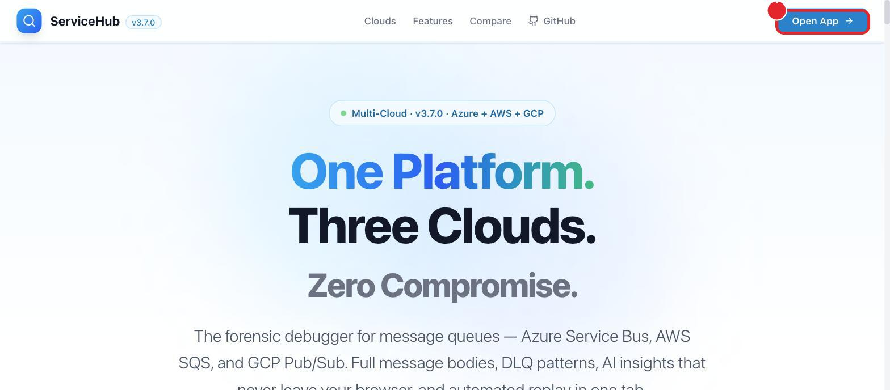
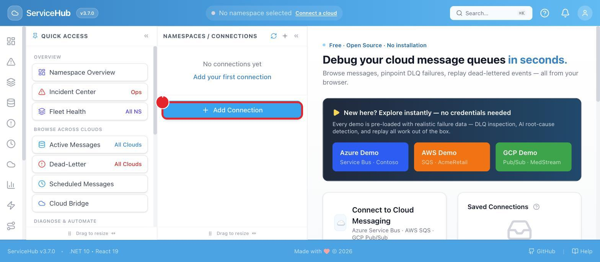
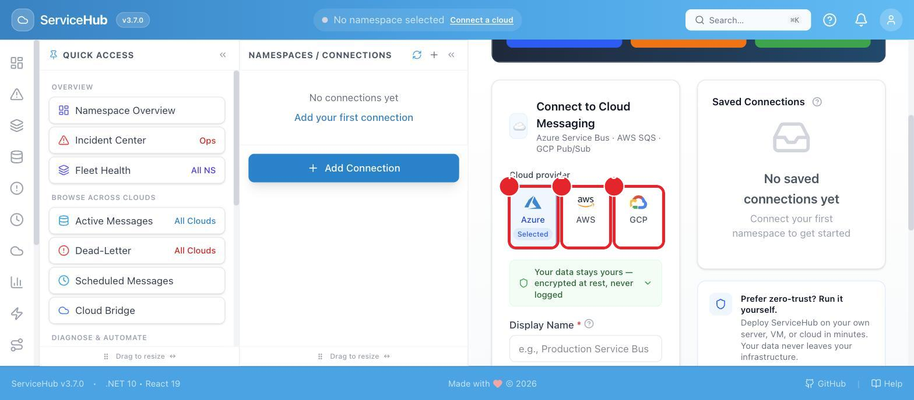
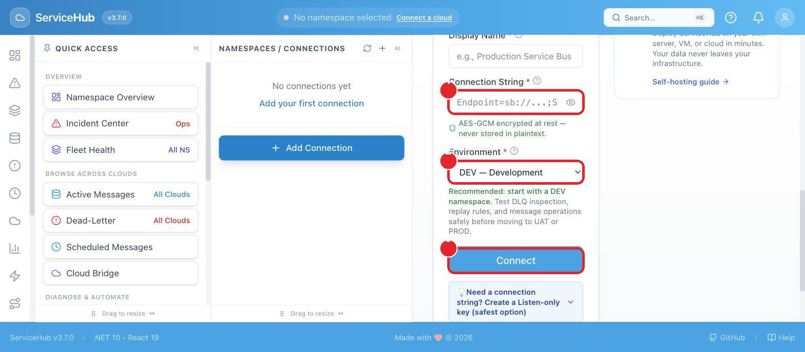
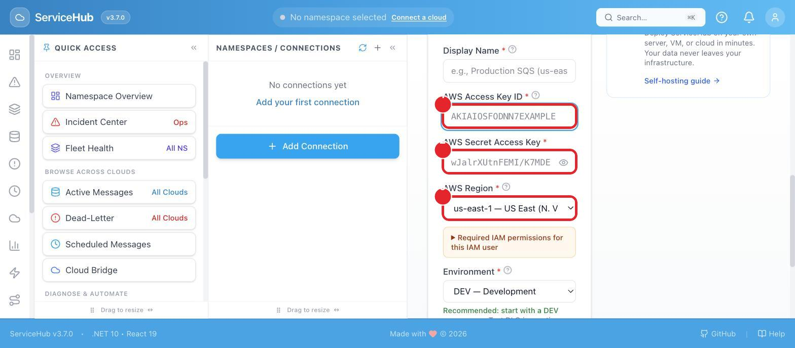
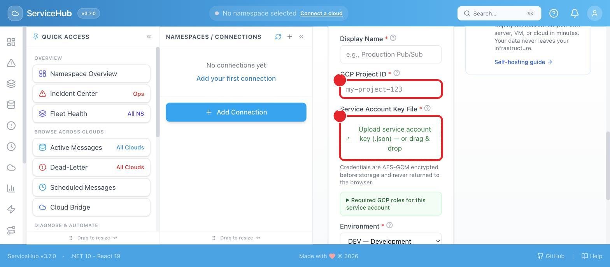

# Running ServiceHub On Your Own Computer

This guide assumes **no technical background**. If you've never used Docker, git, or a
terminal before, you're in the right place — every step is spelled out, and there are
screenshots so you know what "it worked" looks like.

If you're comfortable with Docker and the command line already, the condensed version is in
the main [README.md](README.md#quick-start) — this document is the slow, no-assumptions
version of the same steps.

---

## Two ways to run it — pick one

| | **With Docker** (recommended) | **Without Docker** |
|---|---|---|
| Best for | Everyone — this is the easiest path | People who can't install Docker (e.g. locked-down work laptop) |
| What you install first | One app: Docker Desktop | Nothing — a script installs what's needed for you |
| Opens at | `http://localhost:8080` | `http://localhost:3000` |
| Steps below | [Option A](#option-a-with-docker-recommended) | [Option B](#option-b-without-docker) |

If you're not sure, choose **Option A (Docker)**. It's fewer steps and it's what most people
should use.

---

## Before you start: two words you'll see a lot

- **Terminal** (Mac: called "Terminal" — find it with Spotlight, `Cmd + Space`, then type
  `Terminal`. Windows: called "Command Prompt" or "PowerShell" — find it in the Start Menu.)
  It's a plain black or white window where you type commands and press Enter. Every command
  in this guide is something you copy, paste into that window, and press Enter.
- **Repository / repo** — just means "the folder of ServiceHub's files." You'll download this
  once, near the start of either option below.

---

## Option A: With Docker (recommended)

### Step 1: Install Docker Desktop

Docker Desktop is a free app that lets your computer run ServiceHub in a self-contained box,
without installing anything else ServiceHub needs by hand.

1. Go to <https://www.docker.com/products/docker-desktop/> and download it for your operating
   system (Mac, Windows, or Linux).
2. Install it like any other app, then open it.
3. Wait until the little whale icon in your menu bar / system tray stops animating — that
   means Docker is ready. This can take a minute the first time.

### Step 2: Get the ServiceHub files

Go to <https://github.com/debdevops/servicehub>, click the green **Code** button, then
**Download ZIP**. Unzip it somewhere you'll remember, like your Desktop or Documents folder.

*(If you already use git, `git clone https://github.com/debdevops/servicehub.git` does the
same thing.)*

### Step 3: Open a Terminal in that folder

- **Mac**: open the unzipped `servicehub` folder in Finder, right-click inside it, choose
  **New Terminal at Folder**. (If you don't see that option, open Terminal normally and type
  `cd ` followed by dragging the folder into the window, then press Enter.)
- **Windows**: open the unzipped `servicehub` folder in File Explorer, click into the address
  bar at the top, type `cmd`, and press Enter — a Command Prompt opens already inside that
  folder.

### Step 4: Create your two secret keys

ServiceHub encrypts everything it stores, so it needs two random secret keys before it can
start — think of these as the password that protects your data. There's no default key on
purpose: a shipped default would be the same for every single person who ever ran this,
which defeats the point of encryption.

Copy this whole block, paste it into your terminal, and press Enter:

```bash
cp .env.example .env
printf 'SECURITY__ENCRYPTIONKEY=%s\n'    "$(openssl rand -hex 32)" >> .env
printf 'SECURITY__SPATOKEN__SECRET=%s\n' "$(openssl rand -hex 32)" >> .env
```

**Windows Command Prompt** doesn't have `openssl` by default — instead run this one command
(needs [git](https://git-scm.com/download/win), which most Windows machines already have if
you installed it in Step 2):

```bash
copy .env.example .env
```

then open the new `.env` file in Notepad and fill in `SECURITY__ENCRYPTIONKEY=` and
`SECURITY__SPATOKEN__SECRET=` yourself with any 64 random letters/numbers each (or run the
three-line block above in **Git Bash** instead of Command Prompt, which does have `openssl`).

Nothing is sent anywhere — this only creates a file called `.env` on your own computer.

### Step 5: Start ServiceHub

```bash
docker compose up --build
```

The first run takes a few minutes — it's downloading and building everything. You'll see a
lot of text scroll by; that's normal. It's ready when the scrolling stops and you see lines
mentioning `servicehub-1  Started`.

### Step 6: Open it in your browser

Go to **[http://localhost:8080](http://localhost:8080)**. You should see this:



### Step 7: You're in



**"No connections yet" is expected** — that's not an error, it's the normal starting point.
From here you have two choices:

- Click **Azure Demo**, **AWS Demo**, or **GCP Demo** (top of the page) to explore a fully
  working example with fake data — no real cloud account needed, completely safe to click
  around. This is the fastest way to see what ServiceHub does.
- Click the boxed **Add Connection** button (or just scroll down the page — the same form is
  sitting right below the demo buttons) if you already have a real Azure, AWS, or GCP account
  and want to connect it. Full instructions with screenshots for each cloud are in
  [Connecting to Your Real Cloud Account](#connecting-to-your-real-cloud-account) below.

### Stopping, restarting, and resetting

| I want to... | Do this |
|---|---|
| Stop ServiceHub for now | In the terminal window that's running it, press `Ctrl + C` |
| Start it again later | `docker compose up -d` (the `-d` runs it in the background so you can close the terminal) |
| See if it's still running | `docker compose ps` |
| Completely start over, deleting all saved data | `docker compose down -v` — only do this if you actually want to erase everything |

Your data (saved connections, DLQ history) is kept between restarts automatically — you don't
need to redo Steps 4–5 next time, just run `docker compose up -d` from inside the folder.

---

## Option B: Without Docker

Use this only if you can't install Docker. It takes a couple more minutes the first time
because it installs .NET and Node.js for you if they're missing.

### Step 1: Get the ServiceHub files

Same as [Option A, Step 2](#step-2-get-the-servicehub-files) above — download the ZIP from
GitHub and unzip it, or `git clone`.

### Step 2: Open a Terminal in that folder

Same as [Option A, Step 3](#step-3-open-a-terminal-in-that-folder) above.

### Step 3: Run the start script

**Mac / Linux:**
```bash
./run.sh
```

**Windows (PowerShell):**
```powershell
./run.ps1
```

The first time, this installs .NET 10 and Node.js 22 automatically if you don't already have
them — you may be asked to enter your computer's password to allow the install. This can take
several minutes the first time; later runs are fast.

### Step 4: Open it in your browser

Go to **[http://localhost:3000](http://localhost:3000)**. You'll land on the same screens
shown in Step 6/7 above.

### Stopping

Click into the terminal window running it and press `Ctrl + C`.

---

## Connecting to Your Real Cloud Account

This section is only for people who want to point ServiceHub at a **real** Azure Service Bus,
AWS SQS/SNS, or GCP Pub/Sub — not the free demo data. **You can skip this entirely** and just
use the demo buttons from Step 7 if you're only exploring.

You'll need one thing from your cloud provider: a credential — a long secret code (Azure), a
pair of keys (AWS), or a small file (GCP). You paste or upload it into ServiceHub, ServiceHub
encrypts it immediately, and it's never sent anywhere except your own cloud provider's API.

### Open the connection form (same first step for every cloud)

Go to ServiceHub, click **Add Connection**, then scroll down slightly until you see **Connect
to Cloud Messaging** with three tiles. Click the one for your cloud:



Then jump to the matching section below.

---

### Connecting Azure Service Bus

**What you need:** a *connection string* — a long piece of text Azure gives you that works
like a password for one specific Service Bus namespace.

**Where to get it, in the Azure Portal** (<https://portal.azure.com>):

1. Search for and open your **Service Bus Namespace**.
2. In the left-hand menu, click **Shared access policies**.
3. Click an existing policy, or click **+ Add** to create one. If creating one, name it
   something like `servicehub-readonly` and tick **only** the **Listen** box — that gives
   ServiceHub read-only access, which is the safest choice to start with.
4. Click the policy, then click the copy icon next to **Primary Connection String**.

*(Prefer the command line? The exact `az` command is in
[self-hosting/README.md → Azure Service Bus](self-hosting/README.md#azure-service-bus).)*

**Back in ServiceHub**, paste it into the form:



1. Paste the connection string you copied.
2. Leave **Environment** set to **DEV — Development** the first time — this unlocks every
   feature so you can try replay/send safely. (`PROD` intentionally locks those down — see
   [Deployment Model](README.md#deployment-model).)
3. Click **Connect**.

---

### Connecting AWS SQS/SNS

**Before you start:** AWS support is switched **off** by default on a fresh install. If the
form shows an orange message reading *"AWS SQS/SNS is disabled on this server..."*, that's not
an error — it just means this one-time switch needs flipping first:

1. Stop ServiceHub (`Ctrl + C`, or `docker compose down` if it's running in the background).
2. Open the `.env` file you created in Step 4, and add this line to the bottom:
   ```
   CLOUDPROVIDERS__AWS__ENABLED=true
   ```
3. Start it again: `docker compose up -d`.

**What you need:** an **Access Key ID** and **Secret Access Key** — a pair of codes from AWS
Identity and Access Management (IAM) that work together like a username and password.

**Where to get them, in the AWS Console** (<https://console.aws.amazon.com/iam>):

1. Go to **IAM → Users**, and open (or create) the user you want ServiceHub to use.
2. Open the **Security credentials** tab.
3. Under **Access keys**, click **Create access key**.
4. Copy both the **Access Key ID** and **Secret Access Key** shown — the secret key is only
   shown once, so copy it immediately.

For a personal trial, any working key is fine. Before connecting to anything you actually
care about, attach the least-privilege policy in
[self-hosting/README.md → Cloud credentials](self-hosting/README.md#cloud-credentials-least-privilege-setup)
(AWS SQS / SNS section) instead of using
a full-access key.

**Back in ServiceHub**, paste them into the form:



1. Paste your **Access Key ID**.
2. Paste your **Secret Access Key**.
3. Choose the **AWS Region** your queues actually live in (for example `us-east-1`) — this has
   to match, or ServiceHub won't find anything.

Then set **Environment** to **DEV** the first time (same as Azure above) and click **Connect**.

---

### Connecting GCP Pub/Sub

**Before you start:** like AWS, GCP support is off by default. If you see a message saying GCP
is disabled, add this line to your `.env` file and restart the same way as the AWS steps
above:
```
CLOUDPROVIDERS__GCP__ENABLED=true
```

**What you need:** a **Service Account Key** — a small `.json` file that Google Cloud
generates, which acts as an identity ServiceHub can use.

**Where to get it, in the Google Cloud Console** (<https://console.cloud.google.com/iam-admin/serviceaccounts>):

1. Go to **IAM & Admin → Service Accounts**, then click **Create Service Account**.
2. Give it a name (e.g. `servicehub-readonly`), then click **Create and Continue**.
3. Grant it the role **Pub/Sub Viewer** and **Pub/Sub Subscriber** (add **Pub/Sub Publisher**
   too only if you also want to send test messages), then click **Done**.
4. Open the new service account, go to the **Keys** tab, click **Add Key → Create new key**,
   choose **JSON**, and click **Create** — a `.json` file downloads to your computer.

**Back in ServiceHub**, fill in the form:



1. Type your **GCP Project ID** (found on the Google Cloud Console's dashboard, e.g.
   `my-project-123`).
2. Click the upload box and choose the `.json` file you just downloaded.

Then set **Environment** to **DEV** and click **Connect**.

---

### After you click Connect

ServiceHub tests the credential immediately. If it fails, the error message tells you
specifically what's wrong (wrong region, revoked key, missing permission, etc.) — read it, it's
written for you, not written for programmers. Once it succeeds, your namespace appears in the
**Namespaces / Connections** panel on the left, and you can start browsing real queues.

For production use — least-privilege IAM policies, running with authentication turned on, and
what changes when you set **Environment** to `PROD` — see
[self-hosting/README.md](self-hosting/README.md) once you're past this first trial connection.

---

## Troubleshooting

| What you're seeing | What it means | What to do |
|---|---|---|
| `docker: command not found` | Docker Desktop isn't installed, or isn't finished installing | Reinstall from docker.com, make sure the whale icon appears in your menu bar/tray |
| `Cannot connect to the Docker daemon` | Docker Desktop is installed but not open/running | Open the Docker Desktop app and wait for the whale icon to stop animating, then try again |
| Terminal says a variable like `SECURITY__ENCRYPTIONKEY` is missing and stops immediately | Step 4 (creating your `.env` file) was skipped or didn't finish | Redo [Step 4](#step-4-create-your-two-secret-keys) exactly as written |
| `port is already allocated` / `address already in use` | Something else on your computer is already using port 8080 (or 3000) | Close the other program using that port, or stop and restart Docker Desktop |
| The browser tab just spins and never loads | ServiceHub is still starting up | Wait 30–60 seconds after the terminal text stops scrolling, then refresh |
| I closed the terminal and now the page won't load | Closing the window running `docker compose up --build` stops ServiceHub | Run `docker compose up -d` from inside the folder to start it again in the background |
| I want to see if it's actually working | — | Open [http://localhost:8080/health/live](http://localhost:8080/health/live) — it should show `"status": "Healthy"` |
| Windows: `openssl` isn't recognized | Plain Command Prompt doesn't include `openssl` | Use **Git Bash** instead (installed alongside git), or fill in `.env` by hand as described in Step 4 |
| "AWS/GCP SQS/SNS/Pub-Sub is disabled on this server" | That cloud isn't switched on yet — off by default for everyone | Add the matching `CLOUDPROVIDERS__AWS__ENABLED=true` / `CLOUDPROVIDERS__GCP__ENABLED=true` line to `.env`, then restart — see [Connecting AWS SQS/SNS](#connecting-aws-sqssns) / [Connecting GCP Pub/Sub](#connecting-gcp-pubsub) |
| Clicking **Connect** shows a red error instead of adding the namespace | The credential, region, or project ID doesn't match what you typed, or the account lacks permission | Read the red message — it names the specific problem. Double-check you copied the whole value with nothing extra, and that the region/project match your cloud provider's console exactly |

**Still stuck?** Open an issue on
[GitHub](https://github.com/debdevops/servicehub/issues) — include what step you were on and
copy-paste the exact text you saw in the terminal.
