# ServiceHub

**The Forensic Debugger for Azure Service Bus Incidents**

When production breaks at 2 AM and you need to see **what's inside your queues** — not just message counts.

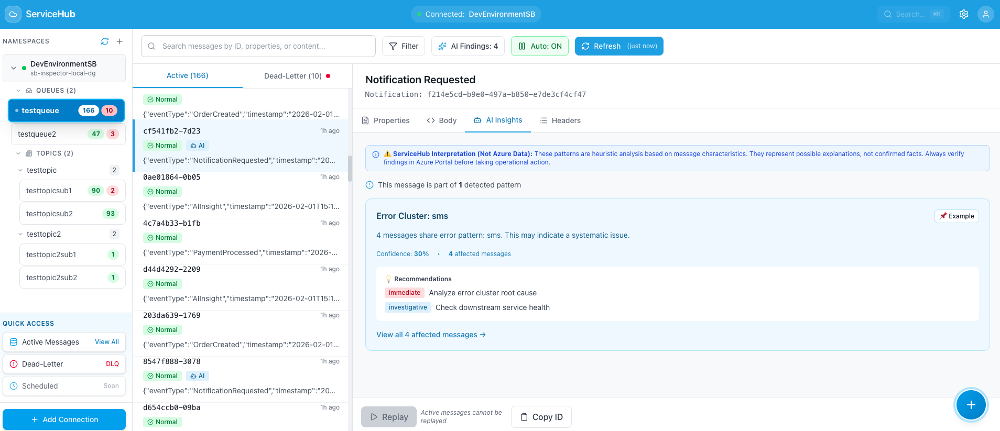

[](LICENSE)
[](https://dotnet.microsoft.com/download/dotnet/8.0)
[](https://react.dev/)
[](https://www.typescriptlang.org/)

---

## The Problem: Blind Incident Response

You're troubleshooting a Service Bus incident. Azure Portal shows **5,000 messages in Dead-Letter Queue**, but:

❌ **Can't read message content** — Portal only shows counts and basic metadata  
❌ **No search capability** — Can't find messages by correlation ID or customer ID  
❌ **No pattern analysis** — Can't identify which error types are dominating  
❌ **Manual investigation** — Sample one message at a time with no bulk insight  
❌ **Limited DLQ context** — Can't see failure reasons across all dead-lettered messages  

**Result:** 2-hour incidents become 6-hour marathons of blind debugging.

---

## ServiceHub vs. Azure Tools

| **Capability** | **Azure Portal** | **Service Bus Explorer** | **ServiceHub** |
|----------------|------------------|--------------------------|----------------|
| **View Message Content** | ❌ Count only | ✅ Desktop only | ✅ Web-based |
| **Search Messages** | ❌ | ⚠️ Basic filtering | ✅ Full-text + properties |
| **DLQ Investigation** | ⚠️ One at a time | ⚠️ Manual inspection | ✅ Batch analysis + AI insights |
| **Pattern Detection** | ❌ | ❌ | ✅ AI-powered clustering |
| **Correlation Tracking** | ❌ | ⚠️ Manual | ✅ Search by any property |
| **Read-Only Safety** | ✅ | ⚠️ Can delete | ✅ Peek-only mode |
| **Multi-Message View** | ❌ | ⚠️ Limited | ✅ Browse 100s at once |
| **DLQ Replay** | ❌ | ❌ | ✅ One-click replay |
| **Deployment** | ☁️ Cloud | 💻 Desktop app | 🚀 Self-hosted web app |
| **Access During Incidents** | ✅ Always | ⚠️ Need .NET desktop | ✅ Browser only |

### Why ServiceHub?

✅ **Built for incidents** — Fast, web-based, read-only by design  
✅ **AI-powered insights** — Automatically detect error patterns across thousands of messages  
✅ **Search at scale** — Find needle-in-haystack messages by any property  
✅ **DLQ forensics** — Understand failure patterns, not just individual messages  
✅ **Safe operations** — Listen-only permissions, messages never leave the queue  

---

## Real-World Scenarios

### Scenario 1: Dead-Letter Queue Incident
**Problem:** 5,000 orders stuck in DLQ. Customer escalation at 2 AM.  
**ServiceHub Solution:**
1. Browse all 5,000 DLQ messages in seconds
2. AI detects **3 error patterns**: "Payment Timeout" (40%), "Invalid Address" (35%), "Duplicate Order" (25%)
3. Search for specific customer orders by correlation ID
4. After fixing payment gateway, replay all "Payment Timeout" messages with one click

**Time Saved:** 6 hours → 45 minutes

### Scenario 2: Message Correlation Tracking
**Problem:** Customer reports "Order #12345 never processed." Find the message across 10,000 active messages.  
**ServiceHub Solution:**
1. Search across message body, properties, and custom headers
2. Find order in 3 seconds
3. Review full message properties, delivery attempts, and processing timestamps

**Time Saved:** 30 minutes → 30 seconds

### Scenario 3: Integration Testing
**Problem:** Need to test error handling with 100 realistic failure scenarios.  
**ServiceHub Solution:**
1. Use Message Generator with "Payment Gateway" scenario
2. Generate 100 messages with 30% anomaly rate
3. Verify error handling and DLQ behavior
4. Clean up test messages with one filter (tagged `ServiceHub-Generated`)

**Time Saved:** Manual testing → Automated in 2 minutes

---

## Feature Showcase

### 🔍 Message Browser with Search

Browse messages across queues and topic subscriptions with powerful filtering:


**Features:**
- View 100+ messages at once (Azure Portal: count only)
- Real-time filtering by content, properties, message ID
- Event type badges, timestamps, delivery counts
- Active and Dead-Letter queue tabs in one view

---

### 📊 Complete Message Details

Click any message to inspect every detail:

**System Properties** — Message ID, enqueue time, TTL, sequence number:
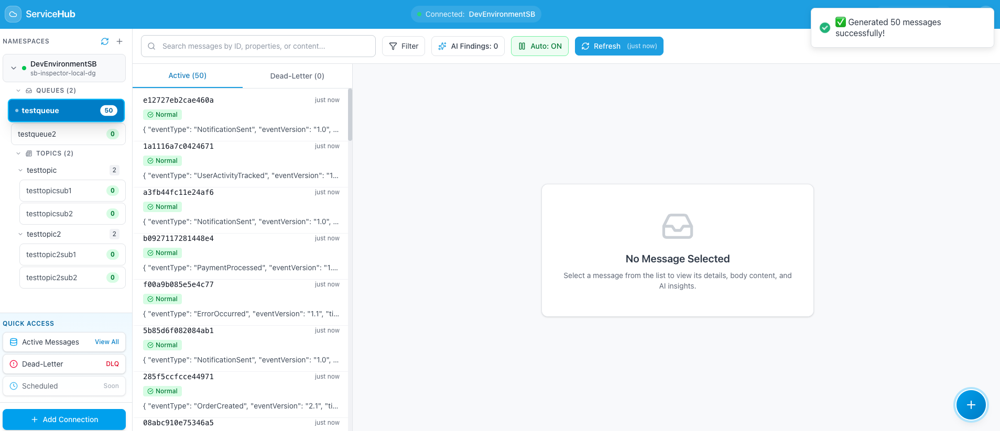

**Custom Properties** — Application headers, correlation IDs, business metadata:


**Message Body** — Full JSON with syntax highlighting and copy button:


---

### 🤖 AI-Powered Pattern Detection

ServiceHub analyzes **all messages** and automatically identifies error clusters:

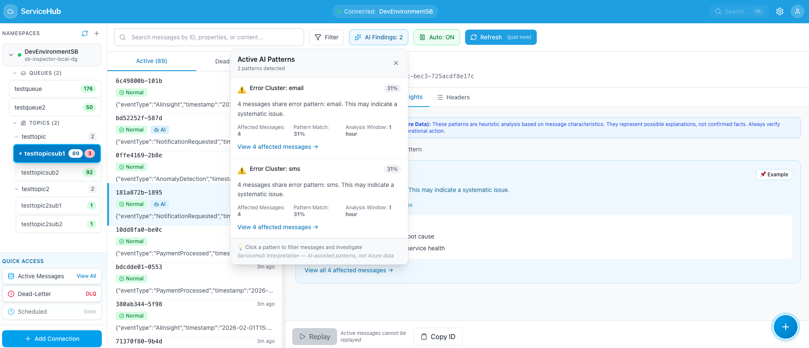

**What it detects:**
- Error message patterns (e.g., "Payment Timeout" across 500 messages)
- Anomaly rates and confidence scores
- Message groups by failure type
- Suggested remediation actions

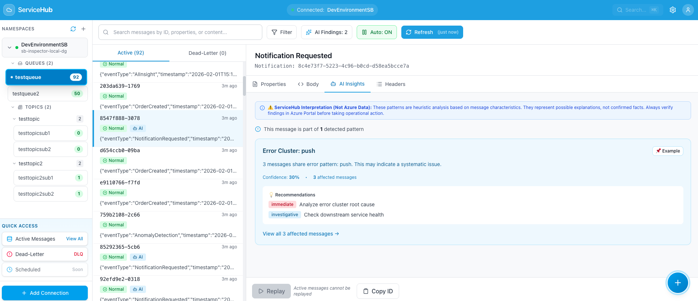

**Real-world example:** From 5,000 DLQ messages, AI instantly identifies:
- 40% failed due to "Payment Gateway Timeout"
- 35% failed due to "Invalid Shipping Address"  
- 25% failed due to "Duplicate Order ID"

---

### ⚠️ Dead-Letter Queue Forensics

Investigate DLQ failures with complete context:

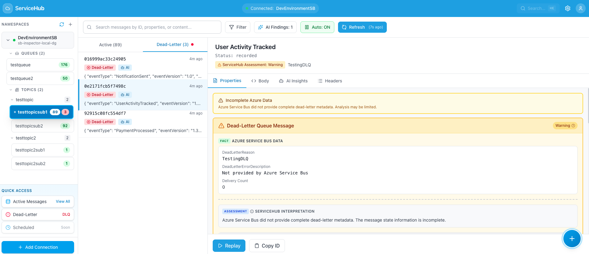

**See instantly:**
- Dead-letter reason (e.g., "MaxDeliveryCountExceeded")
- Error description from Azure Service Bus
- Delivery attempt history
- Original message timestamp vs. DLQ timestamp

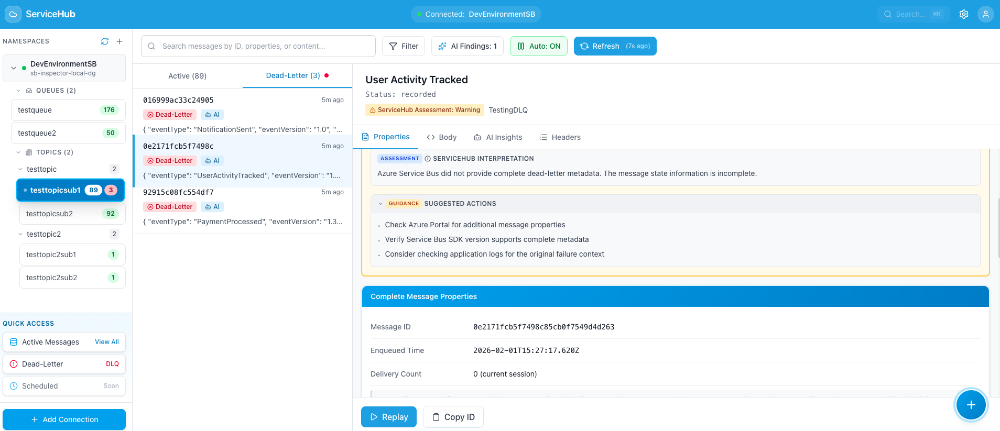

**ServiceHub provides actionable guidance:**
- Why the message failed
- Recommended fix based on failure type
- Whether to replay or discard
- Related messages with same failure pattern

---

### 🔄 DLQ Message Replay

After fixing the root cause, replay messages back to the original queue:

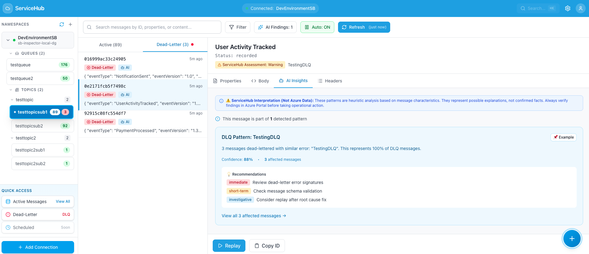

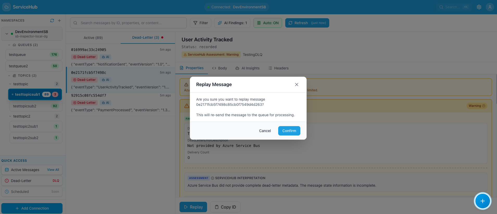

**Use cases:**
- Payment gateway was down → Now restored → Replay all payment messages
- Bug in message processor → Bug fixed → Replay all failed messages
- Invalid configuration → Config corrected → Reprocess orders

---

### 🔎 Advanced Search

Find messages by any property — something Azure Portal **cannot do**:

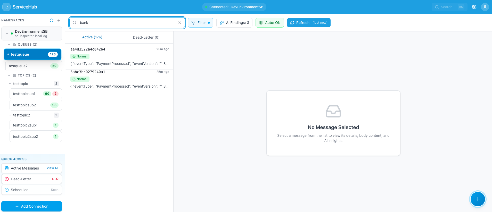

**Search across:**
- Message body content (JSON, XML, plain text)
- Custom properties (correlation ID, customer ID, order number)
- System properties (message ID, session ID)
- Event types and categories

**Example:** Find all messages for customer "C-12345" across 10,000 messages in 2 seconds.

---

## Testing & Development Tools

### Message Generator

Generate realistic test messages for integration testing:


**6 Built-in Scenarios:**
1. **Order Processing** — E-commerce order flow
2. **Payment Gateway** — Payment transactions with retries
3. **Notification Service** — Email/SMS delivery events
4. **Inventory Management** — Stock updates and alerts
5. **User Activity** — Login, registration, profile updates
6. **Error Events** — Simulated failures for testing

**Configuration:**
- Volume: 30, 50, 100, 150, 200 messages
- Anomaly rate: 0% to 50% (inject failures for testing)
- Auto-tagged with `ServiceHub-Generated` for easy cleanup

### Send Custom Messages

Send single messages to queues or topics for ad-hoc testing:

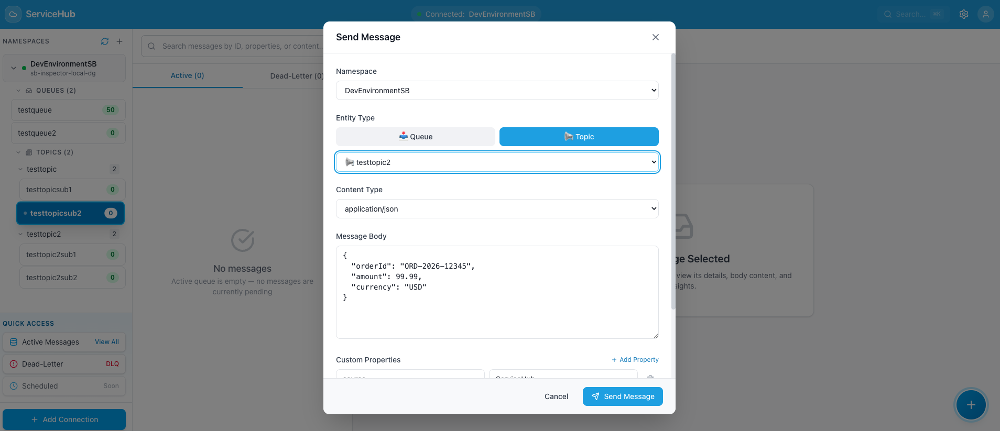


---

## Quick Start (Zero Configuration!)

### 🚀 Automated Setup (Recommended)

**No manual prerequisites needed!** The setup script automatically installs everything:

```bash
git clone https://github.com/debdevops/servicehub.git
cd servicehub
./run.sh
```

The script will:
✅ Auto-install .NET 8 SDK (if not present)
✅ Auto-install Node.js 18+ (if not present)
✅ Install all dependencies
✅ Start both API and UI servers

**First run:** 5-10 minutes (includes installations)
**Subsequent runs:** 30-60 seconds

Open **http://localhost:3000**

> 📘 **Detailed Setup Guide:** See [SETUP.md](SETUP.md) for platform-specific details, troubleshooting, and manual installation options.

### Prerequisites (Auto-Installed)
The following are **automatically installed** by `run.sh`:
- ✅ .NET 8.0 SDK
- ✅ Node.js 18+
- ✅ npm package manager
- ✅ Required utilities (curl, lsof)

**Supports all major platforms:**
- macOS (Intel & Apple Silicon), Ubuntu/Debian, RHEL/CentOS/Fedora, Arch Linux, openSUSE, Alpine, WSL
- See [CROSS-PLATFORM-COMPATIBILITY.md](CROSS-PLATFORM-COMPATIBILITY.md) for complete list

**You only need:**
- ⚠️ Azure Service Bus connection string (Listen permission only)

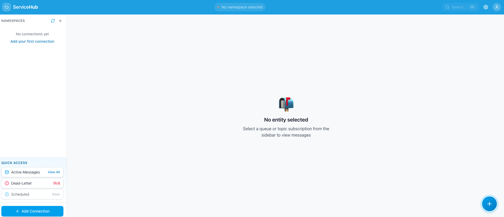

### Connect to Your Namespace

1. Enter a display name for your connection
2. Paste your Service Bus connection string
3. Click "Connect"

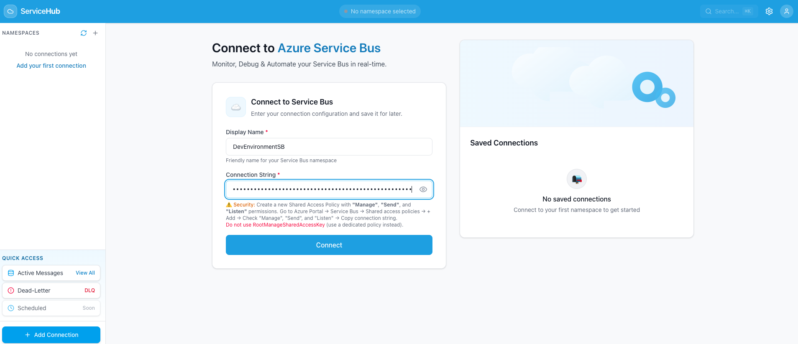

Your queues and topics appear instantly:


**That's it!** Start browsing messages, investigating DLQs, and using AI insights.

---

## Architecture

```
servicehub/
├── apps/web/                    # React + TypeScript frontend
│   └── src/
│       ├── components/          # UI components
│       ├── hooks/               # React Query hooks
│       └── lib/                 # API client, utilities
│
├── services/api/                # ASP.NET Core backend
│   └── src/
│       ├── ServiceHub.Api/               # REST API controllers
│       ├── ServiceHub.Core/              # Domain entities & DTOs
│       └── ServiceHub.Infrastructure/    # Azure SDK integration
│
└── run.sh                       # One-command startup script
```

**Tech Stack:**
- **Frontend:** React 18, TypeScript, Tailwind CSS, TanStack Query (React Query)
- **Backend:** ASP.NET Core 8, Azure.Messaging.ServiceBus SDK
- **AI Analysis:** Client-side pattern detection (no external API calls)
- **Database:** None (stateless, in-memory only)

---

## Security & Compliance

### Read-Only by Design

ServiceHub uses Azure SDK's **`PeekMessagesAsync`** — messages are **never removed** from queues:

```csharp
// ServiceHub only reads — never receives or deletes
await receiver.PeekMessagesAsync(maxMessages: 100);
```

✅ **Safe for production** — Messages remain in queue for your actual consumers  
✅ **Audit-friendly** — No message deletion or modification  
✅ **Incident-safe** — Won't interfere with recovery processes  

### Minimal Permissions Required

Create a dedicated SAS policy with **Listen permission only**:

```bash
# Azure CLI
az servicebus namespace authorization-rule create \
  --namespace-name <your-namespace> \
  --name servicehub-readonly \
  --rights Listen
```

❌ ServiceHub does NOT require:
- `Manage` permissions
- `Send` permissions (except for testing tools, optional)
- `Receive` permissions (never removes messages)

### Data Privacy

- **No external API calls** — AI analysis runs in your browser
- **No data persistence** — Messages displayed in-memory only
- **No logging of message content** — API logs only metadata (message count, queue names)
- **Self-hosted** — Deploy in your VPC/VNET, no SaaS dependencies

---

## Use Cases by Role

### DevOps Engineers
✅ Investigate DLQ spikes during incidents  
✅ Validate message processing after deployments  
✅ Search for specific customer transactions  
✅ Monitor message flow across queues and topics  

### QA Engineers
✅ Generate realistic test messages for integration testing  
✅ Verify message routing to correct topic subscriptions  
✅ Test error handling with controlled anomaly injection  
✅ Validate message transformations and enrichments  

### Support Teams
✅ Find customer orders by correlation ID during escalations  
✅ Verify if customer message was received or dead-lettered  
✅ Provide timestamps and failure reasons to customers  
✅ Replay messages after incident resolution  

### Platform Engineers
✅ Debug namespace-level message routing issues  
✅ Analyze message patterns for capacity planning  
✅ Investigate intermittent failures across multiple queues  
✅ Document incident timelines with actual message evidence  

---

## Key Differentiators

| Feature | Impact |
|---------|--------|
| **Web-Based** | No desktop installation needed — accessible from any browser during incidents |
| **Bulk Message View** | Browse 100s of messages at once vs. one-by-one in Azure Portal |
| **AI Pattern Detection** | Automatically identify root causes across thousands of DLQ messages |
| **Full-Text Search** | Find messages by correlation ID, customer ID, or any property |
| **DLQ Replay** | One-click message reprocessing after fixing issues |
| **Testing Tools** | Generate realistic scenarios for integration testing |
| **Read-Only Safety** | Listen-only permissions — never removes messages from production |
| **Self-Hosted** | Deploy in your environment, no SaaS vendor dependency |

---

## Roadmap

**Planned Features:**

- [ ] **Bulk DLQ Replay** — Replay multiple messages with filters (e.g., all "Payment Timeout" errors)
- [ ] **Message Export** — Download messages as JSON/CSV for offline analysis
- [ ] **Advanced Search** — Regex patterns, date range filters, property comparisons
- [ ] **Multi-Namespace Support** — Switch between multiple Service Bus namespaces
- [ ] **Session-Aware Browsing** — Group messages by session ID for stateful workloads
- [ ] **Message Metrics Dashboard** — Throughput, latency, failure rate visualizations
- [ ] **Scheduled Message Viewer** — Inspect messages scheduled for future delivery
- [ ] **Custom AI Rules** — Define your own pattern detection rules

**Community Requests:** [Open an issue](https://github.com/debdevops/servicehub/issues) to suggest features!

---

## Comparison: ServiceHub vs. Alternatives

### vs. Azure Portal

**Azure Portal Strengths:**
- Always available, no installation
- Basic metrics and alerting
- Namespace management

**Azure Portal Limitations:**
- ❌ Cannot view message **content** (only metadata)
- ❌ No search or filtering capabilities
- ❌ DLQ investigation requires manual sampling
- ❌ No pattern detection or bulk analysis

**When to use ServiceHub:** When you need to see **what's inside messages** during incidents.

---

### vs. Azure Service Bus Explorer (Desktop)

**Service Bus Explorer Strengths:**
- Rich feature set for power users
- Message management (send, receive, delete)
- Detailed property inspection

**Service Bus Explorer Limitations:**
- ⚠️ Desktop application (Windows .NET required)
- ⚠️ Limited multi-message view
- ❌ No AI pattern detection
- ❌ No bulk DLQ analysis
- ⚠️ Can accidentally delete production messages

**When to use ServiceHub:** 
- Web-based access from any device
- Read-only safety for production
- AI-powered pattern detection
- Bulk message analysis

---

### vs. Custom Scripts

**Custom Scripts (PowerShell/CLI) Strengths:**
- Automation potential
- Scriptable workflows

**Custom Scripts Limitations:**
- ⚠️ Requires scripting expertise
- ❌ No UI for visual exploration
- ❌ Limited to technical users
- ⚠️ Time-consuming to build and maintain

**When to use ServiceHub:** 
- Ready-to-use web UI
- Accessible to non-developers (support teams, QA)
- Zero maintenance required

---

## FAQ

**Q: Does ServiceHub remove messages from queues?**  
A: No. ServiceHub uses Azure SDK's **`PeekMessagesAsync`** which only reads messages without removing them. Your consumers continue processing normally.

**Q: Can I use ServiceHub in production?**  
A: Yes. ServiceHub only requires **Listen** permission and operates in read-only mode (except for optional testing tools). Messages remain in queues for your actual consumers.

**Q: How does AI pattern detection work?**  
A: ServiceHub analyzes message content, properties, and error descriptions using heuristic algorithms **in your browser**. No data leaves your environment — no external AI API calls.

**Q: What about sensitive data in messages?**  
A: ServiceHub displays messages only in your browser session (not persisted). Deploy ServiceHub in your private network and restrict access via your identity provider. API logs do not capture message content.

**Q: Can I deploy ServiceHub to Azure App Service / Kubernetes?**  
A: Yes. ServiceHub is a standard ASP.NET Core + React app. You can containerize it with Docker and deploy to any platform supporting .NET 8 and Node.js.

**Q: Does ServiceHub support topics with subscriptions?**  
A: Yes. ServiceHub browses messages from both queues and topic subscriptions. You can view messages for each subscription independently.

**Q: What about message sessions?**  
A: Session-aware browsing is on the roadmap. Currently, you can view session-enabled messages but not group them by session ID.

**Q: Can I contribute?**  
A: Absolutely! ServiceHub is open source (MIT license). Fork the repository, make your changes, and submit a pull request.

---

## Contributing

We welcome contributions! Whether it's bug fixes, new features, or documentation improvements.

**How to contribute:**

1. Fork the repository
2. Create a feature branch (`git checkout -b feature/amazing-feature`)
3. Make your changes with tests
4. Commit your changes (`git commit -m 'Add amazing feature'`)
5. Push to the branch (`git push origin feature/amazing-feature`)
6. Open a Pull Request

---

## License

MIT License — see [LICENSE](LICENSE) for details.

**TL;DR:** Use ServiceHub freely in your organization, modify as needed, no attribution required in your deployment.

---

## Links & Resources

- **🏠 Repository:** https://github.com/debdevops/servicehub
- **🐛 Report Issues:** https://github.com/debdevops/servicehub/issues
- **📖 Full Documentation:** [docs/COMPREHENSIVE-GUIDE.md](docs/COMPREHENSIVE-GUIDE.md)
- **� Screenshots Guide:** [docs/SCREENSHOTS.md](docs/SCREENSHOTS.md)
- **💬 Discussions:** https://github.com/debdevops/servicehub/discussions

---

## Support

**Need help?**
- 📖 Check the [documentation](docs/)
- 💬 Start a [discussion](https://github.com/debdevops/servicehub/discussions)
- 🐛 Report a [bug](https://github.com/debdevops/servicehub/issues)

**Enterprise support:** For production deployment assistance, custom features, or training — open an issue with `[Enterprise]` tag.

---

## Star History

If ServiceHub saved you time during an incident, give it a ⭐ on GitHub!

---

<div align="center">

**ServiceHub** — Because your Service Bus messages shouldn't be invisible during incidents.

Built with ❤️ for DevOps and Platform Engineers

[Get Started](#quick-start-5-minutes) • [View Features](#feature-showcase) • [Report Issue](https://github.com/debdevops/servicehub/issues)

</div>
