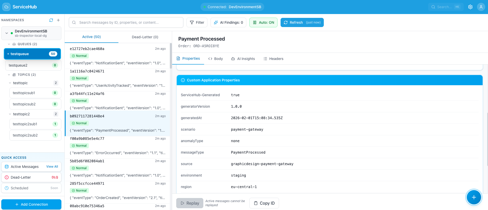
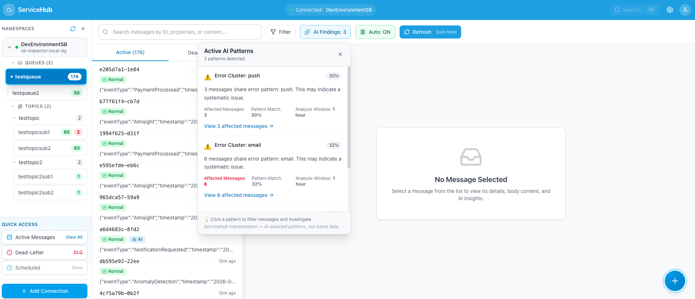
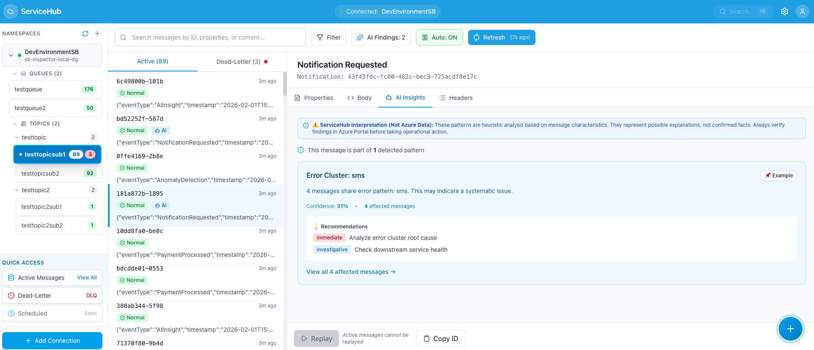
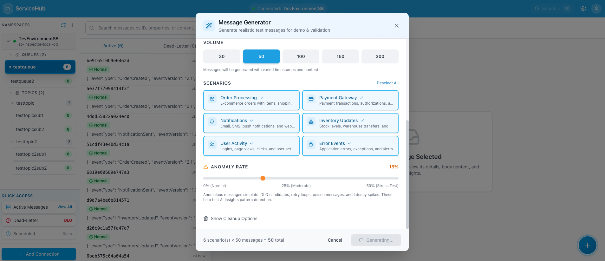

# ServiceHub

**Azure Service Bus Message Browser & Forensic Debugger**

Browse, search, and debug Azure Service Bus messages during incidents — when Azure Portal can't show you what's inside.


*Browse messages from queues and topic subscriptions with real-time AI pattern detection*

[](LICENSE)
[](https://dotnet.microsoft.com/download/dotnet/8.0)
[](https://react.dev/)
[](https://www.typescriptlang.org/)

---

## Why ServiceHub?

**The Problem:** It's 2 AM. Your queue has 5,000 messages in the Dead-Letter Queue. Azure Portal shows you the count — but not the message content, headers, or why they failed.

**The Solution:** ServiceHub lets you browse actual message content, search by correlation ID, and investigate DLQ failures — all read-only, all during the incident.

---

## Quick Start

### Prerequisites
- .NET 8.0 SDK
- Node.js 18+
- Azure Service Bus connection string (Listen permission)

### Run ServiceHub

```bash
git clone https://github.com/debdevops/servicehub.git
cd servicehub
./run.sh
```

Open **http://localhost:3000**


*ServiceHub landing page - ready to connect to Azure Service Bus*

---

## Connect to Your Namespace

Enter your connection string and connect:


*Enter a display name and your Service Bus connection string*

Once connected, your queues and topics appear in the sidebar:


*Namespace shows 2 queues and 2 topics with subscription counts*

---

## Core Features

### 1. Message Browser

Click any queue or subscription to browse messages:


*Empty queue showing Active and Dead-Letter tabs*

Generate test messages or view existing ones:


*Message browser showing multiple messages with event types and timestamps*


*Scrolled view showing more messages in the list*

### 2. Message Details

Click any message to view full details across three tabs:

**Properties Tab** — Message ID, timestamps, delivery count:


*Complete message metadata including enqueue time, TTL, and sequence number*

**Custom Properties** — Application headers and metadata:


*Custom headers like ServiceHub-Generated, scenario, environment, region*


*Scrolled view showing additional custom properties*

**Body Tab** — Full JSON message content:


*Syntax-highlighted JSON body with copy button*

### 3. Search Messages

Search across message content, properties, and headers:


*Search functionality to filter messages*

### 4. Dead-Letter Queue Investigation

View DLQ messages with failure details:


*Dead-Letter tab showing failed messages with failure details*

Inspect the dead-letter reason and Azure metadata:


*Dead-letter reason, error description, and delivery count*

Review suggested actions:


*ServiceHub provides suggested actions based on failure patterns*

### 5. AI Pattern Detection

ServiceHub automatically detects error patterns across messages:


*AI detected error patterns and anomalies*


*Alternative view of AI pattern detection*

Click any message to see its AI insights:


*AI Insights panel showing error patterns and recommendations*


*Scrolled view showing additional AI analysis*


*Complete view of all AI insights and suggestions*

### 6. Replay DLQ Messages

View AI insights for DLQ patterns:


*AI analysis of dead-letter queue patterns*

After fixing the root cause, replay messages from DLQ:


*Confirm replay to re-send message to original queue*

---

## Testing Tools

### Message Generator

Generate realistic test messages with configurable scenarios:


*Basic message generator for sending single messages*


*6 scenarios: Order Processing, Payment Gateway, Notifications, Inventory, User Activity, Error Events*


*Scrolled view showing volume presets and anomaly rate settings*

Features:
- Volume presets: 30, 50, 100, 150, 200 messages
- Anomaly rate slider: 0% to 50%
- Tagged with `ServiceHub-Generated` for easy cleanup

### Send Single Message

Send custom messages to any queue or topic:


*Send JSON message to topic with custom properties*

View the message in topic subscription:


*Messages appearing in topic subscription after send*

---

## Architecture

```
servicehub/
├── apps/web/          # React + TypeScript frontend
├── services/api/      # ASP.NET Core backend
│   └── src/
│       ├── ServiceHub.Api/           # REST API
│       ├── ServiceHub.Core/          # Domain entities
│       └── ServiceHub.Infrastructure/ # Azure SDK integration
└── run.sh             # Start both services
```

### Tech Stack
- **Frontend:** React 18, TypeScript, Tailwind CSS, TanStack Query
- **Backend:** ASP.NET Core 8, Azure.Messaging.ServiceBus SDK
- **AI Analysis:** Client-side heuristic pattern detection

---

## Security

- **Read-only by design** — Uses `PeekMessagesAsync` (messages stay in queue)
- **Listen permission only** — Create a dedicated SAS policy with Listen-only access
- **No data storage** — Messages are never persisted, only displayed in-memory
- **Local AI analysis** — Pattern detection runs in your browser, no external API calls

---

## Use Cases

✅ **Incident Investigation** — View message content during 2 AM outages  
✅ **DLQ Forensics** — Understand why messages failed  
✅ **Correlation Tracking** — Search by order ID or correlation ID  
✅ **Integration Testing** — Generate realistic test messages  
✅ **Post-Mortem Analysis** — Review message patterns after incidents  

---

## Roadmap

- [ ] Bulk DLQ replay
- [ ] Message export (JSON/CSV)
- [ ] Advanced regex search
- [ ] Multi-namespace support
- [ ] Session-aware browsing

---

## Contributing

1. Fork the repository
2. Create a feature branch
3. Submit a pull request

See [CONTRIBUTING.md](CONTRIBUTING.md) for guidelines.

---

## License

MIT License — see [LICENSE](LICENSE) for details.

---

## Links

- **Repository:** https://github.com/debdevops/servicehub
- **Issues:** https://github.com/debdevops/servicehub/issues
- **Documentation:** [docs/COMPREHENSIVE-GUIDE.md](docs/COMPREHENSIVE-GUIDE.md)

---

**ServiceHub** — Because your Service Bus messages shouldn't be invisible during incidents.
