<div align="center">

# ServiceHub

### The Forensic Debugger for Azure Service Bus

**See what's REALLY inside your queues. Browse, search, replay, and analyze messages in real time — everything the Azure Portal can't show you.**

</div>

<div align="center">

## 🚀 [Open ServiceHub →](https://app-servicehub-prod.azurewebsites.net/)

### No install, no credit card. Connect your Azure Service Bus in 30 seconds.

> 🔒 **Authentication:** The hosted application uses **Microsoft Entra ID** (Azure AD) for access control.
> You are redirected to Microsoft's own login page — not a ServiceHub login.
> **No personal data, credentials, or user records are stored.** This is purely a security gate for the shared hosting environment.
> For full data sovereignty, [self-host ServiceHub](#️-quick-start) on your own infrastructure.

</div>

<div align="center">

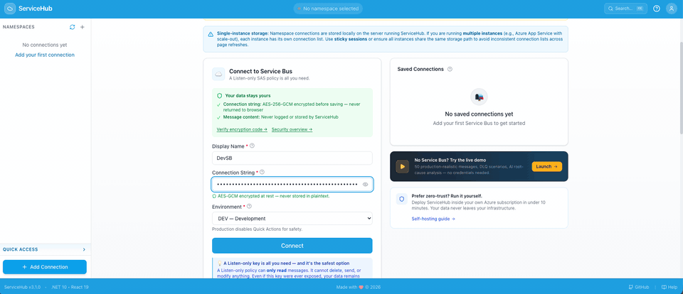

</div>

<div align="center">

[](LICENSE)
[](https://dotnet.microsoft.com/)
[](https://react.dev/)
[](https://www.typescriptlang.org/)
[](.version)
[](https://app-servicehub-prod.azurewebsites.net/)

[🚀 Open ServiceHub](https://app-servicehub-prod.azurewebsites.net/) · [⚡ Quick Start](#️-quick-start) · [✨ Features](#️-features) · [📸 Screenshots](#️-screenshots) · [🏗️ Architecture](#️-architecture) · [🤝 Contributing](#️-contributing)

</div>

---

## Why ServiceHub?

Production breaks at 2 AM. Azure Portal shows **5,000 messages in Dead-Letter Queue** — but you can't read them, only counts. You manually sample messages one by one, spending hours on what should take minutes.

**ServiceHub is a self-hosted web application that gives engineers full forensic visibility into Azure Service Bus** — like a debugger, but for your message queues.

| Capability | Azure Portal | ServiceHub |
|---|---|---|
| View message body & content | ❌ Count only | ✅ Full body + syntax highlighting |
| Search across message content | ❌ Not available | ✅ Real-time full-text search |
| Dead-letter queue investigation | ❌ One at a time | ✅ Batch analysis + AI patterns |
| AI pattern detection | ❌ Not available | ✅ Client-side clustering, zero data sent |
| Replay from DLQ | ❌ Not available | ✅ One-click or auto-replay rules |
| Multi-namespace support | ❌ Portal only | ✅ Manage multiple connections |
| Correlation ID tracing | ❌ Not available | ✅ Trace journeys across all queues |
| Scheduled message management | ❌ Not available | ✅ View, reschedule, and cancel |

---

## ✨ Features

### 🔌 Connect in 30 Seconds — Zero Configuration

Enter your connection string once and you're browsing messages instantly. Supports Listen-only (read-only), Send, and Manage policies. Connection strings are **AES-GCM encrypted at rest** — no plain-text secrets stored anywhere.

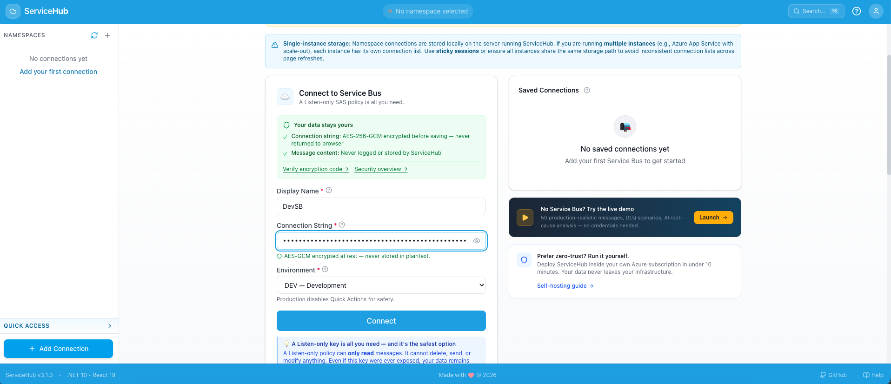

---

### 📨 Message Browser — 1,000s of Messages at Your Fingertips

Browse **Active** and **Dead-Letter** queue messages side by side. See full message previews, status badges, enqueue times, and metadata in a virtualized grid that handles thousands of records without breaking a sweat. Auto-refresh every 7 seconds keeps your view live during incidents.

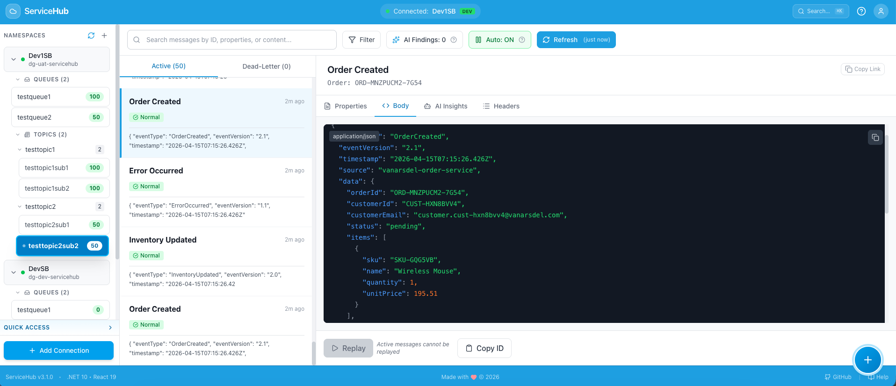

---

### 🔍 Forensic Message Inspection — Every Byte Visible

Click any message for complete forensic analysis:
- **Body** — Full JSON/XML with syntax highlighting and one-click copy
- **Properties** — Message ID, sequence number, TTL, delivery count, enqueue time
- **Headers** — All custom application properties and correlation IDs
- **AI Insights** — Pattern context and remediation hints, computed entirely in-browser

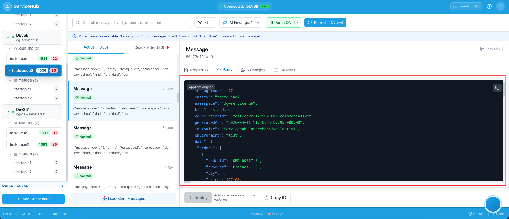

---

### 🤖 AI Findings — Detect Patterns Across Thousands of Messages

Click **AI Findings** to see error pattern clusters detected across your current queue view. The engine groups messages by error type, calculates confidence scores, and surfaces the most impactful clusters — so you know exactly where to look first.

> **Zero-trust privacy:** All analysis runs entirely in your browser. No message content ever leaves your environment.

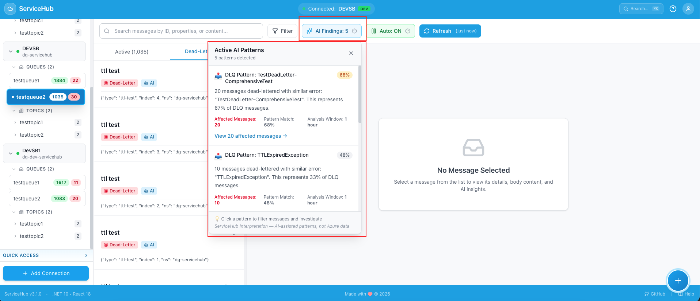

---

### 💀 Dead-Letter Queue Investigation — From Confusion to Root Cause

Select the **Dead-Letter** tab to inspect failed messages in full. Each DLQ message shows:
- **DLQ Reason** — Exactly why Azure moved the message to the dead-letter queue
- **DLQ Error Description** — Full error text from the Azure Service Bus broker
- **AI Assessment** — ServiceHub's categorization and interpretation
- **One-click Replay** — Resend to the active queue after fixing the root cause

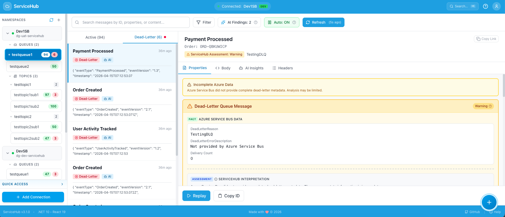

---

### 📊 DLQ Intelligence — Persistent History & 30-Day Trends

DLQ Intelligence automatically scans your dead-letter queues and stores every finding in a local SQLite database — so you can track failures over time, not just during the current session.

- **30-day trend chart** — Visualize DLQ spikes and resolution curves
- **Auto-categorization** — 5 failure types: Transient, MaxDelivery, Expired, DataQuality, Authorization
- **Replay Safety rating** — Know which messages are safe to replay automatically
- **Export** — Download the full history as CSV or JSON for post-mortem analysis

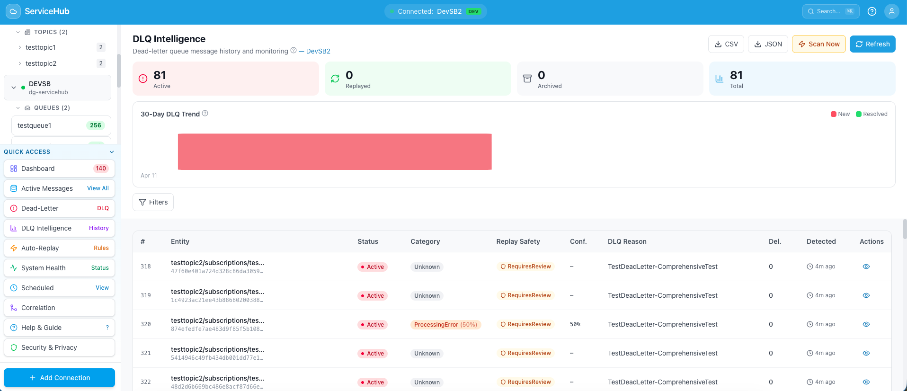

---

### ⚡ Auto-Replay Rules — Automate Your Recovery

Define rules that watch DLQ messages and automatically replay them when conditions match. Recover from common failures without manual intervention.

- **AI-generated rules** — One click generates rules based on your actual DLQ patterns
- **Template gallery** — Pre-built rules for timeouts, throttle errors, and expired messages
- **Flexible matching** — Match by DLQ reason, error description, entity, delivery count, body content, or regex
- **Safety controls** — Rate limiting and circuit breaker prevent overwhelming downstream services
- **Live stats** — Real-time Pending / Replayed / Success counters per rule

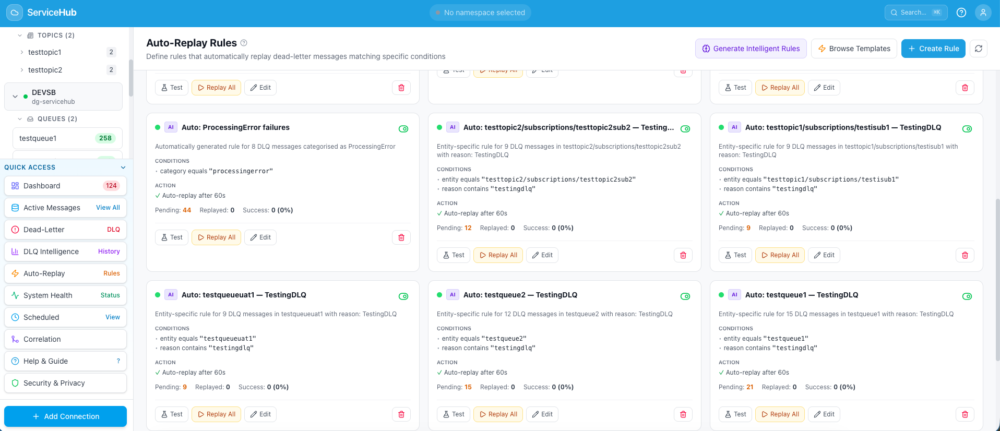

---

### 🔎 Real-Time Search — Find Any Message in Seconds

Search across message body, properties, and headers instantly. Filter 1,000+ messages down to exactly what you need in under a second — no waiting, no pagination round-trips.

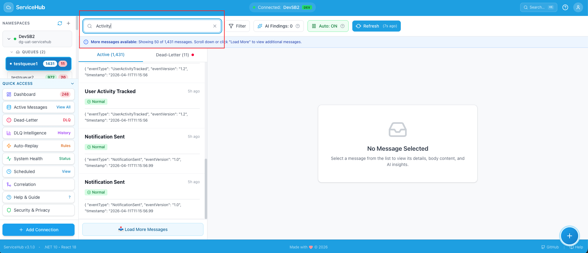

---

### 🔗 Correlation Explorer — Trace Message Journeys

Paste any Correlation ID and instantly trace a message's full journey across all queues, topics, and namespaces. Invaluable during incident investigations — find where an order, payment, or event ended up and whether it's in the active queue or dead-letter.

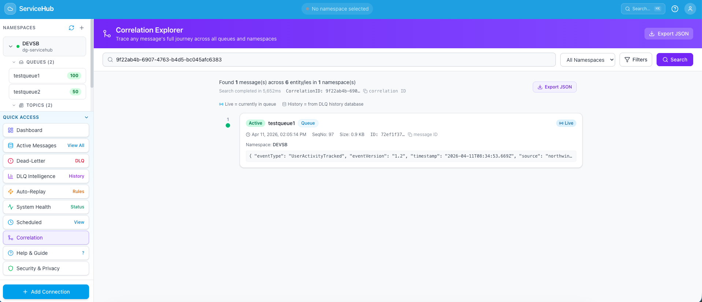

---

### 🏢 Multi-Namespace Support — Manage All Your Environments

Connect to multiple Azure Service Bus namespaces simultaneously. Switch between DEV, UAT, and PROD without disconnecting. All namespaces visible in the sidebar with live, color-coded message counts.

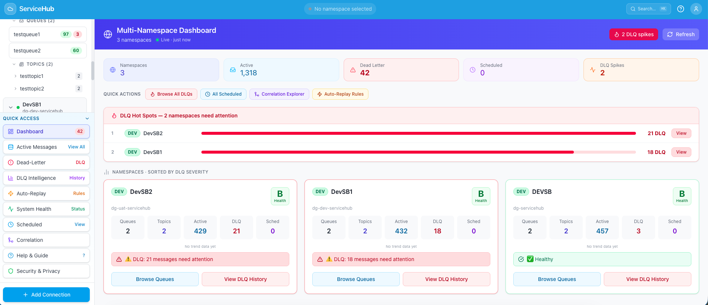

---

### 🕐 Scheduled Messages — View, Reschedule, Cancel

See every message queued for future delivery across your namespaces. Reschedule or cancel individual messages directly from the UI — no SDK, no scripts required.

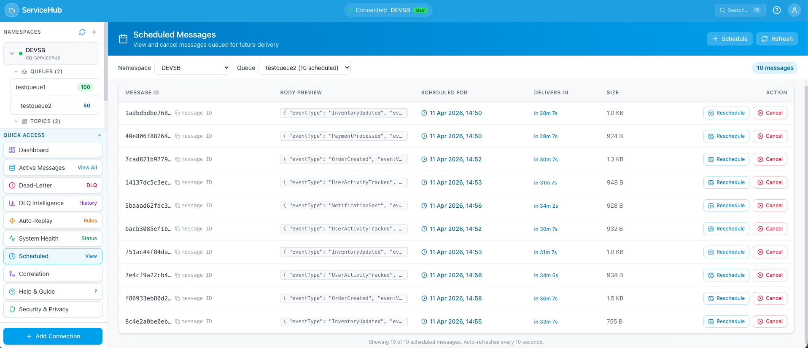

---

### 💚 System Health — Monitor Your Deployment

Real-time runtime metrics for the ServiceHub API itself: uptime, memory usage, thread count, GC generation counts, and full server information including .NET version and environment name.

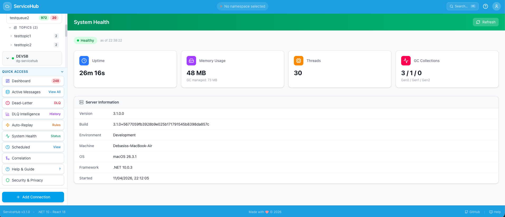

---

## 📸 Screenshots

| Feature | Preview |
|---|---|
| Connect Page |  |
| Message Browser |  |
| Message Detail (JSON body) |  |
| DLQ Investigation |  |
| AI Pattern Findings |  |
| DLQ Intelligence |  |
| Auto-Replay Rules |  |
| Correlation Explorer |  |
| Scheduled Messages |  |
| System Health |  |

---

## 🚦 Recommended Usage Flow

Follow this path before connecting to a production namespace. This protects your live environment and gives you confidence in every operation before it matters.

| Step | Environment | Goal |
|------|-------------|------|
| **Step 1** | **DEV** | Connect your development Service Bus namespace. Explore message browsing, DLQ inspection, AI pattern analysis, and auto-replay rules in a safe environment where mistakes are harmless. |
| **Step 2** | **UAT** | Repeat in your UAT namespace with realistic production-like data. Validate replay targets, confirm rule logic, review AI findings, and check that scheduled messages behave as expected. |
| **Step 3** | **PROD** | Connect only after DEV and UAT validation. Production namespaces enforce read-only browsing by default — Quick Actions (replay, send, generate) are disabled to prevent accidental data modification. |

> ⚠️ **Do NOT connect a production Service Bus namespace without prior validation in DEV and UAT.**
> While ServiceHub is read-only by default, replay and send operations are destructive.
> Validate your replay rules and message targets in lower environments first.

---

## ⚡ Quick Start

### One-Command Setup (Recommended)

```bash
git clone https://github.com/debdevops/servicehub.git
cd servicehub
./run.sh
```

Open **http://localhost:3000** — then connect with your Azure Service Bus connection string.

The script automatically installs .NET 10 SDK and Node.js 20+ if not already present.

### Prerequisites

You provide:
- Azure Service Bus connection string (Listen permission minimum)

Auto-installed by `run.sh`:
- .NET 10.0 SDK
- Node.js 20+

### Create a Dedicated Policy

For read-only browsing (recommended for production):
```bash
az servicebus namespace authorization-rule create \
  --namespace-name <your-namespace> \
  --resource-group <your-rg> \
  --name servicehub-readonly \
  --rights Listen
```

For full access (send, generate, replay):
```bash
az servicebus namespace authorization-rule create \
  --namespace-name <your-namespace> \
  --resource-group <your-rg> \
  --name servicehub \
  --rights Listen Send Manage
```

### Service URLs

| Service | URL |
|---|---|
| **ServiceHub (Hosted)** | **https://app-servicehub-prod.azurewebsites.net/** |
| UI (local) | http://localhost:3000 |
| API (local) | http://localhost:5153 |
| API Docs — Scalar | http://localhost:5153/scalar/v1 |
| API Docs — Swagger UI | http://localhost:5153/swagger/index.html |
| OpenAPI JSON | http://localhost:5153/openapi/v1.json |

---

## 🏗️ Architecture

```
Browser (React 19 SPA)
  └── TanStack Query hooks (useMessages, useQueues, useRules, …)
        └── Axios API client → Vite dev proxy
              └── ASP.NET Core 10 API (port 5153)
                    ├── NamespacesController   → AES-GCM encrypted connections
                    ├── MessagesController     → PeekMessagesAsync (read-only)
                    ├── QueuesController       → queue metadata + counts
                    ├── TopicsController       → topic + subscription metadata
                    ├── DlqHistoryController   → SQLite DLQ intelligence
                    ├── RulesController        → auto-replay rule engine
                    ├── ScheduledMessagesController
                    ├── CorrelationController  → cross-queue message tracing
                    └── HealthController       → runtime health metrics
                          └── Azure.Messaging.ServiceBus SDK
```

**Project layout:**
```
servicehub/
├── apps/web/                    # React 19 + TypeScript + Vite (port 3000)
│   └── src/
│       ├── components/          # UI components (messages, DLQ, rules, FAB)
│       ├── hooks/               # TanStack Query hooks for all API calls
│       ├── lib/                 # Axios client, AI engine, utilities
│       └── pages/               # 10 page routes
│
├── services/api/                # ASP.NET Core 10 backend (port 5153)
│   └── src/
│       ├── ServiceHub.Api/      # Controllers, middleware, auth
│       ├── ServiceHub.Core/     # Domain entities, DTOs, interfaces
│       ├── ServiceHub.Infrastructure/  # Azure SDK, SQLite, AES-GCM encryption
│       └── ServiceHub.Shared/   # Result<T>, Error, constants
│
├── scripts/                     # Key generation + Azure setup scripts
└── run.sh                       # One-command startup
```

**Tech Stack:**

| Layer | Technology |
|---|---|
| Frontend | React 19, TypeScript 5, Tailwind CSS v4, TanStack Query v5 |
| Backend | ASP.NET Core 10, Azure.Messaging.ServiceBus SDK |
| AI Analysis | Client-side heuristic engine (no external API calls) |
| Database | SQLite (DLQ Intelligence history), in-memory message cache |
| API Docs | Scalar (OpenAPI) + Swagger UI |
| Security | AES-GCM encrypted connections, HMAC SPA token, read-only by default |

For deep-dive architecture details, see [services/api/ARCHITECTURE.md](services/api/ARCHITECTURE.md).

---

## 🔐 Permissions Guide

| Permission Level | Capabilities |
|---|---|
| **Listen only** | Browse messages, inspect DLQ, search, AI insights, correlation explorer, health |
| **Listen + Send** | All above + replay from DLQ + send test messages |
| **Manage** | All above + generate test messages, schedule messages, full queue management |

> **Tip:** Create a dedicated `servicehub` policy — never use `RootManageSharedAccessKey`.

---

## 💡 Real-World Scenarios

### Scenario 1: DLQ Incident at 2 AM
**Problem:** 5,000 orders stuck in Dead-Letter Queue. Azure Portal shows counts only.

**With ServiceHub:**
1. Browse all 5,000 DLQ messages in seconds
2. AI detects 3 error clusters: Payment Timeout (40%), Invalid Address (35%), Duplicate (25%)
3. Search by Correlation ID to find a specific customer's order instantly
4. Create an auto-replay rule for Payment Timeout → replay 2,000 messages automatically

**Time saved:** 6 hours → 45 minutes

### Scenario 2: Missing Order Investigation
**Problem:** Customer reports order never processed. Which queue did it land in?

**With ServiceHub:**
1. Open Correlation Explorer
2. Paste the order's Correlation ID
3. Trace the message journey across all queues and namespaces in one search

**Time saved:** 30 minutes → 30 seconds

### Scenario 3: Integration Testing
**Problem:** Need 100 realistic failure scenarios to test error handling.

**With ServiceHub:**
1. Open Message Generator → select Payment Gateway scenario
2. Generate 100 messages with 30% anomaly rate
3. Verify DLQ behavior and error handling
4. Filter by `ServiceHub-Generated` tag to clean up when done

**Time saved:** Hours of manual test data → 2 minutes

---

## 🛡️ Security & Privacy

### What ServiceHub guarantees

- **Read-only by default** — Uses `PeekMessagesAsync`; messages are **never removed or consumed**
- **Minimal permissions** — Full functionality with Listen-only access
- **AES-GCM encryption** — Connection strings encrypted at rest; key stored in local config, never returned to the browser
- **Zero external calls** — AI analysis runs entirely in-browser; no message data leaves your environment
- **No message persistence** — Messages are displayed in-memory only during your session; never written to a database
- **Production-safe** — Won't interfere with your active message consumers
- **Log redaction** — Backend logging pipeline strips connection strings, API keys, and access tokens before any log output

### What ServiceHub does NOT collect or store

| Data | Stored? | Notes |
|------|---------|-------|
| Connection strings | ❌ Never in plaintext | AES-GCM encrypted at rest; decrypted in memory only during use |
| Message bodies | ❌ Never | Displayed in-browser session memory only; not logged or persisted |
| User data / PII | ❌ Never | No user database exists |
| Message correlation IDs (business) | ❌ Never logged | Infrastructure correlation IDs for request tracing only |
| Customer / tenant data | ❌ Never | Messages never leave your own infrastructure |

### Application Insights telemetry (privacy-safe)

ServiceHub optionally emits telemetry to Azure Application Insights. When enabled, telemetry is strictly limited to:

- **Request durations** and HTTP status codes (not request/response bodies)
- **Error codes** and exception types (not exception messages containing secrets)
- **System-level metrics** — memory, GC, thread counts

The following is **explicitly excluded** from telemetry:

- Connection strings (redacted by `SensitiveDataTelemetryProcessor` and `LogRedactor`)
- Message bodies and payloads (message-body API endpoints excluded from auto-tracking)
- Business-level correlation IDs from message content
- User input fields
- API keys and tokens (redacted from query strings and headers)

Application Insights is **disabled by default** — it only activates when `ApplicationInsights:ConnectionString` is configured in `appsettings.Local.json`.

---

## 📖 API Documentation

ServiceHub exposes a full REST API with two interactive documentation interfaces:

| Interface | URL |
|---|---|
| **Scalar** (Modern) | http://localhost:5153/scalar/v1 |
| **Swagger UI** | http://localhost:5153/swagger/index.html |
| OpenAPI JSON | http://localhost:5153/openapi/v1.json |

**Key endpoints:**
```
GET    /api/v1/namespaces                              List connected namespaces
POST   /api/v1/namespaces                              Add a namespace connection
GET    /api/v1/namespaces/{id}/queues                  List queues with counts
GET    /api/v1/namespaces/{id}/queues/{name}/messages  Browse messages (peek only)
POST   /api/v1/namespaces/{id}/queues/{name}/messages  Send a message
GET    /api/v1/namespaces/{id}/topics                  List topics + subscriptions
GET    /api/v1/dlq-history                             DLQ Intelligence records
GET    /api/v1/replay-rules                            Auto-replay rules
POST   /api/v1/replay-rules                            Create a replay rule
GET    /api/v1/health                                  Runtime health metrics
```

---

## ❓ FAQ

**Does ServiceHub remove messages from queues?**
No. ServiceHub only uses `PeekMessagesAsync`. Your consumers continue processing normally, completely unaffected.

**Is it safe to point at production?**
Yes. Listen-only mode is fully read-only. Deploy ServiceHub inside your private network for extra safety.

**How does AI analysis work without an API key?**
ServiceHub uses client-side heuristic pattern detection — pure JavaScript in your browser. No GPT, no external service, no data exfiltration.

**What about sensitive message content?**
Messages are displayed only in your current browser session — never stored in a database or sent anywhere. Deploy on-premises for maximum data sovereignty.

**Can I run it in Docker / Kubernetes / Azure App Service?**
Yes. ServiceHub is a standard ASP.NET Core + React SPA. Deploy to any .NET 10-compatible host. See [self-hosting/](self-hosting/) for guides.

**Does it support topics with subscriptions?**
Yes. Browse messages from both queues and topic subscriptions independently. Both show Active and Dead-Letter tabs.

---

## 🤝 Contributing

Bug fixes, features, and documentation improvements are all welcome.

1. Fork the repository
2. Create a feature branch (`git checkout -b feature/amazing-feature`)
3. Make your changes with tests (`cd apps/web && npm run test:coverage`)
4. Commit and push
5. Open a Pull Request

---

## License

MIT License — see [LICENSE](LICENSE) for details.

---

## 🌐 Welcome Page

ServiceHub ships with a public **landing / welcome page** at the root path (`/`) that serves as the entry point for new users before they log in.

The welcome page includes:
- **Hero section** with a direct link to open the hosted application
- **Full feature showcase** — all 10+ capabilities described in detail
- **Feature comparison table** — ServiceHub vs Azure Portal
- **Real-world use-case scenarios** with time-saving estimates
- **Enterprise security section** — AES-GCM, zero-data-exfiltration AI, read-only design
- **Microsoft Entra authentication notice** — transparent explanation that login redirects to Microsoft's own identity platform for security only (no personal data stored)
- **How it works** — 3-step quickstart
- **Self-hosting quickstart** — one-line git clone + run command

The CTA in the welcome page reads **"Open ServiceHub"** rather than "Demo" to reflect that the hosted application is a fully-functional production deployment — not a restricted preview.

---

<div align="center">

**ServiceHub** — Because your Service Bus messages should not be invisible during incidents.

Built for DevOps, Platform, and SRE Engineers.

[🚀 Open ServiceHub](https://app-servicehub-prod.azurewebsites.net/) · [Quick Start](#️-quick-start) · [Report Issue](https://github.com/debdevops/servicehub/issues)

</div>
