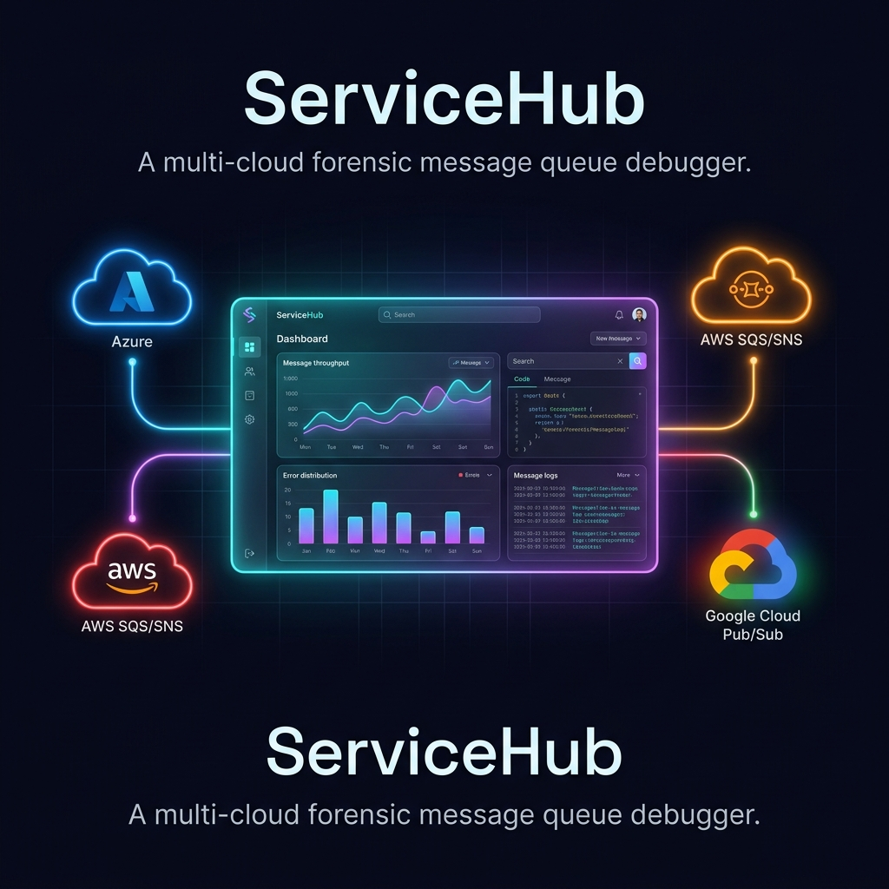

<div align="center">

# ServiceHub

### The Forensic Debugger for Cloud Messaging — Azure Service Bus, AWS SQS/SNS, GCP Pub/Sub



[](LICENSE)
[](https://dotnet.microsoft.com/)
[](https://react.dev/)
[](https://www.typescriptlang.org/)
[](.version)
[](https://app-servicehub-prod.azurewebsites.net/)

[🚀 Open ServiceHub](https://app-servicehub-prod.azurewebsites.net/) · [⚡ Quick Start](#quick-start) · [✨ Core Features](#core-features) · [🛡️ Security](#security-and-privacy) · [🏗️ Architecture](#architecture) · [🤝 Contributing](#contributing)

</div>

---

## What is ServiceHub?

Production breaks at 2 AM. Your cloud portal shows **5,000 messages in the Dead-Letter Queue** — but you can't read their bodies or search them without writing throwaway scripts. 

**ServiceHub is an ultra-fast, self-hosted web application that gives you complete forensic visibility into your messaging queues.** Think of it as a debugger, but for your cloud messages. 

> 🧪 **No credentials?** Try the built-in [Simulator Mode](#simulator-mode) — spin up 3 synthetic namespaces (Azure + AWS + GCP) with 50 pre-seeded messages each in one click.

---

## ⚡ Quick Start

### 1. Run Locally (30 Seconds)

Clone the repository and run the startup script:

```bash
git clone https://github.com/debdevops/servicehub.git
cd servicehub
./run.sh
```
*The script automatically detects and sets up .NET 10 SDK and Node.js if they are missing.*

Open **[http://localhost:3000](http://localhost:3000)** and you're ready to connect!

### 2. Live Demo

Don't want to install anything? Open the **[ServiceHub Live Hosted App](https://app-servicehub-prod.azurewebsites.net/)**.
*Note: The hosted app uses Microsoft Entra ID (Azure AD) as a security gate. No personal credentials or connection strings are stored.*

---

## ⚖️ ServiceHub vs. Standard Cloud Portals

| Capability | Standard Cloud Portals | ServiceHub |
|---|---|---|
| **View Message Payload** | ❌ Count only / One by one peeking | ✅ Pretty-printed JSON/XML with syntax highlighting |
| **Full-Text Search** | ❌ Not available | ✅ Real-time regex & text search across body & headers |
| **DLQ Analytics** | ❌ None | ✅ Persistent sqlite DLQ history & 30-day failure trends |
| **AI Insights** | ❌ None | ✅ Client-side error clustering (Zero data-sharing) |
| **Dead-Letter Replay** | ❌ Manual one-by-one | ✅ Bulk replay, automated replay rules, rate limiting |
| **Cross-Cloud Trace** | ❌ Not possible | ✅ Trace a single correlation ID routing across clouds |

---

## ✨ Core Features

To avoid confusion, ServiceHub distinguishes between its core production-ready features and its multi-cloud bridge previews.

### 🔷 Azure Service Bus Features (GA)

Our most mature, production-hardened capabilities built directly on top of Azure Service Bus:

*   **📨 Message Browser & Search:** Browse active and dead-letter queues side by side. Virtualized grids load thousands of messages instantly. Search across body, headers, and properties. 
    * *[View Browser Screenshot](docs/screenshots/07-ServiceHub-Home-Page-2.png) | [View Detail Screenshot](docs/screenshots/12-ServiceHub-Message-Detail-Expanded.png)*
*   **💀 DLQ Forensic Investigation:** Click any DLQ message to see the exact reason, error description, and AI assessment. 
    * *[View DLQ Screenshot](docs/screenshots/14-ServiceHub-Home-DLQ-1.png)*
*   **📊 DLQ Intelligence:** Automatically records historical DLQ occurrences to a local SQLite database to show 30-day failure trends and categorize errors (Transient, MaxDelivery, Expired, DataQuality, Authorization). 
    * *[View DLQ Intelligence Screenshot](docs/screenshots/20-ServiceHub-DLQ-Intelligence.png)*
*   **🤖 AI Findings:** Groups similar errors into clusters to identify systemic outages. Runs completely in the browser; no data ever leaves your machine. 
    * *[View AI Findings Screenshot](docs/screenshots/25-ServiceHub-AI-Findings.png)*
*   **⚡ Auto-Replay Rules:** Set up rules to automatically replay matching DLQ messages to active queues. Features safety circuit-breakers to prevent overloading downstream consumers. 
    * *[View Replay Rules Screenshot](docs/screenshots/22-ServiceHub-Auto-Replay-1.png)*
*   **🕐 Scheduled Message Manager:** View, reschedule, or cancel messages queued for future delivery. 
    * *[View Scheduled Screenshot](docs/screenshots/28-ServiceHub-Schedule-Message.png)*
*   **🏢 Multi-Namespace Hub:** Connect and switch between UAT, Staging, and Production namespaces with live visual badges. 
    * *[View Namespace Dashboard](docs/screenshots/13-5-ServiceHub-Multi-Namespace-DashBoard.png)*

### 🌐 Multi-Cloud Bridge Features (Preview)

ServiceHub provides a unified pane of glass for multi-cloud deployments via the **Cloud Bridge**:

| Cloud Provider | Connection Status | Queue / Topic Browse | DLQ Support | Replay Support | Cross-Cloud Trace |
|:---|:---:|:---:|:---:|:---:|:---:|
| **Azure Service Bus** | ✅ GA | ✅ Yes | ✅ Yes | ✅ Yes | ✅ Yes (GA) |
| **AWS SQS / SNS** | 🔶 Preview | ✅ Yes | ✅ Yes | ✅ Yes | 🔜 Phase 2 |
| **GCP Pub/Sub** | 🔶 Preview | ✅ Yes | ✅ Yes | ✅ Yes | 🔜 Phase 2 |

*   **🔗 Cross-Cloud Trace:** Paste a Correlation ID or Message GUID to trace its path as it routes from Azure $\rightarrow$ AWS $\rightarrow$ GCP. Displays a visual hop timeline and a namespace search-coverage panel. *(Phase 1 parallelizes searches across up to 5 Azure namespaces concurrently; AWS and GCP node searches arrive in Phase 2)*.
    * *[View Trace Screenshot](docs/screenshots/27-ServiceHub-CorelationId-Explorer.png)*
*   **⚙️ Unified Configuration:** Configure and manage cloud provider connections via **Settings $\rightarrow$ Cloud Bridge**.

---

## 🧪 Simulator Mode

Want to explore all features safely? Run ServiceHub in Simulator Mode. This boots three synthetic namespaces: **Azure (contoso)**, **AWS (acme)**, and **GCP (globex)**, pre-populated with realistic message logs, DLQ exceptions, and trace data.

```bash
./run.sh --simulator
```
Open **[http://localhost:3000](http://localhost:3000)** and go to **Simulator** in the sidebar. For details, see the [Simulator Guide](SIMULATOR.md).

---

## 🛡️ Security and Privacy

ServiceHub is designed for enterprise compliance and zero-trust environments:

*   **Read-Only by Default:** The app uses `PeekMessagesAsync`. It never consumes or deletes active queue messages during browsing.
*   **AES-GCM Encryption:** Stored connection strings are encrypted at rest using AES-GCM. The key is managed locally and is never sent to the UI.
*   **Zero Data Exfiltration:** All AI anomaly detection and message parsing run entirely in-browser. No external APIs are called.
*   **Log Redaction:** A custom logging pipeline automatically scrubs connection strings, SAS keys, and client secrets from server logs.
*   **Enterprise Deployments:** For complete data sovereignty, deploy ServiceHub inside your virtual network (VNet/VPC). Check out the [Self-Hosting Guide](self-hosting/README.md).

---

## 🏗️ Architecture

ServiceHub is built on Clean Architecture and modern technologies:

*   **Frontend:** React 19, TypeScript 5, Tailwind CSS v4, TanStack Query v5.
*   **Backend:** ASP.NET Core 10, Entity Framework Core (SQLite).
*   **SDKs:** Azure.Messaging.ServiceBus, AWSSDK.SQS, AWSSDK.SNS, Google.Cloud.PubSub.V1.

For a deep-dive, see the [Architecture Document](services/api/ARCHITECTURE.md) and the [Comprehensive Design Guide](docs/COMPREHENSIVE-GUIDE.md).

---

## 🤝 Contributing

We welcome community contributions! Please read our testing guidelines before opening a pull request:

```bash
# Run Frontend Tests (Vitest)
cd apps/web
npm run test:coverage

# Run Backend Tests (xUnit)
cd services/api
dotnet test
```

For detailed setup, see the [Developer Onboarding Guide](services/api/README.md).

---

## License

This project is licensed under the MIT License - see the [LICENSE](LICENSE) file for details.
