<div align="center">

# ServiceHub

### The Forensic Debugger for Azure Service Bus

**See what's inside your queues — not just message counts.**


[](LICENSE)
[](https://dotnet.microsoft.com/)
[](https://react.dev/)
[](https://www.typescriptlang.org/)
[](https://app-servicehub-prod.azurewebsites.net/)

[Live Demo](https://app-servicehub-prod.azurewebsites.net/) · [Get Started](#-quick-start) · [Features](#-features) · [Screenshots](#-screenshots) · [API Docs](#-api-documentation) · [Contributing](#-contributing)

</div>

---

## Why ServiceHub?

Production breaks at 2 AM. Azure Portal shows **5,000 messages in Dead-Letter Queue** but you can't read them — only counts and metadata. You manually sample messages one by one, spending hours on what should take minutes.

**ServiceHub is a self-hosted web application that lets you browse, search, and analyze Azure Service Bus messages in real time** — like email for your message queues.

| Capability | Azure Portal | ServiceHub |
|---|---|---|
| View message content | Count only | Full body + properties |
| Search messages | Not available | Full-text search |
| DLQ investigation | One at a time | Batch analysis + AI |
| Pattern detection | Not available | AI-powered clustering |
| Replay from DLQ | Not available | One-click replay |
| Access | Cloud portal | Any browser |

---

## 📸 Screenshots

### Connect to Azure Service Bus

Enter your connection string and you're in. Supports Listen-only (read-only) or Manage (full access) policies.

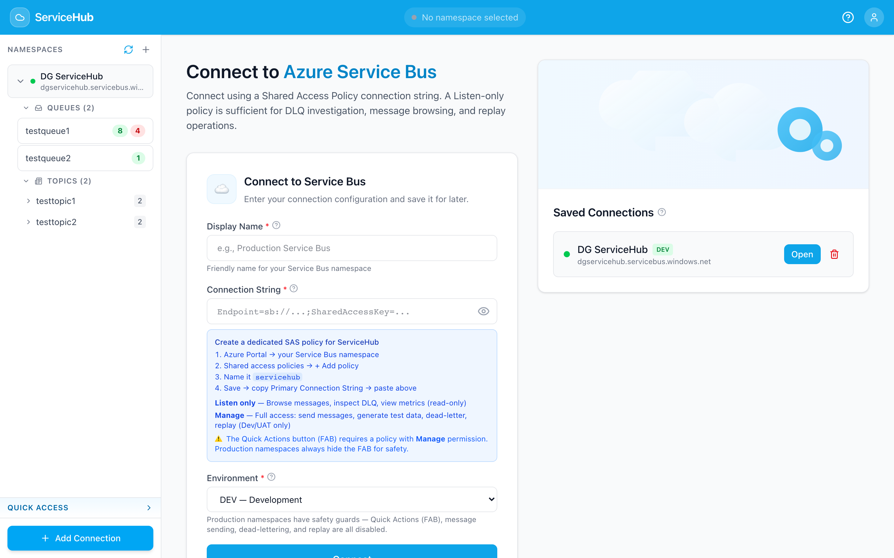

### Message Browser

Browse active messages across queues and topic subscriptions. See message previews, status badges, and metadata at a glance.


### Message Detail — Properties

Click any message to inspect every detail. System properties show Message ID, enqueue time, TTL, sequence number, delivery count, and content type.

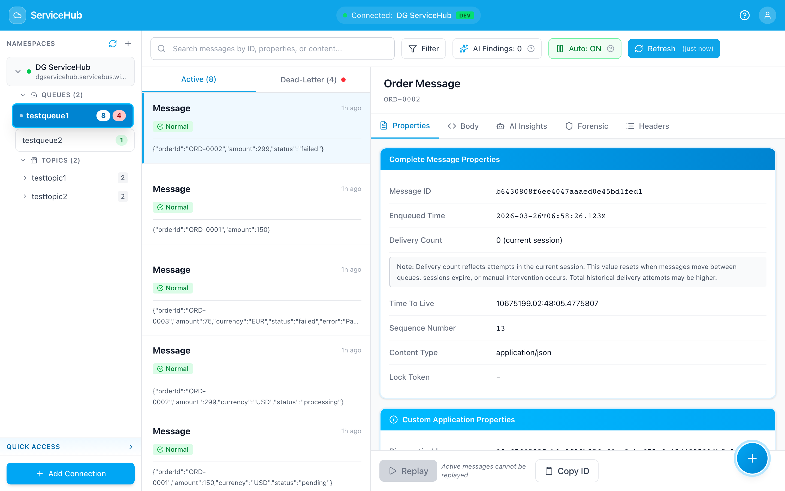

### Message Detail — Body

Full JSON body with syntax highlighting and copy button. Supports JSON, XML, and plain text formats.


### Message Detail — AI Insights

AI-powered analysis detects patterns, anomalies, and error clusters across your messages. All processing happens in your browser — no data leaves your environment.

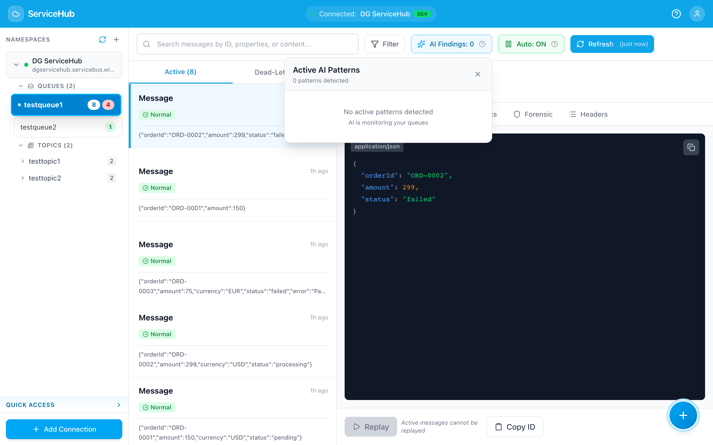

### Message Detail — Forensic View

Deep forensic analysis showing message lifecycle, delivery attempts, and processing timeline.

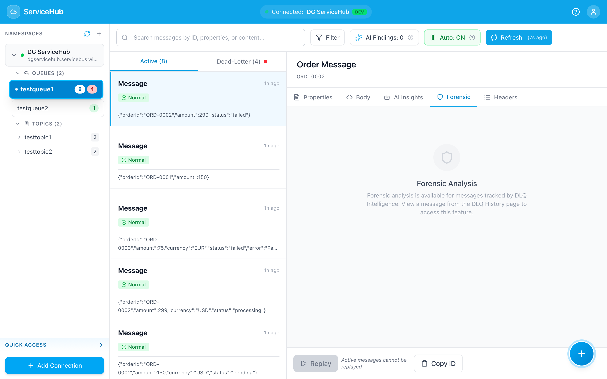

### Message Detail — Headers

View all custom application properties and correlation headers.


### Dead-Letter Queue

Investigate failed messages with DLQ reason, error description, and AI-powered remediation guidance. Replay messages back to the original queue with one click.

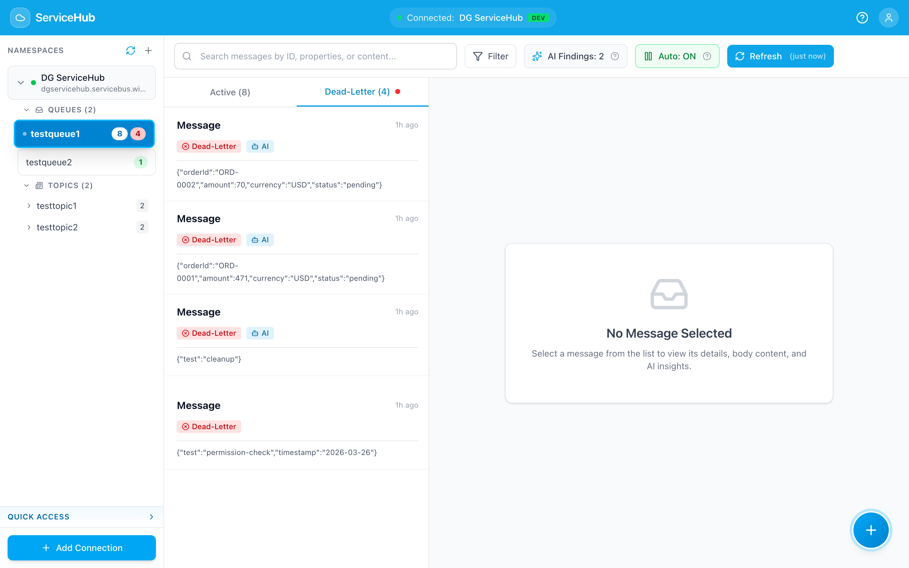

### DLQ Message Detail with Replay

See why messages failed and replay them after fixing the root cause.

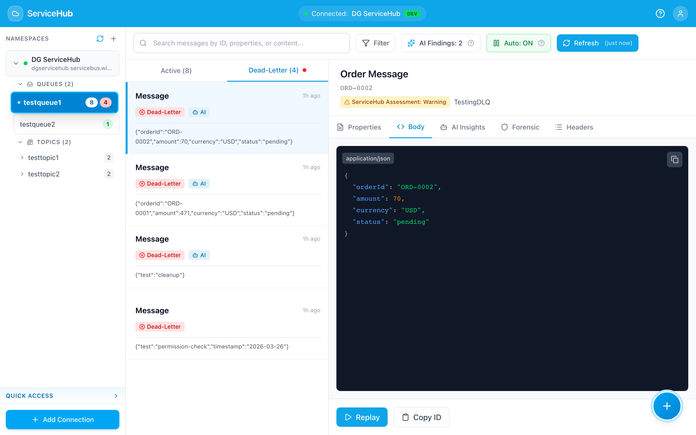

### DLQ AI Analysis

AI automatically categorizes DLQ failures and suggests remediation steps.


### Topic Subscriptions

Browse messages from topic subscriptions with the same powerful inspection tools.

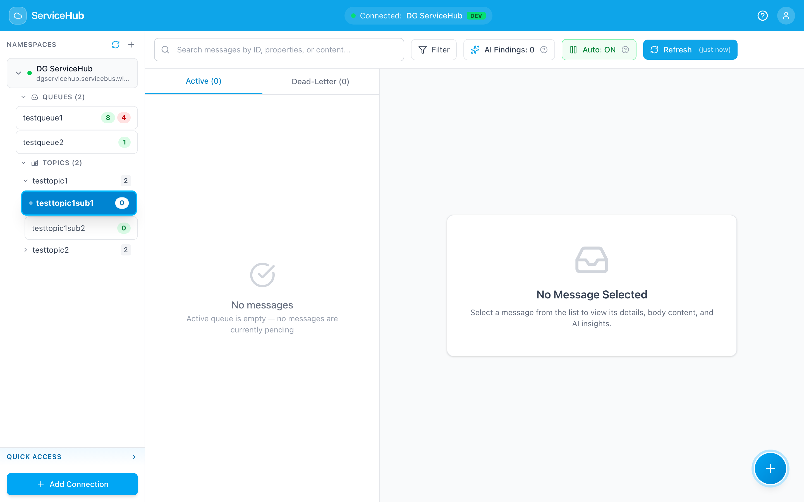

### Quick Actions (FAB)

Floating action button provides quick access to Send Message, Generate Messages, Test DLQ, and Refresh All.

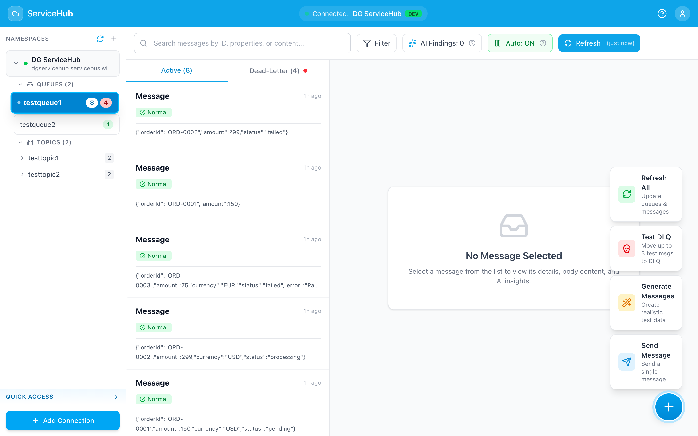

### Send Message

Send single messages to queues or topics for ad-hoc testing. Supports custom properties, content types, and advanced options.


### Generate Test Messages

Generate realistic test messages with built-in scenarios (Order Processing, Payment Gateway, Notification Service, and more). Configure volume and anomaly rate.


### DLQ Intelligence Dashboard

Persistent tracking and monitoring of dead-letter queue messages with trend chart, status breakdown, and category classification.

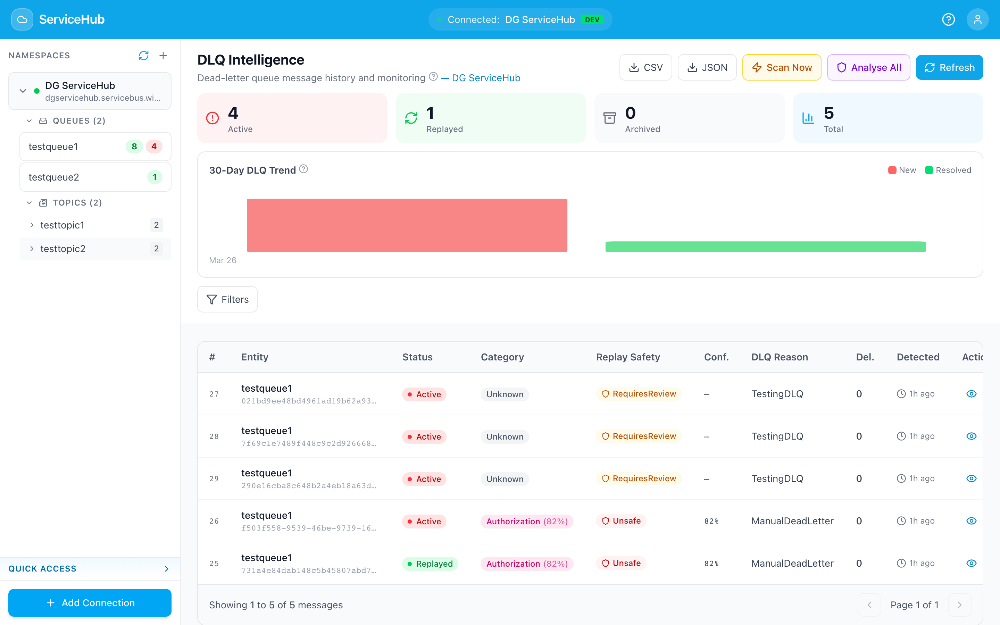

### DLQ History Detail

Drill into individual DLQ records with forensic timeline, replay history, and status tracking.

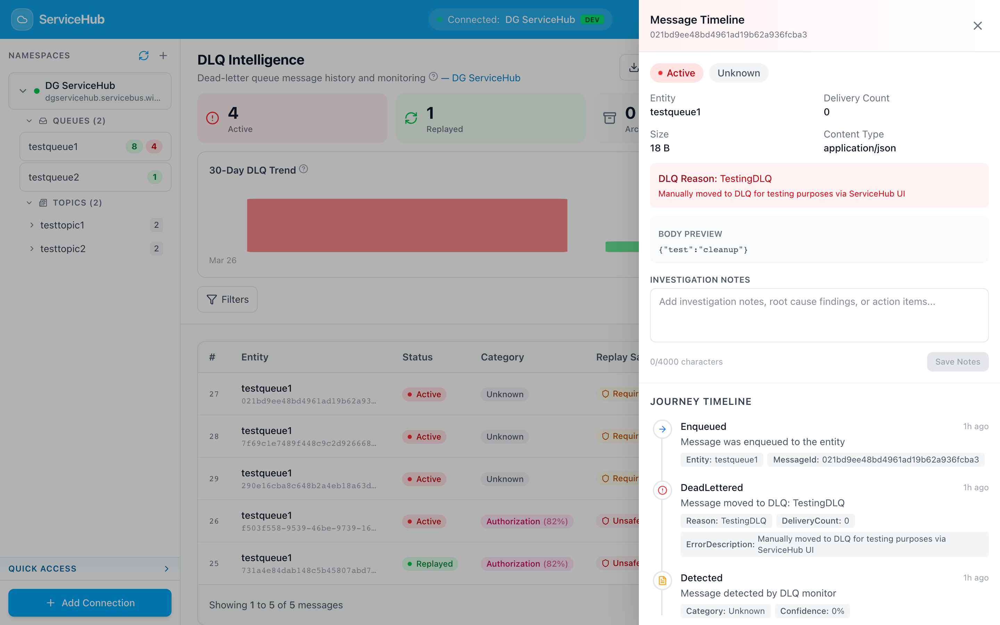

### Auto-Replay Rules

Define conditional replay rules with live statistics. Match messages by dead-letter reason, error description, entity name, content type, or body text.


### Rule Template Gallery

Browse pre-built rule templates for common failure scenarios — transient errors, max delivery exceeded, expired messages, and more.

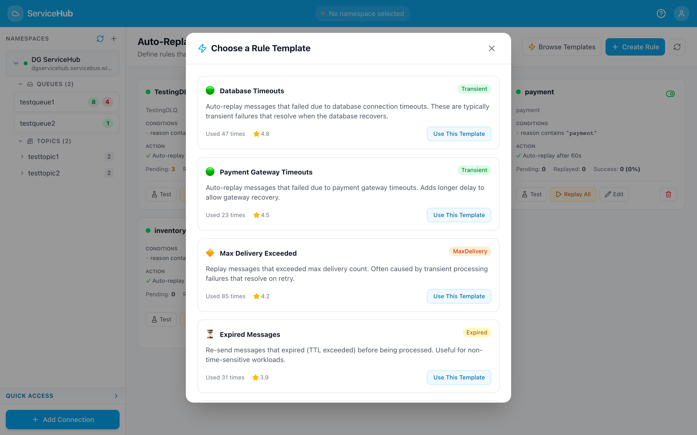

### Create Auto-Replay Rule

Build custom rules with field conditions, operators, actions, rate limiting, and target entity configuration.

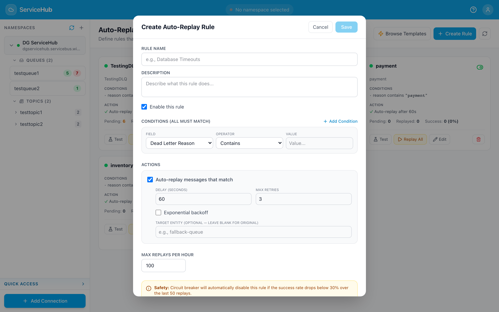

### System Health

Monitor API health, uptime, memory usage, thread count, GC collections, and server information.


### Help & Quick Reference

Searchable help guide covering every feature, Azure Service Bus concepts, and a guided tour.

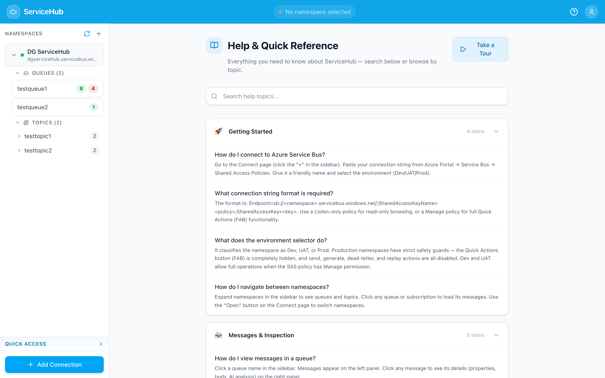

### Message Search & Filter

Find messages by any property — message ID, correlation ID, body content, custom headers.

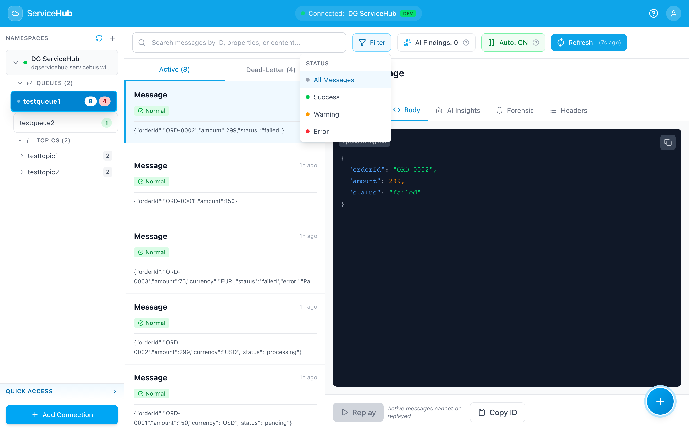

### Sidebar Navigation

Namespace browser with live message counts, queue/topic tree, and Quick Access panel.


### API Documentation (Scalar)

Interactive API documentation with Scalar — test endpoints directly from the browser.


---

## 🚀 Features

### Message Browser
- Browse **active** and **dead-letter** queue messages side by side
- View full message body with JSON syntax highlighting
- Inspect system properties, custom headers, and application properties
- Real-time search across message content and properties
- Auto-refresh with configurable polling intervals

### AI-Powered Analysis
- **Pattern detection** — Identify error clusters across thousands of messages
- **Anomaly identification** — Flag unusual messages automatically
- **Remediation suggestions** — Actionable guidance for each failure type
- **Client-side processing** — All analysis runs in your browser; no data leaves your environment

### DLQ Intelligence System
- **Persistent tracking** — DLQ messages stored in local SQLite database
- **Category classification** — Auto-categorizes: Transient, MaxDelivery, Expired, DataQuality, Authorization
- **Trend chart** — 30-day DLQ trend visualization (New vs. Resolved)
- **Instant scanning** — "Scan Now" for immediate DLQ polling
- **Export** — Download DLQ data as JSON or CSV
- **Status tracking** — Active → Replayed → ReplayFailed → Resolved

### Auto-Replay Rules Engine
- **Conditional matching** — Match messages by reason, error description, entity, delivery count, body text
- **Operators** — Contains, Equals, StartsWith, EndsWith, Regex, GreaterThan, LessThan, In
- **Live statistics** — Pending/Replayed/Success counts updated in real time
- **Rate limiting** — Max replays per hour to prevent overwhelming downstream services
- **Batch replay** — Replay all matching messages with one click
- **Template gallery** — Pre-built rules for common failure scenarios
- **Circuit breaker** — Auto-disables rules if success rate drops below threshold

### Testing & Development Tools
- **Send Message** — Send single messages to queues or topics with custom properties
- **Generate Messages** — 6 built-in scenarios with configurable volume (30–200) and anomaly rate (0–50%)
- **Test DLQ** — Move test messages to dead-letter queue for testing DLQ workflows
- **Tagged messages** — All generated messages tagged with `ServiceHub-Generated` for easy cleanup

### Security & Safety
- **Read-only by default** — Uses Azure SDK PeekMessagesAsync; messages are never removed
- **Listen-only supported** — Works with Listen permission for browse-only access
- **Encrypted at rest** — Connection strings encrypted with AES-GCM
- **No external API calls** — AI analysis runs entirely in the browser
- **No data persistence** — Messages displayed in-memory only
- **Safe for production** — Will not interfere with your consumers

---

## ⚡ Quick Start

### Automated Setup (Recommended)

```bash
git clone https://github.com/debdevops/servicehub.git
cd servicehub
./run.sh
```

The script automatically:
- Installs .NET 10 SDK (if not present)
- Installs Node.js 18+ (if not present)
- Builds and starts both API and UI servers

Open **http://localhost:3000** and connect with your Azure Service Bus connection string.

### Prerequisites

Auto-installed by `run.sh`:
- .NET 10.0 SDK
- Node.js 18+

You provide:
- Azure Service Bus connection string (Listen permission minimum)

### Create a Service Bus Policy

For read-only browsing:
```bash
az servicebus namespace authorization-rule create \
  --namespace-name <your-namespace> \
  --resource-group <your-rg> \
  --name servicehub \
  --rights Listen
```

For full access (send, generate, replay):
```bash
az servicebus namespace authorization-rule create \
  --namespace-name <your-namespace> \
  --resource-group <your-rg> \
  --name servicehub \
  --rights Listen Send Manage
```

### URLs

| Service | URL |
|---|---|
| **Live Demo** | **https://app-servicehub-prod.azurewebsites.net/** |
| UI (local) | http://localhost:3000 |
| API (local) | http://localhost:5153 |
| API Docs (local) | http://localhost:5153/scalar/v1 |

---

## 🏗️ Architecture

```
servicehub/
├── apps/web/                    # React 18 + TypeScript + Vite frontend
│   └── src/
│       ├── components/          # UI components (messages, DLQ, rules, FAB)
│       ├── hooks/               # React Query hooks for API communication
│       ├── lib/                 # API client, utilities, help content
│       └── pages/               # Page components (Messages, Connect, Rules, Health, Help)
│
├── services/api/                # ASP.NET Core 10 backend
│   └── src/
│       ├── ServiceHub.Api/      # REST controllers, middleware, auth
│       ├── ServiceHub.Core/     # Domain entities, DTOs, interfaces
│       ├── ServiceHub.Infrastructure/  # Azure SDK integration, SQLite
│       └── ServiceHub.Shared/   # Common types and utilities
│
├── scripts/                     # Setup and utility scripts
└── run.sh                       # One-command startup
```

**Tech Stack:**
| Layer | Technology |
|---|---|
| Frontend | React 18, TypeScript, Tailwind CSS, TanStack Query |
| Backend | ASP.NET Core 10, Azure.Messaging.ServiceBus SDK |
| AI Analysis | Client-side pattern detection (no external API) |
| Database | SQLite (DLQ Intelligence), in-memory cache |
| API Docs | Scalar (OpenAPI) |

For detailed backend architecture, see [services/api/ARCHITECTURE.md](services/api/ARCHITECTURE.md).

---

## 💡 Real-World Scenarios

### Scenario 1: Dead-Letter Queue Incident
**Problem:** 5,000 orders stuck in DLQ at 2 AM.

**With ServiceHub:**
1. Browse all 5,000 DLQ messages instantly
2. AI detects 3 error patterns: Payment Timeout (40%), Invalid Address (35%), Duplicate Order (25%)
3. Search for specific customer orders by correlation ID
4. Create auto-replay rule for Payment Timeout — replay all 2,000 messages

**Time saved:** 6 hours → 45 minutes

### Scenario 2: Message Correlation
**Problem:** Customer reports order never processed.

**With ServiceHub:**
1. Search across message body and properties
2. Find order in 3 seconds across 10,000 messages
3. Review full message properties and delivery history

**Time saved:** 30 minutes → 30 seconds

### Scenario 3: Integration Testing
**Problem:** Need to test error handling with 100 realistic failure scenarios.

**With ServiceHub:**
1. Select Payment Gateway scenario in Message Generator
2. Generate 100 messages with 30% anomaly rate
3. Verify error handling and DLQ behavior
4. Clean up test messages filtered by ServiceHub-Generated tag

**Time saved:** Manual testing → Automated in 2 minutes

---

## 🔐 Permissions Guide

| Permission Level | Capabilities |
|---|---|
| **Listen only** | Browse messages, inspect DLQ, search, AI insights, view health |
| **Listen + Send** | All above + replay from DLQ + send test messages |
| **Manage** | All above + generate messages, test DLQ, full management |

> **Tip:** Create a dedicated `servicehub` policy instead of using `RootManageSharedAccessKey`.

---

## 📖 API Documentation

ServiceHub exposes a REST API documented with Scalar (OpenAPI). Access interactive docs at:

**http://localhost:5153/scalar/v1**


Key endpoints:
- `GET /api/v1/namespaces` — List connected namespaces
- `GET /api/v1/namespaces/{id}/queues` — List queues with message counts
- `GET /api/v1/namespaces/{id}/topics` — List topics with subscription counts
- `GET /api/v1/namespaces/{id}/queues/{name}/messages` — Browse messages
- `POST /api/v1/namespaces/{id}/queues/{name}/messages` — Send a message
- `GET /api/v1/dlq-history` — DLQ Intelligence records
- `GET /api/v1/replay-rules` — Auto-replay rules

---

## ❓ FAQ

**Q: Does ServiceHub remove messages from queues?**
No. ServiceHub uses PeekMessagesAsync which reads messages without removing them. Your consumers continue processing normally.

**Q: Is it safe for production?**
Yes. ServiceHub only requires Listen permission and operates in read-only mode. Messages remain in queues for your actual consumers.

**Q: How does AI analysis work?**
ServiceHub analyzes message content using heuristic algorithms entirely in your browser. No data leaves your environment.

**Q: What about sensitive data?**
Messages are displayed only in your browser session — not persisted. Deploy ServiceHub in your private network and restrict access.

**Q: Can I deploy to Azure App Service / Kubernetes?**
Yes. ServiceHub is a standard ASP.NET Core + React SPA. Containerize with Docker and deploy anywhere supporting .NET 10.

**Q: Does it support topics with subscriptions?**
Yes. Browse messages from both queues and topic subscriptions independently.

---

## 🤝 Contributing

We welcome contributions! Bug fixes, features, and documentation improvements.

1. Fork the repository
2. Create a feature branch (`git checkout -b feature/amazing-feature`)
3. Make your changes with tests
4. Commit and push
5. Open a Pull Request

---

## License

MIT License — see [LICENSE](LICENSE) for details.

---

<div align="center">

**ServiceHub** — Because your Service Bus messages should not be invisible during incidents.

Built for DevOps, Platform, and SRE Engineers.

[Live Demo](https://app-servicehub-prod.azurewebsites.net/) · [Get Started](#-quick-start) · [View Features](#-features) · [Report Issue](https://github.com/debdevops/servicehub/issues)

</div>
