<div align="center">

# ServiceHub

### The Forensic Debugger for Cloud Messaging — Azure Service Bus, AWS SQS/SNS, GCP Pub/Sub


[](LICENSE)
[](https://dotnet.microsoft.com/)
[](https://react.dev/)
[](https://www.typescriptlang.org/)
[](.version)
[](#quick-start)

[⚡ Quick Start](#quick-start) · [✨ Core Capabilities](#core-capabilities) · [🌐 Multi-Cloud](#multi-cloud-bridge) · [🏗️ Architecture](#architecture) · [🛡️ Security](#security)

</div>

---

## Why ServiceHub?

Production breaks at 2 AM. Your cloud portal shows **5,000 messages in the Dead-Letter Queue** — but you can't read their bodies or search them without writing throwaway scripts. You manually sample messages one by one, spending hours on what should take minutes.

**ServiceHub is an ultra-fast, self-hosted web application that gives engineers full forensic visibility into their cloud message queues** — like a debugger, but for Azure Service Bus, AWS SQS/SNS, and GCP Pub/Sub.

> **Your cloud console shows you counts. ServiceHub shows you answers.**

> [!IMPORTANT]
> **Built for strict environments.** Read-only by default (`Peek`, never consume) · connection strings AES-GCM-256 encrypted at rest · **zero external calls by default** — pattern analysis runs entirely in your browser and no message data ever leaves your network ([telemetry](#application-insights-telemetry) is opt-in and disabled unless you enable it) · destructive actions (replay, send) blocked on production namespaces. Details in [Security](#security).

> [!TIP]
> **No credentials?** Try the built-in [Simulator Mode](#simulator-mode) — runs 3 synthetic namespaces (Azure + AWS + GCP) with 50 seeded messages each. No cloud account needed.

<p align="center">
  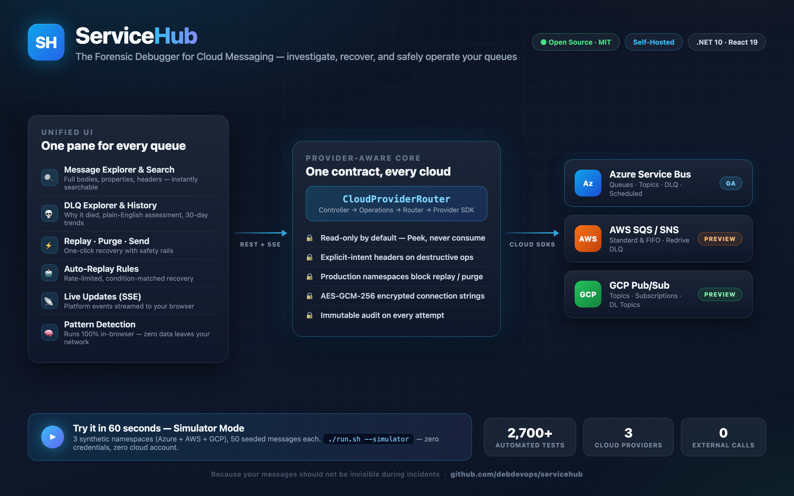
</p>

| Capability | Standard Cloud Portals | ServiceHub |
|---|---|---|
| View message body & content | ❌ Count only | ✅ Full body + syntax highlighting |
| Search across message content | ❌ Not available | ✅ Real-time full-text search |
| Dead-letter queue investigation | ❌ One at a time | ✅ Batch analysis + AI patterns |
| AI pattern detection | ❌ Not available | ✅ Client-side clustering, zero data sent |
| Replay from DLQ | ❌ Not available | ✅ One-click or auto-replay rules |
| Delete a single message | ❌ Not available | ✅ Purge (AWS & GCP; Azure SDK has no single-message delete) |
| Multi-namespace support | ❌ Portal only | ✅ Manage multiple connections |
| Correlation ID tracing | ❌ Not available | ✅ Trace journeys across all queues |
| Scheduled message management | ❌ Not available | ✅ View, reschedule, and cancel |
| Cross-cloud message trace | ❌ Not available | ✅ Trace a message across Azure + AWS + GCP |

---

## Core Capabilities

Everything below serves three jobs: **Investigate** the failure, **Recover** the messages, **Prevent** the repeat. ServiceHub's deepest and most mature features are built natively for Azure Service Bus.

### 🔌 Connect in 30 Seconds — Zero Configuration
Enter your connection string once and you're browsing messages instantly. Supports Listen-only (read-only), Send, and Manage policies. Connection strings are **AES-GCM encrypted at rest** — no plain-text secrets stored anywhere.

### 📨 Message Browser — 1,000s of Messages at Your Fingertips
Browse **Active** and **Dead-Letter** queue messages side by side. See full message previews, status badges, enqueue times, and metadata in a virtualized grid that handles thousands of records without breaking a sweat. Auto-refresh every 7 seconds keeps your view live during incidents.

### 🔍 Forensic Message Inspection — Every Byte Visible
Click any message for complete forensic analysis:
- **Body** — Full JSON/XML with syntax highlighting and one-click copy.
- **Properties** — Message ID, sequence number, TTL, delivery count, enqueue time.
- **Headers** — All custom application properties and correlation IDs.
- **AI Insights** — Pattern context and remediation hints, computed entirely in-browser.

### 🤖 AI Findings — Detect Patterns Across Thousands of Messages
Click **AI Findings** to see error pattern clusters detected across your current queue view. The engine groups messages by error type, calculates confidence scores, and surfaces the most impactful clusters — so you know exactly where to look first.
> [!NOTE]
> **Zero-trust privacy:** All analysis runs entirely in your browser. No message content ever leaves your environment.

### 💀 Dead-Letter Queue Investigation & Recovery
Select the **Dead-Letter** tab to inspect failed messages in full. Each DLQ message shows exactly why the broker moved it, the full error text, the assessment in plain English, and one-click actions: **Replay** it back to the main queue after fixing the root cause, or **Purge** it permanently (AWS & GCP — Azure's SDK has no reliable single-message delete, so the action is disabled there rather than pretending).

### 📊 DLQ Intelligence — Persistent History & 30-Day Trends
DLQ Intelligence automatically scans your dead-letter queues and stores every finding in a local SQLite database — so you can track failures over time, not just during the current session. Features include a 30-day trend chart, auto-categorization (Transient, MaxDelivery, Expired, DataQuality, Authorization), and CSV/JSON exports.

### ⚡ Auto-Replay Rules — Automate Your Recovery
Define rules that watch DLQ messages and automatically replay them when conditions match. Recover from common failures without manual intervention.
- **AI-generated rules** or pre-built templates for timeouts and throttles.
- **Flexible matching** by DLQ reason, error description, entity, delivery count, or regex.
- **Safety controls** with rate limiting to prevent overwhelming downstream services.

### 🔎 Real-Time Search & Correlation Explorer
Search across message body, properties, and headers instantly. Filter 1,000+ messages down to exactly what you need in under a second. Paste any Correlation ID to trace a message's full journey across all queues, topics, and namespaces.

### 🕐 Scheduled Messages
See every message queued for future delivery. Reschedule or cancel individual messages directly from the UI. Azure Service Bus only — AWS SQS (15-minute `DelaySeconds` cap, not inspectable) and GCP Pub/Sub (no scheduled delivery) show an explanatory panel instead of an empty table.

### 📈 Multi-Namespace Dashboard
One glance at every connected namespace — Azure, AWS, and GCP side by side, sorted by DLQ severity. Each card shows live active/DLQ/scheduled counts, a health badge, and one-click jumps into Browse Queues or DLQ History. Quick Actions surface the four things you reach for during an incident: Browse All DLQs, All Scheduled, Cross-Cloud Trace, Auto-Replay Rules.

### 📝 Audit Trail
Every critical operation — send, replay, purge, dead-letter, rule changes — is written to a persistent, per-owner audit log: timestamp, user, cloud/environment, action, resource, and outcome. Exportable, filterable, and isolated so one tenant can never see another's history.

### 🛡️ Security & Privacy Page
An in-app page that answers the trust question before anyone has to ask it: a diagram of exactly how data moves from browser → ServiceHub server → cloud SDK, what's encrypted (connection strings, AES-256-GCM), what's redacted from logs, and what's never stored (message bodies, plaintext secrets) — with links to verify each claim directly in the open-source code.

---

## Multi-Cloud Bridge

ServiceHub extends beyond Azure Service Bus to support **AWS SQS/SNS** and **GCP Pub/Sub** via the Cloud Bridge — a dedicated page that lists every queue, topic, and subscription for a selected non-Azure namespace in one provider-agnostic view, independent of the Correlation ID tracing described below.

| Provider | Status | Browse & Search | Dead-Letter | Replay | Purge | Send & Test Tools³ | Cross-Cloud Trace |
|----------|--------|-----------------|-------------|--------|-------|--------------------|-------------------|
| **Azure Service Bus** | ✅ GA | ✅ | ✅ | ✅ | — (SDK limitation) | ✅ | ✅ |
| **AWS SQS / SNS** | 🔶 Preview | ✅ | ✅ (redrive DLQ) | ✅ | ✅ | ✅ | ✅¹ |
| **GCP Pub/Sub** | 🔶 Preview | ✅ | ✅ peek (nack/ack deadline)² | ✅ | ✅ | ✅ | ✅¹ |

¹ Cross-Cloud Trace searches any namespace whose provider is registered in the API's dependency-injection container. Azure is always registered; AWS/GCP registration is disabled by default in this build — use Simulator mode, or register the provider, to exercise AWS/GCP trace search.
² GCP Pub/Sub dead-lettering is policy-driven via `MaxDeliveryAttempts`; ServiceHub reads the DLQ through the subscription's configured dead-letter topic, and its test tooling moves messages there by republishing through the subscription's dead-letter policy. Message counts are unavailable via the Pub/Sub API and are reported as `0`.
³ Test tools (send a message, generate realistic test data, push messages to the DLQ) are available only on **DEV** namespaces with a Manage-level connection — never in UAT or production.

### 🌐 Cross-Cloud Trace
Connect namespaces from two or more cloud providers and use **Multi-Cloud Trace** to trace a single Correlation ID or message GUID as it routes from Azure $\rightarrow$ AWS $\rightarrow$ GCP (or any combination). The result is a visual routing path diagram, a chronological hop timeline, and a namespace search-coverage panel.
*(Azure namespaces are always searched in parallel. AWS and GCP namespaces are searched the same way whenever those providers are registered on the server; if a provider isn't registered, its namespaces are skipped with a reason shown in the search-coverage panel instead of being silently omitted.)*

---

## Visual Showcase

| Feature | Preview |
|---|---|
| Connect Page | [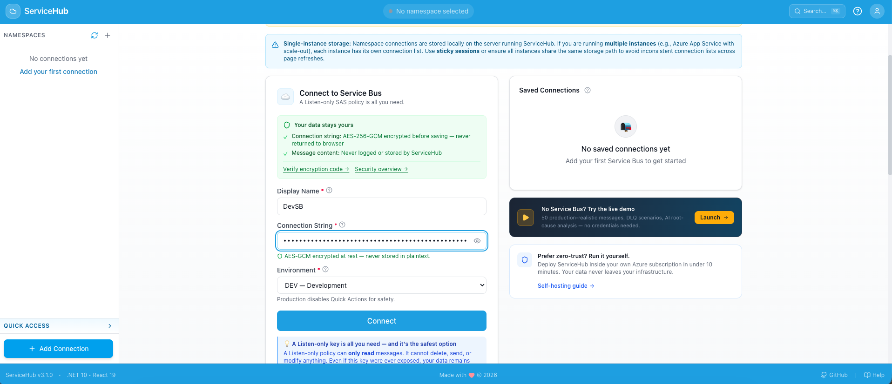](docs/screenshots/01-ServiceHub-Connect-Page-1.png) |
| Message Browser | [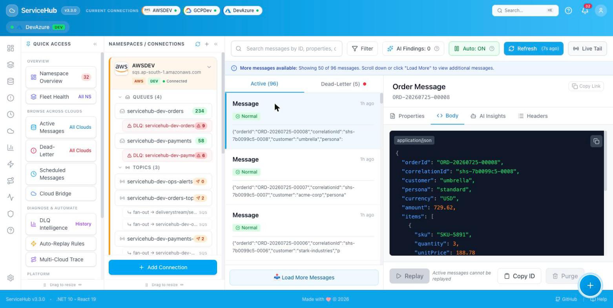](docs/screenshots/07-ServiceHub-Home-Page-2.png) |
| Message Detail (JSON) | [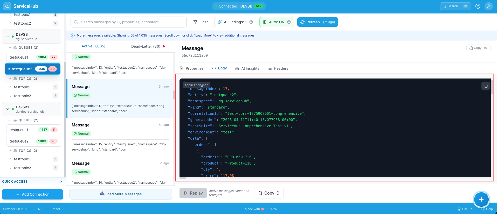](docs/screenshots/12-ServiceHub-Message-Detail-Expanded.png) |
| DLQ Investigation | [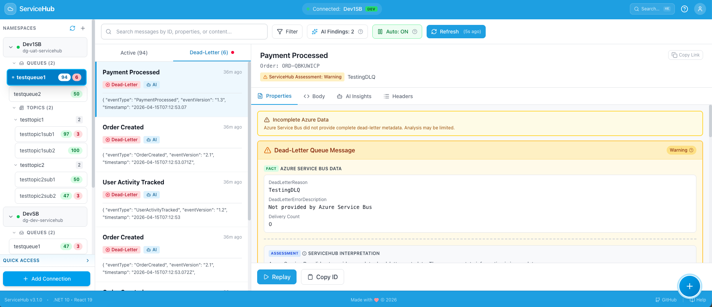](docs/screenshots/14-ServiceHub-Home-DLQ-1.png) |
| AI Pattern Findings | [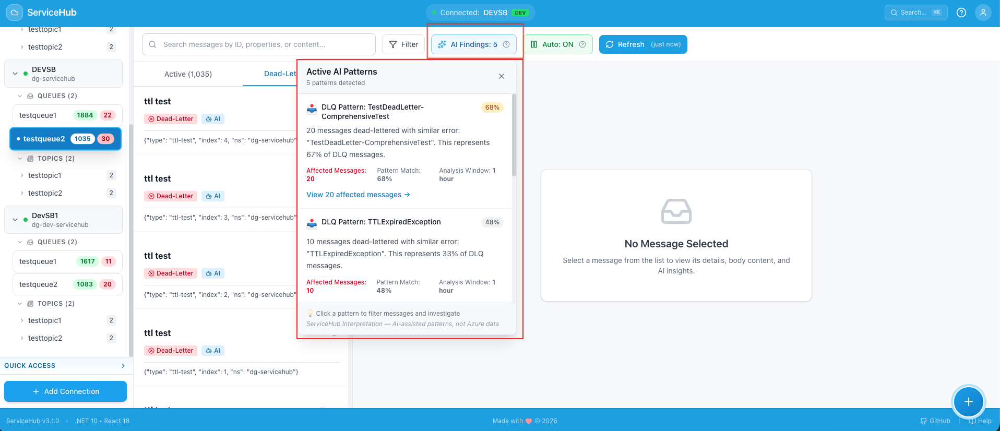](docs/screenshots/25-ServiceHub-AI-Findings.png) |
| DLQ Intelligence | [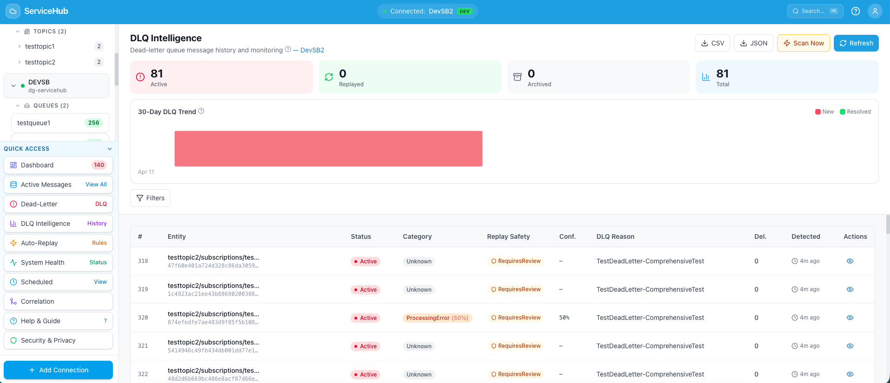](docs/screenshots/20-ServiceHub-DLQ-Intelligence.png) |
| Auto-Replay Rules | [](docs/screenshots/22-ServiceHub-Auto-Replay-1.png) |
| Correlation Explorer | [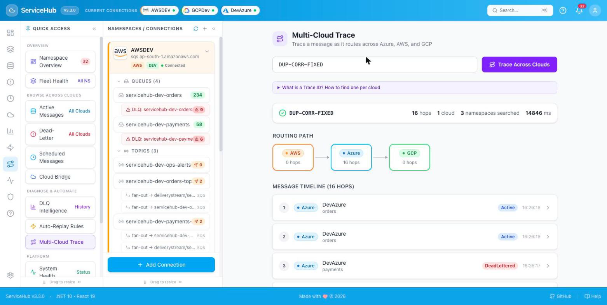](docs/screenshots/27-ServiceHub-CorelationId-Explorer.png) |
| Scheduled Messages | [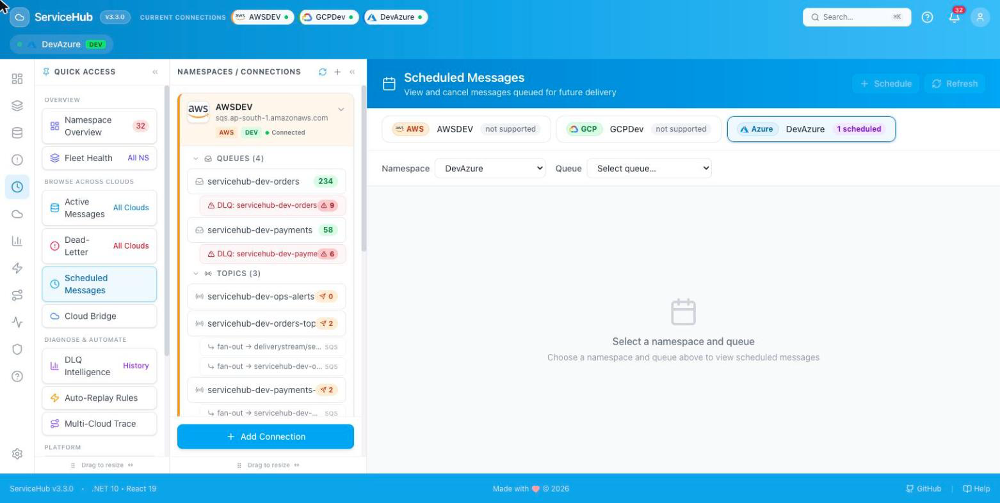](docs/screenshots/28-ServiceHub-Schedule-Message.png) |
| System Health | [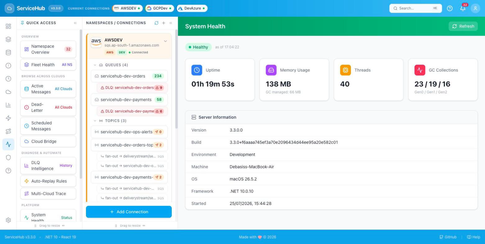](docs/screenshots/29-ServiceHub-System-Health-Status.png) |

### Multi-Cloud Showcase

Captured live against Azure Service Bus, AWS SQS/SNS, and GCP Pub/Sub connected simultaneously — real traffic, not mocked data.

| Feature | Preview |
|---|---|
| Multi-Namespace Dashboard (Azure + AWS + GCP) | [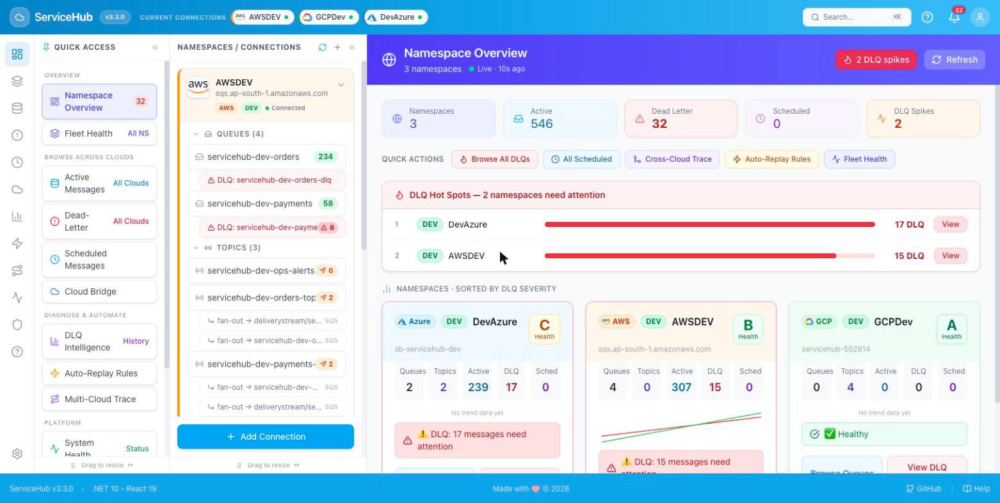](docs/screenshots/30-ServiceHub-MultiCloud-Dashboard.png) |
| Connect — saved connections across all 3 providers | [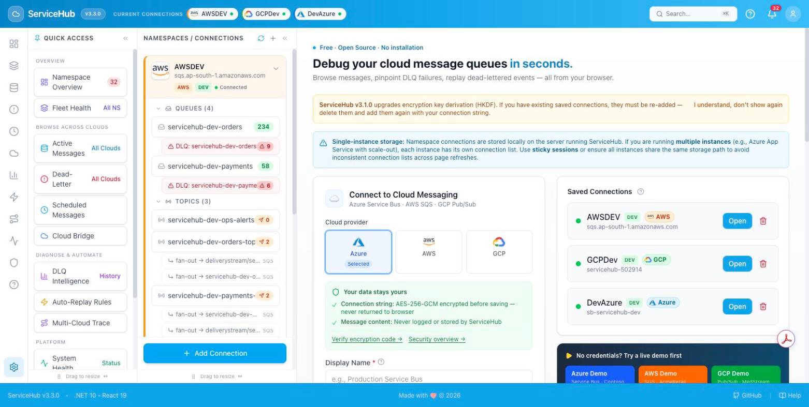](docs/screenshots/31-ServiceHub-Connect-MultiCloud.png) |
| Messages Overview — every cloud, one screen | [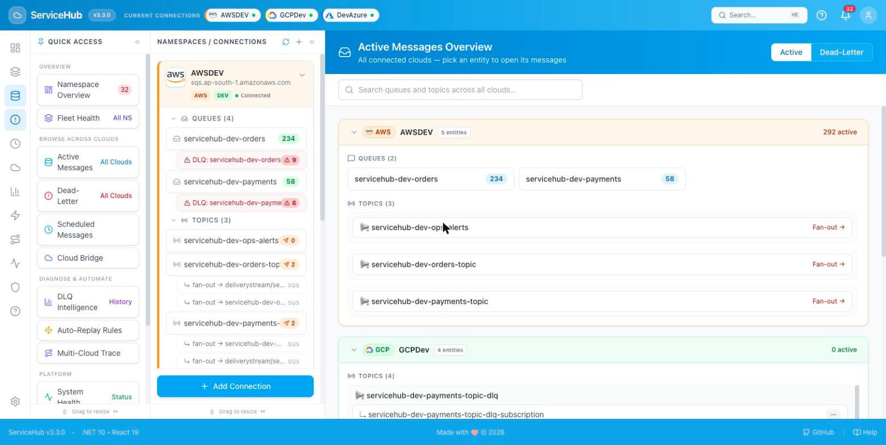](docs/screenshots/32-ServiceHub-Messages-Overview-MultiCloud.png) |
| AWS SNS Fan-Out Dashboard | [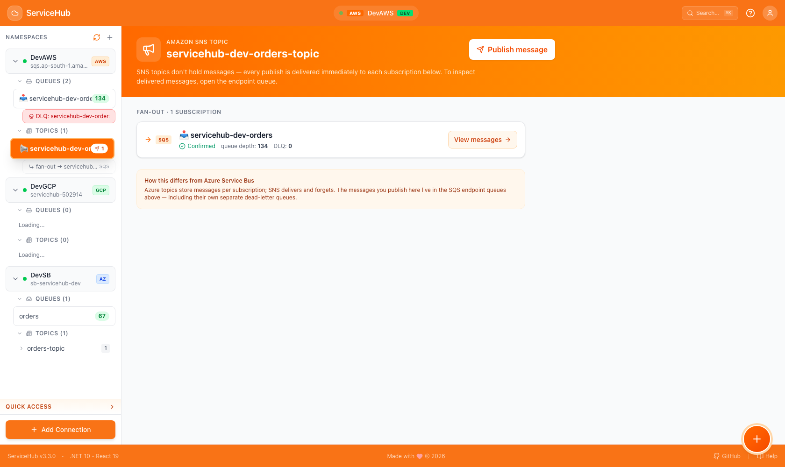](docs/screenshots/33-ServiceHub-AWS-SNS-FanOut.png) |
| GCP Pub/Sub Message Detail | [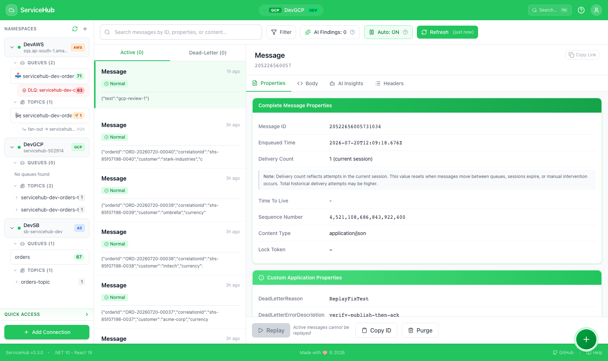](docs/screenshots/34-ServiceHub-GCP-Message-Detail.png) |
| Message Detail — Replay disabled on active messages (safety rail) | [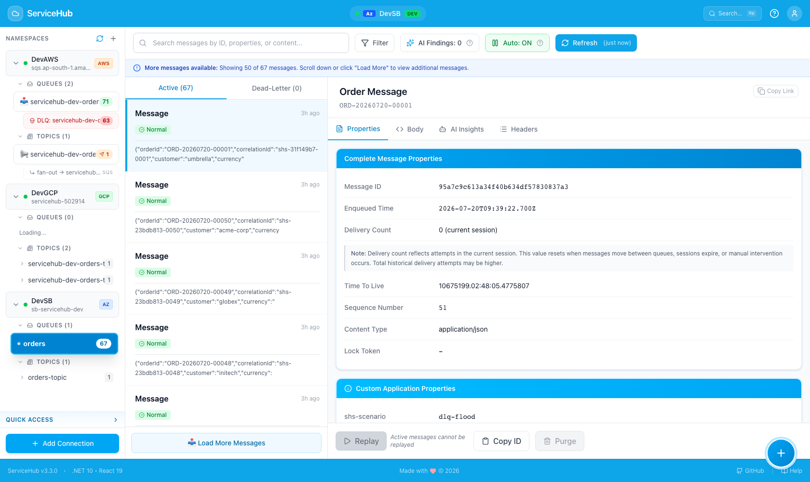](docs/screenshots/35-ServiceHub-Message-Detail-Safety.png) |
| Auto-Replay Rule Builder | [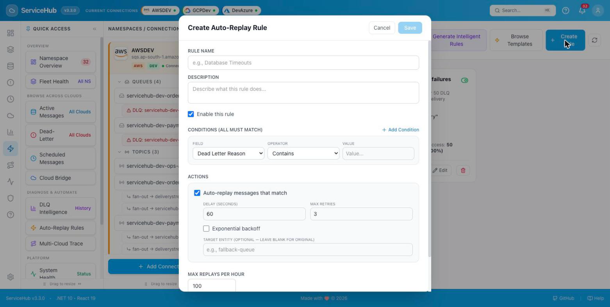](docs/screenshots/36-ServiceHub-Auto-Replay-Rule-Builder.png) |
| DLQ Intelligence — multi-cloud filters | [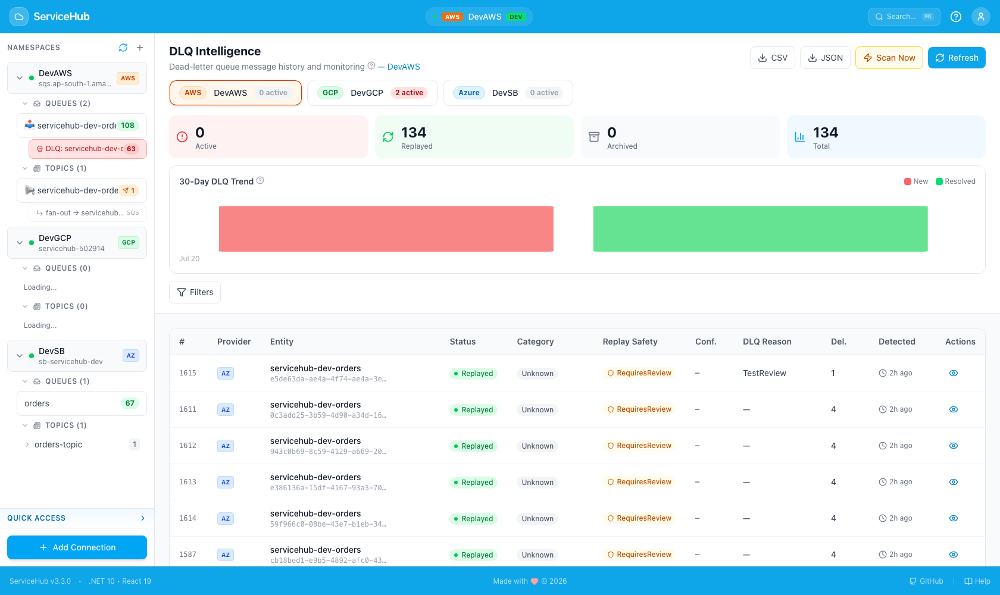](docs/screenshots/37-ServiceHub-DLQ-Intelligence-MultiCloud.png) |
| Security & Privacy — data-flow diagram | [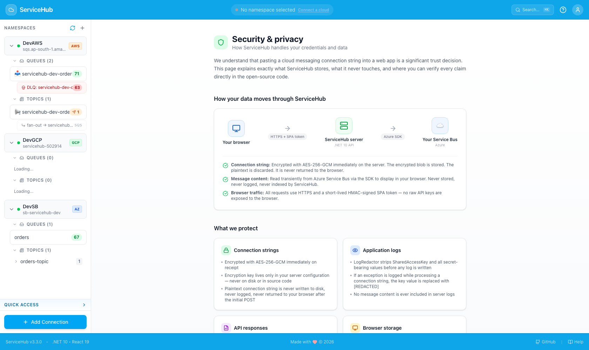](docs/screenshots/38-ServiceHub-Security-Privacy.png) |
| Cloud Bridge — cross-provider entity browser | [](docs/screenshots/39-ServiceHub-Cloud-Bridge.png) |

---

## Real-World Scenarios

### Scenario 1: DLQ Incident at 2 AM
**Problem:** 5,000 orders stuck in Dead-Letter Queue. Azure Portal shows counts only.
**With ServiceHub:**
1. Browse all 5,000 DLQ messages in seconds.
2. AI detects 3 error clusters: Payment Timeout (40%), Invalid Address (35%), Duplicate (25%).
3. Create an auto-replay rule for Payment Timeout $\rightarrow$ replay 2,000 messages automatically.
**Time saved:** 6 hours $\rightarrow$ 45 minutes.

### Scenario 2: Missing Order Investigation
**Problem:** Customer reports order never processed. Which queue did it land in?
**With ServiceHub:**
1. Open Correlation Explorer.
2. Paste the order's Correlation ID.
3. Trace the message journey across all queues and namespaces in one search.
**Time saved:** 30 minutes $\rightarrow$ 30 seconds.

### Scenario 3: Integration Testing
**Problem:** Need 100 realistic failure scenarios to test error handling.
**With ServiceHub:**
1. Open Message Generator $\rightarrow$ select Payment Gateway scenario.
2. Generate 100 messages with 30% anomaly rate.
3. Verify DLQ behavior and error handling.
**Time saved:** Hours of manual test data $\rightarrow$ 2 minutes.

---

## Recommended Usage Flow

Follow this path before connecting to a production namespace. This protects your live environment and gives you confidence in every operation before it matters.

1. **DEV**: Connect your development namespace. Explore message browsing, DLQ inspection, and auto-replay rules in a safe environment.
2. **UAT**: Validate replay targets, confirm rule logic, and review AI findings with realistic data.
3. **PROD**: Connect only after DEV and UAT validation. Production namespaces enforce read-only browsing by default — Quick Actions (replay, send, generate) are disabled to prevent accidental data modification.

> [!WARNING]
> While ServiceHub is read-only by default, replay and send operations are destructive. Validate your replay rules and message targets in lower environments first.

---

## Quick Start

### One-Command Setup (Recommended)

```bash
git clone https://github.com/debdevops/servicehub.git
cd servicehub
./run.sh
```

Open **[http://localhost:3000](http://localhost:3000)** — then connect with your connection string. The script automatically installs .NET 10 SDK and Node.js 20+ if not already present.

### Simulator Mode

```bash
./run.sh --simulator
```
Open **[http://localhost:3000](http://localhost:3000)** and navigate to **Simulator** in the sidebar. See [SIMULATOR.md](SIMULATOR.md) for the full guide.

### Create a Dedicated Policy (Azure)

For read-only browsing (recommended for production):
```bash
az servicebus namespace authorization-rule create \
  --namespace-name <your-namespace> \
  --resource-group <your-rg> \
  --name servicehub-readonly \
  --rights Listen
```

---

## Security

ServiceHub is built for strict enterprise environments.

### What ServiceHub guarantees
- **Read-only by default** — Uses `PeekMessagesAsync`; messages are **never removed or consumed**.
- **AES-GCM encryption** — Connection strings encrypted at rest; key stored in local config, never returned to the browser.
- **Zero external calls** — AI analysis runs entirely in-browser; no message data leaves your environment.
- **No message persistence** — Messages are displayed in-memory only during your session; never written to a database.
- **Log redaction** — Backend logging pipeline strips connection strings, API keys, and access tokens.

### Application Insights Telemetry
ServiceHub optionally emits telemetry to Azure Application Insights. When enabled, telemetry is strictly limited to request durations, error codes, and system metrics. Connection strings, message payloads, business IDs, and user inputs are **explicitly excluded**. Application Insights is **disabled by default**.

---

## Architecture

ServiceHub is a modern Single Page Application communicating with a .NET Core backend.

```
Browser (React 19 SPA)
  └── TanStack Query hooks (useMessages, useQueues, useRules, …)
        └── Axios API client → Vite dev proxy
              └── ASP.NET Core 10 API
                    ├── NamespacesController      → AES-GCM encrypted connections
                    ├── DlqHistoryController      → SQLite DLQ intelligence (no cloud SDK call)
                    ├── RulesController           → auto-replay rule engine
                    ├── SimulatorController       → seeded demo data (no credentials)
                    ├── MessagesController        ┐
                    ├── QueuesController          ├── IMessageOperationsService → CloudProviderRouter
                    ├── TopicsController          ┘
                    └── CrossCloudTraceController → same ICloudMessagingProvider abstraction
                                                     (Azure dispatched via IAzureTraceSearcher,
                                                      AWS/GCP dispatched directly)
                                                            │
                                                            ▼
                                                  ICloudMessagingProvider implementations
                                                            ├── Azure.Messaging.ServiceBus SDK
                                                            ├── AWSSDK.SQS / AWSSDK.SNS
                                                            └── Google.Cloud.PubSub.V1
```

For deep-dive architecture details, see [ARCHITECTURE.md](services/api/ARCHITECTURE.md) and the [Comprehensive Guide](docs/COMPREHENSIVE-GUIDE.md). For exactly which controllers share a routing path today (and which don't yet), see [docs/FLOW.md](docs/FLOW.md).

---

## API Documentation

ServiceHub exposes a full REST API with interactive documentation interfaces accessible when running locally:

- **Scalar (Modern)**: `http://localhost:5153/scalar/v1`
- **Swagger UI**: `http://localhost:5153/swagger/index.html`

---

## FAQ

**Does ServiceHub remove messages from queues?**
No. ServiceHub only uses `PeekMessagesAsync`. Your consumers continue processing normally, unaffected.

**Is it safe to point at production?**
Yes. Listen-only mode is fully read-only. Deploy ServiceHub inside your private network for extra safety. Check out the [Self-Hosting Guide](self-hosting/README.md).

**How does AI analysis work without an API key?**
ServiceHub uses client-side heuristic pattern detection — pure JavaScript in your browser. No GPT, no external service, no data exfiltration.

**Can I delete a single message?**
On AWS (delete by receipt handle) and GCP (acknowledge), yes — the Purge action, guarded by explicit-intent headers and blocked on production namespaces. Azure Service Bus has no reliable single-message delete in the SDK, so ServiceHub disables the action there instead of faking it.

---

## Contributing

Bug fixes, features, and documentation improvements are welcome!

```bash
# Unit tests (Vitest — 1,100+ tests, ≥60% coverage required)
cd apps/web && npm run test:coverage

# Backend tests (xUnit — 1,500+ unit + integration tests)
cd services/api && dotnet test

# E2E tests (Playwright — requires ./run.sh --simulator)
cd apps/web && npm run test:e2e
```
For deep backend developer guidelines, refer to the [API README](services/api/README.md).

---

## Roadmap

ServiceHub is built depth-first: make one workflow excellent before adding the next surface.

- **Now (MVP)** — the forensic core across Azure (GA) and AWS/GCP (preview): explore, search, DLQ investigation, replay, purge, send, auto-replay rules, simulator, live updates.
- **Next** — operational habit: bulk replay/purge with dry-run preview, DLQ triage inbox, live tail, fleet dashboard across namespaces, Slack/Teams alert cards, Docker packaging.
- **Later** — team & governance: SSO, role-based access, approval workflows for destructive operations, audit export.

Have a use-case that should shape this? [Open a feature request](https://github.com/debdevops/servicehub/issues/new) — describe the problem, not just the solution.

---

<div align="center">

**ServiceHub** — Because your Service Bus messages should not be invisible during incidents.

Built for DevOps, Platform, and SRE Engineers.

[⚡ Self-Host ServiceHub](#quick-start) · [Report Issue](https://github.com/debdevops/servicehub/issues)

</div>
