<div align="center">

# ServiceHub

### The Forensic Debugger for Cloud Messaging — Azure Service Bus (GA) · AWS SQS/SNS & GCP Pub/Sub (Supported)


[](https://github.com/debdevops/servicehub/actions/workflows/servicehub.yml)
[](LICENSE)
[](https://dotnet.microsoft.com/)
[](https://react.dev/)
[](https://www.typescriptlang.org/)
[](.version)
[](#quick-start)

[📖 **The Complete Guide**](docs/SERVICEHUB-COMPLETE-GUIDE.md) · [🆕 What's New](#whats-new-in-v400) · [⚡ Quick Start](#quick-start) · [🖥️ Run It Locally (Plain-Language Guide)](LOCAL-DEPLOYMENT.md) · [📚 User Guides](#user-guides) · [✨ Core Capabilities](#core-capabilities) · [🌐 Multi-Cloud](#multi-cloud-bridge) · [🏗️ Architecture](#architecture) · [🛡️ Security](#security) · [🚀 Self-Hosting](self-hosting/README.md) · [📋 Changelog](CHANGELOG.md)

</div>

---

## What is ServiceHub?

**ServiceHub is a self-hosted, open-source forensic debugger for cloud message queues.** Point
it at Azure Service Bus, AWS SQS/SNS, or GCP Pub/Sub and it gives you what the cloud console
won't: full message bodies, real-time search, AI-assisted dead-letter pattern detection, one-click
replay, and a permanent, tamper-evident record of every recovery decision it makes — all running
in a single process you control, with no message data ever leaving your network. Azure Service Bus
is fully supported (GA); AWS and GCP are Supported, conformance-tested against live infrastructure
but capability-gated relative to Azure (see [Provider Conformance](docs/PROVIDER-CONFORMANCE.md)).

> [!NOTE]
> **v4.0.0** closes out the autonomy chapter and opens the next one: durable evidence for all
> four pillars (not just Recover), Production namespaces observable end-to-end with recovery
> gated behind a two-person elevation, an operator-attested route to the top of the autonomy
> ladder on AWS/GCP, outcome metrics that trace to ledger rows, a five-destination top nav, and
> a tested in-place upgrade path from v3.7. See [What's new in v4.0.0](#whats-new-in-v400) and
> the [Changelog](CHANGELOG.md) for the full list.

---

## Why ServiceHub?

Production breaks at 2 AM. Your cloud portal shows **5,000 messages in the Dead-Letter Queue** — but you can't read their bodies or search them without writing throwaway scripts. You manually sample messages one by one, spending hours on what should take minutes.

> **Your cloud console shows you counts. ServiceHub shows you answers.**

> [!IMPORTANT]
> **Built for strict environments, single-operator by default.** Read-only by default (`Peek`, never consume) · connection strings AES-GCM-256 encrypted at rest · analysis runs entirely in your browser — no message data ever leaves your network ([telemetry](#telemetry-opt-in-vendor-neutral) is opt-in, disabled unless you enable it) · destructive actions (replay, send) blocked on production namespaces. **Every browser session shares one admin identity unless you turn on per-user identity** — OIDC (any standards-compliant IdP) or Azure Easy Auth, both off by default. Details in [Security](#security).

> [!TIP]
> **No credentials?** The Welcome page's **"Try a live demo"** buttons open a fully client-side demo walkthrough per cloud — no backend, no cloud account needed.

<table>
<tr>
<td width="50%"><a href="docs/screenshots/showcase/10-investigate-message-forensics.jpg">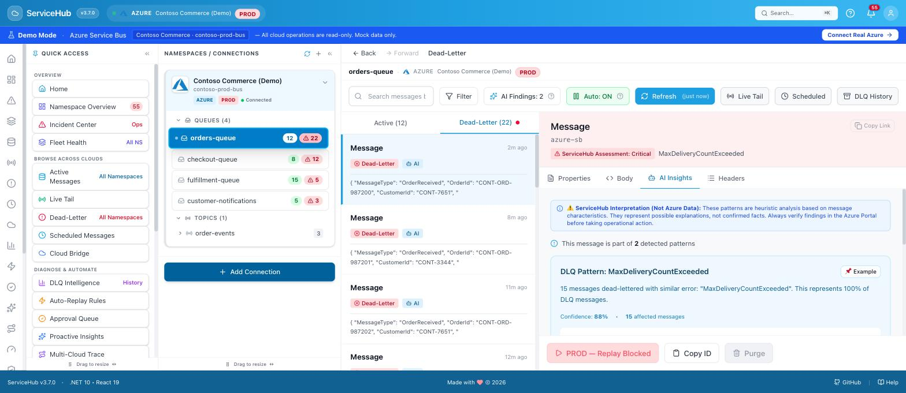</a><br/><sub>Live capture — the Dead-Letter tab: full message list on the left, AI-clustered failure pattern (confidence + affected-message count) on the right.</sub></td>
<td width="50%"><a href="docs/screenshots/showcase/11-investigate-message-body.jpg">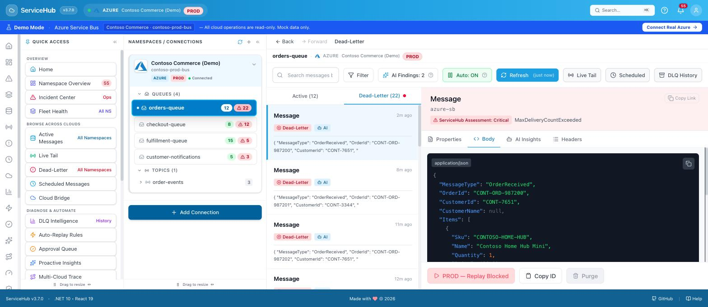</a><br/><sub>Live capture — the Body tab: full JSON with syntax highlighting, not the truncated preview a cloud console gives you.</sub></td>
</tr>
</table>

| Capability | Standard Cloud Portals | ServiceHub |
|---|---|---|
| View message body & content | ❌ Count only | ✅ Full body + syntax highlighting |
| Search across message content | ❌ Not available | ✅ Real-time full-text search |
| Dead-letter queue investigation | ❌ One at a time | ✅ Batch analysis + AI patterns |
| AI pattern detection | ❌ Not available | ✅ Client-side clustering, zero data sent |
| Replay from DLQ | ❌ Not available | ✅ One-click or auto-replay rules |
| Delete a single message | ❌ Not available | ✅ Purge (AWS & GCP; Azure SDK has no single-message delete) |
| Multi-namespace support | ❌ Portal only | ✅ Manage multiple connections |
| Correlation ID tracing | ❌ Not available | ✅ Trace journeys across all queues |
| Scheduled message management | ❌ Not available | ✅ View, reschedule, and cancel (Azure only — see the provider table below) |
| Cross-cloud message trace | ❌ Not available | ✅ Trace across Azure + AWS + GCP (AWS/GCP require an operator to enable them on the server) |

---

## What's new in v4.0.0

Everything since v3.7.0 — full detail in [CHANGELOG.md](CHANGELOG.md). The headline: the top of
the autonomy ladder stopped being a design claim (an L3→L4 promotion, an unattended autonomous
replay, an L4→L3 demotion, and a circuit-breaker trip have each been observed end to end against
real Azure Service Bus traffic, with independently verifiable evidence exports), and this release
closes the three qualifiers that claim still carried:

- **Durable evidence for all four pillars, not just Recover.** Anomaly, drift, correlation,
  narration, backlog-forecast and external-signal findings — previously six process-local,
  24-hour caches that lost everything on restart — now persist to SQLite with a retention sweep
  that never prunes a finding a Playbook Ledger proposal still cites. A new owner-wide
  `GET /api/v1/playbook/export` plus `scripts/verify-playbook-chain.py` let an auditor resolve
  every cited finding from an export alone.
- **Production, earned the same way autonomy was.** A namespace can now be registered as `Prod` —
  Investigate/Correlate/Prevent run against it fully. Every recovery verb still denies it unless a
  time-boxed [production elevation](#production-namespaces-and-elevation) is live, with dual control
  and a hard L0/L1 autonomy ceiling that no configuration raises. See
  [ADR-0010](docs/adr/0010-production-namespace-elevation.md).
- **A named trust root for AWS/GCP's DLQ-absence gap.** An operator-provisioned, push-based DLQ
  observer (Terraform for AWS Lambda+DynamoDB / GCP Cloud Function+Firestore) can attest DLQ
  absence where the provider API can't prove it — a different trust root, not a relaxed one, named
  explicitly in [Provider Conformance](docs/PROVIDER-CONFORMANCE.md). Fails closed on a stale or
  missing observer. **Code-complete; not yet exercised against real cloud infrastructure** — the
  Terraform modules haven't been applied in this build. See [Multi-Cloud Bridge](#multi-cloud-bridge).
- **Outcome measurement.** A "This week" strip on Home and `GET /api/v1/recovery/outcomes` report
  what the fleet actually achieved — messages recovered, written off, median time to a verified
  recovery, recoveries no human had to approve, and gate refusals that stopped a bad replay. Every
  figure traces to a `RecoveryLedgerEntry`/`RecoveryEvent` row — never modelled or estimated.
- **A smaller top-level nav.** The Icon Rail now shows five destinations (Home, Incident Center,
  Namespace Overview, Approval Queue, Recovery Evidence) plus a **More** button that opens the
  command palette. Nothing was removed — Quick Access and the command palette still reach every
  page.
- **Configuration as code and epoch sealing** — see
  [Configuration Export/Import](#configuration-as-code) and
  [Evidence Archive and Epoch Sealing](#evidence-archive-and-epoch-sealing) below.
- **A CI-proven upgrade path from v3.7.** `UpgradeInPlaceTests` stands up a real v3.7-era SQLite
  file, seeds a hash-chained ledger against it, migrates to HEAD, and asserts no data loss and an
  intact chain — see [Release & Upgrade Model](#release--upgrade-model).

---

## 🛡️ Investigate → Recover → Prove It Happened

That's the whole product, in three words. **Investigate** a failure with full message bodies and
AI-assisted pattern clustering — not just a count. **Recover** it with one-click or automated
replay, safety-gated on production namespaces. **Prove it happened** with the Recovery Evidence
Ledger, a permanent, append-only, hash-chained record of exactly what ServiceHub asked the
provider to do and what it subsequently observed — so replay isn't a black box you have to trust
blindly.

Every screenshot below is a live capture from this build — real Azure Service Bus, AWS SQS/SNS,
and GCP Pub/Sub dev namespaces connected to ServiceHub simultaneously, not mocked data or a
staged demo. Click any image to open it full-size.

<table>
<tr>
<td width="33%"><a href="docs/screenshots/showcase/01-investigate-dashboard.jpg">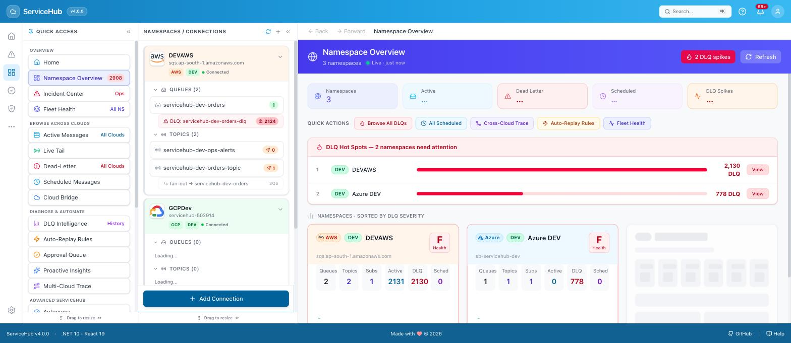</a><br/><sub><b>1. Investigate</b> — Azure, AWS, and GCP namespaces side by side, sorted by DLQ severity</sub></td>
<td width="33%"><a href="docs/screenshots/showcase/02-investigate-ai-insights.jpg">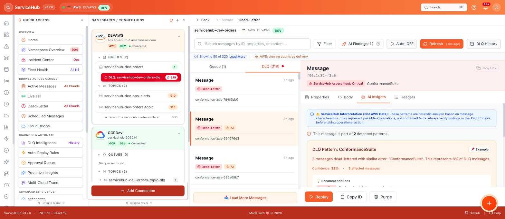</a><br/><sub><b>2. Investigate</b> — full message body plus AI Insights, confidence-scored and never hidden</sub></td>
<td width="33%"><a href="docs/screenshots/showcase/03-investigate-fleet-operations.jpg">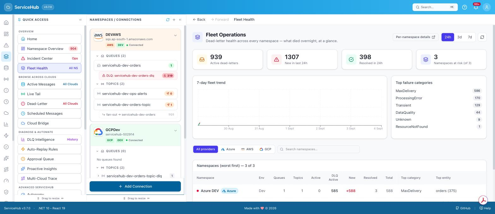</a><br/><sub><b>3. Investigate</b> — Fleet Operations: what died overnight, across every namespace at once</sub></td>
</tr>
<tr>
<td width="33%"><a href="docs/screenshots/showcase/04-recover-attention-queue.jpg"></a><br/><sub><b>4. Recover</b> — Home ranks what needs a decision first, one cloud at a time — never a blended Azure+AWS+GCP dashboard</sub></td>
<td width="33%"><a href="docs/screenshots/showcase/05-recover-auto-replay-rules.jpg">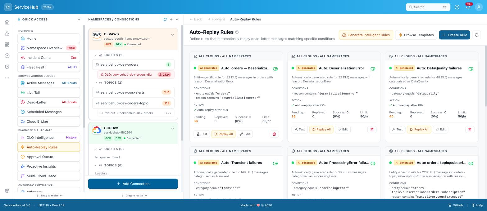</a><br/><sub><b>5. Recover</b> — AI-generated Auto-Replay Rules, with a circuit breaker that self-disables on low success</sub></td>
<td width="33%"><a href="docs/screenshots/showcase/06-recover-incident-center.jpg">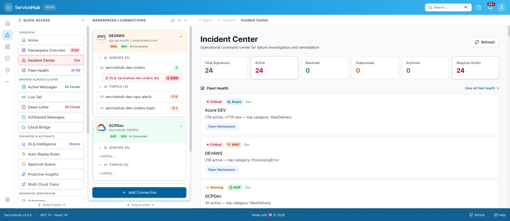</a><br/><sub><b>6. Recover</b> — Incident Center: the operational command center for failure remediation</sub></td>
</tr>
<tr>
<td width="33%"><a href="docs/screenshots/showcase/07-prove-recovery-evidence-ledger.jpg">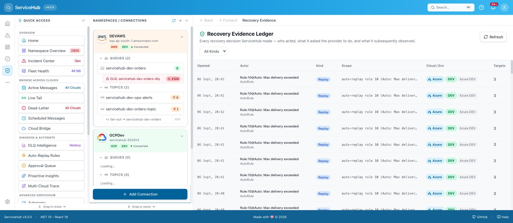</a><br/><sub><b>7. Prove it happened</b> — the Recovery Evidence Ledger, one row per recovery decision, hash-chained</sub></td>
<td width="33%"><a href="docs/screenshots/showcase/08-prove-playbook-ledger.jpg">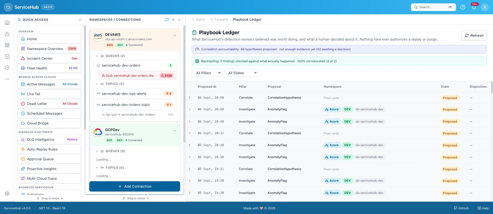</a><br/><sub><b>8. Prove it happened</b> — the Playbook Ledger: every AI proposal on record, nothing auto-executed</sub></td>
<td width="33%"><a href="docs/screenshots/showcase/09-prove-autonomy.jpg">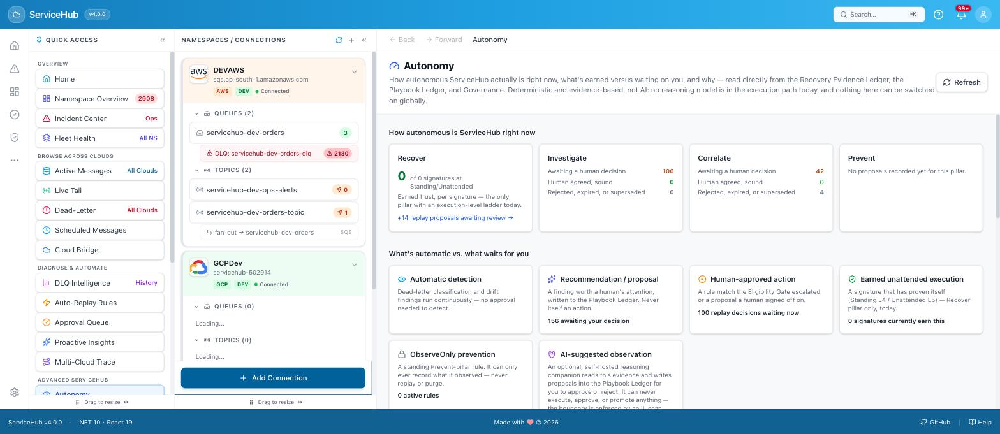</a><br/><sub><b>9. Prove it happened</b> — Autonomy: exactly how much runs unattended today, read from the evidence itself</sub></td>
</tr>
</table>

See the [Quick Access Guide](docs/guides/quick-access-guide.md) for what every one of these
screens does, and the cloud provider guides linked below
([Azure](docs/guides/azure-guide.md) / [AWS](docs/guides/aws-guide.md) /
[GCP](docs/guides/gcp-guide.md)) for a full walkthrough per provider.

---

## Multi-Cloud Bridge

ServiceHub extends beyond Azure Service Bus to support **AWS SQS/SNS** and **GCP Pub/Sub** via the Cloud Bridge — a dedicated page that lists every queue, topic, and subscription for a selected non-Azure namespace in one provider-agnostic view, independent of the Correlation ID tracing described below.

| Provider | Status | Browse & Search | Dead-Letter | Replay | Purge | Send & Test Tools³ | Cross-Cloud Trace |
|----------|--------|-----------------|-------------|--------|-------|--------------------|-------------------|
| **Azure Service Bus** | ✅ GA | ✅ | ✅ | ✅ | — (SDK limitation) | ✅ | ✅ |
| **AWS SQS / SNS** | 🟦 Supported | ✅ | ✅ (redrive DLQ) | ✅ | ✅ | ✅ | ✅¹ |
| **GCP Pub/Sub** | 🟦 Supported | ✅ | ✅ peek (nack/ack deadline)² | ✅ | ✅ | ✅ | ✅¹ |

¹ Cross-Cloud Trace searches any namespace whose provider is registered in the API's dependency-injection container. Azure is always registered; AWS/GCP registration is disabled by default in this build — register the provider to exercise AWS/GCP trace search.
² GCP Pub/Sub dead-lettering is policy-driven via `MaxDeliveryAttempts`; ServiceHub reads the DLQ through the subscription's configured dead-letter topic, and its test tooling moves messages there by republishing through the subscription's dead-letter policy. Message counts are unavailable via the Pub/Sub API and are reported as `0`.
³ Test tools (send a message, generate realistic test data, push messages to the DLQ) are available only on **DEV** namespaces with a Manage-level connection — never in UAT or production.

**Supported** means: conformance-tested against live AWS/GCP services, including the negative
capability assertions (an unsupported operation is rejected with the documented error, not
silently ignored) — see [Provider Conformance](docs/PROVIDER-CONFORMANCE.md) for the reproducible
evidence. Still capability-gated, still no parity guarantee with Azure — those are real, permanent
differences in what each cloud API exposes, not evidence gaps.

**Why autonomous replay stops at L3 on AWS/GCP:** neither provider's API can prove a message
stayed out of the dead-letter queue without risking dead-lettering it, so `CanProveDlqAbsence` is
`false` by default there — a provider fact, never relaxed into a confidence score. An operator can
close that gap with a *different* trust root instead: a self-provisioned, push-based DLQ observer
(Terraform modules for AWS Lambda+DynamoDB and GCP Cloud Function+Firestore) that attests DLQ
absence from infrastructure the operator controls, fails closed the moment it goes stale or
missing, and is named explicitly — never blended with provider-native proof — in
[Provider Conformance](docs/PROVIDER-CONFORMANCE.md). This is implemented and unit-tested as of
v4.0.0; it has not yet been run against a real deployed observer in this build.

### 🌐 Cross-Cloud Trace
Connect namespaces from two or more cloud providers and use **Multi-Cloud Trace** to trace a single Correlation ID or message GUID as it routes from Azure $\rightarrow$ AWS $\rightarrow$ GCP (or any combination). The result is a visual routing path diagram, a chronological hop timeline, and a namespace search-coverage panel.
*(Azure namespaces are always searched in parallel. AWS and GCP namespaces are searched the same way whenever those providers are registered on the server; if a provider isn't registered, its namespaces are skipped with a reason shown in the search-coverage panel instead of being silently omitted.)*

---

## Core Capabilities

Everything below serves three jobs: **Investigate** the failure, **Recover** the messages, **Prevent** the repeat. ServiceHub's deepest and most mature features are built natively for Azure Service Bus.

### 🔌 Connect in 30 Seconds — Zero Configuration
Enter your connection string once and you're browsing messages instantly. Supports Listen-only (read-only), Send, and Manage policies. Connection strings are **AES-GCM encrypted at rest** — no plain-text secrets stored anywhere.

### 📨 Message Browser — 1,000s of Messages at Your Fingertips
Browse **Active** and **Dead-Letter** queue messages side by side. See full message previews, status badges, enqueue times, and metadata in a virtualized grid that handles thousands of records without breaking a sweat. Auto-refresh every 7 seconds keeps your view live during incidents.

### 🔍 Forensic Message Inspection — Every Byte Visible
Click any message for complete forensic analysis:
- **Body** — Full JSON/XML with syntax highlighting and one-click copy.
- **Properties** — Message ID, sequence number, TTL, delivery count, enqueue time.
- **Headers** — All custom application properties and correlation IDs.
- **AI Insights** — Pattern context and remediation hints, computed entirely in-browser.

### 🤖 AI Findings — Detect Patterns Across Thousands of Messages
Click **AI Findings** to see error pattern clusters detected across your current queue view. The engine groups messages by error type, calculates confidence scores, and surfaces the most impactful clusters — so you know exactly where to look first.
> [!NOTE]
> **Zero-trust privacy:** the primary AI Findings surface runs entirely as client-side heuristics in your browser — no message content ever leaves your environment. A richer, optional backend path exists for Failure Signature clustering; it can call a **self-hosted, disabled-by-default companion container you run on your own network** — never a third-party or cloud AI API — and transparently falls back to a local deterministic strategy whenever that container is off. Full boundary details: [`docs/ARCHITECTURE.md` § The AI capability boundary](docs/ARCHITECTURE.md#6a-the-ai-capability-boundary).

### 💀 Dead-Letter Queue Investigation & Recovery
Select the **Dead-Letter** tab to inspect failed messages in full. Each DLQ message shows exactly why the broker moved it, the full error text, the assessment in plain English, and one-click actions: **Replay** it back to the main queue after fixing the root cause, or **Purge** it permanently (AWS & GCP — Azure's SDK has no reliable single-message delete, so the action is disabled there rather than pretending).

### 📊 DLQ Intelligence — Persistent History & 30-Day Trends
DLQ Intelligence automatically scans your dead-letter queues and stores every finding in a local SQLite database — so you can track failures over time, not just during the current session. Features include a 30-day trend chart, auto-categorization (Transient, MaxDelivery, Expired, DataQuality, Authorization), and CSV/JSON exports.

### 🛰️ Fleet Operations — "What died overnight, across everything?"
One cross-namespace operations dashboard that aggregates dead-letter health across **all** your namespaces at once — the daily glance you open with your coffee, not just during an incident. See total active backlog, what's new in the last 24h–7d, a 7-day fleet trend, top failure categories, and a worst-first namespace table (severity, active count, top offending entity, oldest un-actioned message). Click any namespace to jump straight into its DLQ history.

### 🗂️ DLQ Triage Inbox
Turn the dead-letter history into a triage workflow. From any message, **Resolve**, **Archive**, or **Ignore** it — or **Reopen** something you triaged earlier — with the lifecycle status, timestamps, and notes tracked for you. Inbox-zero for dead letters.

### 🔁 Bulk Operations — Replay or Purge Thousands, With a Dry Run First
"Replay everything matching this filter" as a real workflow, not a one-message-at-a-time chore. Preview the exact match count and a sample before anything mutates, then run it as a cancellable background job with a live progress panel — no request timeout on large batches, no guessing what happened. Blocked in production namespaces and gated by provider capability (purge isn't offered where the provider can't reliably support it) exactly like single-message actions.

### ⚡ Auto-Replay Rules — Automate Your Recovery
Define rules that watch DLQ messages and automatically replay them when conditions match. Recover from common failures without manual intervention.
- **AI-generated rules** or pre-built templates for timeouts and throttles.
- **Flexible matching** by DLQ reason, error description, entity, delivery count, or regex.
- **Safety controls** with rate limiting to prevent overwhelming downstream services — including a **circuit breaker** that disables a rule automatically when its real-world success rate drops too low, so a bad rule can't quietly keep failing.

### 🎯 Failure Signature Intelligence — Name the Repeat, Not Just the Symptom
Recurring dead-letter patterns get clustered into a named, confidence-scored **Failure Signature** with its own lifecycle (active → resolved, suppressed, or archived) and guided replay — so the fifth time `PaymentGatewayError` shows up, you're managing a known case instead of re-diagnosing from scratch. Backed by a searchable knowledge base of what worked last time.

### 🔎 Real-Time Search & Correlation Explorer
Search across message body, properties, and headers instantly. Filter 1,000+ messages down to exactly what you need in under a second. Paste any Correlation ID to trace a message's full journey across all queues, topics, and namespaces.

### 🕐 Scheduled Messages
See every message queued for future delivery. Reschedule or cancel individual messages directly from the UI. Azure Service Bus only — AWS SQS (15-minute `DelaySeconds` cap, not inspectable) and GCP Pub/Sub (no scheduled delivery) show an explanatory panel instead of an empty table.

### 📈 Multi-Namespace Dashboard
One glance at every connected namespace — Azure, AWS, and GCP side by side, sorted by DLQ severity. Each card shows live active/DLQ/scheduled counts, a health badge, and one-click jumps into Browse Queues or DLQ History. Quick Actions surface the four things you reach for during an incident: Browse All DLQs, All Scheduled, Cross-Cloud Trace, Auto-Replay Rules.

### 📝 Audit Trail & Recovery Evidence Ledger
Every critical operation — send, replay, purge, dead-letter, rule changes — is written to a persistent, per-owner **Audit Trail**: timestamp, user, cloud/environment, action, resource, and outcome. Exportable, filterable, and isolated so one tenant can never see another's history. Replay and purge specifically get a second, deeper record: the **Recovery Evidence Ledger** (`/recovery`) — an append-only, hash-chained history of exactly what ServiceHub asked the provider to do and what it subsequently observed, so a recovery claim never has to just be taken on faith. See [`docs/RECOVERY-EVIDENCE.md`](docs/RECOVERY-EVIDENCE.md) for the full technical model.

### 🛡️ Security & Privacy Page
An in-app page that answers the trust question before anyone has to ask it: a diagram of exactly how data moves from browser → ServiceHub server → cloud SDK, what's encrypted (connection strings, AES-256-GCM), what's redacted from logs, and what's never stored (message bodies, plaintext secrets) — with links to verify each claim directly in the open-source code.

### 📈 Outcome Measurement — "This week"
Home shows a five-tile strip of what the fleet actually achieved in the trailing window (default
7 days, `?days=` up to 90): messages recovered, messages written off, median time from
dead-letter to verified recovery, recoveries that needed no human approval, and gate refusals
that stopped a bad replay before any provider was contacted. Every figure is a count, average, or
duration read directly from a `RecoveryLedgerEntry`/`RecoveryEvent` row — never modelled,
estimated, or extrapolated. The strip renders nothing at all (not a zero-state) until the fleet
has actually recovered or abandoned something, so a fresh install doesn't read as broken.
`GET /api/v1/recovery/outcomes`.

### 🔓 Production Namespaces and Elevation
A namespace can be registered as `Prod`. Investigate, Correlate, and Prevent run against it
without restriction — full scanning, peeking, clustering, and forecasting. Every recovery verb
(replay, purge, bulk operations, auto-replay rules) stays denied unconditionally unless a
`ProductionElevation` is live: a stated reason, an absolute expiry, and **dual control** — the
identity that requests it and the identity that approves it must be different people, and
self-approval is refused even for Admin. Every step (`ProductionElevationRequested/Approved/
Expired/Revoked`) is a Recovery Evidence Ledger event, so an auditor can reconstruct who elevated
which namespace, on whose approval, for how long — from the export alone, no server access
needed. Autonomy is hard-ceilinged at L0/L1 in production under every configuration; no
`AutonomyGrant` is ever issued against a `Prod` namespace. API only today — no dedicated UI for
requesting or approving an elevation yet, by product decision, not a gap in the safety model. See
[ADR-0010](docs/adr/0010-production-namespace-elevation.md).
`POST/GET /api/v1/recovery/production-elevations{,/{id}/approve,/{id}/revoke}`.

### 📦 Configuration as Code
`GET`/`POST /api/v1/governance/configuration/{export,import}` round-trip a deployment's
Auto-Replay Rules and active governance grants as one JSON file meant for git and a pull request.
Import is additive/upsert only — a rule already present (matched by name) is updated in place, an
already-active grant is left alone, and nothing live but absent from the import is ever deleted
or revoked. Deliberately excludes a namespace's connection string (a credential, never
configuration — namespaces appear only as a read-only id/name/environment/provider reference so
an exported rule's target is human-readable) and `PreventionRule` (a hash-chained Playbook Ledger
claim, not mutable configuration). API only today; no export/import UI.

### 🗄️ Evidence Archive and Epoch Sealing
`POST /api/v1/recovery/epochs/seal` closes an owner's current Recovery Evidence Ledger epoch:
every prior event is independently re-verified, written to an archive file on disk
(`<DataDirectory>/recovery-archive/<ownerId>/epoch-<N>.json`), read back and re-verified from
disk again, and only then pruned from the live table — bounding growth for multi-year operation
without weakening tamper-evidence, since the pruned rows survive byte-for-byte in the archive
first. The seal marker itself becomes the next epoch's anchor, so the chain never breaks across
the seam. `scripts/verify-recovery-chain.py --archive-dir` follows an anchor from a sealed
history into the live export, and a sealed epoch verifies from its archive file alone, with no
server access. Admin-scoped.

---

## Real-World Scenarios

### Scenario 1: DLQ Incident at 2 AM
**Problem:** 5,000 orders stuck in Dead-Letter Queue. Azure Portal shows counts only.
**With ServiceHub:**
1. Browse all 5,000 DLQ messages in seconds.
2. AI detects 3 error clusters: Payment Timeout (40%), Invalid Address (35%), Duplicate (25%).
3. Create an auto-replay rule for Payment Timeout $\rightarrow$ replay 2,000 messages automatically.
**Time saved:** 6 hours $\rightarrow$ 45 minutes.

### Scenario 2: Missing Order Investigation
**Problem:** Customer reports order never processed. Which queue did it land in?
**With ServiceHub:**
1. Open Correlation Explorer.
2. Paste the order's Correlation ID.
3. Trace the message journey across all queues and namespaces in one search.
**Time saved:** 30 minutes $\rightarrow$ 30 seconds.

### Scenario 3: Integration Testing
**Problem:** Need 100 realistic failure scenarios to test error handling.
**With ServiceHub:**
1. Open Message Generator $\rightarrow$ select Payment Gateway scenario.
2. Generate 100 messages with 30% anomaly rate.
3. Verify DLQ behavior and error handling.
**Time saved:** Hours of manual test data $\rightarrow$ 2 minutes.

---

## User Guides

**Start here: [📖 The Complete ServiceHub Guide](docs/SERVICEHUB-COMPLETE-GUIDE.md)** — the single,
definitive, end-to-end reference. Why ServiceHub exists, the vocabulary you need, and every page
in the product explained — what it's for, what every button does, and how it behaves differently
per cloud — illustrated with real screenshots captured live against real, connected Azure, AWS,
and GCP infrastructure. If you only read one document, read this one.

Prefer a narrower, provider-specific walkthrough instead? These are the official per-cloud
handbooks — plain language, screenshot-illustrated, no code or scripting required. Each walks the
full message-debugging journey — browsing, DLQ investigation, AI Insights, replay, and the
Recovery Evidence Ledger — verified live against a real namespace, with an honest, explicit list
of what's supported and what isn't for that cloud:

- **[🧭 Quick Access Guide](docs/guides/quick-access-guide.md)** — every navigation shortcut explained, with a full navigation map
- **[☁️ Azure Service Bus Guide](docs/guides/azure-guide.md)** — the fully supported (GA) provider
- **[🟧 AWS SQS/SNS Guide](docs/guides/aws-guide.md)** — Supported, with SQS's own limitations explained
- **[🟩 GCP Pub/Sub Guide](docs/guides/gcp-guide.md)** — Supported, with Pub/Sub's own limitations explained

New to ServiceHub and haven't connected a cloud account yet? Start with
[LOCAL-DEPLOYMENT.md](LOCAL-DEPLOYMENT.md) instead — it covers installing ServiceHub and
connecting your first namespace, with a link back to the matching guide above once you're in.

---

## Recommended Usage Flow

Follow this path before connecting to a production namespace. This protects your live environment and gives you confidence in every operation before it matters.

1. **DEV**: Connect your development namespace. Explore message browsing, DLQ inspection, and auto-replay rules in a safe environment.
2. **UAT**: Validate replay targets, confirm rule logic, and review AI findings with realistic data.
3. **PROD**: Connect only after DEV and UAT validation. Production namespaces are fully observable (Investigate, Correlate, Prevent all run normally), but every recovery action — replay, purge, bulk operations, auto-replay rules — stays denied unless a time-boxed, dual-control [production elevation](#production-namespaces-and-elevation) is live. There is no autonomy in production at any trust level.

> [!WARNING]
> While ServiceHub is read-only by default, replay and send operations are destructive. Validate your replay rules and message targets in lower environments first.

---

## Quick Start

### What do you want to do?

```
Just try ServiceHub?             → Demo                     (below)
Run on my laptop?                → With Docker              (#docker-fastest-with-docker)
                                  → Without Docker           (#one-command-setup-without-docker-from-source)
Test my real cloud?              → AWS / Azure / GCP         (self-hosting/README.md#cloud-credentials-least-privilege-setup)
Run ServiceHub inside my org?    → Azure App Service         (#azure-app-service-recommended)
                                  → Azure Container Apps      (#azure-container-apps-alternative)
Want a ready-made container?     → GHCR                      (#container-image)
```

No cloud account, credentials, or infrastructure are required for the first option. Every
option below runs the same single Docker image — nothing is a separate build.

Never used Docker or a terminal before? Skip the commands below and follow
**[LOCAL-DEPLOYMENT.md](LOCAL-DEPLOYMENT.md)** — the same "run on my laptop" steps, written
for a non-technical reader with screenshots at every step.

> [!TIP]
> **No credentials yet?** The Welcome page's **"Try a live demo"** buttons open a fully
> client-side demo walkthrough per cloud (`/demo/azure`, `/demo/aws`, `/demo/gcp`) — no backend
> calls, no credentials, safe to click around before connecting anything real. This is the
> supported, tested demo experience and the one worth trying first.

### Docker (fastest, with Docker)

ServiceHub encrypts stored connection strings at rest, so it needs two secrets generated on your
machine before first run. There are no defaults — a shipped default key would be identical across
every deployment that never overrode it.

```bash
git clone https://github.com/debdevops/servicehub.git
cd servicehub

cp .env.example .env
printf 'SECURITY__ENCRYPTIONKEY=%s\n'    "$(openssl rand -hex 32)" >> .env
printf 'SECURITY__SPATOKEN__SECRET=%s\n' "$(openssl rand -hex 32)" >> .env

docker compose up --build
```

Open **[http://localhost:8080](http://localhost:8080)**, then connect a namespace with your own
cloud credentials. The port is bound to `127.0.0.1` (loopback) only by default, so it isn't
reachable from your network until you deliberately change that. One image serves both the SPA and
the API.

Prefer not to build locally? Pull the official image instead of `--build`:
`docker pull ghcr.io/debdevops/servicehub:latest` (see [Container Image](#container-image)).

If you skip the `.env` step, `docker compose` stops immediately and names the variable that is
missing rather than starting a container that fails its configuration check.

To point at real cloud messaging with persisted data and production hardening, run the image in Production mode. Every variable below is **required** — the app validates its Production configuration at startup and refuses to start if any is missing or still holds a `SET_VIA_ENV_VAR` placeholder:

```bash
docker build -t servicehub .
docker run --rm -p 8080:8080 \
  -e ASPNETCORE_ENVIRONMENT=Production \
  -e SECURITY__ENCRYPTIONKEY="$(openssl rand -hex 32)" \
  -e SECURITY__SPATOKEN__SECRET="$(openssl rand -hex 32)" \
  -e SITEURL="http://localhost:8080" \
  -e AllowedHosts="localhost" \
  -v servicehub-data:/var/servicehub/data \
  servicehub
```

The namespace store and SQLite DLQ/audit database persist to the `servicehub-data` volume. This
example starts the process correctly — it is **not** the complete production
checklist. `Cors:AllowedOrigins` and at least one API key (or OIDC) also need setting before real
users reach it, and `SITEURL`/`AllowedHosts` must name the hostname users actually visit rather
than `localhost`.

### Container Image

Official images are published to GitHub Container Registry on every tagged release:

```bash
docker pull ghcr.io/debdevops/servicehub:latest
# or pin a version: ghcr.io/debdevops/servicehub:4.0.0
```

Run it the same way as the locally built image — same required secrets, same volume, same
port. See [Self-Hosting](self-hosting/README.md) before pointing a pulled image at real
credentials or a non-loopback address.

### One-Command Setup (without Docker, from source)

```bash
git clone https://github.com/debdevops/servicehub.git
cd servicehub
./run.sh
```

Open **[http://localhost:3000](http://localhost:3000)** — then connect with your connection string. The script automatically installs .NET 10 SDK and Node.js 22+ if not already present.

Step-by-step with screenshots (no command-line experience assumed):
[LOCAL-DEPLOYMENT.md](LOCAL-DEPLOYMENT.md).

### Create a Dedicated Read-Only Credential

Azure:
```bash
az servicebus namespace authorization-rule create \
  --namespace-name <your-namespace> \
  --resource-group <your-rg> \
  --name servicehub-readonly \
  --rights Listen
```

AWS and GCP least-privilege IAM policies (exact SDK actions ServiceHub calls, JSON policy and
`gcloud` commands included) are in [Self-Hosting → Cloud credentials](self-hosting/README.md#cloud-credentials-least-privilege-setup).
Quick "create a resource, connect it, verify it, tear it down" walkthroughs for all three
clouds are in [Self-Hosting → Quick end-to-end test](self-hosting/README.md#quick-end-to-end-test).

<details>
<summary>Two additional, experimental standalone apps exist in this repo (<code>apps/demo</code>, <code>apps/sandbox</code>) — click to expand</summary>

`./run.sh demo` and `./run.sh sandbox` (or `./run.sh all`) start two separate exploratory apps on
ports 5174 and 5175. They're real and launchable, but **experimental and unsupported** — no test
suite, not covered by the e2e suite, CI only checks that they build and typecheck. If you just want
to try ServiceHub, use the in-app demo mentioned above instead. See
[`apps/demo/README.md`](apps/demo/README.md) and [`apps/sandbox/README.md`](apps/sandbox/README.md)
for what each one is for.

</details>

---

## Deployment Model

ServiceHub is **self-hosted, single-instance software for one team** — not a multi-tenant SaaS
platform. Every deployment is one process: one SQLite database (DLQ history, auto-replay rules,
audit trail) and one in-process event bus, both scoped to that process's own lifetime. There is no
shared state between instances and no supported way to run two instances against the same data
directory.

This is a **deliberate choice for this release, not an omission**. It keeps the architecture
simple, the data local, and the operational surface small — the trade-off is no horizontal
scaling and no built-in multi-tenant isolation beyond the per-owner scoping OIDC/API keys already
provide.

---

## Release & Upgrade Model

ServiceHub is versioned (`.version`, currently `4.0.0`) and released as a single tagged container
image (`ghcr.io/debdevops/servicehub:X.Y.Z`) — see [Container Image](#container-image). Upgrading
in place means pulling a newer tag against the same persistent volume; EF Core migrations run
automatically at startup against the mounted SQLite data directory.

Upgrading from v3.7.0 (or any earlier tagged release) to v4.0.0 is covered by an automated test,
not just a claim: `UpgradeInPlaceTests` stands up a database at the exact migration that shipped
in v3.7.0, seeds a real hash-chained Recovery Evidence Ledger against that schema, migrates it all
the way to the current `HEAD`, and asserts zero data loss, an intact hash chain, and that every
table this release added is genuinely queryable — not just present in the migrations history.

The Recovery Evidence Ledger's hash chain is designed to survive a version boundary by
construction: every event carries its own `SchemaVersion` as a canonical hashed field, and
`RecoveryChainVerifier` is proven (via a dedicated fixture test) to validate a chain that spans two
schema versions in one continuous run. **Evidence you cannot verify after upgrading is not
evidence** — this is why that guarantee is tested rather than assumed.

**Before upgrading a real deployment:** back up the data directory (or use the built-in
`POST /api/v1/admin/backup`, see [`docs/BACKUP-RESTORE.md`](docs/BACKUP-RESTORE.md)) first. A
downgrade path is not supported — migrations are forward-only.

---

## Self-Host on Azure

Both options run the same GHCR image (`ghcr.io/debdevops/servicehub:latest`) as a single,
non-scaled container — see [Deployment Model](#deployment-model). Pick one; you don't need
both.

### Azure App Service (Recommended)

The most mature managed path today — Web App for Containers, one instance, no code changes.

```bash
az login
az group create --name rg-servicehub --location eastus

az appservice plan create --name plan-servicehub --resource-group rg-servicehub \
  --is-linux --sku B1

az webapp create --name <globally-unique-app-name> --resource-group rg-servicehub \
  --plan plan-servicehub --deployment-container-image-name ghcr.io/debdevops/servicehub:latest

# Required secrets + config — same variables as the Docker section above
az webapp config appsettings set --name <app-name> --resource-group rg-servicehub --settings \
  ASPNETCORE_ENVIRONMENT=Production \
  SECURITY__ENCRYPTIONKEY="$(openssl rand -hex 32)" \
  SECURITY__SPATOKEN__SECRET="$(openssl rand -hex 32)" \
  SITEURL="https://<app-name>.azurewebsites.net" \
  AllowedHosts="<app-name>.azurewebsites.net" \
  WEBSITES_PORT=8080

az webapp restart --name <app-name> --resource-group rg-servicehub
```

Then decide where the data directory lives, and read
[Self-Hosting → Storage requirement](self-hosting/README.md#storage-requirement-local-block-storage-not-a-network-share)
**before** you do. App Service's local container disk is not guaranteed to survive a restart,
but its documented alternative — an Azure Files share — is SMB, and **SQLite is not supported
on a network filesystem**: WAL mode silently degrades and the advisory locks that stop a second
writer stop being reliable. The two workable options are to accept the container's local disk
and back up off-box ([docs/BACKUP-RESTORE.md](docs/BACKUP-RESTORE.md)), or to host ServiceHub
somewhere with real block storage instead. Whichever you choose, point both
`DlqDatabase__DataDirectory` and `NamespaceRepository__DataDirectory` at the same path (see
[Self-Hosting → Persistent storage](self-hosting/README.md#persistent-storage-two-stores-two-config-keys) —
this is the single most common misconfiguration). Confirm the result with
`curl https://<app-name>.azurewebsites.net/health/ready` and check that the `sqlite` entry
reports `"JournalMode": "wal"`.

Verify: `curl https://<app-name>.azurewebsites.net/health/live`, then open the URL in a
browser. **Pin the App Service Plan to a single instance** — do not enable auto-scale-out;
duplicate replicas would run duplicate background workers against the same data.

This repo's own `deploy/` folder contains the maintainer's personal production pipeline
(specific budget, resource names, and an Azure DevOps release flow) — useful as a reference,
not something you need to read or reuse for the steps above.

### Azure Container Apps (Alternative)

Workable, but Container Apps' headline feature — scale-to-zero and elastic replica count —
actively fights this architecture: a cold start after scale-to-zero drops in-flight SSE
connections and resets the in-process event bus, and any replica count above 1 risks two
copies of the same background worker acting on the same SQLite database. Use this only if
your organization is already standardized on Container Apps.

```bash
az login
az group create --name rg-servicehub --location eastus

az containerapp env create --name env-servicehub --resource-group rg-servicehub --location eastus

az containerapp create --name servicehub --resource-group rg-servicehub \
  --environment env-servicehub --image ghcr.io/debdevops/servicehub:latest \
  --target-port 8080 --ingress external \
  --min-replicas 1 --max-replicas 1 \
  --secrets encryption-key="$(openssl rand -hex 32)" spa-secret="$(openssl rand -hex 32)" \
  --env-vars ASPNETCORE_ENVIRONMENT=Production \
    SECURITY__ENCRYPTIONKEY=secretref:encryption-key \
    SECURITY__SPATOKEN__SECRET=secretref:spa-secret \
    SITEURL=https://<app-fqdn>
```

`--min-replicas 1 --max-replicas 1` is not optional — it's what makes this safe to run at
all. Storage carries the same constraint as App Service above: **no network file share for the
data directory**, for the reasons in
[Self-Hosting → Storage requirement](self-hosting/README.md#storage-requirement-local-block-storage-not-a-network-share).
Verify against `/health/ready` and confirm the `sqlite` entry reports journal mode `wal`.

---

## Troubleshooting

| Symptom | Cause | Fix |
|---|---|---|
| `docker compose up` exits immediately, names a missing variable | `SECURITY__ENCRYPTIONKEY` or `SECURITY__SPATOKEN__SECRET` unset | `cp .env.example .env` and fill both in — see [Quick Start](#quick-start) |
| App starts but every request is rejected / wrong host | `AllowedHosts` or `SITEURL` doesn't match the hostname you're actually visiting | Set both to the real external hostname, not `localhost`, once you're off loopback |
| Creating an AWS or GCP namespace returns `503` | `CloudProviders:Aws:Enabled` / `CloudProviders:Gcp:Enabled` is `false` (Azure-only by default) | Set `CLOUDPROVIDERS__AWS__ENABLED=true` / `CLOUDPROVIDERS__GCP__ENABLED=true` before connecting that provider |
| `/health/live` fails after deploy | Container isn't listening on the platform's expected port, or hasn't finished startup config validation | Confirm `WEBSITES_PORT`/`--target-port` is `8080`; check container logs for the startup config validator's specific missing-variable error |
| `docker pull ghcr.io/debdevops/servicehub` fails with "denied" | GHCR package visibility is private, or the tag doesn't exist yet | Confirm the tag (`:latest` or a released `:X.Y.Z`) exists under the repo's Packages tab |
| Namespace credentials are gone after a restart, but DLQ history is intact | Only `DlqDatabase__DataDirectory` was persisted, not `NamespaceRepository__DataDirectory` | Mount **both** `DataDirectory` paths to the same persistent volume — see [Self-Hosting → Persistent storage](self-hosting/README.md#persistent-storage-two-stores-two-config-keys) |
| A namespace that worked yesterday now returns `502` / `Queue.List.Failed` | The provider rotated the access key behind the stored connection string — the API log shows the real cause, e.g. Azure `401 InvalidSignature` | Re-register the namespace on the Connect page with a current connection string |
| Every request suddenly returns `429 "Too many failed authentication attempts"` | `AuthFailureThrottle` trips at 10 credential-less/invalid requests in 5 minutes and is keyed on **client IP**, so one unauthenticated script locks out your browser too | Wait out the 5-minute window; find the offender via `Authentication failed: No valid credential for …` in the API log |
| A second instance exits with "Another ServiceHub instance already holds the data directory" | Working as designed — the evidence ledger's hash chain assumes a single writer | Stop the other instance, or give this one its own `DlqDatabase:DataDirectory`. Don't delete `.instance.lock` |

For operational (rather than deployment) errors — permission denials, replay verification, circuit
breakers, evidence-chain failures — see
[Troubleshooting: real errors and what they mean](docs/SERVICEHUB-COMPLETE-GUIDE.md#troubleshooting-real-errors-and-what-they-mean)
in the Complete Guide.

---

## Security

ServiceHub is built for strict enterprise environments.

### What ServiceHub guarantees
- **Read-only by default** — Uses `PeekMessagesAsync`; messages are **never removed or consumed**.
- **AES-GCM encryption** — Connection strings encrypted at rest; key stored in local config, never returned to the browser.
- **No third-party or cloud AI calls, in either direction** — the primary AI analysis path runs entirely in-browser; an optional backend path for deeper clustering only ever reaches a self-hosted companion container on your own network, never an external service. No message data leaves your environment either way.
- **No message persistence for live browsing** — Messages viewed on the Queues/Topics/Messages pages are in-memory only during your session, never written to a database. The deliberate exception is DLQ Intelligence, which stores a 500-character body preview and classification metadata per dead-lettered message in local SQLite to power History and 30-Day Trends.
- **Log redaction** — Backend logging pipeline strips connection strings, API keys, and access tokens (best-effort pattern matching, not a formal guarantee).

### What ServiceHub does not do by default
- **No per-user authentication out of the box** — every browser session shares one built-in admin identity. Enable **OIDC** (any standards-compliant identity provider) or **Azure Easy Auth**, both off by default, to isolate individual users. The browser's SPA token is a CSRF/casual-automation mitigation, not an identity boundary.

### Telemetry (opt-in, vendor-neutral)
ServiceHub can emit operational telemetry two ways, **both disabled by default**:

- **OpenTelemetry** — vendor-neutral traces + metrics over OTLP, for Prometheus/Grafana/Datadog/Jaeger or any OTLP collector. Enable by setting `OpenTelemetry:Enabled=true` or the standard `OTEL_EXPORTER_OTLP_ENDPOINT` environment variable.
- **Azure Application Insights** — enabled when `ApplicationInsights:ConnectionString` is set.

When enabled, telemetry is strictly limited to request durations, error codes, and system metrics. Connection strings, message payloads, business IDs, and user inputs are **explicitly excluded**.

---

## Architecture

ServiceHub is a modern Single Page Application communicating with a .NET Core backend.

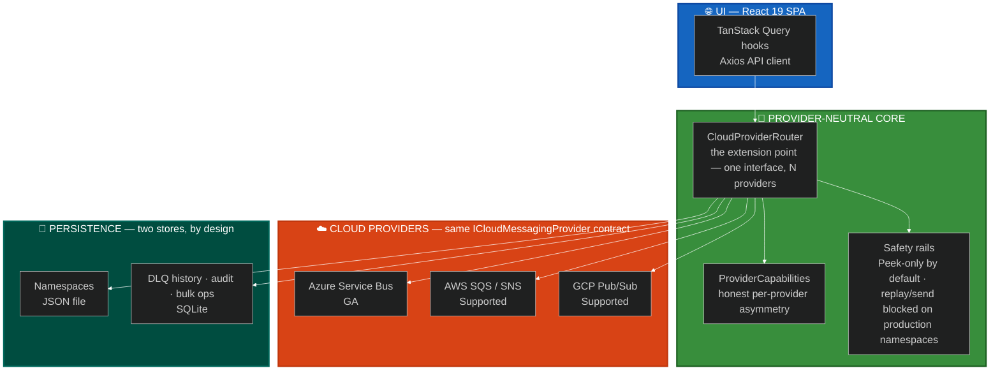
```mermaid
%%{init: {'theme':'dark', 'themeVariables': { 'fontSize':'22px', 'primaryTextColor':'#ffffff', 'fontFamily':'arial', 'lineColor':'#ffffff'}}}%%
graph TB
    subgraph UI["🌐 UI — React 19 SPA"]
        SPA["TanStack Query hooks<br/>Axios API client"]
    end

    subgraph Core["🧭 PROVIDER-NEUTRAL CORE"]
        ROUTER["CloudProviderRouter<br/>the extension point — one interface, N providers"]
        CAPS["ProviderCapabilities<br/>honest per-provider asymmetry"]
        SAFETY["Safety rails<br/>Peek-only by default · replay/send blocked on production namespaces"]
    end

    subgraph Providers["☁️ CLOUD PROVIDERS — same ICloudMessagingProvider contract"]
        AZ["Azure Service Bus<br/>GA"]
        AWS["AWS SQS / SNS<br/>Supported"]
        GCP["GCP Pub/Sub<br/>Supported"]
    end

    subgraph Storage["💾 PERSISTENCE — two stores, by design"]
        JSON["Namespaces<br/>JSON file"]
        SQLITE["DLQ history · audit · bulk ops<br/>SQLite"]
    end

    SPA --> ROUTER
    ROUTER --> CAPS
    ROUTER --> SAFETY
    ROUTER --> AZ
    ROUTER --> AWS
    ROUTER --> GCP
    ROUTER --> JSON
    ROUTER --> SQLITE

    style UI fill:#1565c0,stroke:#0d47a1,stroke-width:3px,color:#fff
    style Core fill:#388e3c,stroke:#1b5e20,stroke-width:3px,color:#fff
    style Providers fill:#d84315,stroke:#bf360c,stroke-width:3px,color:#fff
    style Storage fill:#004d40,stroke:#00695c,stroke-width:3px,color:#fff
```

```
Browser (React 19 SPA)
  └── TanStack Query hooks (useMessages, useQueues, useRules, …)
        └── Axios API client → Vite dev proxy
              └── ASP.NET Core 10 API
                    ├── NamespacesController      → AES-GCM encrypted connections
                    ├── DlqHistoryController      → SQLite DLQ intelligence (no cloud SDK call)
                    ├── RulesController           → auto-replay rule engine
                    ├── MessagesController        ┐
                    ├── QueuesController          ├── IMessageOperationsService → CloudProviderRouter
                    ├── TopicsController          ┘
                    └── CrossCloudTraceController → same ICloudMessagingProvider abstraction
                                                     (Azure dispatched via IAzureTraceSearcher,
                                                      AWS/GCP dispatched directly)
                                                            │
                                                            ▼
                                                  ICloudMessagingProvider implementations
                                                            ├── Azure.Messaging.ServiceBus SDK
                                                            ├── AWSSDK.SQS / AWSSDK.SNS
                                                            └── Google.Cloud.PubSub.V1
```

Full picture — provider abstraction, `ProviderCapabilities`, the Recovery Evidence Ledger,
autonomy/safety model, persistence, SSE, security boundaries: [`docs/ARCHITECTURE.md`](docs/ARCHITECTURE.md).
Why the foundational decisions were made the way they were: [`docs/adr/`](docs/adr/). Adding a new
messaging provider (Kafka, RabbitMQ, a fourth cloud, …): [`docs/extending/adding-a-provider.md`](docs/extending/adding-a-provider.md).

---

## API Documentation

ServiceHub exposes a full REST API with interactive documentation interfaces accessible when running locally:

- **Scalar (Modern)**: `http://localhost:5153/scalar/v1`
- **Swagger UI**: `http://localhost:5153/swagger/index.html`

---

## FAQ

**Does ServiceHub remove messages from queues?**
No. ServiceHub only uses `PeekMessagesAsync`. Your consumers continue processing normally, unaffected.

**Is it safe to point at production?**
Yes. Listen-only mode is fully read-only. Deploy ServiceHub inside your private network for extra safety.

**Can ServiceHub replay or purge messages on a namespace labelled `Prod`?**
Only under a live, time-boxed [production elevation](#production-namespaces-and-elevation) approved
by a second identity — never by the requester alone, and never automatically. Investigate,
Correlate, and Prevent run against a `Prod` namespace unrestricted; every recovery verb stays
denied without a live elevation, and autonomy never runs there at all.

**How does AI analysis work without an API key?**
The primary AI Findings surface is client-side heuristic pattern detection — pure JavaScript in your browser, no API key needed. A deeper, optional backend path (Failure Signature clustering) can call a self-hosted companion container you run yourself, disabled by default — never GPT or any other third-party/cloud service, and no data exfiltration either way.

**Can I delete a single message?**
On AWS (delete by receipt handle) and GCP (acknowledge), yes — the Purge action, guarded by explicit-intent headers and blocked on production namespaces. Azure Service Bus has no reliable single-message delete in the SDK, so ServiceHub disables the action there instead of faking it.

**How is this different from Service Bus Explorer?**
Service Bus Explorer is a well-established, Azure-only desktop tool for browsing and managing Service Bus entities. ServiceHub also covers Azure Service Bus, but adds full-text message search, batch DLQ analysis with client-side AI pattern detection, auto-replay rules, a persistent multi-namespace fleet dashboard, cross-cloud correlation tracing, and the hash-chained Recovery Evidence Ledger — plus conformance-tested support for AWS SQS/SNS and GCP Pub/Sub in the same tool. Both are free and self-hosted; the difference is investigation/recovery depth and multi-cloud scope.

---

## Contributing

Bug fixes, features, and documentation improvements are welcome! See [CONTRIBUTING.md](CONTRIBUTING.md)
for the full guide, including [adding a new messaging provider](docs/extending/adding-a-provider.md).

```bash
# Frontend unit tests (Vitest, ≥60% coverage required)
npm run -w apps/web test:coverage
npm run -w packages/servicehub-ui-shared test   # hooks + API client live here, not in apps/web

# Backend tests (xUnit — unit + integration)
dotnet test services/api/tests/ServiceHub.UnitTests
dotnet test services/api/tests/ServiceHub.IntegrationTests

# E2E tests (Playwright, against client-side Demo Mode)
npm run -w apps/web test:e2e
```

---

## Roadmap

ServiceHub is built depth-first: make one workflow excellent before adding the next surface. Here's
where it stands.

| | Stage | Focus | Status |
|---|---|---|---|
| 🟢 | **Investigate → Recover → Prove** | The forensic core | Shipped |
| 🟢 | **Team & Governance** | Approval queue, per-identity roles | Shipped |
| 🟢 | **Bounded autonomous recovery** | Earned, per-signature, evidence-gated | Shipped — Azure only, by provider capability |
| 🔵 | **Reasoning companion** | Local, opt-in, proposes only | Shipped, off by default |
| 🟢 | **Evidence parity, production, multi-cloud trust root, outcomes, longevity** | v4.0.0 — closes the three qualifiers the autonomy chapter carried | Shipped; see status by unit below |

**🟢 Investigate → Recover → Prove.** The forensic core, live across Azure Service Bus (GA) and
AWS SQS/SNS + GCP Pub/Sub (Supported — see
[provider conformance evidence](docs/PROVIDER-CONFORMANCE.md)): full message inspection, real-time
search, client-side AI pattern detection, one-click and rule-based replay, purge, bulk operations
with dry-run preview, a fleet dashboard, DLQ triage, Live Tail (Azure/GCP), Failure Signature
Intelligence, an incident workspace, and the Recovery Evidence Ledger — a hash-chained,
tamper-evident record of every recovery that a third party can verify from an export alone, with no
server access. Also shipped: Slack/Teams alerts, OIDC SSO, an exportable audit trail, and namespace
sharing for live operations (Preview).

**🟢 Team & Governance.** An approval queue for escalated recovery decisions, and per-identity
governance grants (Viewer / Operator / Approver / Admin, optionally scoped per namespace and per
pillar) enforced ahead of every mutating operation. Two credentials on one deployment can hold two
different roles over the same data, and the denial path is covered by a CI test.

**🟢 Bounded autonomous recovery.** Trust is earned per `(owner, failure signature, action)` from
verified outcomes an independent worker observed *after the fact* — never from a confidence score,
and there is deliberately no "turn autonomy on" switch anywhere in the product. A signature reaches
unattended replay only after ≥10 verified recoveries at ≥95% success (L4) or ≥30 at ≥99% (L5), and
drops back on two consecutive verified failures. A per-rule circuit breaker disables a rule whose
recent verified success rate falls through the floor, and an owner-scoped emergency stop halts all
automation. Promotion, unattended execution, demotion and a circuit-breaker trip have each been
observed end to end against real Azure traffic, with independently verified evidence exports.

Two real limits, stated rather than buried: **AWS and GCP are permanently capped at human-approved
replay (L3)**, because neither API can prove a message stayed out of the dead-letter queue without
risking dead-lettering it — a provider fact, not a maturity gap. And **all recovery, manual or
autonomous, runs against namespaces marked Dev or UAT**; ServiceHub refuses to connect to a
namespace marked Production at all.

**🔵 Reasoning companion** *(optional, off by default)*. `services/agent` is a local, self-hosted
container that reads payload-free evidence — counts, lifecycle state, normalised error terms, never
a message body — and writes plain-language observations into the Playbook Ledger for a human to
approve or reject. It cannot execute, approve or promote anything: the boundary is enforced by an
IL scan over the compiled assemblies, not by review. It never calls an external or cloud LLM; a
local Ollama instance is the only backend it knows.

**🟢 v4.0.0 — evidence parity, production, multi-cloud trust root, outcomes, longevity.** Named
"Shipped" and "Observed" deliberately as two separate claims, because a shipped feature this
session hasn't been driven live yet is a real, different thing from one that has:

| Unit | Shipped | Observed live |
|---|---|---|
| Durable evidence, all 4 pillars | ✅ | ✅ Full test suite green; `verify-playbook-chain.py` run against a real generated export, including a deliberately tampered event and a dangling citation, both caught |
| Production namespaces + elevation | ✅ | ✅ Registering a `Prod` namespace, a denied replay, a pending elevation, a refused self-approval, and a revoke were all driven against the running app. **Not yet observed:** an approval by two distinct identities (local dev has one authenticated identity), and a real production recovery execution |
| Multi-cloud DLQ observer attestation | ✅ (code) | ⏳ Terraform modules `validate`-clean, never `apply`-ed — the attestation path has only ever run against a test double, never a real DynamoDB/Firestore observer |
| Outcome metrics ("This week" on Home) | ✅ | ✅ Rendered against real, currently-connected namespaces |
| Five-destination nav + More | ✅ | ✅ Verified live — five icons plus a More button that opens the full command palette |
| Epoch sealing, config export/import, upgrade-in-place | ✅ | ⏳ Unit/integration-tested only; not yet run against a real production-sized ledger or an actual git-reviewed configuration bundle |

Full detail, including exactly which files changed and why, in [CHANGELOG.md](CHANGELOG.md).

Have a use-case that should shape this? [Open a feature request](https://github.com/debdevops/servicehub/issues/new) — describe the problem, not just the solution.

---

<div align="center">

**ServiceHub** — Investigate. Recover. Prove it happened. Because your Service Bus messages should not be invisible during incidents.

Built for DevOps, Platform, and SRE Engineers.

[⚡ Self-Host ServiceHub](#quick-start) · [Report Issue](https://github.com/debdevops/servicehub/issues)

</div>
