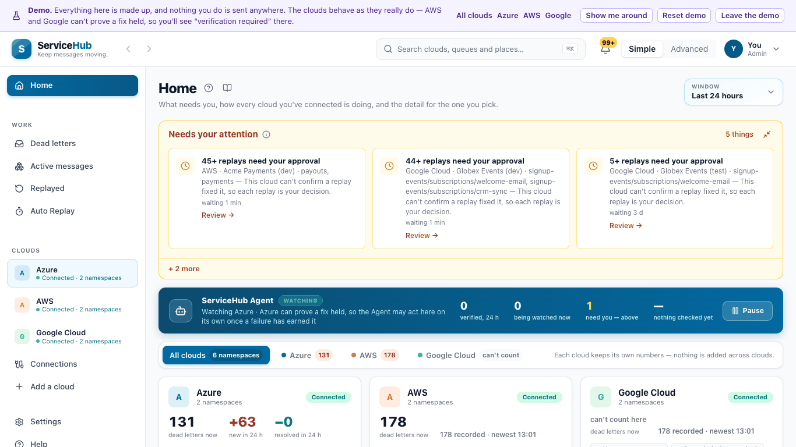
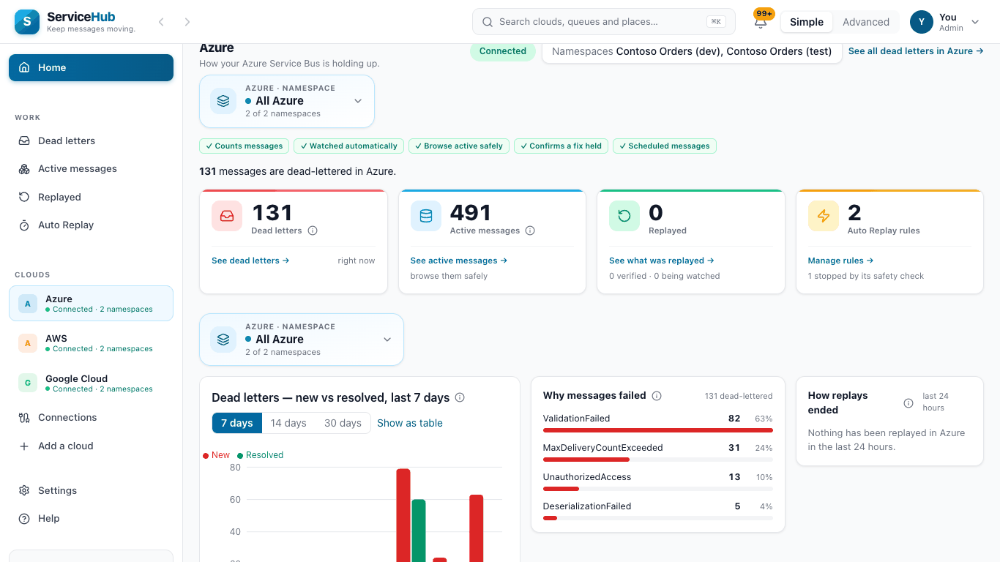
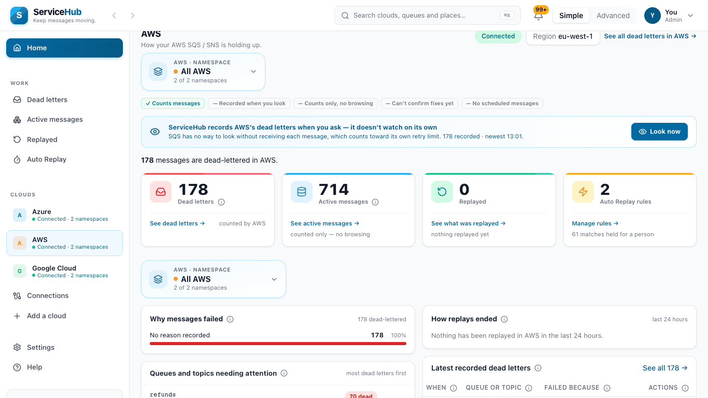
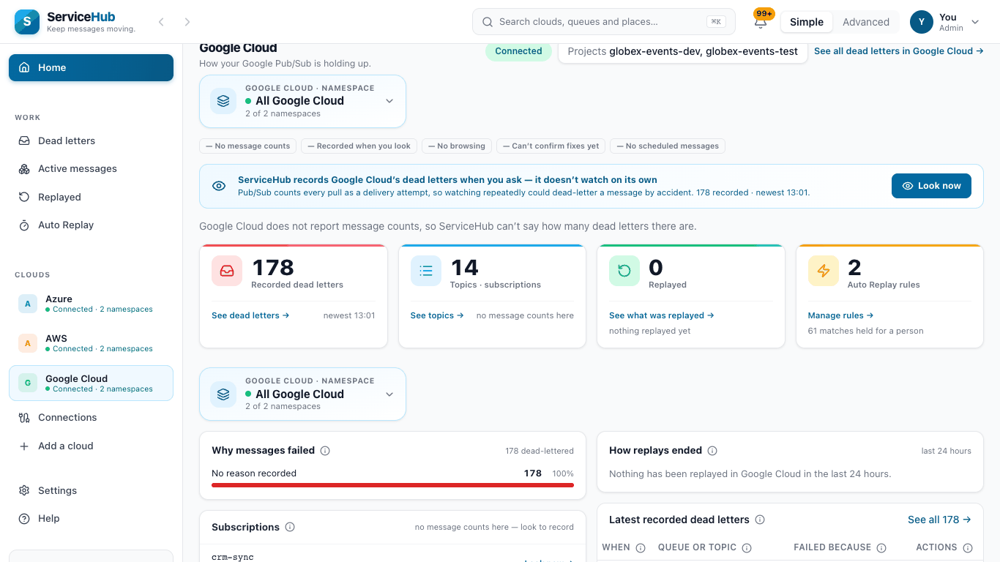
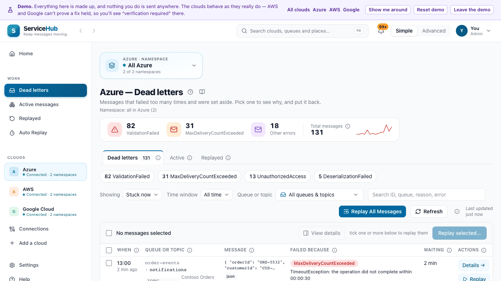
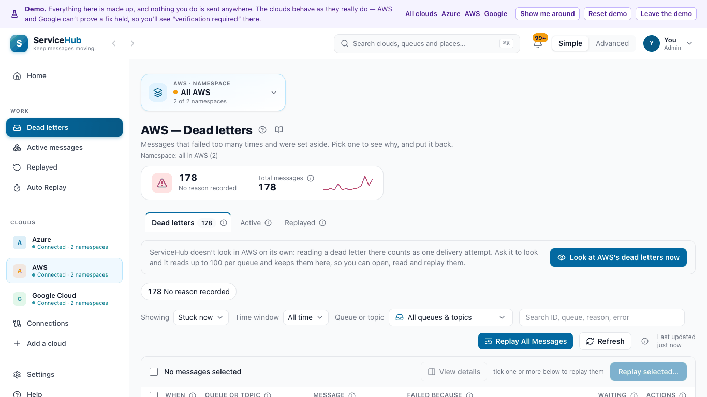
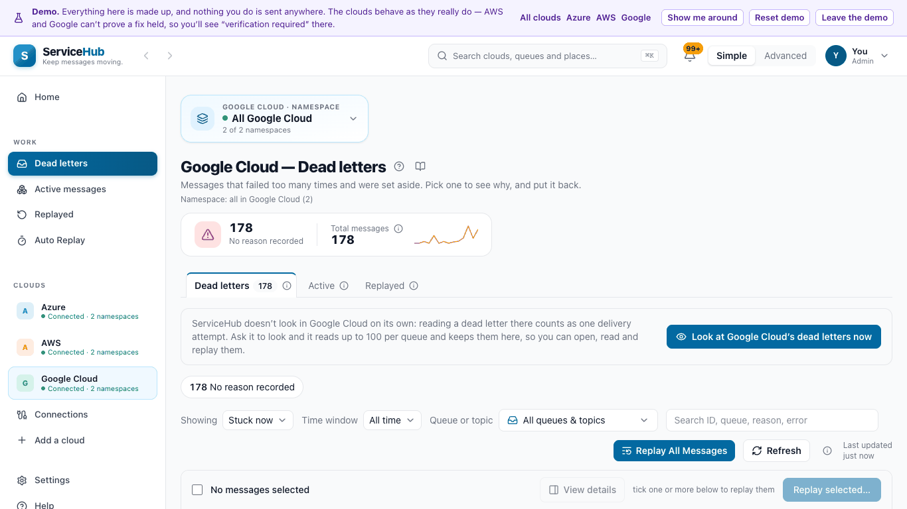
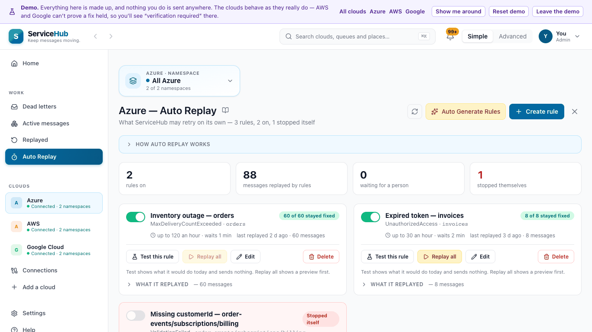
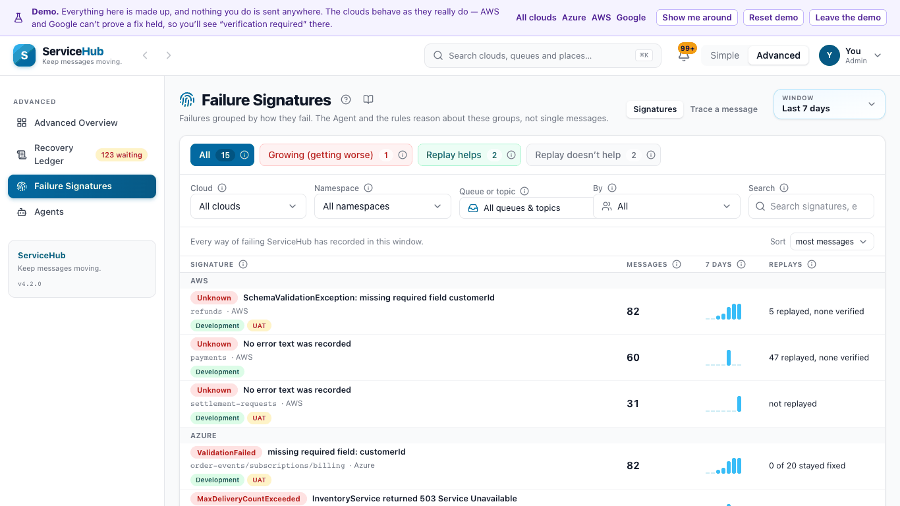
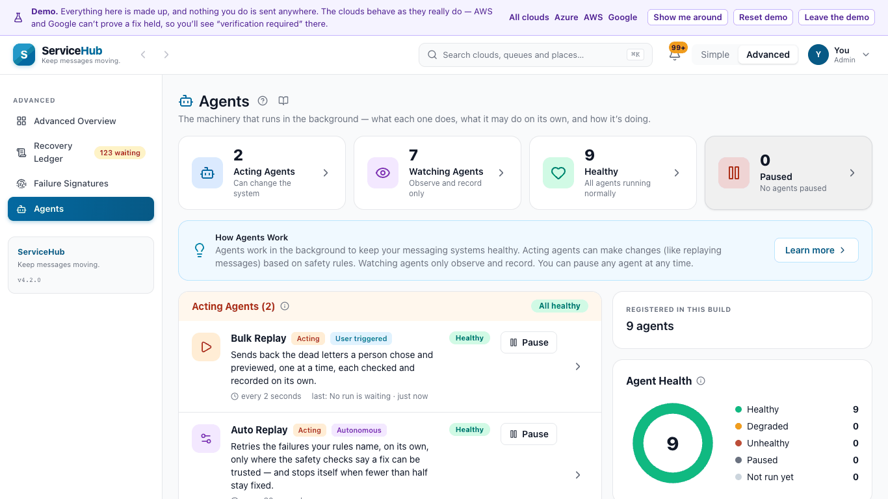

# ServiceHub

**Find out *why* your messages dead-lettered, replay them safely, and see whether the fix held. Azure Service Bus, AWS SQS/SNS and Google Pub/Sub, in one place.**

Your queue says "4,218 dead-lettered messages". A count does not tell you which messages, why each failed, or whether replaying them is safe.
ServiceHub shows all three, previews every replay *before* anything is sent back, and keeps a tamper-evident record you can export and verify offline.
One process, one SQLite file, running on your machine.



*Every screenshot on this page is the built-in demo: made-up data, nothing is sent anywhere. You can open the same demo yourself in about two minutes, with no cloud account.*

## Run it in two minutes

Pick one. Both open the built-in demo, so you can look around before connecting a real cloud.

### Option 1. From source: `./run.sh` does everything

For macOS, Linux, or a WSL 2 terminal on Windows.

```bash
git clone https://github.com/debdevops/servicehub.git
cd servicehub
./run.sh
```

That is the whole install. `./run.sh` checks your machine, **downloads the .NET 10 SDK and Node.js if you do not have them** (into `~/.servicehub/tools`, no `sudo`,
nothing system-wide), installs the packages, builds the API and the web app, starts both, and waits until they answer.
It needs only `bash`, `curl` (or `wget`), `tar` and an internet connection.

The first start takes a few minutes while it downloads and compiles. When you see **✔ ServiceHub is ready**, open **<http://localhost:3000>** and choose
**Try it with sample data**. Press **Ctrl-C** to stop everything it started.

| Want to | Run |
|---|---|
| See what it would install, change nothing | `./run.sh --check` |
| Never download anything (you installed .NET and Node yourself) | `./run.sh --no-install` |
| Use other ports | `SERVICEHUB_API_PORT=5200 SERVICEHUB_WEB_PORT=3200 ./run.sh` |
| Keep the data somewhere else | `SERVICEHUB_DATA_DIR=/path/to/folder ./run.sh` |

If port 3000 or 5153 is busy, it picks the next free one and tells you. This mode is for trying and developing (it uses a throw-away encryption key); your data
lives in `services/api/src/ServiceHub.Api/data/`. Prerequisites, what the script does, and a troubleshooting table: **[Local setup guide](docs/LOCAL-SETUP.md)**.

### Option 2. Docker: no clone, no build

Needs [Docker](https://docs.docker.com/get-docker/), a bash shell (macOS, Linux, or WSL 2) and `openssl`.

```bash
# 1. Make an encryption key once, and keep it. It protects the cloud credentials ServiceHub stores.
export SERVICEHUB_ENCRYPTION_KEY="$(openssl rand -hex 32)"

# 2. Download and start (the image is public: no sign-in to pull)
docker run -d --name servicehub --restart unless-stopped \
  -p 127.0.0.1:8080:8080 -v servicehub-data:/data \
  -e SECURITY__ENCRYPTIONKEY="$SERVICEHUB_ENCRYPTION_KEY" \
  ghcr.io/debdevops/servicehub:latest
```

Open **<http://localhost:8080>** and choose **Try it with sample data**. Linux `amd64` and `arm64` (Intel, AMD and Apple silicon) are supported.

```bash
docker logs -f servicehub     # watch it start
docker stop servicehub        # stop (your data stays in the volume)
docker start servicehub       # start again
```

Pin an exact release for anything you depend on (for example `…/servicehub:4.2.0` instead of `:latest`). To **build the image yourself from a clone** instead:

```bash
git clone https://github.com/debdevops/servicehub.git && cd servicehub
export SERVICEHUB_ENCRYPTION_KEY="$(openssl rand -hex 32)"
docker compose up --build        # → http://localhost:8080 (this machine only)
```

ServiceHub **refuses to start in Production without an encryption key**, and losing the key makes saved cloud connections unreadable, so keep it in a password manager.
Updating, backing up, removing and fixing problems: **[Run ServiceHub with Docker](docs/DOCKER.md)**.

## What it looks like, on each cloud

Same app, three clouds. Each cloud shows what it can and cannot do, honestly: the chips under each cloud's heading say whether ServiceHub can count, browse, confirm a fix and watch automatically there.

| | Azure Service Bus | AWS SQS / SNS | Google Pub/Sub |
|---|---|---|---|
| **Home** |  |  |  |
| **Dead letters** |  |  |  |
| **Step-by-step guide** | [Azure guide](docs/clouds/azure.md) | [AWS guide](docs/clouds/aws.md) | [Google Cloud guide](docs/clouds/gcp.md) |

## What you get

**Simple mode** is Home and the work you do from it. Everything else opens in place and lives in the URL, so a link shows someone exactly what you see.

- **See what needs you** — one Home for every connected cloud, with what is waiting for a decision and how each cloud is doing.
- **Understand a failure** — find a dead letter, read why it failed, and see its body, properties, headers and delivery history.
- **Replay with a preview** — one message, a few selected, or everything with Replay All. Always previewed first (how many, what risk, what policy) and always stoppable.
- **Know whether it held** — a replayed message is watched afterwards and marked *verified* or *came back*.
- **Let the Agent handle repeats, only when it has earned it** — Auto Replay rules replay a failure on their own only after enough verified fixes, and stop and ask a person when results turn bad.



**Advanced mode** is four read-only investigation pages: **Overview**, **Recovery Ledger**, **Failure Signatures** (failures grouped by how they fail) and **Agents**.

| Failure Signatures | Agents |
|---|---|
|  |  |

## Watch it work

One captioned video per cloud, about five minutes each: Home, Dead letters, Look now, replaying one, some or all, Active messages, Replayed, Auto Replay, approvals,
Connections, Settings, Help, then Advanced and back. No sound needed. Click a preview to play the full video.

| Azure Service Bus | AWS SQS / SNS | Google Pub/Sub |
|:---:|:---:|:---:|
| [](docs/media/azure.mp4) | [](docs/media/aws.mp4) | [](docs/media/gcp.mp4) |
| [▶ Azure, 5:12](docs/media/azure.mp4) | [▶ AWS, 5:07](docs/media/aws.mp4) | [▶ Google, 6:03](docs/media/gcp.mp4) |

<details><summary><b>Chapters</b> (Azure; AWS and Google are within a few seconds of these)</summary>

`0:07` Connect a cloud · `0:15` Home: every cloud · `0:26` Home: one cloud · `0:43` Dead letters and Look now · `0:57` Open a message · `1:05` Replay one ·
`1:29` Replay selected · `2:09` Replay All, then stop · `2:43` Active messages and Send · `2:57` Replayed · `3:07` Auto Replay · `3:25` Approve or decline ·
`3:37` Connections · `3:45` Settings · `4:03` Help · `4:09` Switch to Advanced · `5:02` Back to Simple

</details>

*Recorded from the real app against real development clouds. Replay All is started and then stopped on camera: **Stop now** leaves every message not yet sent exactly as it was.*

## Know the limits

- **Production namespaces are read-only for replay.** Replay is refused on any namespace you mark as Production, and ServiceHub has no way to override that. Investigate there; replay in dev and staging.
- **Azure is the verified path.** Only Azure can confirm a replayed message stayed fixed out of the box. AWS and Google read "verification required" until you switch on fix-confirming per namespace (Settings → Connections), which gives ServiceHub a complete view of that cloud's dead-letter queue. GCP often records no failure reason.
- **Anyone who can reach its port is the admin.** Keep it on `localhost`.
- **Message content is stored unencrypted.** The first 500 characters of each dead-letter body, its properties and a hash are kept in the SQLite file ([SECURITY.md](SECURITY.md)), so treat the data folder like the queue. Cloud credentials and webhook URLs are encrypted.
- **No upgrade from 4.0.0.** 4.1.0 and later are a from-scratch rewrite with a fresh database. Run it beside 4.0.0 and connect your clouds again. 4.0.0 lives, frozen, in [`archive/servicehub-4.0.0/`](archive/servicehub-4.0.0/). See the [changelog](CHANGELOG.md).

## How it stays safe

- **A person decides by default.** The Agent replays on its own only for a failure it has earned trust on; otherwise it stops and asks. Every replay, human or automatic, goes through one gate that **fails closed**: a check that cannot run blocks the replay.
- **Honest about each cloud.** Where a cloud cannot prove a fix held, results read *"verification required"*, never *"verified"*.
- **Emergency stop.** Stops everything ServiceHub does on its own, rules and Agent alike. Switching it on needs a reason and the typed word `STOP`; lifting it, a reason and `LIFT`. Both are recorded.
- **Evidence you can check offline.** Every recovery action is appended to a hash-chained ledger. Export it and verify it without ServiceHub: `python3 scripts/verify-recovery-chain.py <export.json>`. See [Recovery Evidence](docs/RECOVERY-EVIDENCE.md).
- **Credentials are encrypted at rest** (AES-GCM) and the key can be rotated: [Encryption key rotation](docs/ENCRYPTION-KEY-ROTATION.md).

## Deploying it for real

- **One instance.** One process, one SQLite file; a second instance on the same data directory exits. Keep the file on local block storage, not a network share.
- **Where to run it.** Step by step on a small Azure VM: **[Host ServiceHub on Azure](docs/HOSTING-AZURE.md)**. Terraform for Azure, AWS and Google Cloud (a private VM, no open port, daily snapshots) is in [`infra/`](infra/README.md); it has not yet been run against a real account.
- **Data and backups.** Set `ServiceHub__DataDirectory` (the Docker image uses `/data`). Back up from Settings → Backup: [Backup & restore](docs/BACKUP-RESTORE.md).
- **Who is asking.** ServiceHub does not log the browser in. Keep it on `localhost` or put it behind a private network or an authenticating reverse proxy. It can give other people and automation *limited* access with API keys (`X-API-KEY`), OIDC or Azure Easy Auth, plus Viewer, Operator and Admin roles. It answers only to `localhost`, `127.0.0.1` and `[::1]`; reaching it by another name needs `AllowedHosts` set (keep `localhost` in it). See [SECURITY.md](SECURITY.md).
- **Cloud permissions.** Read/receive on the queues you want watched; send and delete only if you want to replay and purge. Prefer identity-based auth (managed identity, IAM role, workload identity) over long-lived secrets.

## Documentation

| | |
|---|---|
| [Local setup](docs/LOCAL-SETUP.md) | Install, run, check and troubleshoot on your own machine, with or without Docker |
| [Run with Docker](docs/DOCKER.md) | Run the public image, update it, back it up, fix problems |
| [Azure](docs/clouds/azure.md) · [AWS](docs/clouds/aws.md) · [Google Cloud](docs/clouds/gcp.md) | Step-by-step setup and use, with annotated screenshots (also in the app under **Help**) |
| [Hosting on Azure](docs/HOSTING-AZURE.md) | Run it always-on on an Azure VM, safely |
| [Backup & restore](docs/BACKUP-RESTORE.md) | Take, verify and restore a backup |
| [Encryption key rotation](docs/ENCRYPTION-KEY-ROTATION.md) | Rotate the key that protects stored credentials, and what to do if it leaks |
| [Recovery Evidence](docs/RECOVERY-EVIDENCE.md) | The hash-chained ledger and how an auditor verifies an export |
| [Adding a provider](docs/extending/adding-a-provider.md) · [Adding an agent](docs/extending/adding-an-agent.md) | For engineers extending ServiceHub |
| [MCP server](tools/mcp/README.md) | A read-only way for an AI assistant to ask ServiceHub about dead letters |
| [Tests](tests/README.md) · [Contributing](CONTRIBUTING.md) · [Security](SECURITY.md) · [Changelog](CHANGELOG.md) | |

## Contributing

```bash
./runtest.sh --all     # everything CI runs: lint, type-check, backend + frontend suites with 60 % floors, browser tests, guards
```

See [CONTRIBUTING.md](CONTRIBUTING.md). Licensed under the [MIT License](LICENSE).
