# ServiceHub

**A self-hosted tool for recovering stuck messages in Azure Service Bus, AWS SQS/SNS and GCP Pub/Sub.**

Your queue says "4,218 dead-lettered messages". ServiceHub shows which ones, why each failed, and what a replay would do *before* anything is
sent back — then keeps a local record you can export and verify offline. It runs as one process with one SQLite file. Message content never
leaves your network: ServiceHub talks only to your clouds and, if you add one, to a notification channel (Slack, Teams or a webhook), which gets
queue names and failure reasons, never message bodies.

## Quick start

No cloud account is needed to look around: both options open a built-in demo with made-up data. Pick one.

### Option 1. Clone it and run it (no Docker)

For macOS, Linux, or a WSL 2 terminal on Windows.

| You need | Version | Check with |
|---|---|---|
| [.NET SDK](https://dotnet.microsoft.com/download/dotnet/10.0) | 10.0 or newer | `dotnet --version` |
| [Node.js](https://nodejs.org) (npm comes with it) | 22 LTS recommended, 20.19 minimum | `node --version` |
| [git](https://git-scm.com), `curl`, `lsof` | any | `git --version` |

```bash
git clone https://github.com/debdevops/servicehub.git
cd servicehub
./run.sh --check    # optional: checks your machine and the ports, starts nothing
./run.sh            # installs the web dependencies the first time, then starts the API (:5153) and the web app (:3000)
```

The first start compiles the API and takes a minute or two. When you see **✔ ServiceHub is ready**, open **<http://localhost:3000>** and choose
**Try it with sample data** (or go straight to <http://localhost:3000/demo/azure>). Press **Ctrl-C** to stop. Then use **Add a cloud** (sidebar) to connect your own.

This mode runs in `Development` with a throw-away encryption key, so it is for trying and developing. Your data lives in `services/api/src/ServiceHub.Api/data/`.
Something did not start? The **[Local setup guide](docs/LOCAL-SETUP.md)** covers prerequisites, what `./run.sh` does, and a troubleshooting table.

### Option 2. Run the Docker image (no clone, no build)

Needs [Docker](https://docs.docker.com/get-docker/), a bash shell (macOS, Linux, or a WSL 2 terminal on Windows) and `openssl`.

```bash
export SERVICEHUB_ENCRYPTION_KEY="$(openssl rand -hex 32)"      # keep this key; it protects stored cloud credentials
docker run -d --name servicehub -p 127.0.0.1:8080:8080 -v servicehub-data:/data \
  -e SECURITY__ENCRYPTIONKEY="$SERVICEHUB_ENCRYPTION_KEY" ghcr.io/debdevops/servicehub:4.1.0
```

Open **<http://localhost:8080>** and choose **Try it with sample data**. The image is public (`linux/amd64` and `linux/arm64`, no sign-in to pull);
`docker run` downloads it, or fetch it first with `docker pull ghcr.io/debdevops/servicehub:4.1.0`. This is the mode to run it for real: it uses `Production`
settings and your own encryption key.

Full guide, with update, back up, stop, remove and troubleshooting: **[Run ServiceHub with Docker](docs/DOCKER.md)**. To build the image from a clone instead:

```bash
export SERVICEHUB_ENCRYPTION_KEY="$(openssl rand -hex 32)"   # once, and keep it somewhere safe
docker compose up --build                                       # → http://localhost:8080 (this machine only)
```

ServiceHub **refuses to start in Production without an encryption key**, because the key protects every cloud connection string it stores. Losing the
key makes them unreadable, so back it up in a secret manager. If you reach it by any name other than `localhost`, it answers `400` until you list that name
in `AllowedHosts`; the setting replaces the default, so keep `localhost` in it: `-e "AllowedHosts=localhost;your.host.name"`.

**Know the limits:** replay is refused on any namespace you mark as Production, and 4.1.0 has no way to override that · AWS and GCP cannot confirm a replay stayed fixed, so they read "verification required" · anyone who can reach its port is the admin, so keep it on `localhost`.

> **Status:** this is **ServiceHub 4.1.0**, a from-scratch rewrite. **There is no upgrade path from 4.0.0** — it starts with a fresh database and cannot open a 4.0.0 file; run it beside 4.0.0 and connect your clouds again.
> 4.0.0 lives, frozen, in [`archive/servicehub-4.0.0/`](archive/servicehub-4.0.0/). See the [changelog](CHANGELOG.md).

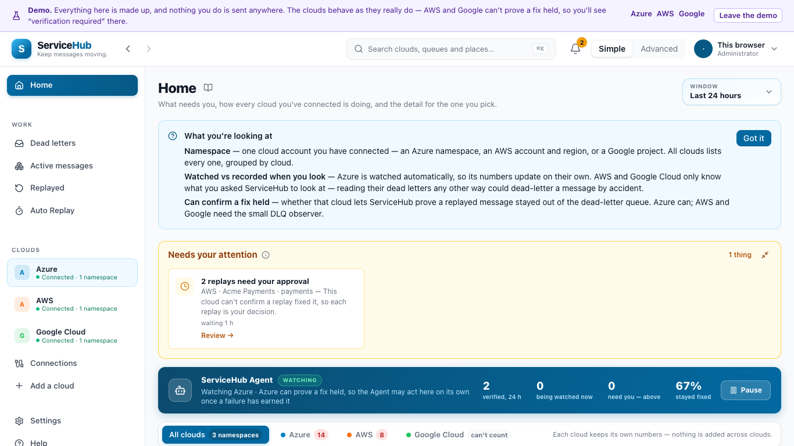

*Screenshots are the built-in demo (`/demo/azure`): made-up data, nothing is sent anywhere.*

## What you get

**Simple** — Home and the work you do from it; everything else opens in place and lives in the URL, so a link shows someone exactly what you see.

- **Home** — what needs you, how every connected cloud is doing, and the ServiceHub Agent.
- **Dead letters · Active messages · Replayed · Auto Replay** (tabs on Home) — find a message, read why it failed, replay it, and watch whether it stayed fixed.

**Advanced** — four read-only investigation pages: **Overview**, **Recovery Ledger**, **Failure Signatures**, **Agents**.

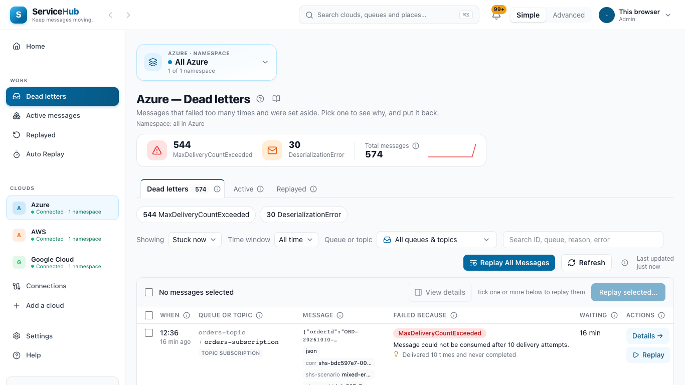

## Watch it work — all of Simple mode, start to finish

One captioned video per cloud, about five minutes each. They cover everything you do day to day in **Simple** mode — Home, Dead letters, Look now, opening a message, **replaying one message, a few selected, or everything with Replay All** (always previewed first, always stoppable), Active messages, Replayed, Auto Replay, the approvals, Connections, Settings and Help — and then **how to switch to Advanced** (read-only: Overview, Recovery Ledger, Failure Signatures, Agents) and back. No sound needed. Click a preview to play the full video.

| Azure Service Bus | AWS SQS / SNS | Google Pub/Sub |
|:---:|:---:|:---:|
| [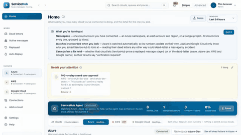](docs/media/azure.mp4) | [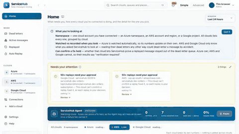](docs/media/aws.mp4) | [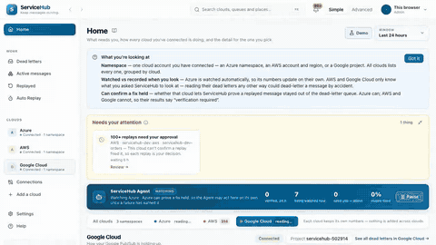](docs/media/gcp.mp4) |
| [▶ Azure Service Bus, 5:12](docs/media/azure.mp4) | [▶ AWS SQS / SNS, 5:07](docs/media/aws.mp4) | [▶ Google Pub/Sub, 6:03](docs/media/gcp.mp4) |

<details><summary><b>Azure Service Bus</b> — chapters (5:12)</summary>

- `0:07` Connect a cloud
- `0:15` Home: every cloud
- `0:26` Home: one cloud
- `0:43` Dead letters (and Look now)
- `0:57` Open a message
- `1:05` Replay one message
- `1:29` **Replay selected**: preview, run, watch
- `2:09` **Replay All Messages**: preview, run, watch, stop
- `2:43` Active messages and Send
- `2:57` Replayed
- `3:07` Auto Replay
- `3:25` Needs you: approve or decline
- `3:37` Connections
- `3:45` Settings
- `4:03` Help
- `4:09` **Switch to Advanced**: Overview
- `4:31` Advanced: Recovery Ledger
- `4:44` Advanced: Failure Signatures
- `4:53` Advanced: Agents
- `5:02` **Back to Simple**

</details>

<details><summary><b>AWS SQS / SNS</b> — chapters (5:07)</summary>

- `0:07` Connect a cloud
- `0:14` Home: every cloud
- `0:26` Home: one cloud
- `0:42` Dead letters (and Look now)
- `0:59` Open a message
- `1:08` Replay one message
- `1:32` **Replay selected**: preview, run, watch
- `2:04` **Replay All Messages**: preview, run, watch, stop
- `2:38` Active messages and Send
- `2:52` Replayed
- `3:02` Auto Replay
- `3:20` Needs you: approve or decline
- `3:32` Connections
- `3:39` Settings
- `3:58` Help
- `4:04` **Switch to Advanced**: Overview
- `4:26` Advanced: Recovery Ledger
- `4:39` Advanced: Failure Signatures
- `4:48` Advanced: Agents
- `4:57` **Back to Simple**

</details>

<details><summary><b>Google Pub/Sub</b> — chapters (6:03)</summary>

- `0:07` Connect a cloud
- `0:14` Home: every cloud
- `0:26` Home: one cloud
- `0:43` Dead letters (and Look now)
- `1:00` Open a message
- `1:08` Replay one message
- `1:32` **Replay selected**: preview, run, watch
- `3:00` **Replay All Messages**: preview, run, watch, stop
- `3:34` Active messages and Send
- `3:47` Replayed
- `3:58` Auto Replay
- `4:16` Needs you: approve or decline
- `4:28` Connections
- `4:35` Settings
- `4:54` Help
- `5:00` **Switch to Advanced**: Overview
- `5:22` Advanced: Recovery Ledger
- `5:34` Advanced: Failure Signatures
- `5:43` Advanced: Agents
- `5:53` **Back to Simple**

</details>

*Recorded from the real app against real development clouds, with the sample app's made-up orders. Replay All is started and then stopped on camera: the preview says how many it would replay, the run is paced at about two a second, and **Stop now** leaves every message not yet sent exactly as it was. Azure says "ServiceHub watches that it stays out"; AWS and Google say "verification required" — they cannot prove a replayed message stayed out of the dead-letter queue, and the videos show that rather than hide it.*

## Step-by-step guides — one per cloud

Each guide goes from nothing to a working ServiceHub, one screen at a time. Every picture is the real app (or the real cloud console, with account
names and keys blanked out) with numbered markers; the list under each picture says what each control does **and what it will not do**.

| | Azure Service Bus | AWS SQS / SNS | Google Pub/Sub |
|---|---|---|---|
| **Guide** | [Azure guide](docs/clouds/azure.md) | [AWS guide](docs/clouds/aws.md) | [Google Cloud guide](docs/clouds/gcp.md) |
| **1. Connect** | 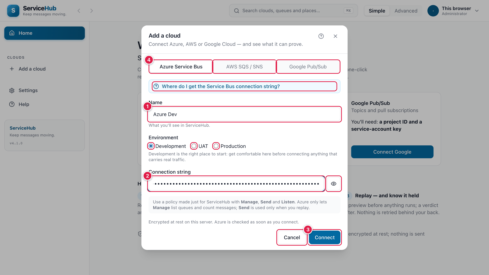 | 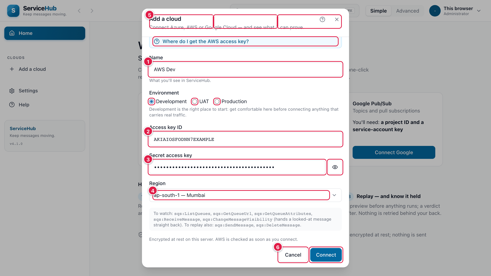 | 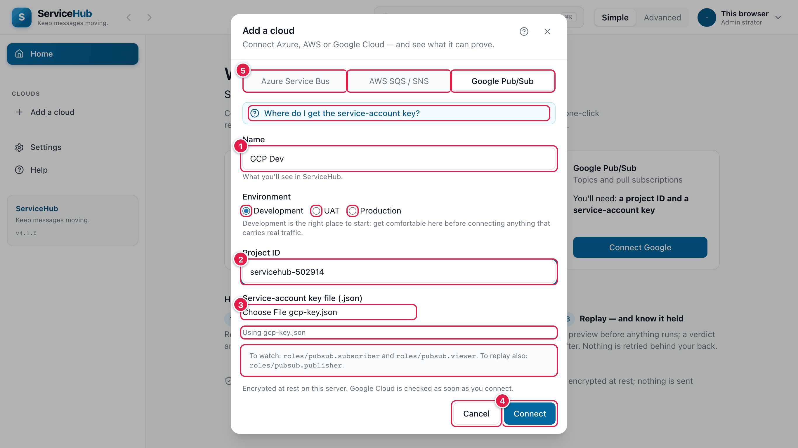 |
| **2. Home** | 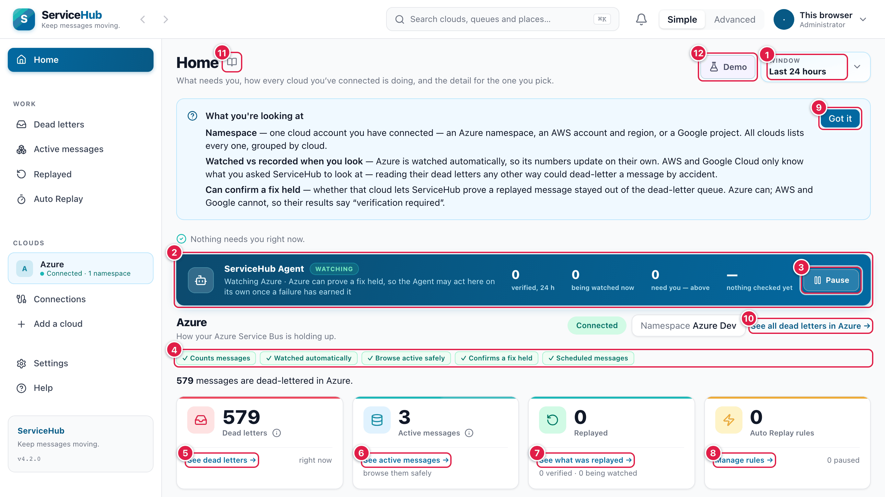 | 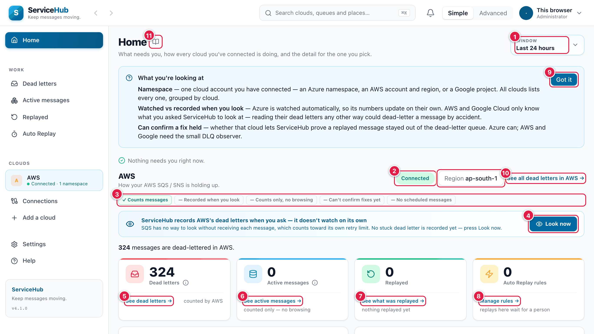 | 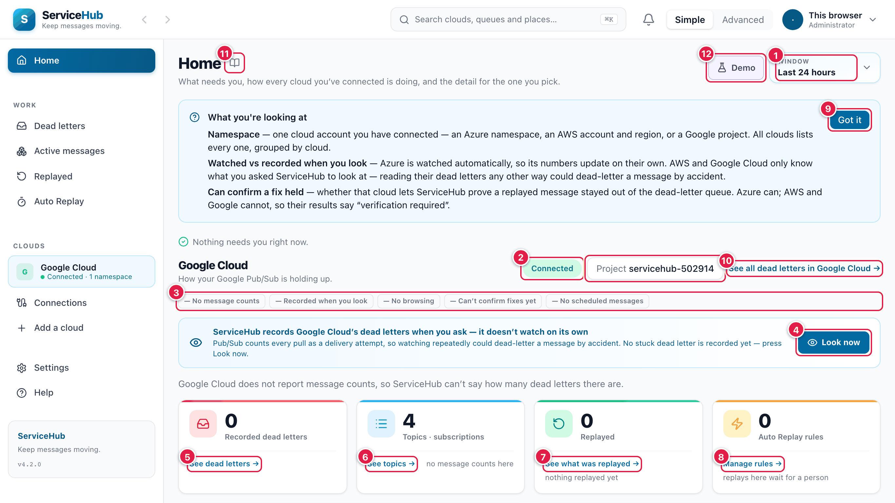 |
| **3. Dead letters** | 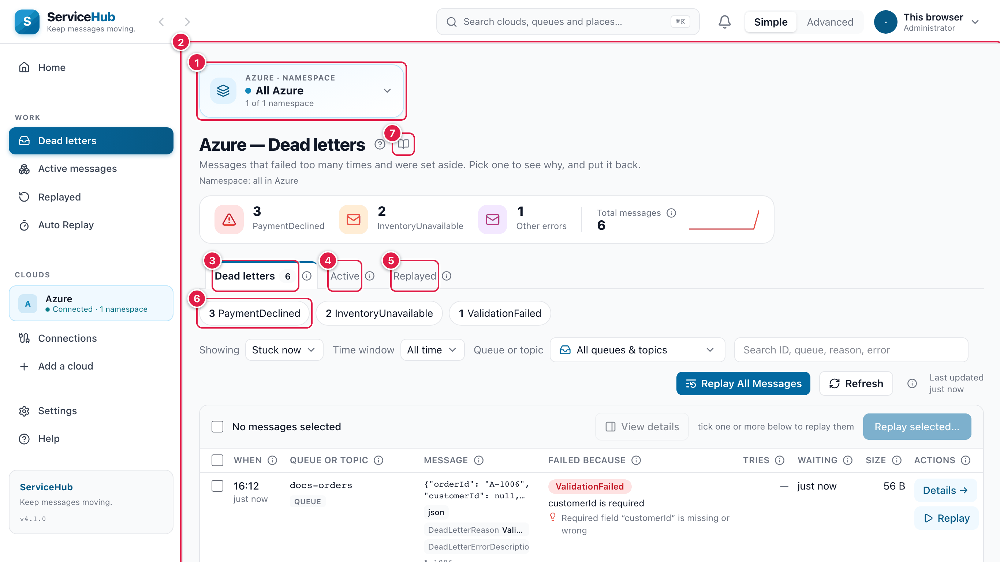 | 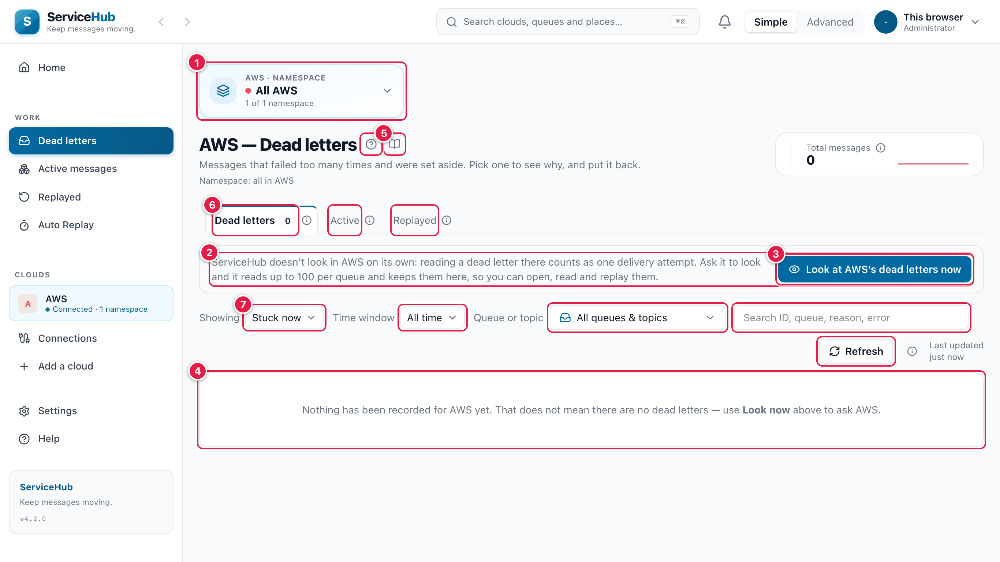 | 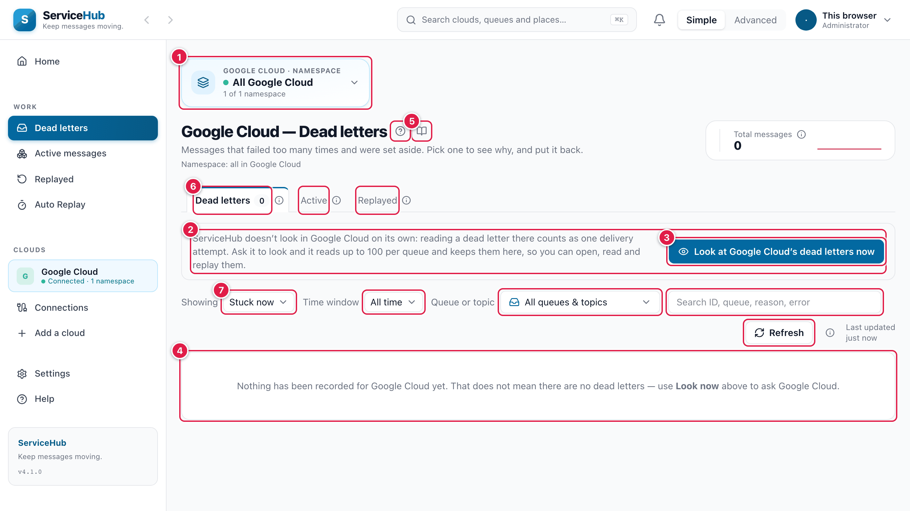 |
| **4. Replay result** | 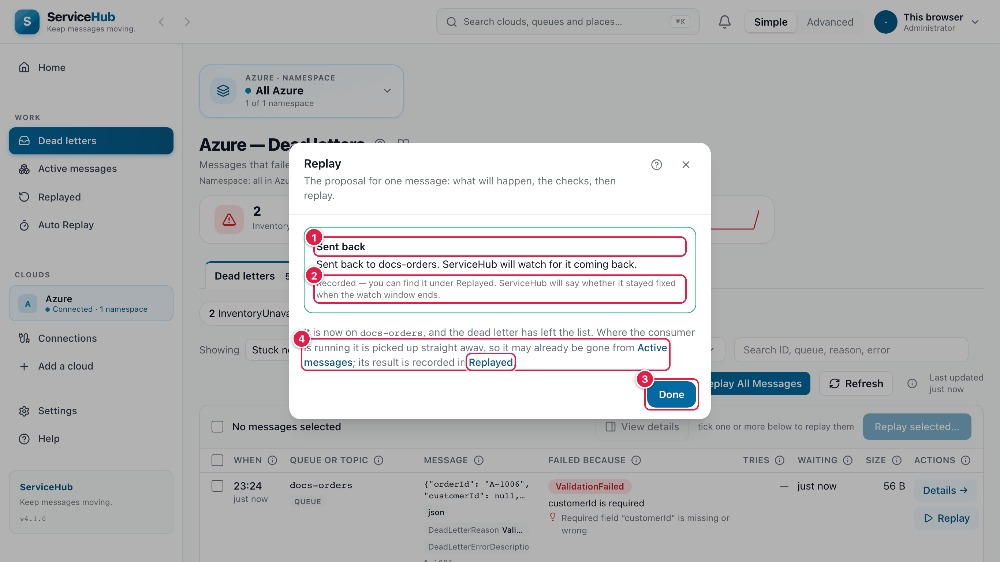 | 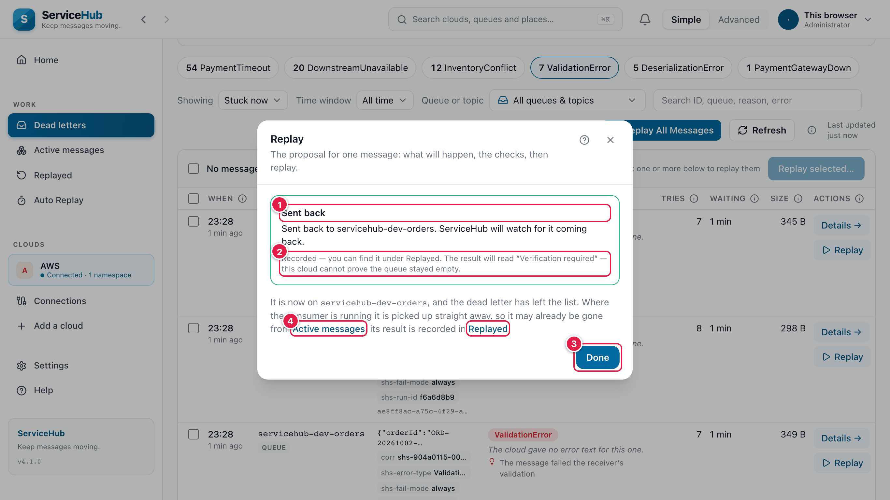 | 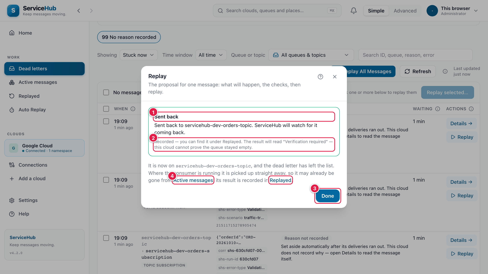 |

The same guides are in the app: open **Help** in the sidebar, or the book icon next to any page title.

## How it stays safe

- **A person decides by default.** The Agent replays on its own only for a failure it has earned trust on; otherwise it stops and asks. Every
  replay, human or automatic, goes through one gate that **fails closed** — a check that cannot run blocks the replay.
- **Honest about each cloud.** Azure can confirm a replayed message stayed out of the dead-letter queue. AWS and GCP cannot, so their results read *"verification required"*, never *"verified"*.
- **Production namespaces are refused.** A namespace you mark as *Production* when you add the cloud can be read, but not replayed into: the recovery gate asks for a production elevation, and 4.1.0 has no screen to grant one, so recovery there is denied for everyone, people and the Agent alike.
- **Emergency stop.** Stops everything ServiceHub does on its own — rules and the Agent; a person can still replay deliberately.
  Switching it on needs a reason and the typed word `STOP`; lifting it, a reason and `LIFT`. Both are recorded in the ledger.
- **Evidence you can check offline.** Every recovery action is appended to a hash-chained ledger. Export it and verify it without ServiceHub:
  `python3 scripts/verify-recovery-chain.py <export.json>`. See [Recovery Evidence](docs/RECOVERY-EVIDENCE.md).
- **Credentials are encrypted at rest** (AES-GCM) and the key can be rotated: [Encryption key rotation](docs/ENCRYPTION-KEY-ROTATION.md).

## Deploying it for real

Step by step: **[Host ServiceHub on Azure](docs/HOSTING-AZURE.md)** — a small VM running the Docker image, data on its managed disk, reached through an SSH tunnel.

| | |
|---|---|
| **One instance.** | One process, one SQLite file; a second instance on the same data directory exits. Keep the file on local block storage, not a network share. |
| **Data** | Set `ServiceHub__DataDirectory` (the Docker image uses the `/data` volume). |
| **Backups** | Settings → Backup, or `GET/POST /api/v1/admin/backup`. Restore takes effect on the next start: [Backup & restore](docs/BACKUP-RESTORE.md). |
| **Who is asking** | **ServiceHub does not log the browser in: anyone who can reach its port is the server's owner, an Administrator.** Keep it on `localhost` (the Docker Compose file binds `127.0.0.1` for this reason) or put it behind a private network or an authenticating reverse proxy before exposing it. What it *can* do is give other people and automation **limited** access: API keys (`Security:Authentication:ApiKeys`, sent as `X-API-KEY`), OIDC (`Security:Oidc:*`) or Azure Easy Auth (`Security:EasyAuth:*`) identify who acted, and roles granted in Settings (Viewer, Operator, Admin) limit what they may do. A wrong key is refused (`401`); no key means the owner. ServiceHub also **answers only to `localhost`, `127.0.0.1` and `[::1]`** (it refuses any other `Host`, so a web page on another site cannot reach it through your browser); if you reach it by another name — a reverse proxy, an App Service host name — set `AllowedHosts` to that name. See [SECURITY.md](SECURITY.md). |
| **Cloud permissions** | Read/receive on the queues you want watched; send and delete only if you want to replay and purge. Prefer identity-based auth (managed identity, IAM role, workload identity) over long-lived secrets. |

## Documentation

| | |
|---|---|
| [Run with Docker](docs/DOCKER.md) | Download the public image, run it, update it, back it up, fix problems |
| [Local setup](docs/LOCAL-SETUP.md) | Install, run, check and troubleshoot ServiceHub on your own machine |
| [Hosting on Azure](docs/HOSTING-AZURE.md) | Run it always-on on an Azure VM, safely |
| [Azure](docs/clouds/azure.md) · [AWS](docs/clouds/aws.md) · [Google Cloud](docs/clouds/gcp.md) | Step-by-step setup and use, with annotated screenshots |
| [Backup & restore](docs/BACKUP-RESTORE.md) | Take, verify and restore a backup |
| [Encryption key rotation](docs/ENCRYPTION-KEY-ROTATION.md) | Rotate the key that protects stored cloud credentials, and what to do if it leaks |
| [Recovery Evidence](docs/RECOVERY-EVIDENCE.md) | The hash-chained ledger and how an auditor verifies an export offline |
| [Adding a messaging provider](docs/extending/adding-a-provider.md) · [Adding an agent](docs/extending/adding-an-agent.md) | For engineers extending ServiceHub |
| [Tests](tests/README.md) · [Contributing](CONTRIBUTING.md) · [Security](SECURITY.md) · [Changelog](CHANGELOG.md) | |

## Contributing

```bash
./runtest.sh --all     # everything CI runs: lint, type-check, backend + frontend suites with 60 % floors, browser tests, guards
```

See [CONTRIBUTING.md](CONTRIBUTING.md). Licensed under the [MIT License](LICENSE).
