# ServiceHub — Comprehensive Guide

**A Complete Guide for Novices and Experts**  
*Understanding Azure Service Bus Inspection Made Simple*

**Version:** 2.0 (February 2026) — DLQ Intelligence & Auto-Replay System  
**New Features:** Persistent DLQ tracking, Auto-replay rules, Batch replay operations

---

## Table of Contents

1. [What is ServiceHub and Why Do We Need It?](#what-is-servicehub)
2. [High-Level Architecture](#high-level-architecture)
3. [System Architecture Diagram](#system-architecture-diagram)
4. [Complete Application Flow](#complete-application-flow)
5. [Backend API Architecture](#backend-api-architecture)
6. [Frontend Application Architecture](#frontend-application-architecture)
7. [Data Flow & Communication](#data-flow--communication)
8. [Key Components & Methods](#key-components--methods)
9. [Deployment Architecture](#deployment-architecture)
10. [Security & Authentication](#security--authentication)
11. [DLQ Intelligence System](#dlq-intelligence-system) ⭐ NEW
12. [Auto-Replay Rules Engine](#auto-replay-rules-engine) ⭐ NEW

---

## What is ServiceHub?

### The Problem ServiceHub Solves

Imagine you're running a large e-commerce platform. When a customer places an order, multiple things need to happen:
- Process the payment
- Update inventory
- Send confirmation email
- Notify the warehouse
- Update analytics

Instead of doing these all at once (which could slow down or crash your system), you use **Azure Service Bus** — a message queue system. Each task becomes a "message" that gets processed in order.

But what happens when something goes wrong?

❌ **Without ServiceHub:**
- Messages disappear into a "black box"
- No visibility into what's in the queue
- Can't see why messages failed
- Hard to debug production issues
- No pattern detection for recurring problems
- Manual investigation takes hours
- No automated replay capabilities

✅ **With ServiceHub:**
- **Point-in-time visibility** into all messages for stable investigation
- **Dead-letter queue inspection** — see exactly what failed and why
- **DLQ Intelligence** — persistent tracking with categorization and history (v2.0)
- **Auto-Replay Rules** — conditional batch replay with rate limiting (v2.0)
- **Optional AI-powered analysis** — automatically identifies recurring issue patterns
- **Read-mostly by design** — safe for production use (browsing is read-only, actions are user-confirmed)
- **Outlook-style browsing** — familiar interface for long debugging sessions
- **Safely replay failed messages** back to the main queue with no risk of message loss

### Who Needs ServiceHub?

- **Backend Engineers** debugging message processing issues
- **SREs (Site Reliability Engineers)** monitoring queue health
- **DevOps Engineers** troubleshooting production incidents
- **Support Teams** investigating customer-reported issues
- **Platform Engineers** optimizing message flow

---

## High-Level Architecture

ServiceHub consists of three main components working together:

```mermaid
%%{init: {'theme':'base', 'themeVariables': { 'fontSize':'22px', 'primaryColor':'#0ea5e9', 'primaryTextColor':'#fff', 'primaryBorderColor':'#0369a1', 'lineColor':'#64748b', 'secondaryColor':'#f59e0b', 'tertiaryColor':'#10b981'}}}%%
graph TB
    subgraph "🌐 User Interface"
        UI["React Frontend<br/>Port 3000<br/>━━━━━━━━━<br/>• Message browsing<br/>• Queue inspection<br/>• AI insights view<br/>• Dead-letter management"]
    end

    subgraph "🔧 Backend API"
        API[".NET 8 API<br/>Port 5153<br/>━━━━━━━━━<br/>• REST endpoints<br/>• Authentication<br/>• Data transformation<br/>• Business logic"]
    end

    subgraph "☁️ Azure Cloud"
        ASB["Azure Service Bus<br/>━━━━━━━━━<br/>• Message queues<br/>• Topics & subscriptions<br/>• Dead-letter queues<br/>• Message metadata"]
        
        AI["AI Service (Optional)<br/>━━━━━━━━━<br/>• Pattern detection<br/>• Anomaly identification<br/>• Insights generation"]
    end

    subgraph "💾 Local Storage"
        CACHE["In-Memory Cache<br/>━━━━━━━━━<br/>• Connection strings<br/>• Client instances<br/>• Message cache"]
        
        DB["SQLite Database<br/>━━━━━━━━━<br/>• Namespace configs<br/>• API keys<br/>• Settings"]
    end

    UI -->|HTTP/REST| API
    API -->|AMQP Protocol| ASB
    API -->|HTTPS| AI
    API -->|Read/Write| DB
    API -->|Cache| CACHE
    
    style UI fill:#e0f2fe,stroke:#0369a1,stroke-width:3px,color:#000
    style API fill:#fef3c7,stroke:#d97706,stroke-width:3px,color:#000
    style ASB fill:#dbeafe,stroke:#2563eb,stroke-width:3px,color:#000
    style AI fill:#dcfce7,stroke:#16a34a,stroke-width:3px,color:#000
    style DB fill:#fce7f3,stroke:#db2777,stroke-width:3px,color:#000
    style CACHE fill:#f3e8ff,stroke:#9333ea,stroke-width:3px,color:#000
```



---

## System Architecture Diagram

This diagram shows how all components interact at a detailed level:


---

## Complete Application Flow

### Flow 1: Connecting to Azure Service Bus

This is the first thing a user does — connect ServiceHub to their Azure Service Bus namespace:

```mermaid
%%{init: {'theme':'base', 'themeVariables': { 'fontSize':'16px'}}}%%
sequenceDiagram
    autonumber
    
    participant User as 👤 User
    participant UI as React UI
    participant API as .NET API
    participant DB as SQLite DB
    participant Crypto as Encryption
    participant Azure as Azure Service Bus
    
    User->>UI: Enters connection string
    Note over User,UI: Connection String contains:<br/>• Endpoint URL<br/>• Access Key Name<br/>• Access Key
    
    UI->>API: POST /api/v1/namespaces
    Note over UI,API: JSON Payload:<br/>{name, connectionString, displayName}
    
    API->>API: Validate request format
    Note over API: Checks:<br/>• Connection string format<br/>• Required fields present
    
    API->>Crypto: Encrypt connection string
    Note over Crypto: Uses AES-256 encryption<br/>Key stored securely
    
    Crypto-->>API: Encrypted string
    
    API->>DB: Save namespace record
    Note over DB: Stores:<br/>• ID (GUID)<br/>• Name<br/>• Encrypted connection string<br/>• Created timestamp
    
    DB-->>API: Namespace ID
    
    API->>Azure: Test connection (Admin API)
    Note over Azure: Validates:<br/>• Connection string is valid<br/>• Has necessary permissions<br/>• Namespace is accessible
    
    alt Connection Successful
        Azure-->>API: ✅ Connection OK
        API->>DB: Update isActive = true
        API-->>UI: 200 OK + Namespace details
        UI-->>User: ✅ "Namespace connected successfully"
    else Connection Failed
        Azure-->>API: ❌ Connection failed
        API->>DB: Update isActive = false
        API-->>UI: 400 Bad Request + Error details
        UI-->>User: ❌ "Connection failed: [reason]"
    end
```



**What happens in plain English:**

1. **User enters connection string** — This is like giving ServiceHub the "address and password" to your Azure Service Bus
2. **UI sends to API** — The frontend sends this securely to the backend
3. **API validates** — Checks if the format is correct
4. **Encryption** — The connection string is encrypted before storage (security best practice)
5. **Save to database** — Stored in a local SQLite database
6. **Test connection** — API tries to actually connect to Azure to verify it works
7. **Success/Failure** — User sees whether it worked or not

---

### Flow 2: Browsing Messages in a Queue

Once connected, users can browse messages in any queue:

```mermaid
%%{init: {'theme':'base', 'themeVariables': { 'fontSize':'16px'}}}%%
sequenceDiagram
    autonumber
    
    participant User as 👤 User
    participant Sidebar as Sidebar Component
    participant MsgPage as MessagesPage
    participant Hook as useMessages Hook
    participant QueryClient as React Query
    participant API as .NET API
    participant Cache as Client Cache
    participant Azure as Azure Service Bus
    
    User->>Sidebar: Clicks on "testqueue"
    Sidebar->>MsgPage: Navigate to /messages?namespace=X&queue=testqueue
    
    MsgPage->>Hook: Request messages
    Hook->>QueryClient: Check cache
    
    alt Cache Hit (data < 30s old)
        QueryClient-->>Hook: Return cached messages
        Hook-->>MsgPage: Display messages immediately
    else Cache Miss or Stale
        QueryClient->>API: GET /api/v1/namespaces/X/queues/testqueue/messages
        
        API->>Cache: Get ServiceBusClient
        
        alt Client in Cache
            Cache-->>API: Return existing client
        else Client not in Cache
            API->>Azure: Create new ServiceBusClient
            Azure-->>API: Client instance
            API->>Cache: Store client for reuse
        end
        
        API->>Azure: PeekMessagesAsync(take=100)
        Note over API,Azure: This is a point-in-time snapshot.<br/>The list does not update automatically.
        Note over Azure: Peek = read without removing<br/>Gets up to 100 messages
        
        Azure-->>API: List of messages with metadata
        Note over API: Each message has:<br/>• MessageId<br/>• Body<br/>• EnqueuedTime<br/>• DeliveryCount<br/>• Properties<br/>• etc.
        
        API->>API: Transform to DTOs
        Note over API: Converts Azure format to UI-friendly format
        
        API-->>QueryClient: Return message list + pagination
        QueryClient->>QueryClient: Cache for 30 seconds
        QueryClient-->>Hook: Messages data
        Hook-->>MsgPage: Display in virtualized list
    end
    
    MsgPage->>User: Show messages in list (48 messages)
    
    User->>MsgPage: Clicks on a message
    MsgPage->>MsgPage: Highlight selected message
    MsgPage->>MsgPage: Show detail panel with tabs:<br/>• Properties<br/>• Body<br/>• AI Insights<br/>• Headers
```



**What happens in plain English:**

1. **User selects a queue** — Clicks on "testqueue" in the sidebar
2. **Page navigation** — URL changes to show the selected queue
3. **Check cache first** — React Query checks if we already have this data (< 30 seconds old)
4. **If cached** — Show immediately (instant!)
5. **If not cached** — API fetches from Azure Service Bus
6. **API gets client** — Reuses existing connection or creates new one
7. **Peek messages** — "Peek" means read without removing (safe, read-only)
8. **Transform data** — Convert Azure's format to something easier for the UI
9. **Cache the result** — Store for 30 seconds to avoid repeated calls
10. **Display** — Show in a virtualized list (only renders visible items for performance)
11. **User clicks message** — Detail panel shows full info with tabs

---

### Flow 3: Dead-Letter Queue Inspection

When messages fail to process, they go to a special "dead-letter queue". This is one of ServiceHub's most valuable features:

```mermaid
%%{init: {'theme':'base', 'themeVariables': { 'fontSize':'16px'}}}%%
sequenceDiagram
    autonumber
    
    participant User as 👤 User
    participant UI as React UI
    participant API as .NET API
    participant Azure as Azure Service Bus
    
    User->>UI: Selects "Dead-Letter" tab
    Note over User: Queue shows:<br/>Active: 48 messages<br/>Dead-Letter: 3 messages
    
    UI->>API: GET /messages?queueType=deadletter
    
    API->>Azure: Access queue/$deadletterqueue path
    Note over API,Azure: Dead-letter queue is a special path:<br/>queue/myqueue/$deadletterqueue
    
    Azure-->>API: Dead-letter messages with:<br/>• Original message data<br/>• DeadLetterReason<br/>• DeadLetterErrorDescription<br/>• DeliveryCount
    
    API->>API: Classify severity
    Note over API: Severity Logic:<br/>• Test: Reason contains "test"/"demo"<br/>• Critical: DeliveryCount > 5<br/>• Warning: All others
    
    API-->>UI: Messages with severity classification
    
    UI->>UI: Render with color coding
    Note over UI: • 🔵 Test (blue)<br/>• 🟡 Warning (amber)<br/>• 🔴 Critical (red)
    
    User->>UI: Clicks on dead-letter message
    
    UI->>UI: Show detailed panel with sections:
    Note over UI: Section 1: Azure Data<br/>DeadLetterReason: "MaxDeliveryCountExceeded"<br/>DeadLetterSource: "myqueue"<br/>DeliveryCount: 10<br/><br/>Section 2: ServiceHub Analysis<br/>"This message failed 10 times..."<br/><br/>Section 3: Suggested Actions<br/>• Check app logs<br/>• Verify downstream service<br/>• Review error details
    
    User->>UI: Clicks "Replay Message" button
    Note over User: This will send the message<br/>back to the main queue
    
    UI->>UI: Show confirmation dialog
    UI-->>User: "Are you sure you want to replay?"
    
    User->>UI: Confirms
    
    UI->>API: POST /messages/{sequenceNumber}/replay
    Note over UI,API: This initiates the safe replay flow.
    
    API->>Azure: 1. Lock message in DLQ (PeekLock)
    Note over API,Azure: Message becomes invisible but is NOT deleted.
    
    Azure-->>API: Message locked
    
    API->>Azure: 2. Send copy to main queue
    Note over API,Azure: SendMessageAsync() to 'myqueue'
    
    alt Send Succeeded
        Azure-->>API: ✅ Sent successfully
        API->>Azure: 3. Complete message in DLQ
        Note over API,Azure: Original message is now deleted.
    else Send Failed
        Azure-->>API: ❌ Send failed
        API->>Azure: 3. Abandon lock on DLQ message
        Note over API,Azure: Message becomes visible in DLQ again.<br/>No message loss.
    end
    
    API-->>UI: 200 OK
    
    UI->>UI: Refresh message list
    
    UI-->>User: ✅ "Message replayed successfully"
    Note over User: Message now in main queue<br/>Will be reprocessed
```



**What happens in plain English:**

1. **User switches to Dead-Letter tab** — Sees failed messages
2. **API fetches from special path** — Dead-letter queue is at `{queue}/$deadletterqueue`
3. **Messages include failure info** — Azure tells us WHY it failed
4. **ServiceHub classifies severity** — Automatic categorization (test/warning/critical)
5. **Color-coded display** — Visual distinction between severity levels
6. **User clicks message** — Sees three sections:
   - **Azure Data** — Facts from Azure (reason, source, delivery count)
   - **ServiceHub Analysis** — AI-generated interpretation
   - **Suggested Actions** — What to do next
7. **User clicks Replay** — Sends message back to main queue
8. **Confirmation dialog** — Prevents accidents
9. **API orchestrates safe replay** — Locks the DLQ message, sends a copy to the main queue, and only deletes the original from the DLQ upon successful send. This guarantees no message loss.
10. **Success** — Message will be reprocessed by the application

---

### Flow 4: AI Pattern Detection (Optional Feature)

ServiceHub can optionally integrate with an AI service to detect patterns in failed messages:

```mermaid
%%{init: {'theme':'base', 'themeVariables': { 'fontSize':'16px'}}}%%
sequenceDiagram
    autonumber
    
    participant User as 👤 User
    participant UI as React UI
    participant API as .NET API
    participant AIService as AI Service
    participant Azure as Azure Service Bus
    
    Note over API: Background worker runs every 5 minutes
    
    API->>Azure: Get all dead-letter messages
    Azure-->>API: 50 failed messages
    
    API->>API: Extract patterns from messages
    Note over API: Groups by:<br/>• Error type<br/>• Time window<br/>• Source system<br/>• Message properties
    
    Note right of API: **Privacy Guarantee:**<br/>Only anonymized metadata is sent.<br/>Message bodies are NEVER sent to the AI service.
    API->>AIService: POST /api/analyze-patterns
    Note over API,AIService: Payload includes:<br/>• DeadLetterReason<br/>• DeliveryCount<br/>• EnqueuedTime<br/>• Custom property *keys* (not values)<br/>• Error patterns
    
    AIService->>AIService: ML Pattern Detection
    Note over AIService: Detects:<br/>• Recurring errors<br/>• Time-based patterns<br/>• Anomalies<br/>• Correlations
    
    AIService-->>API: Pattern insights
    Note over AIService: Returns:<br/>• Pattern ID<br/>• Confidence score<br/>• Affected message IDs<br/>• Root cause hypothesis<br/>• Recommendations
    
    API->>API: Store insights
    Note over API: Caches for 1 hour
    
    User->>UI: Opens InsightsPage
    
    UI->>API: GET /api/v1/insights?namespace=X&queue=testqueue
    
    API-->>UI: List of AI insights
    Note over API: Example insight:<br/>"Payment Gateway Timeout Pattern"<br/>Confidence: 87%<br/>25 messages affected<br/>Recommendations:<br/>• Increase timeout<br/>• Check gateway health
    
    UI->>User: Display insights dashboard
    Note over UI: Shows:<br/>• Active patterns<br/>• Affected messages<br/>• Priority (immediate/short-term)<br/>• Recommendations
    
    User->>UI: Clicks "View affected messages"
    
    UI->>UI: Filter message list
    Note over UI: Highlights the 25 messages<br/>part of this pattern
    
    User->>UI: Clicks on message with AI insight
    
    UI->>UI: Show "AI Insights" tab
    Note over UI: Displays:<br/>• Pattern membership<br/>• Why this message is included<br/>• Recommended actions<br/>• Related messages
```



**What happens in plain English:**

1. **Background worker** — Runs every 5 minutes automatically
2. **Fetch failed messages** — Gets all dead-letter messages
3. **Pattern extraction** — Groups similar failures together
4. **Send to AI** — External AI service analyzes patterns
5. **ML processing** — Machine learning detects recurring issues
6. **Store insights** — Cached for fast retrieval
7. **User opens Insights page** — Sees dashboard of patterns
8. **View pattern details** — See affected messages and recommendations
9. **Click affected message** — AI Insights tab shows why this message is part of the pattern
10. **Actionable recommendations** — Specific steps to fix the issue

---

## Backend API Architecture

### Clean Architecture Layers

ServiceHub's backend follows **Clean Architecture** principles:


**Layer Responsibilities:**

| Layer | Purpose | Dependencies |
|-------|---------|--------------|
| **API** | HTTP handling, routing, validation | → Core |
| **Core** | Business logic, domain models | None (pure) |
| **Infrastructure** | External integrations, data access | → Core |
| **Shared** | Common utilities, constants | None |

---

## Frontend Application Architecture

### Component Hierarchy


---

## Data Flow & Communication

### Request/Response Cycle

```mermaid
%%{init: {'theme':'base', 'themeVariables': { 'fontSize':'16px'}}}%%
sequenceDiagram
    autonumber
    
    participant Browser as 🌐 Browser
    participant ReactQuery as React Query Cache
    participant Axios as Axios Client
    participant Middleware as API Middleware
    participant Controller as Controller
    participant Service as Service Layer
    participant Azure as Azure Service Bus
    
    Browser->>ReactQuery: User action triggers query
    
    alt Data in Cache & Fresh
        ReactQuery-->>Browser: Return cached data (instant)
    else Cache Miss or Stale
        ReactQuery->>Axios: Execute fetch
        
        Axios->>Axios: Add headers:<br/>• Content-Type<br/>• X-API-Key (if configured)
        
        Axios->>Middleware: HTTP Request
        
        Middleware->>Middleware: Request Pipeline:<br/>1. CORS handling<br/>2. Request logging<br/>3. Error handling setup
        
        Middleware->>Controller: Routed request
        
        Controller->>Controller: Model validation
        
        alt Validation Failed
            Controller-->>Middleware: 400 Bad Request
            Middleware-->>Axios: Error response
            Axios->>Axios: Error interceptor:<br/>Show toast notification
            Axios-->>ReactQuery: Error thrown
            ReactQuery-->>Browser: Display error
        else Validation Passed
            Controller->>Service: Call business logic
            
            Service->>Azure: AMQP operation
            
            Azure-->>Service: Data or confirmation
            
            Service->>Service: Transform to DTO
            
            Service-->>Controller: Result object
            
            Controller-->>Middleware: 200 OK + JSON
            
            Middleware->>Middleware: Response Pipeline:<br/>1. Add headers<br/>2. Response logging<br/>3. Compression
            
            Middleware-->>Axios: HTTP Response
            
            Axios->>Axios: Response interceptor:<br/>Parse JSON
            
            Axios-->>ReactQuery: Data
            
            ReactQuery->>ReactQuery: Update cache<br/>Set stale timer (30s)
            
            ReactQuery-->>Browser: Render with new data
        end
    end
```



**Key Points:**

- **Caching**: React Query caches for 30 seconds to reduce API calls
- **Optimistic Updates**: UI updates immediately, then syncs with server
- **Error Handling**: Automatic retry (3 attempts) for failed requests
- **Interceptors**: Axios adds auth headers and handles errors globally

---

## Key Components & Methods

### Backend: MessagesController

**File**: `services/api/src/ServiceHub.Api/Controllers/V1/MessagesController.cs`


**Key Methods:**

1. **GetMessages**
   - **Purpose**: Retrieve messages from a queue or topic subscription
   - **Parameters**: 
     - `namespaceId` — Which Azure Service Bus namespace
     - `entityName` — Queue or Topic/Subscription name
     - `queueType` — "active" or "deadletter"
     - `take` — How many messages (default 100)
     - `skip` — Pagination offset
   - **Returns**: Paginated list of messages with metadata
   - **Example**: Gets first 100 messages from "orders-queue"

2. **SendMessage**
   - **Purpose**: Send a new message to a queue
   - **Parameters**: Message body, content type, properties
   - **Returns**: Confirmation with message ID
   - **Use Case**: Testing, manual message injection

3. **ReplayMessage**
   - **Purpose**: Move a message from dead-letter back to main queue
   - **Parameters**: Namespace, entity, sequence number
   - **Returns**: Success confirmation
   - **Use Case**: Retry failed messages after fixing the issue

---

### Backend: ServiceBusClientWrapper

**File**: `services/api/src/ServiceHub.Infrastructure/ServiceBus/ServiceBusClientWrapper.cs`

This is the core service that talks to Azure Service Bus:

**Key Methods:**

1. **PeekMessagesAsync**
   ```csharp
   Task<List<Message>> PeekMessagesAsync(string queueOrTopicName, int maxMessages, bool fromDeadLetter)
   ```
   - **Purpose**: Read messages without removing them (safe)
   - **How it works**:
     1. Get or create ServiceBusReceiver for the queue
     2. Call `PeekMessagesAsync` on Azure SDK
     3. Transform Azure messages to our DTO format
     4. Return list
   - **Thread-Safe**: Uses locks to prevent concurrent access issues

2. **ReceiveAndSendAsync**
   ```csharp
   Task ReceiveAndSendAsync(string queueOrTopicName, long sequenceNumber, string targetQueue)
   ```
   - **Purpose**: Move a message from one queue to another
   - **How it works**:
     1. Receive the source message in `PeekLock` mode (makes it invisible but doesn't delete).
     2. Create and send a new message with the same body/properties to the target queue.
     3. If the send is successful, `Complete` the original message to delete it.
     4. If the send fails, `Abandon` the original message so it reappears in the source queue.
   - **Resilient (At-Least-Once)**: This pattern guarantees the message is not lost, even if the application crashes mid-operation. It is not a distributed transaction, but a highly reliable resiliency pattern.

3. **SendMessageAsync**
   ```csharp
   Task<string> SendMessageAsync(string queueOrTopicName, string body, Dictionary<string, object> properties)
   ```
   - **Purpose**: Send a new message
   - **Returns**: Message ID (GUID)
   - **Properties**: Custom key-value pairs attached to message

---

### Frontend: useMessages Hook

**File**: `apps/web/src/hooks/useMessages.ts`

This custom React hook manages message state and API calls:

```typescript
export function useMessages(params: GetMessagesParams) {
  return useQuery({
    queryKey: ['messages', params],
    queryFn: () => messagesApi.list(params),
    enabled: !!params.namespaceId && !!params.entityName,
    refetchInterval: false, // Manual refresh only
    staleTime: 30000, // 30 seconds
  });
}
```

**Key Features:**

1. **Query Key**: `['messages', params]` — Caches separately for each queue
2. **Conditional Fetching**: Only fetches if namespace and entity are selected
3. **No Auto-Refetch**: User must manually refresh (prevents unwanted API calls)
4. **Stale Time**: 30 seconds — balances freshness with API efficiency

**Mutations (Actions):**

```typescript
export function useSendMessage() {
  return useMutation({
    mutationFn: messagesApi.send,
    onSuccess: () => {
      queryClient.invalidateQueries(['messages']); // Refresh message list
      toast.success('Message sent successfully');
    },
    onError: () => {
      toast.error('Failed to send message');
    },
  });
}
```

---

### Frontend: MessageList Component

**File**: `apps/web/src/components/messages/MessageList.tsx`

**Purpose**: Displays messages in a virtualized list for performance

**Key Features:**

1. **Virtualization**
   - Only renders visible items (10-20 at a time)
   - Handles 10,000+ messages smoothly
   - Uses `@tanstack/react-virtual`

2. **Tabs**
   - Active Messages
   - Dead-Letter Messages
   - Badge shows count for each

3. **Status Badges**
   - Normal (green) — Delivery count = 1
   - Retried (amber) — Delivery count > 1
   - Dead-Letter (red) — In DLQ
   - Tooltip explains ServiceHub's assessment logic

4. **Selection State**
   - Highlights selected message
   - Shows detail panel on click

---

### Frontend: MessageDetailPanel Component

**File**: `apps/web/src/components/messages/MessageDetailPanel.tsx`

**Purpose**: Shows detailed view of selected message

**Tabs:**

1. **Properties Tab**
   - Message metadata
   - Dead-letter information (if applicable)
   - ServiceHub interpretation section
   - Suggested next steps

2. **Body Tab**
   - Message content
   - JSON syntax highlighting
   - Copy to clipboard

3. **AI Insights Tab**
   - Pattern membership
   - Recommendations
   - Related messages

4. **Headers Tab**
   - System headers
   - Custom headers

**Actions:**

- **Replay** — Move from DLQ to main queue (only for DLQ messages)
- **Copy ID** — Copy message ID to clipboard

---

## Deployment Architecture

### Production Deployment Options


**Deployment Strategies:**

1. **Docker Containers**
   ```dockerfile
   # Frontend
   FROM node:20-alpine
   COPY dist /usr/share/nginx/html
   
   # Backend
   FROM mcr.microsoft.com/dotnet/aspnet:8.0
   COPY published /app
   ```

2. **Kubernetes**
   - Frontend: 2-3 replicas
   - Backend: 3-5 replicas (auto-scaling)
   - Persistent volume for SQLite

3. **Environment Variables**
   - `AZURE_KEYVAULT_URI` — For secrets
   - `CORS_ORIGINS` — Allowed frontend origins
   - `AI_API_ENDPOINT` — Optional AI service

---

## Security & Authentication

### Security Model


**Security Features:**

1. **Connection String Encryption**
   - AES-256-CBC encryption
   - Key stored in Azure Key Vault
   - Never logged or exposed in responses

2. **CORS Protection**
   - Whitelist of allowed origins
   - Credentials allowed only for trusted domains

3. **Rate Limiting**
   - 100 requests per minute per IP
   - Prevents abuse and DDoS

4. **Read-Mostly by Design**
   - All browsing operations use non-destructive `Peek`.
   - Write operations (`Replay`, `Send`) are clearly labeled and require explicit user confirmation.
   - There are no automatic or background write operations.

5. **Audit Logging**
   - All operations logged with user context
   - Includes timestamp, action, parameters

---

## DLQ Intelligence System

### Overview

**DLQ Intelligence** is a persistent monitoring and forensic system for dead-letter queue messages. Instead of ephemeral message browsing, ServiceHub v2.0 tracks every DLQ message in a SQLite database for historical analysis and audit trails.

### Key Components

#### 1. DlqDbContext (Entity Framework Core)

Manages three core entities:

```csharp
public class DlqDbContext : DbContext
{
    public DbSet<DlqMessage> DlqMessages { get; set; }
    public DbSet<ReplayHistory> ReplayHistories { get; set; }
    public DbSet<AutoReplayRule> AutoReplayRules { get; set; }
}
```

**DlqMessage Entity:**
- `ServiceBusMessageId` — Azure Service Bus message ID
- `EntityName` — Queue/subscription where message dead-lettered
- `DeadLetterReason` — Azure-provided failure reason
- `FailureCategory` — ServiceHub categorization (Transient, MaxDelivery, Expired, DataQuality, Authorization, ProcessingError, ResourceNotFound, QuotaExceeded)
- `Status` — Active, Replayed, Archived, Discarded, ReplayFailed, Resolved
- `FirstSeenAt`, `LastSeenAt` — Timeline tracking
- `BodyPreview`, `ContentType`, `DeliveryCount`, `CustomProperties`

**ReplayHistory Entity:**
- `DlqMessageId` — Foreign key to DlqMessage
- `ReplayedAt`, `ReplayedBy` — Audit trail
- `ReplayStrategy` — Manual, AutoRule, BatchReplay
- `OutcomeStatus` — Success, Failed, Skipped
- `TargetEntity` — Where message was replayed to
- `ErrorDetails` — Failure details if replay failed
- `RuleId` — If replayed via auto-rule

#### 2. DlqMonitorService (Background Worker)

Scans dead-letter queues every 10-15 seconds:

```csharp
protected override async Task ExecuteAsync(CancellationToken stoppingToken)
{
    while (!stoppingToken.IsCancellationRequested)
    {
        await ScanAllNamespacesAsync();
        await Task.Delay(TimeSpan.FromSeconds(10-15), stoppingToken);
    }
}
```

**Scan Process:**
1. Enumerate all active namespaces
2. For each namespace, enumerate all queues and subscriptions
3. Peek DLQ messages (up to 100 per entity)
4. Upsert into DlqMessages table (idempotent)
5. Categorize failure reason into FailureCategory enum
6. Update status if message no longer in DLQ (Resolved)

#### 3. DlqHistoryController (API Endpoints)

**GET /api/v1/dlq/{namespaceId}** — List DLQ messages with filters
- Query params: `entityName`, `status`, `category`, `page`, `pageSize`
- Returns paginated DlqMessage list with replay counts

**GET /api/v1/dlq/{namespaceId}/summary** — Statistics
- Total Active/Replayed/Failed counts
- Breakdown by entity
- Failure category distribution

**GET /api/v1/dlq/{namespaceId}/export** — CSV/JSON export
- Format: `?format=csv` or `?format=json`
- Includes all message details and replay history

**POST /api/v1/dlq/scan/{namespaceId}** — Instant scan
- Triggers immediate DLQ scan (bypasses background schedule)
- Returns count of new messages found
- Used by "Scan Now" button in UI

**GET /api/v1/dlq/message/{messageId}/timeline** — Message timeline
- Returns chronological history: FirstSeen, ReplayAttempts, StatusChanges
- Includes replay outcomes and error details

### Frontend Components

**DlqHistoryPage** (`apps/web/src/pages/DlqHistoryPage.tsx`):
- Table view with filters (status, category, entity)
- "Scan Now" button (instant DLQ polling)
- Export buttons (CSV/JSON)
- Pagination with 50 items per page
- Timeline drawer for individual message history

**Features:**
- Real-time stats: "Active: 150 | Replayed: 45 | Failed: 3"
- Category badges with color coding
- Click message → See replay history timeline
- Filter by entity/status/category

---

## Auto-Replay Rules Engine

### Overview

**Auto-Replay Rules** allow conditional batch replay of DLQ messages based on user-defined criteria. This enables automated recovery workflows after fixing root causes.

### Architecture

#### 1. RuleEngine (Core Logic)

Evaluates conditions against DLQ messages:

```csharp
public class RuleCondition
{
    public string Field { get; set; } // DeadLetterReason, FailureCategory, EntityName, BodyPreview, etc.
    public string Operator { get; set; } // Contains, Equals, StartsWith, Regex, GreaterThan, etc.
    public string Value { get; set; }
}

public class RuleAction
{
    public bool AutoReplay { get; set; } // false = manual only
    public int DelaySeconds { get; set; }
    public bool ExponentialBackoff { get; set; }
    public string TargetEntity { get; set; } // null = replay to original
    public int MaxReplaysPerHour { get; set; } // rate limiting
}
```

**Condition Evaluation:**
- Supports 10+ operators: Contains, NotContains, Equals, NotEquals, StartsWith, EndsWith, Regex, GreaterThan, LessThan, In
- Can match on any message field or custom property
- Multiple conditions with AND logic (all must match)

#### 2. RulesController (API Endpoints)

**GET /api/v1/dlq/rules** — List all rules
- Returns rule definitions + live statistics:
  - `pendingMatchCount` — How many Active DLQ messages currently match (evaluated real-time)
  - `matchCount` — Total messages replayed using this rule
  - `successCount` — Successful replays

**POST /api/v1/dlq/rules** — Create rule
- Request: `{ name, description, conditions[], action, namespaceId }`
- Validates conditions and action parameters

**POST /api/v1/dlq/rules/{id}/toggle** — Enable/disable rule
- Disabled rules don't execute but statistics still update

**POST /api/v1/dlq/rules/test** — Test rule conditions
- Evaluates conditions against Active DLQ messages
- Returns: `{ totalTested, matchedCount, estimatedSuccessRate, sampleMatches[] }`
- Used by "Test" button before executing Replay All

**POST /api/v1/dlq/rules/{id}/replay-all** — Batch replay
- Evaluates rule conditions against Active DLQ messages
- Groups messages by (NamespaceId, Entity) for batch processing
- Calls `ServiceBusClientWrapper.ReplayMessagesAsync` for each group
- Records ReplayHistory for every message
- Returns: `{ messagesMatched, replayed, failed, skipped }`

#### 3. ServiceBusClientWrapper.ReplayMessagesAsync (Batch Optimization)

**Problem (Before v2.0):**
- Created separate DLQ receiver for each message → O(N²) connections
- Sequential processing with 5s delay per message
- 7 messages took 30s+ and timed out

**Solution (v2.0):**
```csharp
public async Task<Dictionary<long, Result<bool>>> ReplayMessagesAsync(
    string connectionString,
    string entityPath,
    IEnumerable<long> sequenceNumbers,
    string targetEntity = null)
{
    // Create ONE DLQ receiver for all messages in this entity
    var receiver = await GetDeadLetterReceiverAsync(connectionString, entityPath);
    
    // Batch-fetch all target messages (100 at a time)
    var messagesToReplay = new Dictionary<long, ServiceBusReceivedMessage>();
    await foreach (var msg in receiver.ReceiveMessagesAsync(maxMessages: 100))
    {
        if (sequenceNumbers.Contains(msg.SequenceNumber))
            messagesToReplay[msg.SequenceNumber] = msg;
    }
    
    // Replay each message to target
    foreach (var (seqNum, msg) in messagesToReplay)
    {
        try
        {
            await sender.SendMessageAsync(CloneMessage(msg));
            await receiver.CompleteMessageAsync(msg); // Remove from DLQ
            results[seqNum] = Result.Success(true);
        }
        catch (Exception ex)
        {
            await receiver.AbandonMessageAsync(msg); // Keep in DLQ
            results[seqNum] = Result.Failure<bool>(ex.Message);
        }
    }
    
    return results;
}
```

**Performance:** O(N) connections instead of O(N²)  
**Tested:** 7 messages across 2 subscriptions → 9 seconds (was 30s+ timeout)

#### 4. AutoReplayExecutor (Safety & Audit)

Wraps replay operations with safety checks:

```csharp
public async Task<Result> ExecuteAsync(DlqMessage message, AutoReplayRule rule)
{
    // 1. Rate limiting check
    if (!await CanReplayAsync(rule))
        return Result.Failure("Rate limit exceeded: MaxReplaysPerHour");
    
    // 2. Extract target entity (bug fix: handle "topic/subscriptions/sub" paths)
    var targetEntity = ExtractSubscriptionName(message.EntityName);
    
    // 3. Execute replay via ServiceBusClientWrapper
    var replayResult = await _wrapper.ReplayMessageAsync(...);
    
    // 4. Record audit trail
    await _db.ReplayHistories.AddAsync(new ReplayHistory {
        DlqMessageId = message.Id,
        ReplayedAt = DateTime.UtcNow,
        ReplayedBy = "System",
        ReplayStrategy = "AutoRule",
        OutcomeStatus = replayResult.IsSuccess ? "Success" : "Failed",
        ErrorDetails = replayResult.Error,
        RuleId = rule.Id
    });
    
    // 5. Update message status
    message.Status = replayResult.IsSuccess ? "Replayed" : "ReplayFailed";
    
    // 6. Increment rule statistics
    rule.MatchCount++;
    if (replayResult.IsSuccess) rule.SuccessCount++;
    
    await _db.SaveChangesAsync();
    return replayResult;
}
```

### Frontend Components

**RulesPage** (`apps/web/src/pages/RulesPage.tsx`):
- Rule cards displaying:
  - **Pending** (amber): Active DLQ messages matching conditions
  - **Replayed**: Total messages replayed via this rule
  - **Success**: Success count and percentage
- Actions: Test, Replay All, Edit, Delete, Toggle

**RuleTestDialog** (`apps/web/src/components/rules/RuleTestDialog.tsx`):
- Shows matched message count before execution
- Displays sample matched messages (up to 10)
- Estimated success rate based on historical data

**ReplayAllConfirmDialog** (embedded in RulesPage.tsx):
- **Red danger header** with warning icon
- 3 safety warnings:
  1. Messages will be removed from DLQ (cannot undo)
  2. May end up back in DLQ if root cause not fixed
  3. High volume may disrupt downstream services
- Safety tip: "Use Test button first"
- Cancel button auto-focused (safer default)

### Rate Limiting

**Purpose:** Prevent overwhelming downstream services during bulk replay

**Configuration:**
- `MaxReplaysPerHour` per rule (default: 100)
- Enforced in `AutoReplayExecutor.CanReplayAsync`

**Implementation:**
```csharp
private async Task<bool> CanReplayAsync(AutoReplayRule rule)
{
    var oneHourAgo = DateTime.UtcNow.AddHours(-1);
    var recentReplays = await _db.ReplayHistories
        .Where(h => h.RuleId == rule.Id && h.ReplayedAt >= oneHourAgo)
        .CountAsync();
    
    return recentReplays < rule.Action.MaxReplaysPerHour;
}
```

---

## Summary

ServiceHub solves a critical problem for teams using Azure Service Bus: **visibility into message queues**. Without it, debugging production issues is like trying to fix a car engine with the hood closed.

**What makes ServiceHub valuable:**

✅ **Read-mostly by design** — Safe for production forensics  
✅ **Dead-letter queue inspection** — See exactly why messages failed  
✅ **DLQ Intelligence** — Persistent tracking with categorization and history (v2.0)  
✅ **Auto-Replay Rules** — Conditional batch replay with rate limiting (v2.0)  
✅ **Batch Optimization** — O(N) performance for bulk operations (v2.0)  
✅ **Optional AI-powered analysis** — Identify recurring issue patterns  
✅ **Safe Replay capability** — Reprocess failed messages with no risk of loss  
✅ **Outlook-style interface** — Designed for long debugging sessions  
✅ **Clean architecture** — Easy to extend and maintain  

**Who benefits:**

- Backend engineers debugging message processing
- SREs monitoring queue health and recovery
- Support teams investigating customer issues
- Platform engineers optimizing systems and automating recovery

**Technology Stack:**

- **Frontend**: React + TypeScript + Tailwind CSS + React Query (TanStack Query)
- **Backend**: .NET 8 + Clean Architecture + Azure SDK + Entity Framework Core
- **Storage**: SQLite (DLQ Intelligence, rules), Azure Service Bus (messages)
- **Optional**: AI service for pattern detection

---

## Next Steps

1. **Getting Started**: See [README.md](../README.md)
2. **API Documentation**: See [services/api/README.md](../services/api/README.md)
3. **Architecture Details**: See [services/api/ARCHITECTURE.md](../services/api/ARCHITECTURE.md)
4. **Class-A Quality**: See [Quality Review](../copilot-prompt/ui-review-agent.md)

---

*Last Updated: January 26, 2026*  
*Version: 1.0.0*
