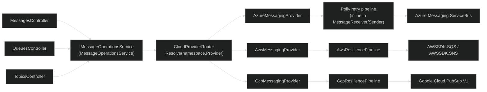
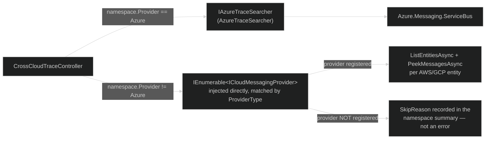
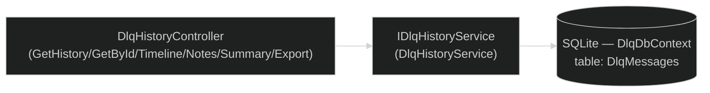
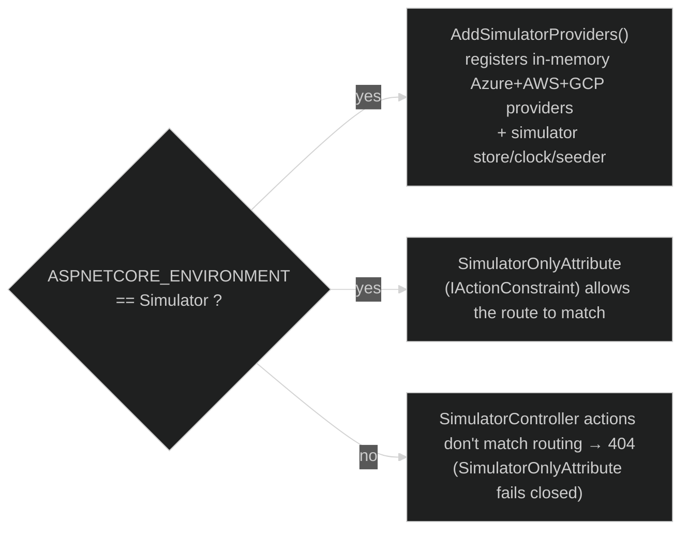
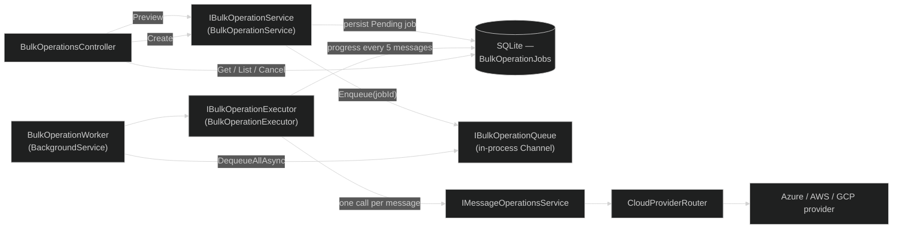
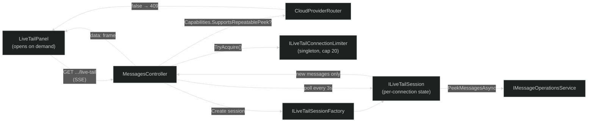
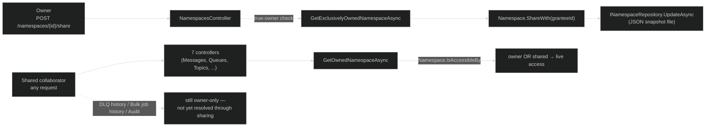

# ServiceHub — Current Request & Provider Flow

This document describes, as verified directly against source in this repository, how a request
gets from an API controller to a cloud provider's SDK today. It exists because the controllers
that touch cloud messaging do **not** all use the same path — this is the single place that spells
out exactly which ones do and which don't, so that doesn't have to be re-derived from the
codebase (or guessed from a diagram) every time.

Not every controller or background service is covered — only the ones that route to a cloud
provider, or that this doc's callers (CHANGELOG.md, docs/COMPREHENSIVE-GUIDE.md) link here for.

---

## The short version

| Component | Path to the cloud provider |
|---|---|
| `MessagesController`, `QueuesController`, `TopicsController` | → `IMessageOperationsService` → `CloudProviderRouter` → `ICloudMessagingProvider` |
| `CrossCloudTraceController` | → **its own dispatch**: Azure via `IAzureTraceSearcher`, non-Azure via a directly-injected `IEnumerable<ICloudMessagingProvider>` — **not** through `CloudProviderRouter` |
| `DlqHistoryController` | → `IDlqHistoryService` → SQLite (`DlqDbContext`) — **no cloud SDK call at all**, it only reads/writes locally persisted DLQ Intelligence history |
| `DlqMonitorWorker` (background) | → `DlqMonitorService.ScanNamespaceAsync` → `CloudProviderRouter.Resolve(namespace.Provider)` — provider-aware; a namespace is skipped (with a log line) only if its provider has no `ICloudMessagingProvider` registered on this server at all |
| `SimulatorController` | → in-memory simulator store, reachable only when `ASPNETCORE_ENVIRONMENT=Simulator` |

The rest of this doc walks through each row.

---

## 1. Messages / Queues / Topics — the unified path

- All three controllers depend on `IMessageOperationsService` only — no controller holds a
  per-provider `if (namespace.Provider == ...)` branch anymore. `CloudProviderRouter.Resolve()`
  throws `InvalidOperationException` if a provider isn't registered; `IsRegistered()` lets callers
  check first without triggering the exception.
- **Every provider retries transient errors the same way**: 3 attempts, exponential backoff
  (1s base, 30s cap), jitter enabled.
  - Azure: retry logic lives inline in `MessageReceiver`/`MessageSender` (`ServiceHub.Infrastructure/ServiceBus`).
  - AWS: `AwsResiliencePipeline.Create()` — retries `AmazonServiceException` when the SDK marks it
    retryable, or on 5xx/429.
  - GCP: `GcpResiliencePipeline.Create()` — retries `RpcException` for `Unavailable`,
    `DeadlineExceeded`, `Internal`, `ResourceExhausted`, `Aborted`.
- **Provider registration today**: `AddAzureProvider()` is always called from `Program.cs`.
  `AddAwsProvider()` / `AddGcpProvider()` are called when `CloudProviders:Aws:Enabled` /
  `CloudProviders:Gcp:Enabled` is set (both default `false` in `appsettings.json`); enabling a
  flag registers that provider's `ICloudMessagingProvider`, client factory, and connectivity
  health check. Simulator mode (`ASPNETCORE_ENVIRONMENT=Simulator`) registers all three via
  `AddSimulatorProviders()` regardless of the flags — still the recommended way to exercise the
  AWS/GCP code paths end-to-end without live credentials.

### Provider-specific behavior worth knowing

| Operation | Azure | AWS SQS/SNS | GCP Pub/Sub |
|---|---|---|---|
| Peek dead-letter messages | ✅ | ✅ | ✅ (via convention subscription `{name}-dlq`) |
| Manual dead-letter (move a message to DLQ on demand) | ✅ | ✅ (`MaxReceive` redrive) | ❌ — Pub/Sub dead-lettering is policy-driven via `MaxDeliveryAttempts`; `DeadLetterMessagesAsync` returns a `Validation` failure explaining this |
| Message count | ✅ | ✅ | Normalized to `Success(0)` — Pub/Sub has no direct count API; mirrors the "unsupported read" convention used by `GetScheduledMessagesAsync` |
| Purge (delete a single message by identity) | ❌ — no reliable single-message delete by sequence number | ✅ | ✅ |
| Scheduled messages (queryable/cancellable) | ✅ | ❌ — SQS only offers `DelaySeconds` (max 15 min) at send time | ❌ |

**As of Phase 3**, this table is also machine-readable: every `ICloudMessagingProvider` implementation
declares a `Capabilities` property (`ServiceHub.Core.Models.ProviderCapabilities`) with the same four
booleans plus a human-readable `Notes` explanation, and `GET /api/v1/cloud-bridge/capabilities` exposes
it to the frontend. This replaced two independent, hand-rolled per-feature capability maps that had
drifted apart (`ScheduledMessagesPage`'s local `SCHEDULING_UNSUPPORTED` map and
`MessageDetailPanel`'s inline `purgeSupported` boolean) with one shared `useProviderCapabilities()`
hook — see `ServiceHub.Core/Models/ProviderCapabilities.cs` and `docs/EXTENDING-PROVIDERS.md`.

---

## 2. Cross-Cloud Trace — a deliberately separate path

`CrossCloudTraceController` does **not** use `IMessageOperationsService` or `CloudProviderRouter`.
It resolves namespaces by provider itself and dispatches to two different code paths:

- **Azure namespaces** search in parallel (max 5 concurrent, 30s overall timeout) via
  `IAzureTraceSearcher` — extracted into its own service so the controller only orchestrates and
  aggregates results.
- **Non-Azure namespaces** are matched against the injected `IEnumerable<ICloudMessagingProvider>`
  by `ProviderType`. If no provider is registered for that type, the namespace is marked
  `WasSearched: false` with a human-readable `SkipReason` (e.g. `"AWS provider is not enabled on
  this server."`) rather than failing the whole trace or silently omitting the namespace.
- **Both paths now search dead-letter messages, not just active ones** (fixed in Phase 3). The
  non-Azure path previously only peeked active messages (`FromDeadLetter: false`), so a message
  found dead-lettered on AWS/GCP was silently invisible to a trace that found the same shape of
  message correctly on Azure (`IAzureTraceSearcher` always checked both). The non-Azure path now
  peeks the dead-letter queue too, gated on `entity.DeadLetterCount > 0` only when the resolved
  provider's `Capabilities.SupportsMessageCounts` is true (AWS) — GCP never populates that count
  (see §1's capability table), so its dead-letter peek always runs unconditionally rather than
  being silently skipped.

This means AWS/GCP node search in Cross-Cloud Trace is **fully implemented**, not a "coming later"
feature — it's gated purely on whether `AddAwsProvider()`/`AddGcpProvider()` are called for the
running instance (see §1). Enable Simulator mode, or register a provider, to see it work
end-to-end.

**Why this hasn't been unified with §1's router**: no functional reason found in source — it
predates the `IMessageOperationsService`/`CloudProviderRouter` introduction and was carried forward
as-is. Unifying it fully would also require `CloudEntity` to separate topic/subscription into
first-class parent/child fields instead of the current encoded `"topic/subscriptions/sub"` name
string, which `AzureTraceSearcher`'s dual active+DLQ walk relies on implicitly — left as the next
step rather than attempted in the same pass as the dead-letter parity fix above.

---

## 3. DLQ Intelligence — no cloud SDK involved

- Every method on `IDlqHistoryService` takes `ownerId` and filters on it — `GetHistoryAsync`,
  `GetByIdAsync`, `GetTimelineAsync`, `UpdateNotesAsync`, `GetSummaryAsync`, `ExportAsync`. A caller
  can only see or modify DLQ Intelligence records for their own owner ID; a different owner's
  message ID returns `NotFound`, not the record.
- `DlqMessage` (the row persisted per dead-lettered message) has a `CloudProvider` column
  (`CloudProviderType`, defaults to `Azure` for rows written before the column existed). It's
  populated by whichever background process detected the dead-letter — `DlqMonitorWorker`, which
  scans every registered provider (see §4), so rows are attributed to the namespace's real
  provider (`Azure`/`Aws`/`Gcp`), not defaulted.
- This whole path never calls a cloud SDK — it's a read/write against the local SQLite database
  only. `DlqMonitorWorker` is what populates that database in the first place.

---

## 4. Background DLQ monitoring — provider-aware

`DlqMonitorWorker` polls active namespaces on an interval, scans each for newly dead-lettered
messages, and persists findings via `DlqHistoryService`/`DlqDbContext`. `DlqMonitorService.ScanNamespaceAsync`
resolves the namespace's provider through `CloudProviderRouter` — the same router `IMessageOperationsService`
uses in §1 — rather than hardcoding Azure:

- A namespace is skipped up front (not attempted-then-failed) only if `CloudProviderRouter.IsRegistered`
  returns false for its provider (e.g. the `CloudProviders:Aws:Enabled` / `:Gcp:Enabled` flags are off
  on this server) — with a log line noting why.
- **Capability-driven short-circuit (Phase 3):** an entity is skipped without a peek when
  `entity.DeadLetterCount == 0` **and** the resolved provider's `Capabilities.SupportsMessageCounts`
  is true — true for both Azure and AWS (`AwsMessagingProvider.ListEntitiesAsync` reliably
  populates `DeadLetterCount` via the redrive-target queue's live count), false for GCP (Pub/Sub
  has no count API, so `CloudEntity.DeadLetterCount` is never populated and the scan always peeks
  unconditionally). Before Phase 3 this was hardcoded to `provider == Azure`, which meant AWS was
  always peeked even when its (accurate) reported count was zero — a real inefficiency, not just
  duplicated logic; fixed using the same `ProviderCapabilities` model the cross-cloud-trace
  dead-letter parity fix (§2) uses.
- GCP additionally resolves its dead-letter subscription dynamically from the source
  subscription's `DeadLetterPolicy` — there's no fixed naming convention for it in real Pub/Sub.
- This means DLQ Intelligence (§3), 30-day trend, and Auto-Replay Rules all operate on real-time
  Azure **and** AWS/GCP dead-letter data whenever those providers are registered — not Azure only.

---

## 5. Simulator mode — environment-gated, not just hidden

Two independent layers both have to agree for Simulator endpoints to work, which is why this is
described as defense-in-depth rather than a single check:

1. **DI registration** (`Program.cs`): `AddSimulatorProviders()` is only called when
   `builder.Environment.IsEnvironment("Simulator")`. Outside that environment, the services
   `SimulatorController` depends on aren't registered at all.
2. **Routing** (`SimulatorOnlyAttribute`): an `IActionConstraint` on `SimulatorController` that
   only accepts the action when `IWebHostEnvironment.IsEnvironment("Simulator")` — if the check
   fails, or the environment service can't be resolved, the action doesn't match and ASP.NET Core
   returns a plain 404, not a 403 (so the existence of Simulator-only routes isn't even
   distinguishable from "route doesn't exist" in Production).

---

## 6. Rate limiting — owner-scoped, not IP-scoped

`RateLimitingMiddleware` keys its bucket on the authenticated `OwnerId` (from `HttpContext.Items`,
populated by the auth middleware earlier in the pipeline) when one is present — `"owner:{id}"` —
and falls back to the remote IP address — `"ip:{addr}"` — only for unauthenticated requests.
`X-Forwarded-For` is never trusted for this, since it's trivially spoofable by the client. This
matters behind a reverse proxy (e.g. Azure App Service): without owner-keying, every request would
present the same proxy IP and all tenants would share one bucket. Default limit: 300 requests/min
(`RateLimit:MaxRequests`, `RateLimit:WindowDuration` in `appsettings.json`).

---

## 7. Bulk Operations — a durable job, not a request/response cycle

"Replay/purge these 3,000 messages matching this filter" was explicitly deferred out of Phase 2
pending "a durable job/operation abstraction + safety rails" (`docs-private/technical-review/21-
PHASE2-IMPLEMENTATION-PLAN.md`) — a single HTTP request can't safely process an unbounded batch
(the existing `RulesController.ReplayAll` hits exactly this limit today: a hard-coded 30-second
`CancellationTokenSource`, no progress reporting, no cancellation). Bulk Operations solves this
with a persisted job row polled to completion instead of one long-lived request.

- **Provider-neutral by construction**: `BulkOperationExecutor` calls `IMessageOperationsService
  .ReplayMessageAsync`/`PurgeMessageAsync` once per matched message — the exact same
  provider-agnostic facade `MessagesController`'s single-message replay/purge already uses (§1).
  No Azure/AWS/GCP-specific code exists in the bulk-operations layer at all; this is a deliberate
  improvement over `RulesController.ReplayAll`, which is Azure-only (it calls
  `IServiceBusClientCache` directly).
- **In-process, not distributed**: `IBulkOperationQueue` is a singleton in-memory `Channel<Guid>`
  plus a `CancellationTokenSource` registry for live cancellation — consistent with ServiceHub's
  current single-instance architecture (SQLite, in-process `IPlatformEventBus`). Job durability
  comes from the persisted `BulkOperationJob` row, not the queue: if the process restarts with a
  job still `Running`, `BulkOperationWorker` marks it `Failed` ("interrupted by a restart") at
  startup rather than silently losing or double-processing it; `Pending` jobs (never started) are
  simply re-enqueued.
- **Capability-gated up front, not per message**: `SupportsPurge` etc. is a fact about the
  namespace's provider as a whole (`ProviderCapabilities`, `docs/EXTENDING-PROVIDERS.md`), so it's
  checked once at preview/creation time — a whole job is rejected with an explanatory warning
  rather than silently skipping a subset of messages.
- **Progress is polling, not SSE**: `GET /api/v1/bulk-operations/{id}` is the source of truth,
  polled by the frontend every ~1.5s while the job is active. The platform event bus (used
  elsewhere for DLQ spike alerts, §4) deliberately strips `Payload` from its SSE wire format
  (`EventStreamItem`) and uses drop-oldest buffers — adequate for "something changed, go refetch"
  hints, not for precise `processed/total` counts, so it isn't used here.
- **Safety rails match single-message replay/purge exactly**: same production-namespace block,
  same `Send`-permission check for replay, same `X-ServiceHub-Intent`/`X-ServiceHub-Confirm`
  explicit-intent headers (`bulk:replay`/`bulk:purge`) before a job can be created.

---

## 8. Live Tail — an on-demand poll loop, not a background worker

`MessagesPage` already had a 7-second auto-refresh poll, but it's a full re-fetch (resets
pagination, no incremental "just arrived" feed) and — critically — is disabled outright for AWS
namespaces, because SQS's peek is a real receive that increments `ReceiveCount`. Live Tail is a
genuinely different capability: a `tail -f`-style incremental stream, scoped to one queue or
subscription, that only runs while a user has explicitly opened it.

- **On-demand and connection-scoped, not a background worker**: this replaced
  `MessagePollingWorker`, a `BackgroundService` stub that had been registered and running on a 30s
  timer since an earlier phase without doing anything (`services/api/src/ServiceHub.Infrastructure
  /BackgroundServices/` — since removed). A global always-on scan of every namespace's every queue
  was the wrong shape for this feature: expensive against real cloud APIs, and the previous
  `DlqMonitorWorker` (§4) already owns the "continuously scan everything" background pattern for a
  different purpose (DLQ detection). Live Tail's `ILiveTailSession` instead lives only for the
  duration of one SSE connection — state (which messages have been seen) is held in memory per
  session and discarded when the connection closes; nothing is persisted.
- **Capability-gated, not provider-conditional**: `ProviderCapabilities.SupportsRepeatablePeek`
  (`docs/EXTENDING-PROVIDERS.md`) is `true` for Azure and GCP (whose peek implementations are
  genuinely non-destructive or re-queuing) and `false` for AWS — checked once via
  `CloudProviderRouter.Resolve(...).Capabilities`, the same pattern §7 uses for `SupportsPurge`.
  The endpoint returns `409` rather than silently starting a session that would risk dead-lettering
  a customer's messages.
- **Dedup by `MessageId`, not sequence number**: unlike the DLQ monitor (§4), which uses Azure's
  stable sequence number as a dedup key and falls back to `MessageId` for AWS/GCP,
  `LiveTailSession` always dedups on `MessageId` — simpler, and safe across all three providers
  since sequence-number stability is provider-specific while `MessageId` is a peek-time constant
  everywhere.
- **No auto-reconnect on the client**: unlike the platform event stream (§4's SSE consumer,
  `useEventStream`), `connectLiveTail` does not retry after a drop — Live Tail is an explicit,
  opt-in viewing session, and silently reconnecting in the background after the user has moved on
  would keep polling a cloud provider with no one watching. A session also self-expires after 30
  minutes server-side as a backstop against a forgotten open browser tab.

---

## 9. Namespace sharing — one leverage point, one deliberate boundary (Preview)

Before this, `Namespace.OwnerId` was a single immutable string — two engineers (even two distinct
OIDC identities, §"OIDC Bearer authentication" in the CHANGELOG) could not both operate on the
same namespace without literally sharing credentials.

- **One field, one high-leverage check point, not a Team/Group domain concept**: `Namespace`
  gained `SharedWithOwnerIds` (mutable, unlike the immutable `OwnerId`) and `IsAccessibleBy(caller)`.
  `ApiControllerBase.GetOwnedNamespaceAsync` — already the single path 7 controllers and 23 call
  sites used for "does this caller own this namespace" — now calls `IsAccessibleBy` instead of an
  exact `OwnerId` match, so sharing propagates to every one of those call sites (Messages, Queues,
  Topics, Subscriptions, Anomalies, CloudBridge, Namespaces) with one change, not 23.
- **A second, stricter check point for privilege-sensitive actions**: `GetExclusivelyOwnedNamespaceAsync`
  (true owner only, no shared-access bypass) gates namespace delete, share, and revoke — a shared
  collaborator gets full live operational access but can never re-share, revoke someone else's
  access, or delete the namespace out from under its owner.
- **Deliberately not centralized further, on purpose**: ownership enforcement in this codebase is
  not actually one pattern — `RulesController` and `BulkOperationService` (Infrastructure layer)
  each reimplement their own raw `OwnerId` equality check independently of `GetOwnedNamespaceAsync`,
  and `DlqHistoryService`, `AuditLog`, and `BulkOperationJob` all stamp whichever owner performed
  an action onto the record at write time rather than resolving it dynamically through the
  namespace. Retrofitting all of that to resolve through `IsAccessibleBy` — so a shared
  collaborator also sees historical DLQ Intelligence records, past bulk job runs, and audit trail
  entries another owner created — is a real, separate, multi-service consistency project (a research
  pass identified at least 4 distinct enforcement patterns and 4 owner-stamped entity types before
  this feature shipped). Shipping that alongside the live-access change risked an inconsistent,
  partially-working feature; it's tracked as explicit future work instead — see the CHANGELOG
  entry's "Known limitation" note.
- **No DB migration needed**: `Namespace` persists as a full-snapshot JSON file
  (`servicehub-namespaces.json`), not a SQLite table — adding `SharedWithOwnerIds` is a plain
  additive field; `System.Text.Json` deserializes older files (missing the key entirely) with the
  C# default (`null`), normalized to an empty list on rehydration. This is why this feature could
  ship safely in the time other identity-stamped-entity retrofits (DLQ, Bulk Ops, Audit) could not.

---

## Sources checked for this document

`MessagesController.cs`, `QueuesController.cs`, `TopicsController.cs`, `CrossCloudTraceController.cs`,
`DlqHistoryController.cs`, `MessageOperationsService.cs`, `CloudProviderRouter.cs`,
`ICloudMessagingProvider.cs`, `AzureTraceSearcher.cs`/`IAzureTraceSearcher.cs`,
`GcpMessageReceiver.cs`, `AwsMessageReceiver.cs`, `AwsResiliencePipeline.cs`, `GcpResiliencePipeline.cs`,
`DlqMonitorWorker.cs`, `DlqHistoryService.cs`, `IDlqHistoryService.cs`, `DlqMessage.cs`,
`SimulatorOnlyAttribute.cs`, `SimulatorController.cs`, `Program.cs`, `RateLimitingMiddleware.cs`,
`appsettings.json` — all read directly in the session that produced this document (2026-07-07).
If behavior here looks wrong, re-check these files rather than assuming this doc is still current.

**§3/§4 updated 2026-07-20**: `DlqMonitorService.cs` re-read directly against a live 3-cloud
session (Azure + AWS + GCP simultaneously connected and dead-lettering) — confirmed
`ScanNamespaceAsync` resolves the namespace's actual provider via `CloudProviderRouter` rather
than hardcoding Azure, contradicting the original 2026-07-07 text this doc shipped with.

**§7 added 2026-07-21**: `BulkOperationsController.cs`, `BulkOperationService.cs`,
`BulkOperationExecutor.cs`, `BulkOperationWorker.cs`, `BulkOperationQueue.cs`,
`BulkOperationMatching.cs`, `IBulkOperationService.cs`, `IBulkOperationExecutor.cs`,
`IBulkOperationQueue.cs`, `RulesController.cs` (`ReplayAll`) — verified live end-to-end against
Simulator-mode Azure/AWS/GCP namespaces in a running Docker container (preview, create, poll to
completion, list, idempotent cancel).

**§8 added 2026-07-21**: `MessagesController.cs` (`LiveTail` action), `LiveTailSession.cs`,
`LiveTailSessionFactory.cs`, `LiveTailConnectionLimiter.cs`, `ILiveTailSession.cs`,
`ILiveTailConnectionLimiter.cs`, `ProviderCapabilities.cs` — verified live against a running
Docker container in Simulator mode: Azure and GCP streams open and emit heartbeats, AWS returns
409, and a message sent mid-session via `POST .../queues/orders/messages` appeared as a `data:`
frame within one poll cycle.

**2026-07-21, architecture hardening**: `QueuesController`, `TopicsController`,
`SubscriptionsController`, and `MessagesController` now depend on the new
`ServiceHub.Core.Interfaces.ICloudProviderRouter` instead of the concrete
`ServiceHub.Infrastructure.Routing.CloudProviderRouter` shown in the diagrams above (§1, §7, §8)
— the diagrams' *behavior* is unchanged (same singleton router instance, same
`Resolve`/`IsRegistered` calls), only the compile-time dependency direction at the Api/Infrastructure
boundary changed. See `docs/EXTENDING-PROVIDERS.md` and `tests/ServiceHub.UnitTests/Architecture/ApiLayerBoundaryTests.cs`.

**§9 added 2026-07-21**: `Namespace.cs` (`SharedWithOwnerIds`, `ShareWith`, `RevokeShare`,
`IsAccessibleBy`), `InMemoryNamespaceRepository.cs`, `ApiControllerBase.cs`
(`GetExclusivelyOwnedNamespaceAsync`), `NamespacesController.cs` (`Share`, `RevokeShare`),
`MeController.cs` — verified live against a running Docker container in Simulator mode with two
distinct scoped API keys (real cross-identity isolation, not just mocked): the owner key shared a
namespace with the second key's derived owner ID, and only after that grant could the second key
successfully peek/browse it — before the grant it got the same 404 any unrelated caller gets.
