# The Complete ServiceHub Guide

**Every page. Every button. Why it exists. Screenshots from a live, running instance connected
to real Azure, AWS, and GCP infrastructure.**

**ServiceHub** is a self-hosted, open-source forensic debugger for cloud message queues — Azure
Service Bus (GA), AWS SQS/SNS and GCP Pub/Sub (Supported) — giving full message bodies, real-time
search, AI-assisted dead-letter pattern detection, one-click replay, and a tamper-evident record
of every recovery decision, all running in a single process you control. This is the single,
definitive, end-to-end reference for it — written so a complete
novice can go from "what is this?" to confidently operating it, while still being useful as a
lookup reference for an experienced operator who just wants to know what one specific button
does. If you read nothing else, read [Why ServiceHub?](#why-servicehub) and
[Core Concepts](#core-concepts-the-vocabulary-you-need) — everything after that will make more
sense.

> [!NOTE]
> Every screenshot in this document was taken against a real, currently-running ServiceHub
> instance with three live cloud connections open at the same time — an Azure Service Bus
> namespace, an AWS SQS/SNS account, and a GCP Pub/Sub project — so the numbers, message bodies,
> and failure patterns you see are genuine, not staged. Numbers will differ by the time you read
> this (dead-letter counts change by the minute); what won't differ is what each screen, button,
> and badge *means*.

**In this article:** why ServiceHub exists and who it's for; the vocabulary every other section
assumes you know; connecting your first namespace; the shared page layout; a complete,
screenshotted reference for every destination in the product (organized by workflow stage, with
an Azure/AWS/GCP applicability line on every entry that differs by provider); a one-table summary
of what differs across clouds; the autonomy and security models in plain language; a short
history; and a troubleshooting FAQ.

### Prerequisites

- A running ServiceHub instance — self-hosted, either from a Docker image or built from source.
  See `LOCAL-DEPLOYMENT.md` if you don't have one yet.
- At least one connected namespace to follow along with (Azure Service Bus, AWS SQS/SNS, or GCP
  Pub/Sub) — or none at all: every Connect page has a one-click **Demo Mode** per cloud that needs
  no credentials (see [Getting Started](#getting-started-connecting-your-first-namespace)).
- No prior ServiceHub knowledge assumed. Cloud-messaging vocabulary (queue, topic, dead-letter)
  is covered from first principles in [Core Concepts](#core-concepts-the-vocabulary-you-need).

---

## Table of Contents

- [The Complete ServiceHub Guide](#the-complete-servicehub-guide)
  - [Table of Contents](#table-of-contents)
  - [Why ServiceHub?](#why-servicehub)
    - [Who is this for?](#who-is-this-for)
    - [What makes it different from the cloud portal?](#what-makes-it-different-from-the-cloud-portal)
    - [The one sentence that matters](#the-one-sentence-that-matters)
  - [Core Concepts — the vocabulary you need](#core-concepts--the-vocabulary-you-need)
  - [Getting Started: Connecting Your First Namespace](#getting-started-connecting-your-first-namespace)
  - [The ServiceHub Layout](#the-servicehub-layout)
  - [Complete Page Reference](#complete-page-reference)
    - [Overview](#overview)
      - [Home](#home)
      - [Namespace Overview](#namespace-overview)
      - [Incident Center](#incident-center)
      - [Fleet Health](#fleet-health)
    - [Browse across clouds](#browse-across-clouds)
      - [Active Messages / Dead-Letter](#active-messages--dead-letter)
      - [Live Tail](#live-tail)
      - [Scheduled Messages](#scheduled-messages)
      - [Cloud Bridge](#cloud-bridge)
      - [Connect](#connect)
      - [Messages (drill-down)](#messages-drill-down)
    - [Diagnose \& automate](#diagnose--automate)
      - [DLQ Intelligence](#dlq-intelligence)
      - [Auto-Replay Rules](#auto-replay-rules)
      - [Approval Queue](#approval-queue)
      - [Proactive Insights](#proactive-insights)
      - [Multi-Cloud Trace](#multi-cloud-trace)
      - [Failure Signatures](#failure-signatures)
    - [Advanced ServiceHub](#advanced-servicehub)
      - [Autonomy](#autonomy)
      - [Recovery Evidence](#recovery-evidence)
      - [Playbook Ledger](#playbook-ledger)
      - [Governance](#governance)
    - [Platform](#platform)
      - [System Health](#system-health)
      - [Audit Trail](#audit-trail)
      - [Security \& Privacy](#security--privacy)
    - [Learn ServiceHub](#learn-servicehub)
      - [Advanced ServiceHub (education page)](#advanced-servicehub-education-page)
    - [Support](#support)
      - [Help \& Guide](#help--guide)
  - [Multi-Cloud Support At A Glance](#multi-cloud-support-at-a-glance)
  - [The Autonomy Model, In Plain Language](#the-autonomy-model-in-plain-language)
  - [Security \& Privacy Model](#security--privacy-model)
  - [From The Beginning: How ServiceHub Got Here](#from-the-beginning-how-servicehub-got-here)
  - [FAQ \& Troubleshooting](#faq--troubleshooting)
  - [Where To Go Next](#where-to-go-next)

---

## Why ServiceHub?

Imagine it's 2 AM. A pager goes off. Your cloud provider's console tells you **"5,000 messages
in the dead-letter queue."** That's it — that's all it tells you. To find out *why* those
messages failed, you'd normally have to write a throwaway script, page through raw JSON blobs
one at a time, and manually correlate errors by eye. By the time you've found the pattern, the
sun is coming up.

**ServiceHub exists to close that gap.** It is a self-hosted, open-source *forensic debugger*
for cloud message queues — Azure Service Bus, AWS SQS/SNS, and GCP Pub/Sub. Point it at your
namespace and it gives you what the cloud console never will:

- **Full message bodies**, not just counts — searchable, syntax-highlighted, side-by-side.
- **AI-assisted pattern detection** that clusters thousands of dead-lettered messages into a
  handful of named failure signatures — entirely client-side, so no message content ever leaves
  your network.
- **One-click replay** (or fully automatic replay, gated by rules you control) to put a message
  back to work instead of leaving it to rot.
- **A permanent, tamper-evident record** of every recovery decision ServiceHub ever made — so
  six months from now, you can prove exactly what happened, not just remember it.
- **One pane of glass across three clouds.** If your organization runs Azure in one place, AWS in
  another, and GCP somewhere else, ServiceHub is the one tool that understands all three well
  enough to be honest about where they differ.

### Who is this for?

- **The on-call engineer** who needs to understand a 2 AM dead-letter spike in minutes, not
  hours.
- **The platform team** standardizing how every service in the org handles poison messages.
- **The security-conscious operator** who cannot send message content to a third-party SaaS —
  ServiceHub runs entirely in infrastructure you control, and its AI analysis runs in your
  browser.
- **Anyone new to cloud messaging** who wants one tool that explains itself as you use it,
  instead of assuming you already know what a "dead-letter queue" or "redrive policy" means.

### What makes it different from the cloud portal?

| Capability | Azure/AWS/GCP Portal | ServiceHub |
|---|---|---|
| View a message's full body | Count only, or one message at a time | Full body, syntax-highlighted, at scale |
| Search across message content | Not available | Real-time full-text search |
| Detect recurring failure patterns | Not available | Client-side AI clustering, zero data sent anywhere |
| Replay a dead-lettered message | Not available (Azure/GCP) | One click, or fully automatic via rules |
| Prove what happened later | Not available | Tamper-evident, hash-chained ledger |
| See all three clouds together | Not available | One screen, one mental model |

### The one sentence that matters

> **Your cloud console shows you counts. ServiceHub shows you answers — and then proves what it
> did about them.**

---

## Core Concepts — the vocabulary you need

If you're new to cloud messaging, read this section before anything else. Every page in
ServiceHub assumes you know these terms.

- **Queue** — an ordered (or approximately ordered) holding area for messages waiting to be
  processed by a consumer. Azure Service Bus and AWS SQS both have queues; GCP Pub/Sub does not
  — it has topics and subscriptions instead (see below). This is the single biggest structural
  difference between the three clouds, and it shows up throughout this guide.
- **Topic / Subscription** — a topic is a single stream a message is published to once; a
  subscription is one of potentially many independent "copies" of that stream, each consumed
  separately. Azure and AWS (SNS) both support topics-with-subscriptions as a fan-out mechanism
  on top of queues; GCP Pub/Sub uses topics and subscriptions as its *only* primitive — there is
  no separate "queue" concept on GCP at all.
- **Dead-Letter Queue (DLQ)** — where a message goes after it fails processing too many times (or
  is rejected outright). This is where ServiceHub spends most of its time: investigating why
  messages ended up here, and deciding what to do about them.
- **Namespace** — ServiceHub's word for one connected cloud account/resource group: an Azure
  Service Bus namespace, an AWS account/region pair, or a GCP project. You can connect several at
  once, across all three clouds, and ServiceHub treats them as peers in the same UI.
- **Replay** — taking a message that's stuck in the DLQ and sending it back to be processed
  again, exactly as if it had never failed.
- **Purge** — permanently deleting a single dead-lettered message (supported on AWS and GCP; the
  Azure SDK itself has no single-message delete operation, which is a provider limitation, not a
  ServiceHub one).
- **Failure Signature** — ServiceHub's name for a *repeated pattern* of failure, not a single
  message. Instead of showing you the same error 300 times, it shows you one signature ("324
  messages, same root cause") so you fix the pattern once.
- **Recovery Evidence Ledger** — a permanent, append-only, hash-chained record of every replay and
  purge ServiceHub has ever executed, plus what was independently observed to happen afterward.
  This is what lets you *prove* a recovery happened, rather than just remembering that it did.
- **Playbook Ledger** — the record of every *proposal* ServiceHub's detection workers have ever
  made (an anomaly worth reviewing, a correlation across namespaces, a drift finding) and what a
  human decided about it. A Playbook entry never authorizes an action by itself — it's a
  recommendation a person disposes of.
- **Autonomy Level** — how much a specific kind of recovery action (per failure signature) has
  *earned* the right to run unattended, based on a track record of verified outcomes. Nothing in
  ServiceHub lets a human simply flip a switch to "turn on autonomy" — see
  [The Autonomy Model](#the-autonomy-model-in-plain-language).
- **Demo Mode** — a fully client-side walkthrough (no backend, no cloud credentials) reachable
  from the Connect page's "Try a live demo" buttons, one per cloud. Useful for exploring the UI
  before you've connected anything real.

---

## Getting Started: Connecting Your First Namespace

Every session starts at **Connect** (`/connect`) — the page that manages every namespace
ServiceHub knows about.

This instance already has three real, live connections open side by side — one per cloud — which
is exactly the point: ServiceHub doesn't pick a favorite cloud.

- **1 — Open.** Switches your active view to that namespace and takes you into the message
  browser. This is the fastest way back into a namespace you've already connected.
- **2 — Connect another namespace.** Expands the connection form (below) to add a new one.
- **3 — "No credentials? Try Demo Mode first."** Three buttons, one per cloud, that open a fully
  client-side walkthrough with realistic seeded data — no backend call, no real credential
  needed. This is the safe way to explore ServiceHub before pointing it at anything real.
- **4 — Single-instance storage notice.** An honest warning, not a hidden gotcha: namespace
  connections are stored on the machine running ServiceHub. If you run multiple instances behind
  a load balancer, each instance has its own connection list unless you configure sticky sessions
  or shared storage.

Clicking **Connect another namespace** expands the full form:

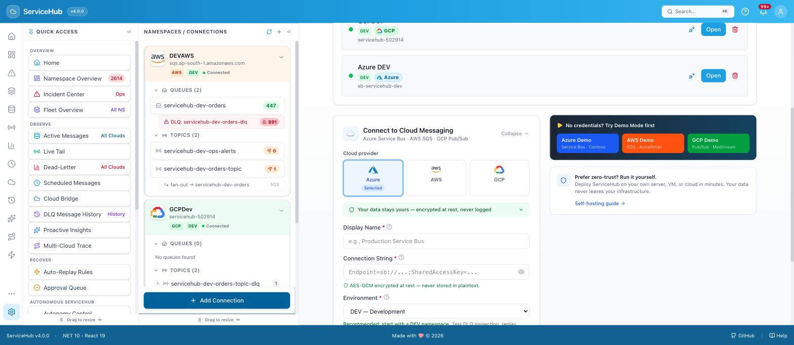

- **1 — Cloud provider.** Pick Azure, AWS, or GCP. The rest of the form adapts: Azure asks for a
  Service Bus connection string, AWS asks for an access key pair plus region, GCP asks for a
  service account (or workload identity).
- **2 — Display Name.** A friendly label — this is what shows up everywhere else in the UI (the
  sidebar, the dashboard, the audit trail), not the raw cloud-side namespace name.
- **3 — Connection String / credentials.** Never stored in plaintext — see
  [Security & Privacy](#security--privacy-model).
- **4 — Environment.** Dev / UAT / Prod. This single field is the safety switch behind almost
  every destructive-action guard in ServiceHub: replay, send, and purge are all blocked outright
  on anything marked Production, everywhere in the product, not just in this form.
- **5 — Encryption notice.** A plain-language reminder, right where you're about to paste a
  secret, that it's encrypted (AES-GCM-256) the moment it reaches the server and the plaintext is
  never returned to the browser.

**Practical tip:** start with a **Dev** namespace, even a throwaway one. Most of ServiceHub's
more interesting behavior (replay, purge, auto-replay rules) is designed to be exercised safely
against a non-production namespace first.

---

## The ServiceHub Layout

Every page in ServiceHub shares the same three-part chrome, visible in nearly every screenshot
in this guide:

1. **Quick Access** (far left) — the fastest way to any destination in the product, grouped by
   workflow stage: *Overview → Browse across clouds → Diagnose & automate → Advanced ServiceHub →
   Platform → Learn ServiceHub → Support*. This is the same grouping this guide's
   [Page Reference](#complete-page-reference) follows, on purpose.
2. **Namespaces / Connections** (next to Quick Access) — a live tree of every connected
   namespace, its queues, topics, and subscriptions, with real-time active/dead-letter counts.
   Click any entity here to jump straight into its messages. This panel is collapsible (the
   **«** icon) and resizable (drag its right edge) — collapsing it frees up significant width for
   message detail views.
3. **Workspace** (everything to the right) — the actual page content, with a Back/Forward
   navigation strip at the top that works like a browser's, but scoped to ServiceHub's own
   destinations.

A command palette (**⌘K** / **Ctrl+K**) is reachable from anywhere and can jump to any
destination in the product by typing a few letters of what you're looking for.

---

## Complete Page Reference

Every destination below is organized exactly the way the product organizes itself in Quick
Access, so this section doubles as a map of the sidebar. Each entry answers three questions:
**what is this page**, **why does it exist**, and **what does every button on it do** — with a
real screenshot, captured fresh for this guide.

### Overview

#### Home

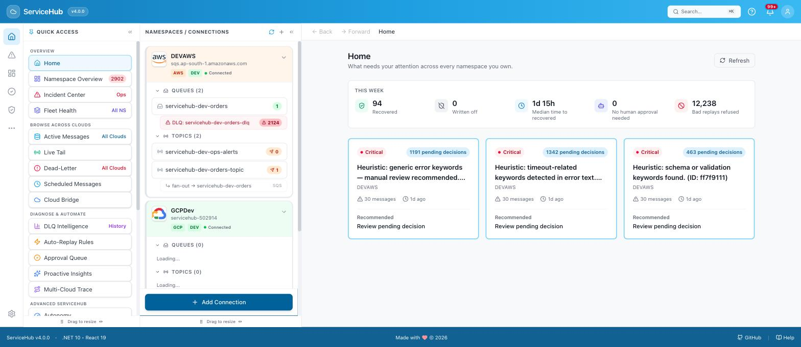

- **What is it?** The landing page. A ranked "what needs you right now" queue — at most three
  cards, across *every* namespace you own, ordered by severity, blast radius, recurrence, and
  whether a human decision is actively blocking progress.
- **Why does it exist?** Because "check every namespace one by one" doesn't scale past two or
  three connections. Home answers "where should I look first?" in one glance, without you having
  to know which namespace is on fire.
- **The buttons:**
  - **Refresh** (marked **1**) — re-pulls the attention queue on demand; it also spins while
    fetching.
  - Each **card** is itself a button — clicking one takes you straight to that failure's
    [Incident Center](#incident-center) detail view, with the right namespace pre-selected.
  - The **severity badge** (Critical/Warning/Healthy) and the **pending-decisions badge**
    (marked **5** in the screenshot above, "Recommended: Review pending decision") tell you at a
    glance whether this needs a human right now or is just informational.
- **When it's empty:** a calm "Everything looks healthy" state — Home never invents urgency that
  isn't there.

#### Namespace Overview

**Applies to:** Azure ✅ · AWS ✅ · GCP ⚠️ (a namespace with no live count available shows that
honestly rather than as zero — see the multi-cloud note below)

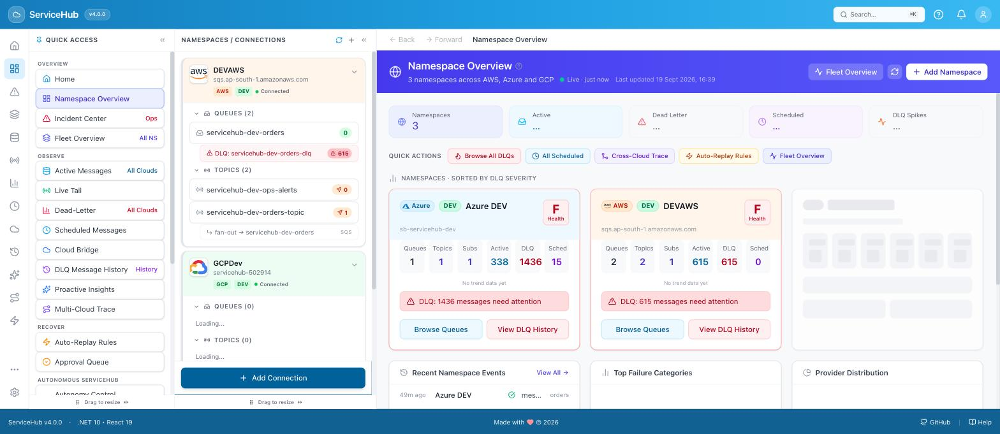

- **What is it?** The classic multi-namespace dashboard — every connected namespace as a card,
  side by side, regardless of which cloud it's on. This screenshot shows three real, live
  connections (one per cloud) at once, exactly the point of the page.
- **Why does it exist?** It's the fastest way to answer "which of my namespaces is unhealthy
  right now, and how badly?" — an **F health grade** and a live dead-letter count are visible on
  every card without clicking into any of them.
- **The buttons:**
  - **Quick Actions row** — Browse All DLQs, All Scheduled, Cross-Cloud Trace, Auto-Replay Rules,
    Fleet Health: one-click jumps to the corresponding destination, scoped fleet-wide rather than
    to one namespace.
  - **DLQ Hot Spots** — a ranked list of the worst-affected namespaces with a **View** button per
    row, jumping straight into that namespace's dead-letter view.
  - Each **namespace card** shows Queues / Topics / Subs / Active / DLQ / Scheduled counts and its
    own health grade; clicking the card (or its "Browse Queues" affordance) opens that namespace's
    first non-empty queue directly — not a blank "no entity selected" screen.
- **Multi-cloud note:** a namespace with genuinely no live count available (some GCP configurations,
  for instance) is shown honestly as "unavailable," never silently rendered as zero.

#### Incident Center

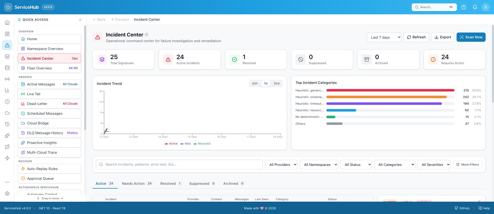

- **What is it?** The operational command center for failure investigation. Where
  [Home](#home) shows you three cards, Incident Center shows the *entire* picture: every failure
  signature across every namespace, bucketed by lifecycle state.
- **Why does it exist?** It's the "war room" view — the place you go when something is actually
  on fire and you need the full picture, not a triaged summary.
- **The buttons:**
  - **Refresh** — re-pulls the fleet-wide rollup.
  - The six stat tiles (**Total Signatures / Active / Resolved / Suppressed / Archived / Requires
    Action**) are live counts, not estimates.
  - **Fleet Health** section — one row per namespace, each showing its top failure category and
    a real-time active-message-affected count, with an **Open Namespace** link.
  - **View all fleet health →** jumps to the dedicated [Fleet Health](#fleet-health) page for the
    deeper trend view.

Clicking into any specific failure opens its **Incident Workspace** — a durable, bookmarkable URL
per signature with four tabs:

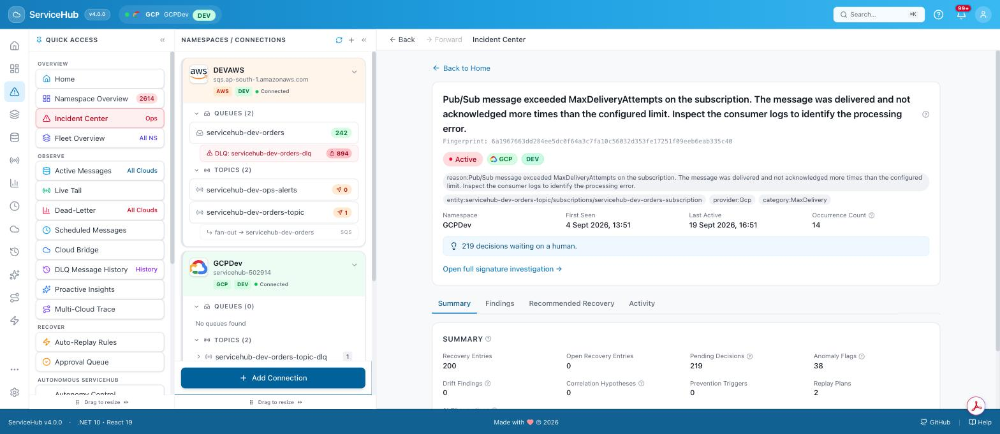

- **Summary** (shown above) — recovery-entry counts, open/pending decisions, anomaly flags, and
  drift findings for this one signature, all sourced live from the underlying ledgers — nothing
  here is a separate copy of the data that could drift out of sync.
- **Evidence, Recommended Recovery, Activity** — deeper tabs covering the technical evidence
  behind the classification, what ServiceHub suggests doing about it, and the full timeline.
- **Open full signature investigation →** jumps to the full [Failure Signatures](#failure-signatures)
  detail page for this exact signature, which has additional controls (Mark Resolved, Suppress,
  Replay Signature) that this summary view deliberately doesn't duplicate.
- **View Recovery Ledger / View Playbook Ledger** — direct links into the underlying evidence,
  so nothing on this page asks you to simply trust a summary number.

#### Fleet Health

**Applies to:** Azure ✅ · AWS ✅ · GCP ⚠️ (connected and filterable, but see the "Not monitored"
note below)

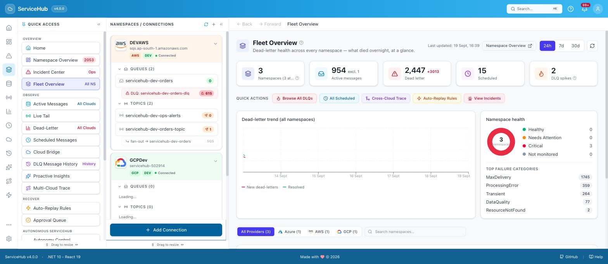

The **Provider filter tabs** narrow the same page to one cloud at a time — each filtered view is
its own real, live screenshot, not a mockup of what the filter "would" show:

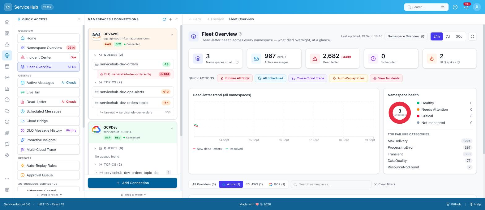

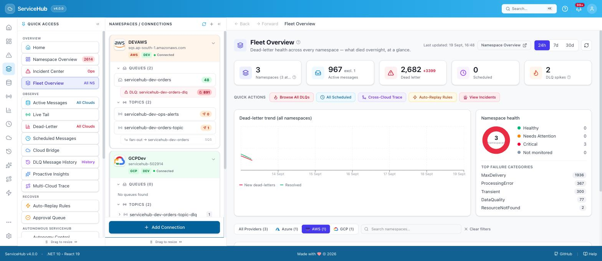

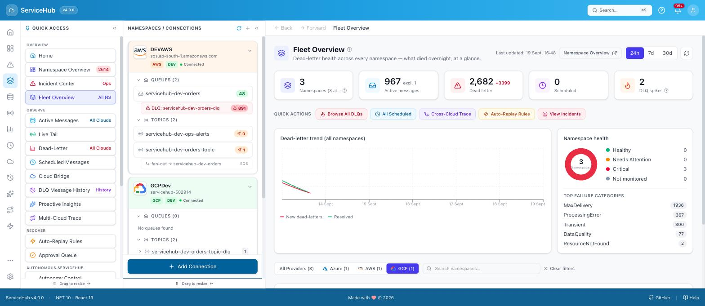

- **What is it?** "What died overnight, across everything" — the fleet-wide DLQ health rollup,
  built for a daily or post-incident review rather than moment-to-moment monitoring.
- **Why does it exist?** Individually, a namespace's DLQ count doesn't tell you if today was
  worse than yesterday. Fleet Health adds the missing dimension: trend, over a selectable window
  (24h / 3d / 7d), across every namespace and every provider at once.
- **The buttons:**
  - **Per-namespace details ↗** — opens the full drill-down for whichever namespace you're
    looking at.
  - **24h / 3d / 7d** — the time window every stat and the trend chart below reflect.
  - **Provider filter tabs** (All providers / Azure / AWS / GCP) plus a namespace search box —
    narrows the worst-first table without leaving the page.
  - **Top failure categories** — a ranked list (e.g. MaxDelivery, ProcessingError, Transient)
    showing exactly what's driving the fleet's failures right now, fleet-wide, not per namespace.
  - The **worst-first table** sorts every namespace by DLQ severity, with Queues/Topics/Subs/
    Active/DLQ/New/Resolved/Total/Top category/Top entity columns.

> [!WARNING]
> A namespace can show an amber **"Not monitored"** badge next to its environment tag (see the
> GCP screenshot above) — this means ServiceHub's background monitor does not scan that namespace
> automatically, so **an empty or low DLQ count there does not mean the queue is actually clean.**
> It's a genuinely different signal from "0 dead-letters, verified" — hover the badge in the app
> for the specific reason on that namespace.

---

### Browse across clouds

#### Active Messages / Dead-Letter

**Applies to:** Azure ✅ · AWS ✅ · GCP ✅ — all three appear side by side on this page, each in
its own collapsible, provider-tinted section.

These are two tabs of the same page (`/messages-overview`) — deliberately, since "what's
currently active" and "what's currently failing" are the same question asked from two angles.

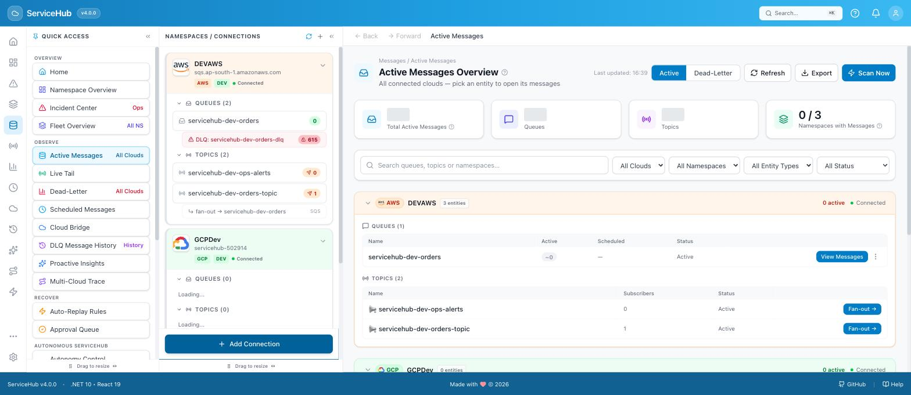

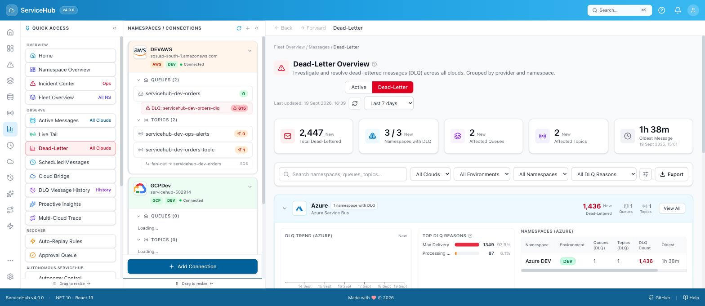

- **What is it?** A single aggregate view across *every* connected namespace, sectioned by
  provider, so you never have to pick a namespace first just to browse what's active or
  dead-lettered. Toggle between the two with the **Active / Dead-Letter** tabs at top right.
- **Why does it exist?** Before this existed, "browse dead letters" meant picking a namespace
  first — which silently defaulted to whichever namespace happened to be marked active, often
  the wrong one. This page fixes that by showing every provider's real counts side by side, with
  no ambiguity about which one you're looking at.
- **The buttons:**
  - **Search queues and topics across all clouds…** — a global filter across every section at
    once.
  - Each **provider section header** is collapsible independently (chevron), and shows a live
    entity count and active/dead-lettered total for that provider.
  - Clicking any **queue** or **topic/subscription** row jumps straight into its
    [Messages](#messages-drill-down) view.
  - AWS topics show a **Fan-out →** link into the SNS fan-out dashboard (see
    [Cloud Bridge](#cloud-bridge)); AWS's paired redrive-policy DLQ queue is deliberately hidden
    here — it's represented by the source queue's own DLQ tab instead of a second, confusing row.
  - GCP has no "queue" concept at all (see [Core Concepts](#core-concepts-the-vocabulary-you-need))
    — its section only ever shows topics and their subscriptions, including the DLQ topic/
    subscription pair Pub/Sub creates for you.

#### Live Tail

**Applies to:** Azure ✅ Supported · AWS ❌ Not supported · GCP ❌ Not supported

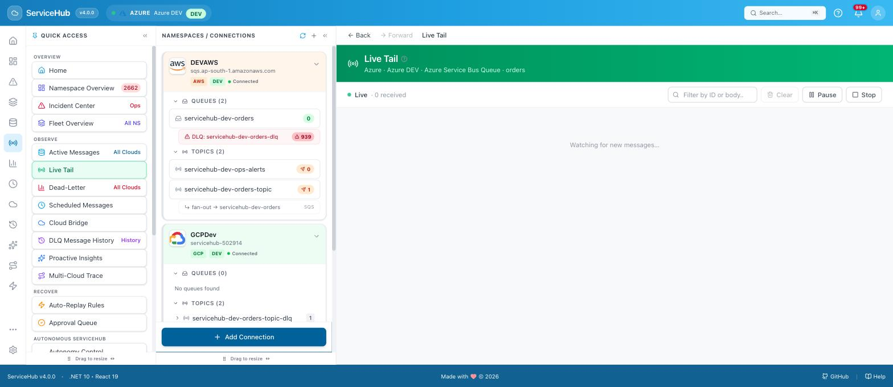

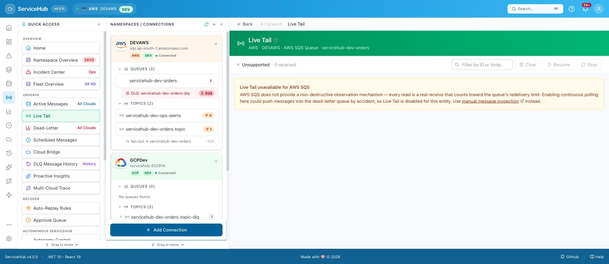

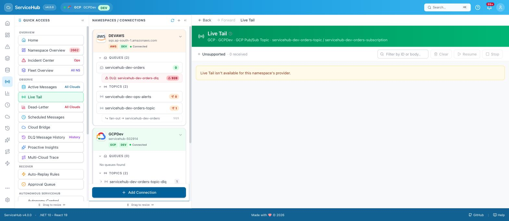

- **What is it?** Watch new messages arrive on one queue or topic/subscription in real time, as
  they happen — a dedicated, bookmarkable page (`/live-tail`) rather than a drawer buried inside
  the Messages page.
- **Why does it exist?** For debugging a live producer issue, "manually refresh the message list
  every few seconds" is both slow and error-prone. Live Tail streams new arrivals via
  server-sent events as they happen.
- **The buttons:**
  - **Pause / Stop / Clear** — pause and resume the stream, stop it outright, or clear what's
    accumulated on screen without touching the underlying queue.
  - The **entity picker** (shown when no queue/topic is selected yet) lists every entity across
    every connected namespace, providers included.

> [!IMPORTANT]
> **Only Azure supports Live Tail — both AWS and GCP are honestly unsupported, for the same root
> cause.** SQS has no way to observe a message without a real receive that counts against its
> redelivery limit; GCP Pub/Sub has the identical problem — every pull-then-release still counts
> as a delivery attempt toward the subscription's `MaxDeliveryAttempts`. Continuously polling
> either provider for Live Tail could accidentally push healthy messages into the DLQ purely by
> watching them. Rather than silently substitute a worse approximation on either cloud,
> ServiceHub disables Live Tail outright for both and explains exactly why (see the GCP screenshot
> above), with a link to manual peek-based inspection instead.
>
> This is a correction from an earlier version of this guide, which incorrectly stated that GCP
> supports Live Tail "fully." It doesn't — verified directly against the provider capability the
> backend enforces (`ProviderCapabilities.Gcp.SupportsRepeatablePeek = false`, identical to AWS)
> and against a live GCP Pub/Sub connection.

#### Scheduled Messages

**Applies to:** Azure ✅ Full support · AWS ❌ Not listable · GCP ❌ No concept

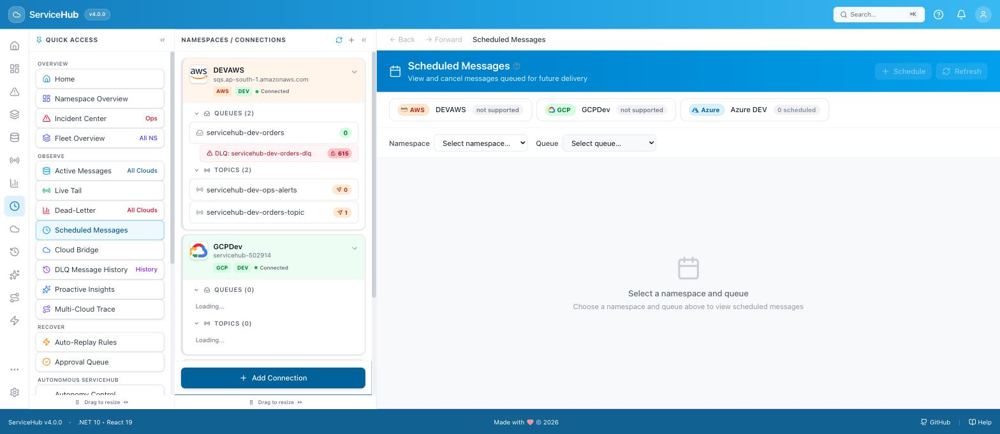

- **What is it?** View and cancel messages queued for future delivery.
- **Why does it exist?** Scheduled delivery is a real Azure Service Bus feature (`ScheduleMessage`)
  that's easy to lose track of — a message scheduled for next Tuesday doesn't show up anywhere
  else until it arrives.
- **The buttons:**
  - **Schedule** — create a new scheduled message (Azure only — see below).
  - **Namespace / Queue selectors** — pick which entity's scheduled messages to view.
- **Provider honesty, front and center:** this single screenshot shows the whole multi-cloud
  story without navigating anywhere else. AWS SQS only offers `DelaySeconds` (max 15 minutes) at
  send time, not a queryable "list what's scheduled" API — so ServiceHub marks it **not
  supported** rather than faking a list. GCP Pub/Sub has no scheduled-delivery concept at all — a
  suggested alternative (Cloud Scheduler / EventBridge Scheduler for AWS) is shown instead of an
  empty, confusing table.

#### Cloud Bridge

**Applies to:** Azure ✅ · AWS ✅ (plus an SNS fan-out dashboard) · GCP ✅ (topics/subscriptions
only — no queue concept)

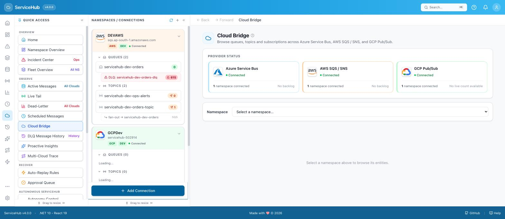

- **What is it?** Browse queues, topics, and subscriptions across Azure, AWS, and GCP from one
  screen, with each provider's live connectivity and backlog status shown up front.
- **Why does it exist?** It answers "is each of my cloud connections actually healthy right now?"
  before you go looking at any specific queue — a quick multi-cloud status board.
- **The buttons:**
  - Each **provider card** shows Connected/not-connected, namespace count, and either a live
    dead-lettered count or an honest "No live count available" when the provider genuinely can't
    supply one (see [Multi-Cloud Support At A Glance](#multi-cloud-support-at-a-glance)).
  - **Namespace picker** below — select a namespace to browse its entities inline, including (for
    AWS) the SNS fan-out dashboard: a full-pane view of a topic's subscriptions with live
    queue/DLQ depths per fan-out target and a **Publish** shortcut.

#### Connect

Covered in full in [Getting Started](#getting-started-connecting-your-first-namespace) above —
it's reachable from Quick Access as **Connect** but deliberately sits outside the main workspace
navigation, since adding a namespace connection is inherently a real-infrastructure action (it
always exits Demo Mode, even if you were in it a moment ago).

#### Messages (drill-down)

**Applies to:** Azure ✅ · AWS ✅ · GCP ✅ — every provider is fully browsable here, but tab
labels, auto-refresh defaults, and Purge availability all differ (see below).

This page (`/messages`) is reached by clicking any queue, topic, or subscription anywhere else in
the product — it's the actual message browser, and it looks meaningfully different per provider,
which is exactly why it's worth three separate screenshots.

**Azure** — a dead-lettered order message with a detected DLQ pattern, AI Insights tab open:

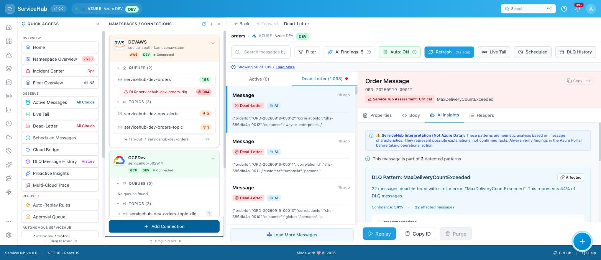

**AWS** — the equivalent dead-letter view on a real SQS queue:

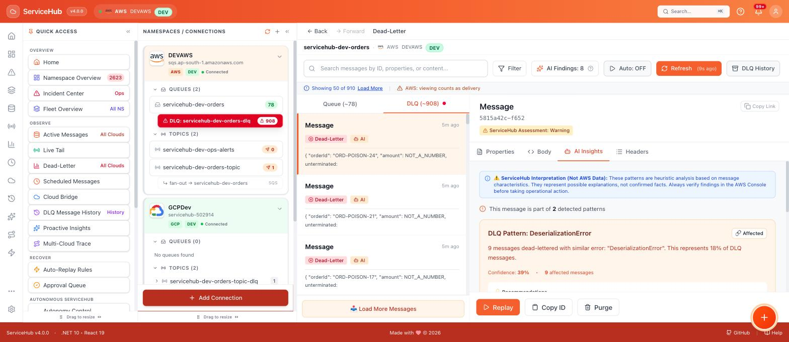

**GCP** — a topic/subscription pair, green-themed, with unavailable counts shown honestly:

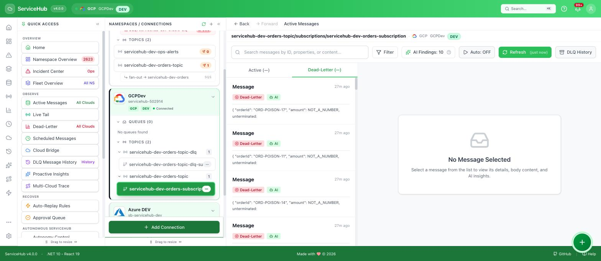

- **What is it?** The core message browser: list, search, inspect, and act on individual
  messages in one queue or topic/subscription.
- **Why does it exist?** This is where "investigate" actually happens — full message bodies,
  properties, headers, and (for dead-lettered messages) AI-detected pattern findings, all in one
  place.
- **The buttons and tabs, provider-neutral:**
  - **Filter** — narrow the visible list by ID, property, or content.
  - **Auto: ON/OFF** — auto-refresh. **Off by default on AWS** specifically, because SQS has no
    non-destructive peek (see [Live Tail](#live-tail)) — auto-refreshing would silently spend
    delivery attempts.
  - **Properties / Body / AI Insights / Headers tabs** — everything about one selected message.
    AI Insights shows detected DLQ patterns (with a confidence score and affected-message count)
    computed entirely client-side.
  - **Replay** — send this message back to be processed again. Always available where the
    provider allows it.
  - **Purge** — permanently delete this one message.

> [!IMPORTANT]
> **Purge is disabled on Azure, enabled on AWS and GCP.** This is a provider limitation, not a
> ServiceHub choice — the Azure Service Bus SDK has no single-message delete operation at all, so
> ServiceHub greys the button out rather than faking a delete with a workaround that could have
> side effects. If you need Azure messages gone, the only safe pattern is: replay them somewhere
> they'll be legitimately consumed, or let the queue's own TTL expire them.
- **What differs by provider, and why it's shown, not hidden:**
  - **Azure** labels its tabs **Active / Dead-Letter** with real counts, because Service Bus
    genuinely maintains both.
  - **AWS** labels them **Queue / DLQ** and shows an *"AWS: viewing counts as delivery"* banner —
    SQS "active" isn't quite the same concept as Azure's, and ServiceHub says so rather than
    pretending the two clouds work identically.
  - **GCP** shows **Active (—) / Dead-Letter (—)** — Pub/Sub has no native message-count API at
    all, so ServiceHub shows an honest em-dash instead of a fabricated zero.
  - The **AI Insights disclaimer** changes wording per provider too ("Not Azure Data" vs. "Not
    AWS Data") — a reminder that these are heuristic patterns from message *characteristics*, not
    confirmed facts, and should be verified in the provider's own console before acting on them
    at scale.

---

### Diagnose & automate

#### DLQ Intelligence

**Applies to:** Azure ✅ · AWS ✅ · GCP ✅ — history and trend tracking work the same way on all
three; only the underlying message counts each provider can supply differ (see
[Multi-Cloud Support At A Glance](#multi-cloud-support-at-a-glance)).

- **What is it?** Persistent dead-letter history and trend monitoring for one namespace — where
  [Fleet Health](#fleet-health) looks across every namespace, this page goes deep on one.
- **Why does it exist?** A single point-in-time DLQ count doesn't tell you whether a problem is
  new, recurring, or resolved. This page keeps that history, and surfaces recurring patterns
  automatically.
- **The buttons:**
  - **Bulk Replay / Bulk Purge** — act on many messages at once, always behind a dry-run-first
    safety gate (see below). **Disabled outright on production namespaces** — not merely
    rejected after clicking, the button itself never becomes clickable.
  - **CSV / JSON** — export the current view.
  - **Scan Now** — trigger an immediate re-scan instead of waiting for the next background poll.
  - **30-Day DLQ Trend** and **By Failure Category** — the historical view a live count can't
    give you.
  - **Recurring Failure Signatures** — ServiceHub's own interpretation of clustering, with a
    **Filter table to X →** shortcut that narrows everything below to just that entity, and
    **View details →** into the full [Failure Signature](#failure-signatures) record.
- **Bulk-operation safety, worth calling out on its own:** every bulk replay or purge shows a
  **preview** of exactly what will be affected before you confirm, and a second, explicit
  confirmation step before anything executes — there is no single click that mutates hundreds of
  messages.

#### Auto-Replay Rules

- **What is it?** Define rules that automatically replay dead-lettered messages matching
  specific conditions — this is where "automation" in ServiceHub actually lives.
- **Why does it exist?** Manually replaying the same known-transient failure every time it
  recurs doesn't scale. A rule lets you say "if you see this again, handle it the same way" —
  with hard limits so it can never run away.
- **The buttons:**
  - **Generate Intelligent Rules** — ServiceHub proposes rules based on patterns it's already
    detected in your DLQ, rather than asking you to write matching conditions from scratch.
  - **Browse Templates** — start from a known-good pattern instead of a blank rule.
  - **Create Rule** — build one by hand: conditions (entity/reason/category match), an action
    (auto-replay after a configurable delay), and a per-rule hourly limit.
  - Per rule: **Test** (dry-run against current DLQ contents with no side effect), **Replay All**
    (execute now, against everything currently matching), **Edit**, and delete.
  - Every rule card shows **Pending / Replayed / Success rate / Limit per hour** — live,
    real numbers, not estimates.
- **The safety net underneath every rule:** a rule match doesn't always execute immediately —
  the **Eligibility Gate** can escalate a match to the [Approval Queue](#approval-queue) instead
  (for example, if the message has recurred past the automatic-replay cap), and a **circuit
  breaker** automatically disables any rule whose recent success rate falls below a floor. Rules
  do not run at all on production namespaces.

#### Approval Queue

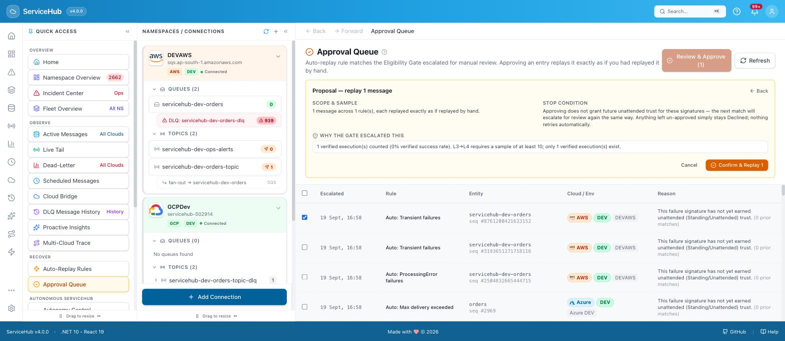

- **What is it?** Auto-replay rule matches that the Eligibility Gate escalated for manual
  review — messages a rule *would* have replayed automatically, except a safety condition said
  "have a human look at this first."
- **Why does it exist?** Not every "known pattern" match should run unattended forever. This
  queue is the deliberate off-ramp between full automation and full manual work: approving one
  entry replays it exactly as if you'd clicked Replay by hand — nothing more.
- **The buttons and flow, in order:**
  - Select one or more rows via checkbox, then **Review & Approve (N)** — this does **not**
    replay anything yet.
  - A **proposal** appears first (first screenshot above): the exact scope and sample, a
    plain-language **stop condition** ("approving does not grant future unattended trust — the
    next match escalates again the same way"), and the specific reason the gate escalated this
    batch.
  - Only **Confirm & Replay N**, the second explicit click, actually executes.
  - After execution, entries move into a **"Just approved"** list showing the real outcome —
    **Accepted for replay** or **Failed** — never a blanket success toast. As the second
    screenshot shows, ServiceHub reports a real failure honestly (here, both messages had already
    been reconciled by the time the approval executed) rather than claiming success it can't
    verify.
  - **View in Recovery Ledger →** — the actual Recovered/Returned/Unverified verification appears
    there once the observation window closes; it's never claimed on this page before it's real.
- **Demo Mode note:** approving requires a live connection, so this queue is always empty in
  Demo Mode — shown as an explicit notice, not a silent empty state.

#### Proactive Insights

- **What is it?** "What ServiceHub noticed without being asked" — four on-demand detection tools
  in one page, each computing fresh over roughly the last 24 hours rather than maintaining a
  persisted list.
- **Why does it exist?** Some findings only become visible when you deliberately look for them
  across namespaces or over time — this page is where that deliberate look happens.
- **The four tabs:**
  - **Narrations** — stitches anomaly, drift, and correlation findings into one plain-English
    paragraph per emergent pattern, with concrete recommended actions (e.g. "Check DLQ
    Intelligence for a newly dominant failure signature").
  - **Correlation Findings** — anomalies that fired together across two or more namespaces,
    same-provider or cross-cloud, before anyone had to notice by hand.
  - **Backlog Forecasts** — arithmetic (not ML) growth-rate extrapolation: how many hours remain
    before an entity's backlog crosses your alert threshold.
  - **Contract Violations** — packages message-shape drift findings as a producer-facing Markdown
    report, ready to hand to the upstream team that owns the actual fix, with a **Copy** button.
  - Each tab has its own **Generate / Detect / Forecast / Generate export** button — nothing
    computes until you ask.
- **Demo Mode note:** these are all live-data computations with no synthetic fixture to fall back
  to, so actions here are disabled in Demo Mode rather than fabricated.

#### Multi-Cloud Trace

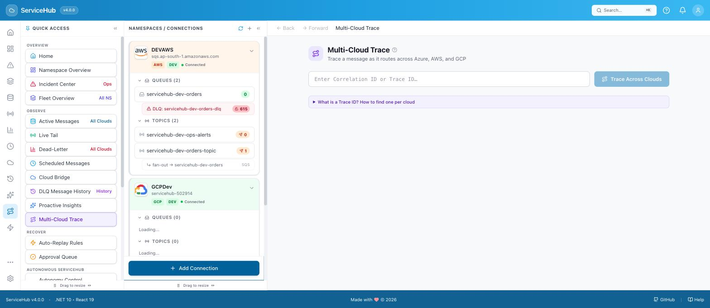

- **What is it?** Trace a single message by its correlation ID / trace ID as it (potentially)
  routes across Azure, AWS, and GCP.
- **Why does it exist?** In a fan-out architecture, one logical event can touch multiple clouds.
  Grepping three separate consoles for the same correlation ID by hand doesn't scale — this page
  searches all connected namespaces at once.
- **The buttons:**
  - **Enter Correlation ID or Trace ID…** then **Trace Across Clouds**.
  - **What is a Trace ID? How to find one per cloud** — an expandable explainer, since each
    provider names and surfaces this concept differently.
  - Results show a **routing path** visualization plus a hop count, cloud count, and namespaces-
    searched tally. As shown above, a genuinely-not-found ID reports exactly that — it never
    fabricates hops or a partial match to look more useful than it is.

#### Failure Signatures

**Applies to:** Azure ✅ · AWS ✅ · GCP ✅ — every provider gets signatures, but the "can this
recover unattended?" verdict shown on each one differs by provider (see the callout below).

> [!NOTE]
> **The "Automatic recovery blocked" message means two different things depending on the
> provider, and the wording is deliberately different so you don't confuse them:**
> - On **AWS or GCP**, it means *permanently* blocked — the provider cannot prove a replayed
>   message never returned to the DLQ, so no amount of successful history changes the verdict
>   (see [The Autonomy Model](#the-autonomy-model-in-plain-language)).
> - On **Azure**, an equivalent-looking notice instead reads *"has not yet earned Standing (L4)
>   or Unattended (L5) trust"* — a temporary, evidence-based state that a real track record can
>   change, because Azure can prove DLQ absence. The Azure screenshot above shows this exact
>   wording live.
>
> This distinction was a real, provider-resolution bug at the time this section of the guide was
> drafted: a signature that had never yet had a replay recorded against it (so the Recovery Ledger
> had no `ProviderSnapshot` for it) fell back to AWS's stricter capabilities regardless of its
> actual provider, so a brand-new Azure signature briefly showed the permanent-AWS-style wording
> instead of the correct temporary one. Fixed by resolving the provider from the namespace the
> signature was observed in when no ledger entry exists yet, rather than treating "no ledger
> entry" as "assume AWS."

- **What is it?** Not a page reachable from Quick Access directly, but the drill-down destination
  from almost everywhere else (Incident Center, DLQ Intelligence, Home) — the record of one
  *repeated pattern* of failure, not one message.
- **Why does it exist?** "324 messages failed" is not actionable; "one root cause affecting 324
  messages, here's what to do about it" is. Signatures are how ServiceHub turns volume into a
  short, prioritized list of actual problems.
- **The buttons:**
  - **Status / Trend / Review filters** on the list page — narrow by Active/Resolved/Suppressed/
    Archived, New/Recurring/Escalating, or whether a review is overdue.
  - **View details →** opens the full record (second screenshot): star-rated confidence,
    occurrence count, first/last seen, and an honest **"Automatic recovery blocked"** notice when
    a provider genuinely can't support unattended replay for this signature yet (see
    [The Autonomy Model](#the-autonomy-model-in-plain-language)).
  - **Mark Resolved / Suppress / Archive** — the human lifecycle actions on a signature.
  - **Replay Signature** — replay every currently-matching message for this one signature in one
    action, gated the same way bulk operations are.
  - **Root Cause & Knowledge** — a place to record what you learned, so the next person (or the
    next occurrence) benefits from it.
  - **Replay Safety & History** — explains, in the specific language of the connected provider,
    exactly what does and doesn't apply here (in the screenshot above: AWS SQS's lack of
    scheduled-message support and non-destructive peek).

---

### Advanced ServiceHub

*(If any of this section feels dense, read [Advanced ServiceHub — the education page](#advanced-servicehub-education-page)
first — it's the plain-language explanation of everything below it.)*

#### Autonomy

**Applies to:** Azure ✅ Can reach Standing (L4) / Unattended (L5) · AWS ⚠️ Permanently capped at
Approve (L3) · GCP ⚠️ Permanently capped at Approve (L3)

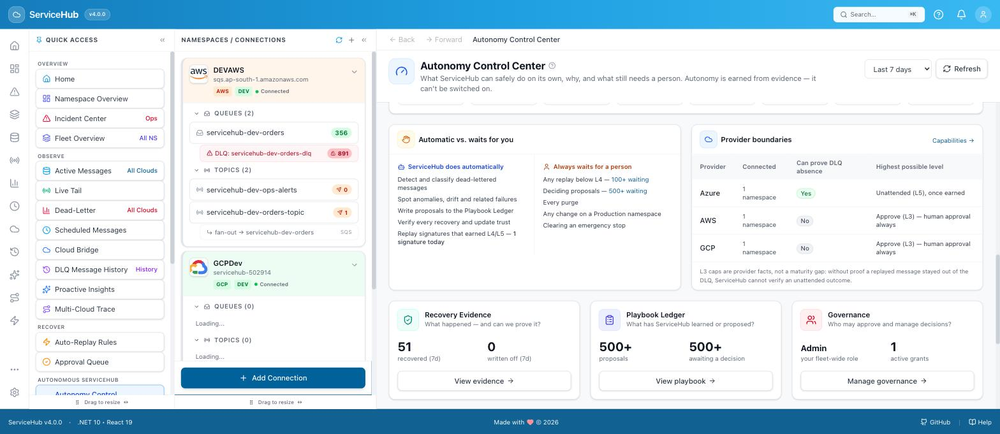

- **What is it?** How autonomous ServiceHub *actually* is, right now — read directly from the
  Recovery Evidence Ledger, the Playbook Ledger, and Governance, never from a marketing claim.
- **Why does it exist?** "Is this AI?" is the most common question a new operator asks. This page
  answers it precisely: **no reasoning model is in the execution path today** (ADR-0005), every
  number here is a deterministic read from real evidence, and there is no control anywhere in
  ServiceHub — including on this page — that lets a human simply switch autonomy on.
  - **How autonomous is ServiceHub right now** — one card per pillar (Recover, Investigate,
    Correlate, Prevent), each showing real counts of what's awaiting a human decision versus
    already agreed-sound.
  - **What's automatic vs. what waits for you** — a six-step verb taxonomy from *automatic
    detection* (always on, no approval needed) through *recommendation*, *human-approved
    action*, *earned unattended execution* (Recover pillar only, today), *ObserveOnly
    prevention*, up to a deliberately-marked-unavailable *future AI reasoning* card.
  - **Provider constraints table** — the single most important table in this guide for
    understanding multi-cloud limits: Azure can prove DLQ absence and can therefore earn Standing
    (L4) / Unattended (L5) trust; **AWS and GCP are permanently capped at Approve (L3)** — a real
    provider fact (neither can prove a replayed message never returned to the DLQ), not a
    maturity gap ServiceHub will eventually close.
  - **Evidence & safety floors** — the actual promotion math: L3→L4 requires 10+ verified
    outcomes at 95%+ success; L4→L5 requires 30+ at 99%+; two consecutive failures or a
    duplicate-business-effect flag demotes immediately. **Trust is earned automatically from
    ledger evidence — it cannot be granted directly by any user, ever.**
  - **Signature standings** and **Recent promotions & demotions** — the actual, per-signature
    ledger of what's happened.
  - **Governance, and what you can configure yourself** — the honest boundary: you can create/
    enable rules, grant/revoke Governance roles, and review Playbook proposals — but you cannot
    set a signature's autonomy level directly, ever.

#### Recovery Evidence

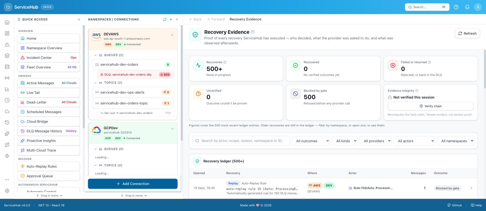

- **What is it?** Every recovery decision ServiceHub has ever made — who (or what) acted, what it
  asked the provider to do, and what was subsequently, independently observed to happen.
- **Why does it exist?** This is ServiceHub's core promise made concrete: a **tamper-evident,
  append-only, hash-chained** record, so six months from now you (or an auditor) can verify
  exactly what happened, not just trust a log line that could have been edited. The three
  underlying database tables reject any delete or out-of-allowlist modification at the
  persistence layer itself — independent of any application code's discipline.
  - **All Kinds filter** — narrow to Replay or Purge operations only.
  - Each row's **Actor** shows exactly who or what triggered it: a human (`__spa__`, meaning "via
    the single-page app," i.e. a person clicked a button), or a specific named `AutoRule`.
  - **Scope** shows the exact entity/rule/signature that was the trigger; **Targets** is the real
    count of messages this operation touched.
  - Full detail (click a row) shows the verification chain: what was asked, what was observed
    afterward, and the resulting **Recovered / Returned / Unverified** status once the
    observation window closes — never claimed before it's actually known.
- See `docs/RECOVERY-EVIDENCE.md` in the repository for the complete hash-chain and verification
  model, written for someone verifying a chain from an export alone, independent of ServiceHub
  itself.

#### Playbook Ledger

- **What is it?** What ServiceHub's detection workers (anomaly, drift, correlation) believed was
  worth a human's attention, and what a human decided about it. **Nothing here ever authorizes a
  replay or purge** — approving an entry means "a human agrees this finding is sound," full stop.
- **Why does it exist?** It's the accountability trail for ServiceHub's own judgment, separate
  from the Recovery Evidence Ledger's accountability trail for its *actions*. Two different
  questions: "was this a good call?" versus "what actually happened?"
  - **Correlation accountability** and **Backtesting** strips — a running scorecard of how often
    ServiceHub's own correlation hypotheses and anomaly/drift findings were later approved by a
    human, or corroborated by what actually happened. An honest "not enough evidence yet" shows
    when there's too little data for a real rate.
  - **Pillar / State filters** — narrow by Investigate/Correlate/Prevent/Recover and by lifecycle
    state (Proposed, UnderReview, Approved, Rejected, Expired, Superseded, Revoked).
  - Click a row to expand: the raw **Evidence** and **Proposal** JSON, the full **event chain**,
    and — while the entry is still open — **Mark under review**, **Approve**, or **Reject** (with
    a required reason).
  - **AI suggestion badge** — appears only on proposals from the optional, self-hosted reasoning
    companion (disabled by default). It marks the observation distinctly so a reviewer never
    mistakes an AI-generated suggestion for a deterministic worker's finding — this service has no
    access to any ledger or broker and can only ever land here as a proposal, like any other.

#### Governance

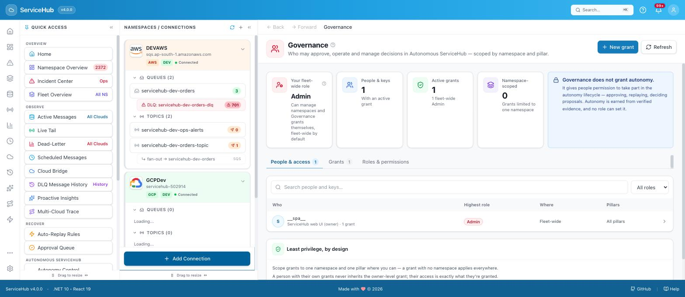

- **What is it?** Who holds which role, scoped to which namespace and which pillar. A grant with
  no namespace is fleet-wide; a grant with no pillar covers all four (Recover/Investigate/
  Correlate/Prevent).
- **Why does it exist?** Not every operator should be able to approve replays, and not every
  approver should have admin rights everywhere. Governance is the RBAC layer that makes "who is
  allowed to do what, where" an explicit, auditable fact instead of an assumption.
  - **New grant** — expands the form: **Grantee identity** (an Entra object ID, an API key name,
    or an owner ID), **Grantee kind** (User/ApiKey), **Role** (Viewer/Operator/Approver/Admin),
    **Pillar** (optional — blank means all four), and **Namespace** (optional — blank means
    fleet-wide).
  - **Create grant** takes effect on the very next request — no restart required, since this is
    the same table `GovernanceAuthorizationFilter` reads at request time.
  - **Revoke** on any active grant — revoked grants stay visible (greyed out) rather than
    disappearing, so the history is never lost.
  - **Until the first grant exists, every caller has unrestricted access** — an explicit empty
    state says so, rather than silently behaving as if governance were already locked down.

---

### Platform

#### System Health

- **What is it?** API and background-service health status for the ServiceHub instance itself —
  not your cloud provider's health, but ServiceHub's own.
- **Why does it exist?** Before troubleshooting "why does my namespace look wrong," it's worth
  ruling out "is ServiceHub itself healthy" first. This page answers that in one glance.
  - **Uptime / Memory Usage / Threads / GC Collections** — process-level vitals.
  - **Server Information** — exact version, build hash, environment, host machine, OS, and
    .NET framework version — useful when filing a bug report or comparing instances.
  - **Component Health** — a per-dependency breakdown: `servicebus` (Azure connectivity),
    `sqlite` (the local database), `ai` (client-side clustering availability), `reasoning-agent`
    (the optional companion — correctly shown **Degraded** when disabled, not falsely Healthy),
    `self` (the API process), `aws-connectivity` / `gcp-connectivity`, and `worker-heartbeat`
    (every background worker's last-seen cadence).
  - **Refresh** — re-checks every component now.

#### Audit Trail

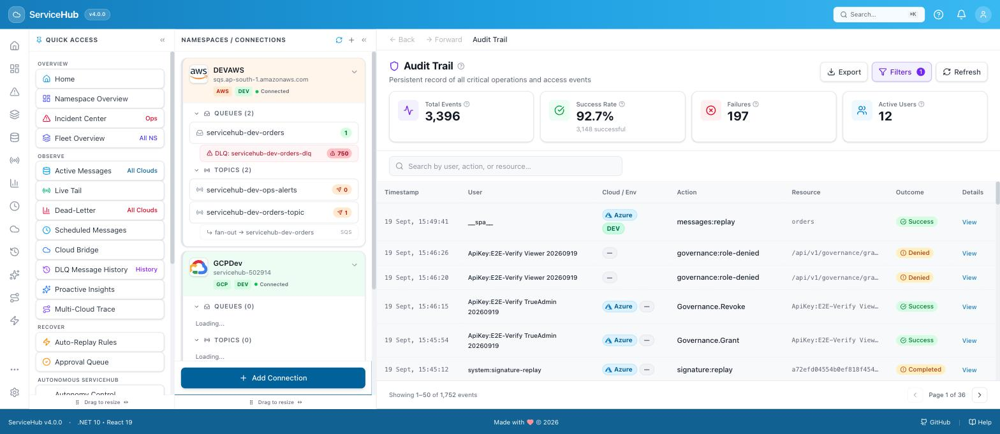

- **What is it?** A persistent record of every critical operation and access event —
  authentication, replays, purges, rule changes, governance changes, backups.
- **Why does it exist?** This is the compliance and forensics layer: "who did what, when, and did
  it succeed" for every operation that matters, independent of the more specific Recovery Evidence
  and Playbook ledgers.
  - **Export** — download the visible events.
  - **Filters** — narrow by user, action type, cloud/environment, or outcome.
  - **Search by user, action, or resource…** — free-text filter across the table.
  - **Total Events / Success Rate / Failures / Active Users** stat tiles — real, live numbers.
    (In the screenshot above, the Failures count includes two real replay failures triggered
    earlier in this exact session from the Approval Queue — the audit trail doesn't
    editorialize a failure into a success.)

#### Security & Privacy

- **What is it?** A plain-language explanation of exactly what ServiceHub stores, what it never
  touches, and where you can verify every claim directly in the open-source code.
- **Why does it exist?** Pasting a cloud connection string into a web app is a real trust
  decision. This page exists so you don't have to take that trust on faith — every claim here is
  checkable against the actual source.
  - The **data-flow diagram** at the top is the single clearest artifact in the product for this:
    your browser talks to the ServiceHub server over HTTPS with a short-lived, HMAC-signed SPA
    token (never a raw API key exposed to the browser); the server alone talks to your cloud via
    its official SDK.
  - **Connection string** — encrypted with AES-256-GCM immediately on arrival at the server; the
    plaintext is discarded and never returned to the browser.
  - **Message content** — read *transiently* from the cloud provider to display in your browser;
    never stored, never logged, never indexed by ServiceHub.
  - **Browser traffic** — HTTPS end to end; no raw API keys are ever exposed to the browser.
  - **What we protect** cards below cover connection strings and application logs specifically
    (log redaction strips shared-access-keys and known secret patterns automatically).
- See [Security & Privacy Model](#security--privacy-model) further down in this guide, and
  `SECURITY.md` in the repository, for the complete picture including telemetry and threat model.

---

### Learn ServiceHub

#### Advanced ServiceHub (education page)

- **What is it?** The canonical, plain-language explanation of what the four *Advanced
  ServiceHub* pages ([Autonomy](#autonomy), [Recovery Evidence](#recovery-evidence),
  [Playbook Ledger](#playbook-ledger), [Governance](#governance)) actually are and why they're
  grouped together. **Purely static and educational** — it makes no API calls, so nothing on it
  can drift out of sync with live data, because it never shows any; every specific number lives
  on the pages this one links to.
- **Why does it exist?** Most of ServiceHub is where you *use* the product day to day (Messages,
  DLQ Intelligence, Auto-Replay Rules). This section is different: it's where ServiceHub explains
  and governs *itself*. That distinction is worth a dedicated explanation, written for an
  operator who already uses ServiceHub and wants to understand how much of it runs unattended,
  why, and where the human floor still is.
- **The legend (the single most useful thing on the page):**
  - 🟢 **CURRENT** — implemented and operating today.
  - 🔵 **BOUNDED** — available only once evidence, governance, or a safety gate allows it.
  - 🟡 **HUMAN REQUIRED** — requires a human's approval or action, by design, not by limitation.
  - ⚪ **FUTURE** — not implemented. Deliberately gated, not hidden — the page is upfront about
    what doesn't exist yet rather than staying silent about it.
- **Numbered sections below the legend** walk through: what Advanced ServiceHub means and why it
  exists; the autonomy model and its loop; evidence and the Recovery Evidence Ledger; the
  Playbook Ledger and human disposition; Governance/RBAC and approval boundaries; provider-
  specific limits; ObserveOnly prevention; how autonomy is actually earned; what runs
  automatically today versus what still waits for a human; what "autonomous" explicitly does
  *not* mean; why there is no global "Enable Autonomous" switch anywhere in the product; and what
  a future Reasoning Companion is (and isn't) today.

---

### Support

#### Help & Guide

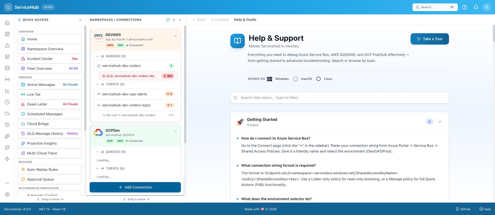

- **What is it?** The in-app quick reference and searchable FAQ — "master ServiceHub in
  minutes," covering everything from first connection to advanced troubleshooting.
- **Why does it exist?** Not every question needs a support ticket or a trip to this document —
  most day-to-day questions ("what does the environment selector do?", "what connection-string
  format do I need?") are answered right here, searchable, without leaving the app.
  - **Take a Tour** — an interactive, guided walkthrough of the UI for a first-time user.
  - **Search help topics…** — filters every topic below by keyword as you type.
  - Topics are grouped into collapsible sections (Getting Started, and further sections for
    deeper troubleshooting) — each with a topic count badge and a chevron to expand/collapse.

---

## Multi-Cloud Support At A Glance

ServiceHub treats honesty about provider differences as a design principle, not an afterthought
— you've seen this repeatedly throughout this guide (Live Tail, Scheduled Messages, Purge,
Autonomy's provider-constraints table). Here's the same information in one table:

| Capability | Azure Service Bus | AWS SQS/SNS | GCP Pub/Sub |
|---|---|---|---|
| Support tier | GA (fully supported) | Supported | Supported |
| Native queue concept | Yes | Yes | No — topics/subscriptions only |
| Single-message Purge | ❌ (SDK has no single-delete) | ✅ | ✅ |
| Live Tail (continuous watch) | ✅ | ❌ (no non-destructive peek) | ❌ (repeated pull-then-release still counts as a delivery attempt) |
| Scheduled messages | ✅ | ❌ (15-min delay only, not listable) | ❌ (no concept) |
| Can prove DLQ absence (unattended replay ceiling) | ✅ — can reach Standing (L4) / Unattended (L5) | ❌ — permanently capped at Approve (L3) | ❌ — permanently capped at Approve (L3) |
| Auto-refresh default | On | **Off** (protects delivery-attempt budget) | Off |

For the full conformance methodology and live test results, see `docs/PROVIDER-CONFORMANCE.md`
in the repository.

---

## The Autonomy Model, In Plain Language

This is worth summarizing once, in one place, because it's the single most-asked question about
ServiceHub: **"is this AI, and can it act on its own?"**

1. **Nothing acts unattended by default.** Every signature (failure pattern) starts at **Approve
   (L3)** — a permanent floor where a human always signs off before a replay executes. This is
   not a rung to climb past; it's the baseline every signature starts and can fall back to.
2. **Trust is earned, never granted.** A signature can climb to **Standing (L4)** after at least
   10 verified outcomes at a 95%+ success rate, and to **Unattended (L5)** after at least 30 at
   99%+. Two consecutive failures, or an operator flagging a duplicate business effect, demotes
   immediately. There is no button, anywhere in ServiceHub, that sets a signature's level
   directly — it is computed purely from the Recovery Evidence Ledger's history.
3. **The provider itself sets a ceiling.** Only Azure can currently *prove* a replayed message
   never returned to the DLQ — AWS and GCP structurally cannot provide that proof today, so they
   are permanently capped at Approve (L3), a provider fact rather than a maturity gap ServiceHub
   will eventually close.
4. **No AI reasoning is in the execution path today.** Every autonomy decision described above is
   deterministic — arithmetic against ledger history, not a model's judgment. An optional,
   self-hosted "reasoning companion" exists and can *propose* observations into the Playbook
   Ledger, disabled by default, with zero access to any ledger or broker, and it can never itself
   execute anything — see the **AI suggestion** badge in [Playbook Ledger](#playbook-ledger).
5. **Governance authorizes people, never autonomy levels.** A [Governance](#governance) grant
   controls who can approve, operate, or administer — it has no mechanism to change how much
   trust a signature has earned.

If you want the full, section-by-section explanation with a legend for what's implemented versus
deliberately not, read [Advanced ServiceHub](#advanced-servicehub-education-page) in the app
itself — it's written to answer exactly this question in depth.

---

## Security & Privacy Model

Summarized from the in-app [Security & Privacy](#security--privacy) page and `SECURITY.md`:

- **Read-only by default.** ServiceHub peeks, it doesn't consume, unless you explicitly replay,
  send, or purge.
- **Connection strings are encrypted at rest** with AES-256-GCM the moment they reach the server;
  the plaintext is discarded and never returned to the browser.
- **Message content never leaves your network.** AI pattern analysis runs entirely in your
  browser — no message body is ever sent to a third-party service. Telemetry (usage metrics, not
  message content) is vendor-neutral and opt-in, disabled unless you explicitly enable it.
- **Destructive actions are blocked on Production namespaces**, everywhere in the product — this
  is enforced both in the UI (buttons never become clickable) and independently on the backend
  (the same guard applies even if a request bypassed the UI entirely).
- **Single shared identity by default.** Every browser session shares one admin identity unless
  you turn on per-user identity — OIDC (any standards-compliant identity provider) or Azure Easy
  Auth, both off by default. If you're deploying ServiceHub for a team, turning this on is the
  first thing worth doing.
- **Self-hosted, always.** ServiceHub runs entirely in infrastructure you control. There is no
  hosted SaaS version that receives your data.

---

## From The Beginning: How ServiceHub Got Here

ServiceHub did not start as a multi-cloud, evidence-ledger, autonomy-aware platform — it grew
into one. A brief history, for context:

- **The foundation:** ServiceHub began as an Azure Service Bus-focused forensic debugger — the
  core insight (full message bodies + AI clustering + one-click replay, all client-side and
  self-hosted) predates multi-cloud support entirely.
- **Multi-cloud expansion:** AWS SQS/SNS and GCP Pub/Sub support followed, built to the same
  standard rather than as an afterthought — hence the extensive, honest documentation throughout
  this guide of exactly where the three clouds genuinely differ (Live Tail, Purge, Scheduled
  Messages, and more).
- **v3.6.0 — Stabilization.** A dedicated bug-bash release: no new features, purely defects found
  during a deep review and a live multi-cloud validation pass.
- **v3.7.0 — Recovery Evidence Ledger (the current released version as of this writing).** The
  headline addition: a durable, append-only, hash-chained ledger that every provider-mutating
  recovery path writes to, plus a verification worker that closes entries as Recovered/Returned/
  Unverified based on what's actually, provably observed per provider — never approximated. This
  release also added the fleet-wide replay velocity cap, per-rule circuit breaker, the dedicated
  Live Tail workspace, and cross-Quick-Access Back/Forward navigation. A same-cycle deep
  multi-cloud E2E pass against real infrastructure found and fixed five further defects, including
  a cross-tenant namespace-name disclosure in the unauthenticated health endpoints.
- **The autonomy and governance layer (built on top of v3.7.0, documented in this guide as
  currently running).** Home's ranked attention queue, the Incident Center and per-signature
  Incident Workspace, the Approval Queue's propose-then-verify flow, Proactive Insights
  (narration, correlation, backlog forecasting, contract-violation export), the Autonomy page,
  the Playbook Ledger, Governance/RBAC, and an optional, disabled-by-default reasoning-companion
  scaffold that can only ever propose, never execute. This work reflects ServiceHub's stated
  position that a system that silently replays messages without evidence a human can check is a
  liability, not automation — every one of these pages exists to make unattended action
  defensible, evidence-first.

For the exhaustive, dated, entry-by-entry history — including every bug fixed and why — see
`CHANGELOG.md` in the repository root. For the architectural decisions behind major features
(provider abstraction, the Recovery Evidence Ledger's design, the self-hosted security model, the
AI capability boundary, and more), see the ADRs under `docs/adr/`.

---

## FAQ & Troubleshooting

**Is ServiceHub going to replay or delete anything on its own the first time I connect a
namespace?**
No. Every signature starts at the human-approval floor (Approve/L3). Nothing executes unattended
until it has earned that trust through a real track record — and even then, only for the Recover
pillar, and never on a Production-tagged namespace.

**Why can't I see Live Tail working on my AWS queue?**
This is by design, not a bug — SQS has no way to observe a message without a real receive that
counts against its redelivery limit. See [Live Tail](#live-tail).

**Why is Purge greyed out on my Azure queue?**
The Azure Service Bus SDK itself has no single-message delete operation. This is a provider
limitation ServiceHub surfaces honestly rather than working around with a risky substitute.

**My dashboard shows "No live count available" for GCP — is something broken?**
No — some GCP Pub/Sub configurations genuinely don't expose a queryable message count the way
Azure and AWS do. ServiceHub shows this honestly instead of guessing at a number.

**I approved a replay in the Approval Queue and it says "Failed" — did something break?**
Not necessarily. A common, honest reason: the message was already reconciled (returned, expired,
or otherwise resolved) by ServiceHub's own background monitor between the time it was escalated
and the time you approved it. Check the [Recovery Evidence Ledger](#recovery-evidence) and
[Audit Trail](#audit-trail) for the specific detail.

**Where do I go to actually change who can approve replays?**
[Governance](#governance) — create a grant with the Approver (or Admin) role, scoped to whichever
namespace and pillar makes sense.

**I'm running multiple ServiceHub instances behind a load balancer and my namespace list looks
inconsistent between requests.**
See the single-instance storage notice on the [Connect](#connect) page — namespace connections
are stored on the instance that handled the request. Use sticky sessions, or point every instance
at the same shared storage path.

**Where's the plain-language explanation of the autonomy stuff?**
[Advanced ServiceHub](#advanced-servicehub-education-page) — written specifically to answer this
without requiring you to read any source code.

For deployment-specific troubleshooting (Docker, ports, environment variables), see
`LOCAL-DEPLOYMENT.md` and the **Troubleshooting** section of the main `README.md`.

---

## Where To Go Next

- **`README.md`** (repository root) — the top-level product overview, quick start, and
  self-hosting instructions.
- **`LOCAL-DEPLOYMENT.md`** — plain-language, step-by-step guide to running ServiceHub locally.
- **`docs/ARCHITECTURE.md`** — the technical architecture behind everything in this guide.
- **`docs/PROVIDER-CONFORMANCE.md`** — the full, tested methodology behind the
  [Multi-Cloud Support At A Glance](#multi-cloud-support-at-a-glance) table.
- **`docs/RECOVERY-EVIDENCE.md`** — the complete hash-chain and verification model behind the
  [Recovery Evidence Ledger](#recovery-evidence).
- **`docs/ENCRYPTION-KEY-ROTATION.md`** — how connection-string encryption keys are rotated.
- **`docs/adr/`** — every architectural decision record, including the provider-abstraction model
  (ADR-0001), the self-hosted security model (ADR-0004), and the AI capability boundary
  (ADR-0005) referenced throughout this guide.
- **`docs/guides/azure-guide.md` / `aws-guide.md` / `gcp-guide.md`** — deeper, provider-specific
  walkthroughs with additional real-world screenshots per cloud.
- **`docs/guides/quick-access-guide.md`** — an earlier, Quick-Access-panel-focused reference this
  guide supersedes as the primary entry point, kept for its additional annotated detail.
- **`SECURITY.md`** — the full security policy and threat model.
- **`CONTRIBUTING.md`** — how to contribute to ServiceHub itself.
