# ServiceHub on AWS SQS — step by step, with real screenshots

> **Prefer to watch?** A captioned walkthrough of all of Simple mode, about five minutes — including Replay selected, Replay All and the switch to Advanced: [AWS SQS video](../media/aws.mp4).

This guide takes you from nothing to a working ServiceHub on **AWS SQS**, one screen at a time. Every picture is the real
application (or the real AWS console) — not a mock-up — with numbered markers; the numbered list under each picture says what that control
does **and what it will not do**. Account ids and the access key are blanked out in the console pictures.

**What you will do**

1. In the AWS console, make a user just for ServiceHub, limited to your queues, and create an access key for it.
2. Connect AWS in ServiceHub and check it can see your queues.
3. Ask ServiceHub to look at the dead letters, understand why they failed, and replay one safely.
4. See what ServiceHub can and cannot prove on AWS, and learn what Auto Replay, Settings and the Advanced pages show.

**What you need**

| You need | Why |
|---|---|
| One or more SQS queues, ideally with a **dead-letter queue** (a redrive policy) | The dead-letter queue is where failed messages wait for ServiceHub |
| Permission in AWS to create an IAM user and an access key | You will make a ServiceHub-only credential |
| ServiceHub running (see the README) | You will open it in a browser |

> **Cost, and the one thing that is different on AWS.** SQS has no way to look at a message without *receiving* it, and every receive counts as a
> delivery attempt. So ServiceHub **never looks on its own**: it counts messages for free, and reads dead letters only when you press
> **Look now** (up to 100 per queue, handed straight back). It does not browse your active messages at all. Normal SQS request charges apply;
> ServiceHub adds none of its own.

**The permissions policy** (replace `ACCOUNT_ID` and the region and queue names with yours). Nothing outside these two queues is reachable:

```json
{
  "Version": "2012-10-17",
  "Statement": [
    { "Sid": "ListQueues", "Effect": "Allow", "Action": "sqs:ListQueues", "Resource": "*" },
    { "Sid": "WatchAndReplay", "Effect": "Allow",
      "Action": ["sqs:GetQueueUrl", "sqs:GetQueueAttributes", "sqs:ReceiveMessage",
                 "sqs:ChangeMessageVisibility", "sqs:SendMessage", "sqs:DeleteMessage"],
      "Resource": ["arn:aws:sqs:ap-south-1:ACCOUNT_ID:servicehub-dev-orders",
                   "arn:aws:sqs:ap-south-1:ACCOUNT_ID:servicehub-dev-orders-dlq"] }
  ]
}
```

Why each action: `ListQueues` finds your queues; `GetQueueUrl` and `GetQueueAttributes` read counts; `ReceiveMessage` is the look;
`ChangeMessageVisibility` hands a looked-at message straight back; `SendMessage` and `DeleteMessage` are used only when you replay.


---


## Part 1 — In the AWS console

*Do these first. Each step shows the real console.*


### 1.1 Look at your queues

Sign in to the AWS console, search for **SQS** and open **Queues**. Note the **region** (top right): queues belong to a region, and you will choose the same one in ServiceHub. The **Messages available** column is what ServiceHub will count.


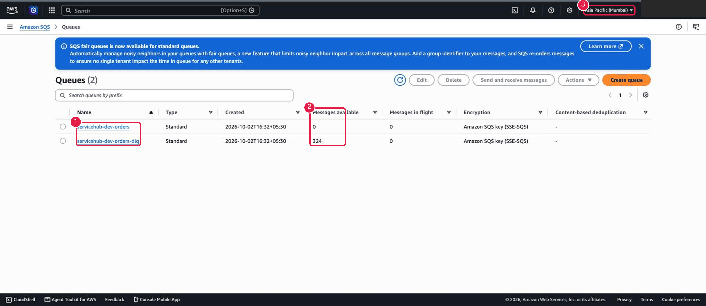


1. Queue names — your orders queue and its dead-letter queue (the one ending -dlq). ServiceHub finds every queue in the region; you do not list them.
2. Messages available — waiting to be received. The dead-letter queue's number is what ServiceHub counts as dead letters (here 324).
3. Region — queues belong to a region. You choose the same region in ServiceHub when you connect (here Asia Pacific (Mumbai), ap-south-1).


### 1.2 Find the dead-letter queue

Open your main queue and choose the **Dead-letter queue** tab. It names the queue that receives failures and the **Maximum receives** — how many tries before SQS moves a message there. If a queue has no dead-letter queue, failed messages are retried until they expire and ServiceHub has nothing to show.


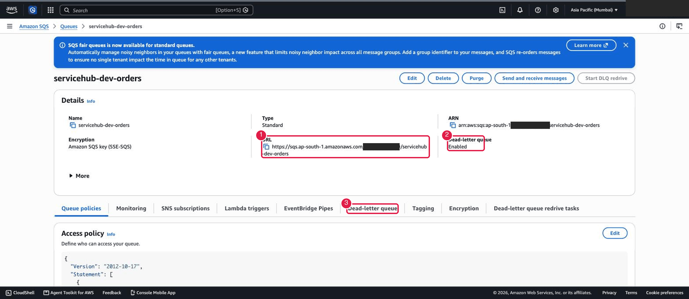


1. URL — the address of this queue. ServiceHub builds it for you from the queue's name and your region.
2. Dead-letter queue — Enabled: a message that fails too often is moved to a second queue instead of being lost.
3. Dead-letter queue tab — shows which queue receives the failures (next screenshot).


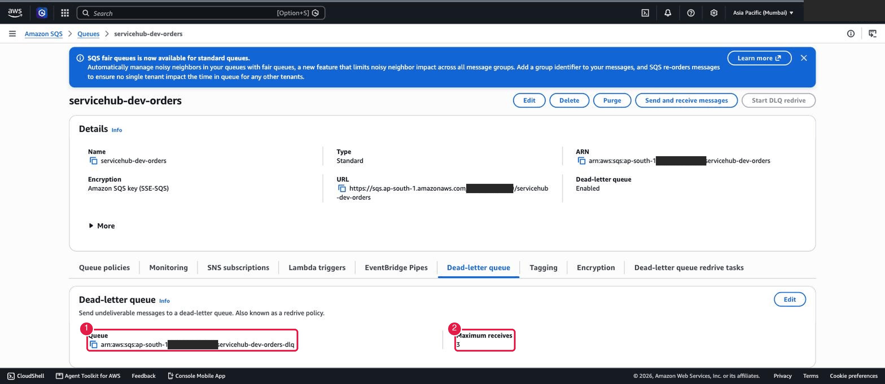


1. Queue — the dead-letter queue that receives the failures. ServiceHub reads this one to show Dead letters.
2. Maximum receives — 3: after three failed tries SQS moves the message here. Reading a dead letter from ServiceHub counts as one more receive, which is why ServiceHub only looks when you ask.


### 1.3 Create a ServiceHub-only user

Open **IAM → Users → Create user**. Name it (we use `servicehub-app`), leave **console access** off — it is for programs only — and give it no groups. Do not use your own user or the root account: a separate user can be switched off later without disturbing anything else.


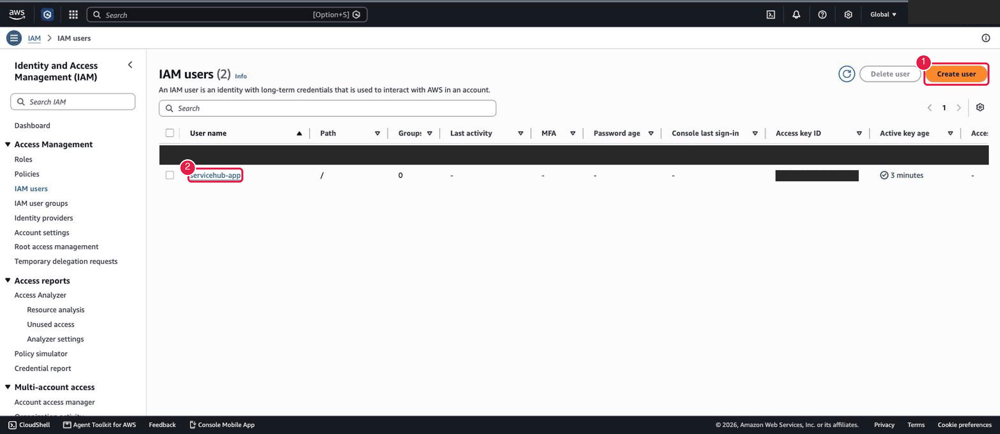


1. Create user — start here to make a user just for ServiceHub, not your own.
2. The ServiceHub user — separate from your own, so you can switch it off later without disturbing anything else.


### 1.4 Give it only the SQS permissions it needs

On the user, **Add permissions → Create inline policy**, choose JSON, and paste the policy from the start of this guide with your queue names. The user then has exactly one policy, limited to your queues: if its key ever leaked, it could touch nothing else in your account.


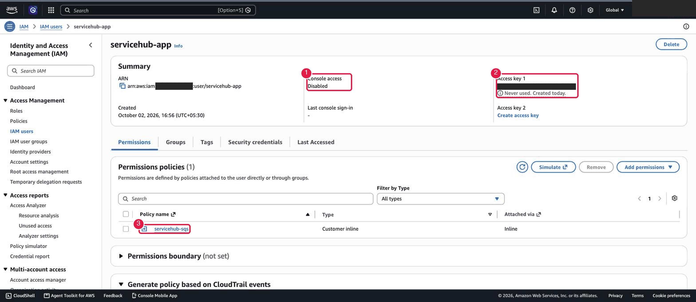


1. Console access — Disabled. This user is for programs only: nobody can sign in to the AWS console as it.
2. Access key 1 — what ServiceHub signs in with. It is made on the Security credentials tab; AWS shows its secret only once.
3. servicehub-sqs — one inline policy, limited to the two queues (next screenshot). The user has no other permissions.


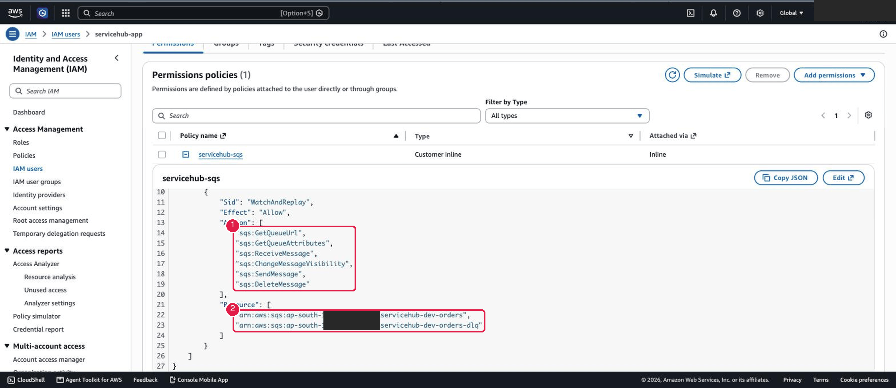


1. Actions — what ServiceHub may do: read queue counts, receive (to look), change visibility (to hand a looked-at message back), send and delete (to replay). Above these, sqs:ListQueues lets it find your queues.
2. Resource — only these two queues. If the key ever leaked, it could touch nothing else in your account.


### 1.5 Create an access key

Open the user's **Security credentials** tab and choose **Create access key**. Pick **Application running outside AWS**, then copy the **Access key ID** and the **Secret access key** — AWS shows the secret **once**. Treat both like a password: ServiceHub encrypts them on arrival and never shows them again. Making the key inactive or deleting it is how you revoke access later.


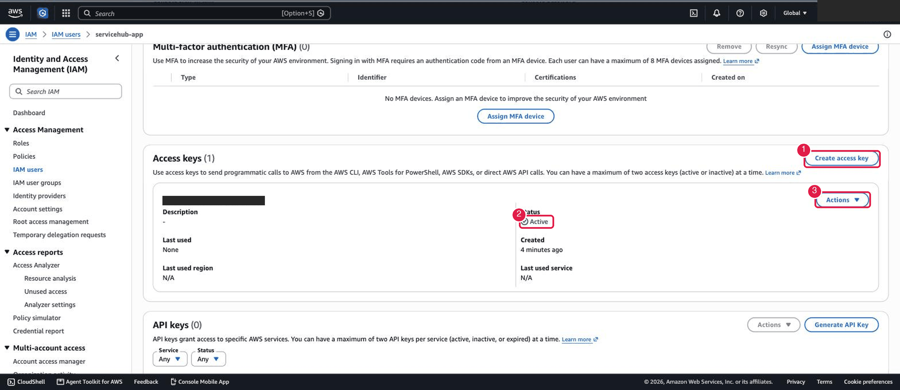


1. Create access key — choose “Application running outside AWS”, then copy the Access key ID and the Secret access key. AWS shows the secret once.
2. Status — Active. Make it Inactive or delete it at any time to cut ServiceHub off.
3. Actions — make the key inactive or delete it: the way to revoke ServiceHub’s access later.


## Part 2 — Connect AWS in ServiceHub

*About two minutes.*


### 2.1 The welcome page

With no cloud connected, ServiceHub opens on a welcome page. Choose **Connect AWS**.


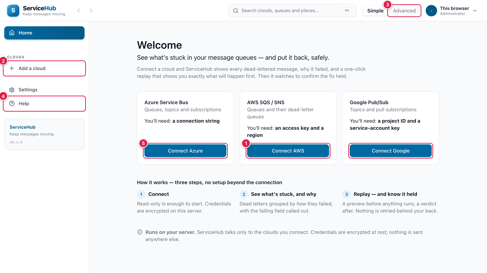


1. Connect AWS — opens the Add a cloud window on the AWS tab. It asks for an access key and a region; nothing is read until you press Connect there.
2. Add a cloud — the same window, from anywhere in the app. Use it later to connect Azure or Google Cloud as well.
3. Simple | Advanced — Simple is where you act. Advanced is read-only pages (ledger, signatures, agents); it never changes anything.
4. Help — opens the Help panel with task-shaped answers and the keyboard shortcuts.
5. Connect Azure / Connect Google — the same Add a cloud window, on the Azure or Google Cloud tab. You do not need them for AWS.


### 2.2 Add a cloud

The window opens on the AWS tab. Open **Where do I get the AWS access key?** for the same console steps you just did.


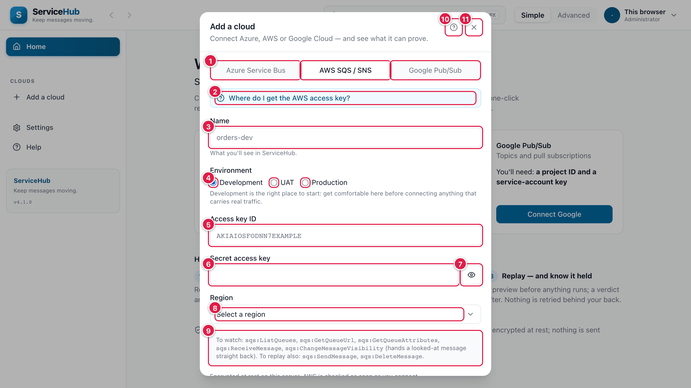


1. Cloud tabs — AWS SQS / SNS is selected. The Azure and Google tabs ask for different credentials.
2. Where do I get the AWS access key? — expands the console steps, with the permissions to give.
3. Name — what you will see in ServiceHub. It is a label only; it does not change anything in AWS.
4. Environment — Development, UAT or Production. Start with Development; Auto Replay never acts in Production.
5. Access key ID — the ID of the access key you made for ServiceHub (it starts AKIA).
6. Secret access key — shown by AWS only once, when you create the key. It is encrypted on this server and never shown again.
7. Show value — reveals what you typed so you can check it. It cannot reveal a stored secret.
8. Region — the region your queues are in (the console shows it top right). Queues in other regions are not seen.
9. The permissions ServiceHub uses — to watch, and (in the second sentence) also to replay. Give it nothing more.
10. (?) — opens Help on this very screen. Every window has one.
11. ✕ — closes the window without saving (Esc does the same).


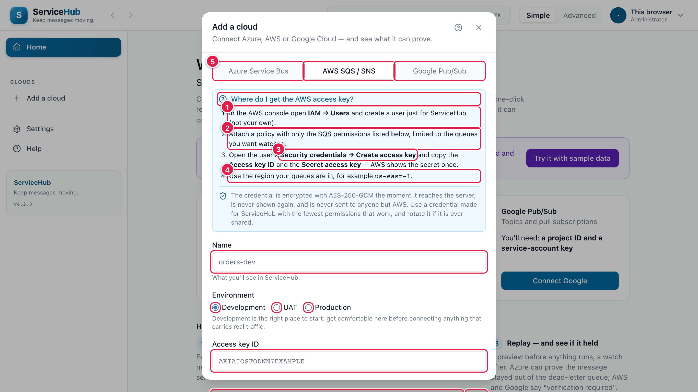


1. IAM → Users — in the AWS console, make a user just for ServiceHub (not your own).
2. Attach a policy with only the SQS permissions below, limited to the queues you want watched.
3. Security credentials → Create access key — copy the Access key ID and the Secret access key; AWS shows the secret once.
4. Use the region your queues are in.
5. The form underneath — the cloud tabs, Name, Environment, Access key ID, Secret access key, Show value and Region, exactly as in the previous screenshot.


### 2.3 Fill it in and connect

Give it a name, keep the environment as **Development** for your first connection, paste the Access key ID and the Secret access key, choose the region your queues are in, and press **Connect**. ServiceHub tests the key, then saves it encrypted (AES-256-GCM).


1. A name you will recognise.
2. The Access key ID (AWS’s documented example is shown here, not a real key).
3. The Secret access key, hidden as you paste it.
4. The region — here ap-south-1, Asia Pacific (Mumbai).
5. The rest of the form above — cloud tabs, Environment and Show value, as described on the previous screenshot.
6. Cancel and Connect — shown in full on the next screenshot.


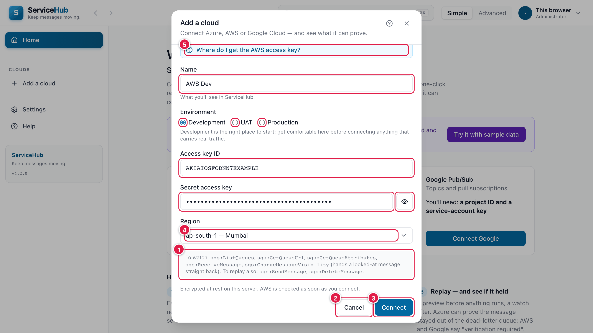


1. The permissions ServiceHub uses — to watch, and (second sentence) also to replay. Give it nothing more.
2. Cancel — closes the window; nothing is saved.
3. Connect — tests the key, then saves it. It only reads queue counts; it never receives, sends or deletes anything by itself.
4. Region — ap-south-1 (Asia Pacific, Mumbai) is chosen here.
5. The fields above — the name, key ID, secret and Show value, as filled in on the previous screenshot.


### 2.4 The result

You see exactly what ServiceHub can see: how many queues it found, how many messages are dead-lettered right now, and that this cloud **cannot yet prove a replayed message stayed fixed** — ServiceHub will say so honestly rather than pretend.


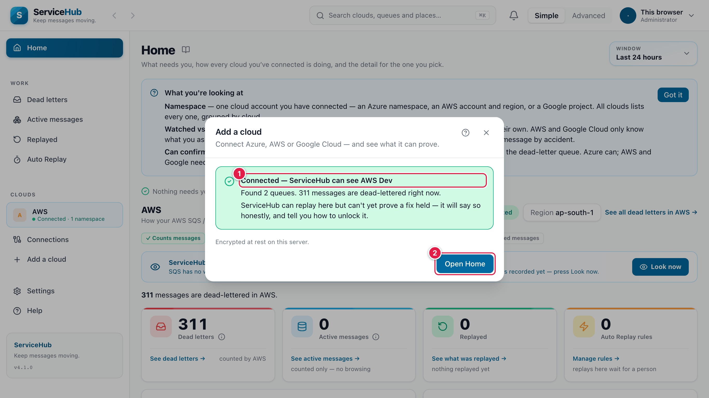


1. The result: how many queues ServiceHub found, how many messages are dead-lettered right now, and whether this cloud can prove a replayed message stayed fixed (AWS cannot yet — it will say so honestly).
2. Open Home — closes the window and shows Home.


## Part 3 — Learn the screens

*Home, and the controls that are on every page.*


### 3.1 Home

Home answers: *what needs me* and *how is each cloud doing*. For AWS it shows what the cloud can do (count messages, record dead letters when you look), the **Look now** button, and the counts. Scroll down for why messages failed, how replays ended, the queues needing attention, the latest dead letters and a live activity list.


1. Window — the period Home counts over (24 hours, 7 or 30 days). It changes what you see, never what happens.
2. Connected, and the region — ServiceHub can reach AWS with your key; the region is the one you chose.
3. What this cloud can do — ticks show what AWS lets ServiceHub do safely. AWS counts messages and records dead letters when you look; it cannot browse active messages or prove a fix held.
4. Look now — asks AWS for its dead letters (up to 100 per queue) and keeps them in ServiceHub. Each one read counts as one delivery attempt, which is why ServiceHub never does it on its own.
5. Dead letters — opens the list of messages that failed and were set aside.
6. Active messages — on AWS this shows counts per queue only; opening a message there would count as a delivery.
7. Replayed — everything put back, by whom, and how it went.
8. Auto Replay rules — opens the rules panel. On AWS a rule always waits for a person, because AWS cannot prove a fix held.
9. Got it — hides this explanation. It does not affect your data.
10. See all dead letters in AWS — opens the Dead letters list for this cloud.
11. Help for this page (the book beside the title) — opens Help on this very page, over it. Every page has one.


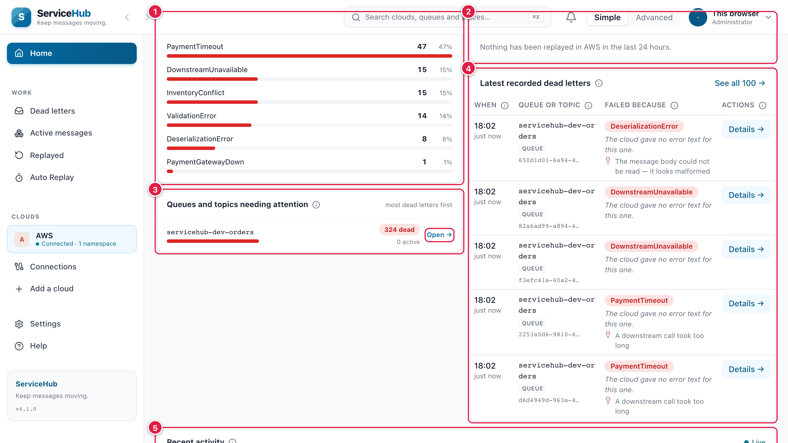


1. Why messages failed — the reasons among the dead letters ServiceHub has recorded, biggest first, with how many each has. It only counts what you have looked at.
2. How replays ended — what happened to the replays in this window. On AWS they stay “watching”, because AWS cannot prove a fix held.
3. Queues and topics needing attention — the queues with the most dead letters first. Open → shows that queue’s dead letters.
4. Latest recorded dead letters — the five most recent ServiceHub has recorded, each with Details →. “See all →” opens the full list.
5. Recent activity — shown in full on the next screenshot.


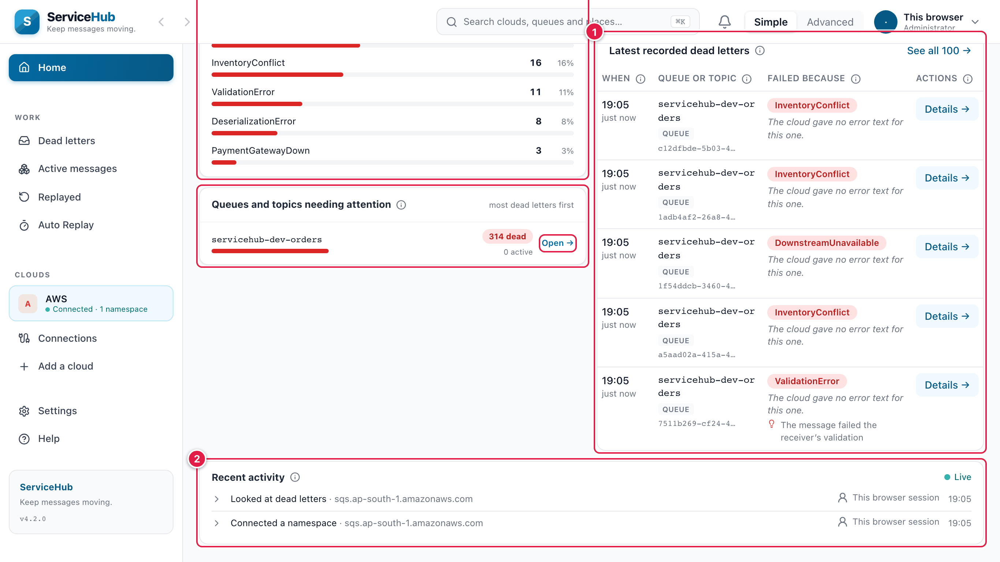


1. The five latest dead letters, each with Details → — the same message view as on the Dead letters tab.
2. Recent activity — what ServiceHub and people did, newest first (Live means it updates by itself). Each line opens to show its detail; nothing here changes anything.
3. Each reason in “Why messages failed” is a link that opens the Dead letters list filtered to that reason; Open → opens that queue’s dead letters.


### 3.2 The bar and the sidebar

These are the same on every page.


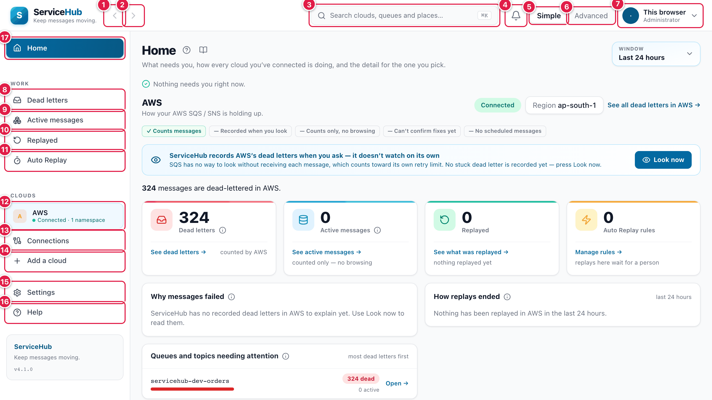


1. Back — returns to the previous place in the app.
2. Forward — goes to the place you came back from.
3. Search (⌘K) — jump to a cloud, queue or page. Searching never changes anything.
4. The bell — the only place the Agent asks you something. A number appears when it needs you.
5. Simple — the two pages where you do the work.
6. Advanced — four read-only pages.
7. You — who ServiceHub records actions as, with your role.
8. Dead letters — messages that failed, with the reason and a Replay button.
9. Active messages — what is waiting now, counted per queue on AWS.
10. Replayed — what was put back and whether it stayed fixed.
11. Auto Replay — rules for retries ServiceHub may do on its own.
12. Your cloud — pick it to see only that cloud. The dot shows the connection is healthy.
13. Connections — your connected clouds, to test or remove.
14. Add a cloud — connect another cloud.
15. Settings — connections, notifications, preferences, access and backup.
16. Help — answers and shortcuts.
17. Home — the overview: what needs attention, what the Agent is doing, and how replays ended.


## Part 4 — Work with dead letters

*The core loop: look, understand, replay, confirm.*


### 4.1 The Dead letters tab

A **dead letter** is a message your consumer failed to process several times, so SQS moved it to the dead-letter queue. The list starts **empty on AWS** even when the queue holds thousands, because reading a dead letter counts as a delivery attempt. Press **Look at AWS's dead letters now**: ServiceHub receives up to 100 per queue, records them, and hands them straight back. It never deletes or moves anything. Press it again to record more; AWS hands back a sample, so a dead letter not seen on a later look stays in the list.


1. Namespace picker — all of AWS, or one account and region.
2. Why the list starts empty — on AWS, reading a dead letter counts as one delivery attempt, so ServiceHub only looks when you ask. It reads up to 100 per queue and keeps them here.
3. Look at AWS’s dead letters now — receives up to 100 dead letters per queue, records them, and hands them straight back. It never deletes or moves anything; it does add one to each message’s delivery count.
4. The empty list — “nothing recorded” does not mean there are none: the queue holds 324. Press Look now to see them.
5. Help for this page — opens Help on this page’s step of the guide. The (?) beside it only re-shows the short explanation.
6. The three tabs — Dead letters, Active and Replayed — switch the list below. The (?) beside the title brings back the short “What you’re looking at” card.
7. Filters and Refresh — Showing, Time window, queue or topic and search narrow the list; Refresh re-reads what ServiceHub has recorded. On AWS Refresh does not look at AWS: only Look now does.


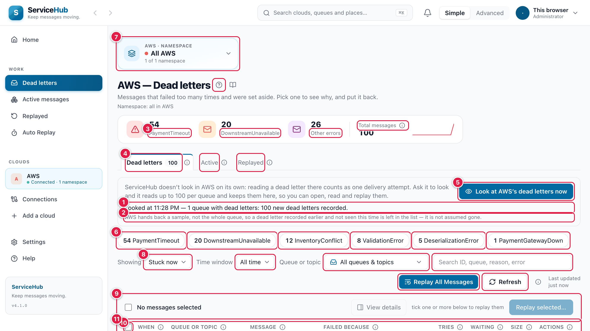


1. What the look found — when it ran, how many queues had dead letters, and how many new ones were recorded.
2. AWS hands back a sample, not the whole queue: a dead letter recorded earlier and not seen this time stays in the list; it is not assumed gone.
3. Why they failed — the biggest reasons among the dead letters recorded, counted.
4. Dead letters tab — the number is how many ServiceHub has recorded (not how many AWS holds).
5. Look again — records any dead letters not seen before. Each look adds one delivery attempt to the messages it reads.
6. Reason chips — click one to show only that reason.
7. The namespace picker, the (?) that re-shows the short explanation, and the Active and Replayed tabs.
8. Filters, Replay All Messages and Refresh — described on the next screenshot, where the table is in view.
9. The selection bar — the tick selects the whole page; View details chooses columns; Replay selected stays dimmed until something is ticked.
10. The tick in the table heading — ticks every row on this page.
11. The table headings — each has an ⓘ that explains that column in a sentence; the next screenshot shows the table itself.


### 4.2 Filters, selection and the table

Narrow the list, tick the messages you want, and use **Details** or **Replay** on a row. Choosing a reason chip filters to that reason (with *show all reasons* at the foot to clear it, and *Select all* for that reason in the selection bar); the list pages at the bottom. Refresh re-reads what ServiceHub has recorded; only Look now asks AWS.


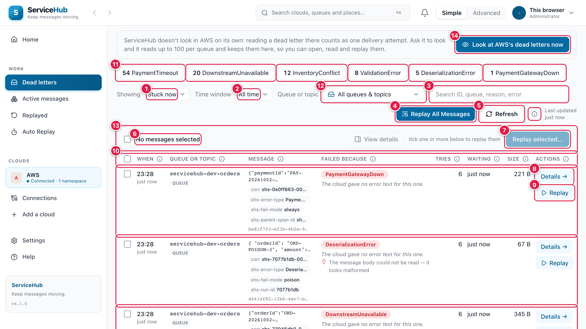


1. Showing — Stuck now, or messages that have since left the queue.
2. Time window — only messages set aside in this period.
3. Search — by message ID, queue, reason or error text.
4. Replay All Messages — opens a preview of every message still stuck in the cloud and namespace you are viewing. It ignores the filters, time window and search here. Nothing is sent until you confirm the preview.
5. Refresh — reads the queue again. It re-reads what ServiceHub has already recorded; it does not look at AWS (only Look now does). The ⓘ beside it says when it was last updated.
6. Selection — tick rows to act on several; this line shows how many.
7. Replay selected — opens the same preview for just the ticked messages.
8. Details — opens the message: why it failed, its body, properties and delivery history.
9. Replay — opens the proposal for this one message. It does not send anything yet.
10. The table — a tick on every row (the one in the heading ticks the whole page), Details and Replay on every row, and an ⓘ About button on each column heading that explains that column in a sentence. “View details” in the heading chooses which columns show.
11. Reason chips — each shows a reason and how many messages have it. Click one to show only those; click it again to show all.
12. All queues & topics — limit the list to one queue or topic.
13. The selection bar — the tick selects every row on this page; View details chooses which columns show; Replay selected stays dimmed until something is ticked.
14. Look at AWS’s dead letters now — records any dead letters not seen before. Each look adds one delivery attempt to the messages it reads.


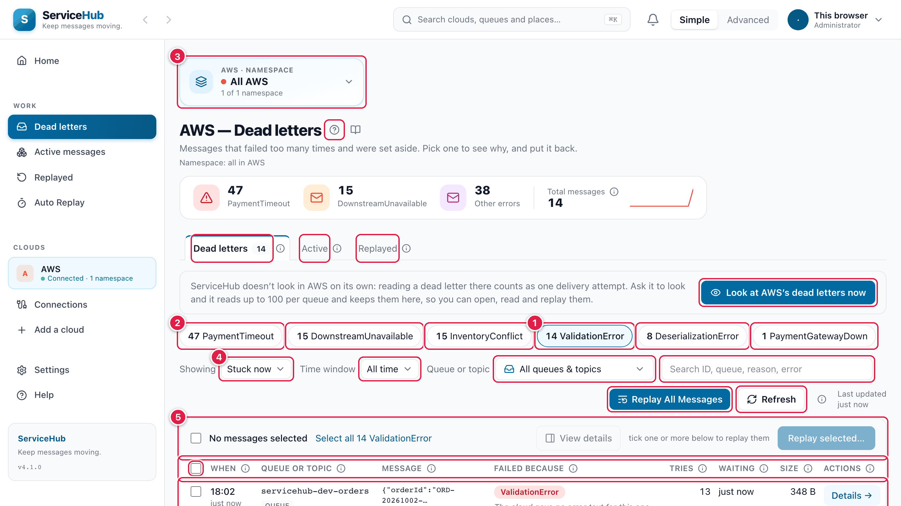


1. Filtering by a reason — the chosen reason is highlighted and “show all reasons” clears the filter. The list below shows only that reason.
2. The reason chips — click one to show only that reason.
3. The namespace picker, the (?) that re-shows the short explanation, and the three tabs.
4. Filters, Replay All Messages, Refresh and Look now — described on the earlier screenshots.
5. The selection bar (which now offers “Select all” for this reason), the table headings and the rows, as on the earlier screenshots.


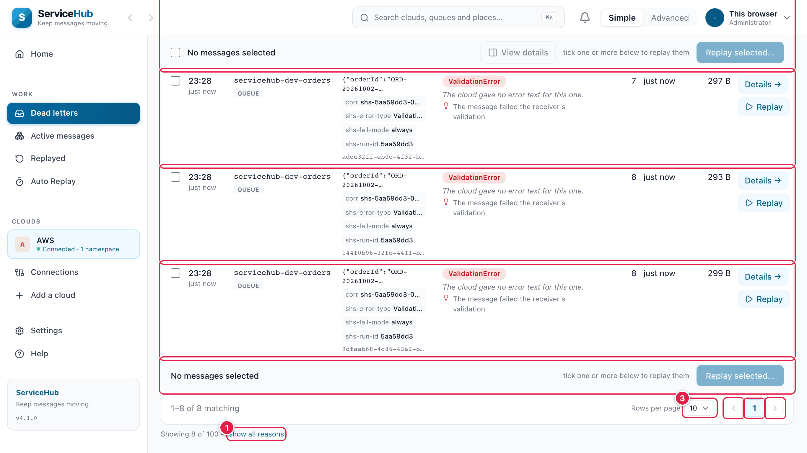


1. Show all reasons — at the foot of a filtered list too: clears the reason filter and brings every recorded dead letter back.
2. The rows of this reason only, and the selection bar repeated underneath.
3. Paging — rows per page, previous, the page numbers and next.


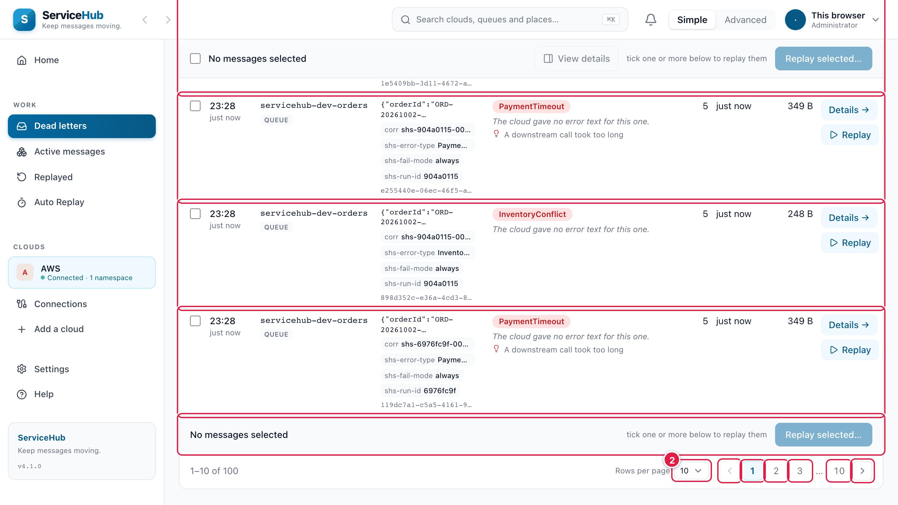


1. The foot of the table — the same ticks, Details and Replay on every row, and the selection bar repeated underneath.
2. Paging — rows per page, previous, the page numbers and next. The list holds up to 100 dead letters per queue from each look.


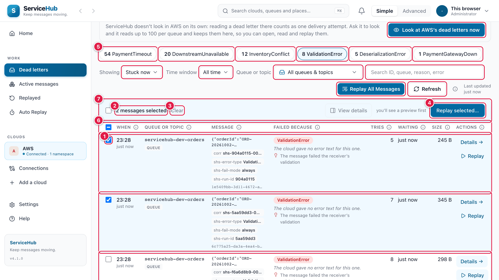


1. Row tick — choose which messages to act on. The header tick chooses every row on the page.
2. Selection count — how many messages are ticked.
3. Clear — unticks everything. Nothing else changes.
4. Replay selected — opens the bulk preview for just these messages. Nothing is sent yet.
5. The filter row — reason chips, Showing, Time window, queue, search, Replay All Messages and Refresh, each explained on the previous screenshot.
6. The table — the ticks, Details and Replay on every row, and the whole-page tick in the heading.
7. The selection bar — the whole-page tick and View details (which columns show).


### 4.3 Open a message

**Details** opens the message: the reason, a plain-words reading of why it failed (marked *Suggestion* because it is a reading, not something AWS reported), and the body. The tabs show the body, the attributes your sender attached, what SQS recorded, and the delivery count — which includes ServiceHub's own looks. At the bottom are **Replay this message** and **Purge instead…**, which only opens a form.


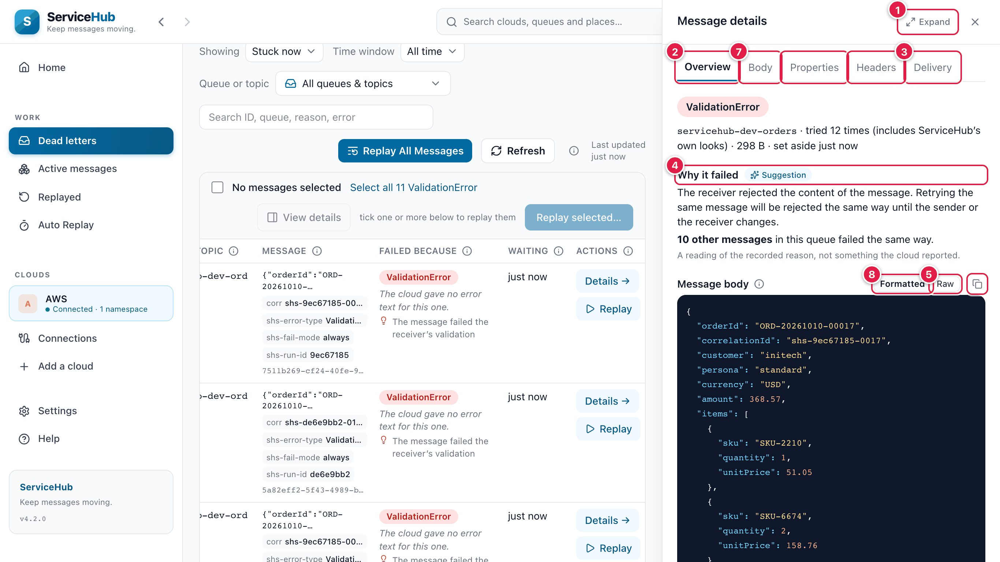


1. Expand — widens the panel for long messages.
2. Overview — reason, why it failed, the body with the bad field marked.
3. Delivery — how many times the message was received (ServiceHub’s own looks count) and when AWS set it aside.
4. Why it failed — a plain-words reading of the recorded reason. Marked Suggestion: it is a reading, not something AWS reported.
5. Formatted / Raw — switch the body view.
6. Replay this message — opens the proposal. Nothing is sent from here.
7. Body, Properties and Headers — the other tabs; each is shown below.
8. Formatted and Copy body — pretty-print the body, or copy it to your clipboard. The copy stays in your browser.
9. Copy message ID — copies the ID so you can search for it elsewhere.


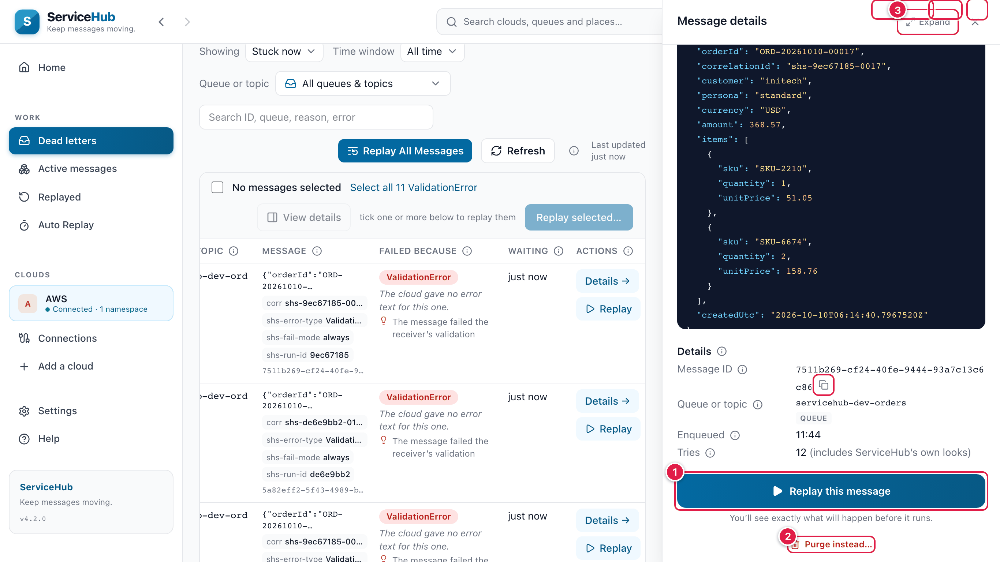


1. Replay this message — opens the proposal. Nothing is sent from here.
2. Purge instead… — for a message not worth replaying. It only opens a small form: you give a reason, and nothing is deleted until you press “Purge for good”. Deleting is permanent, goes through the same checks as a replay, and is recorded with your name and reason.
3. Expand, the body view and the copy buttons — as on the previous screenshots.


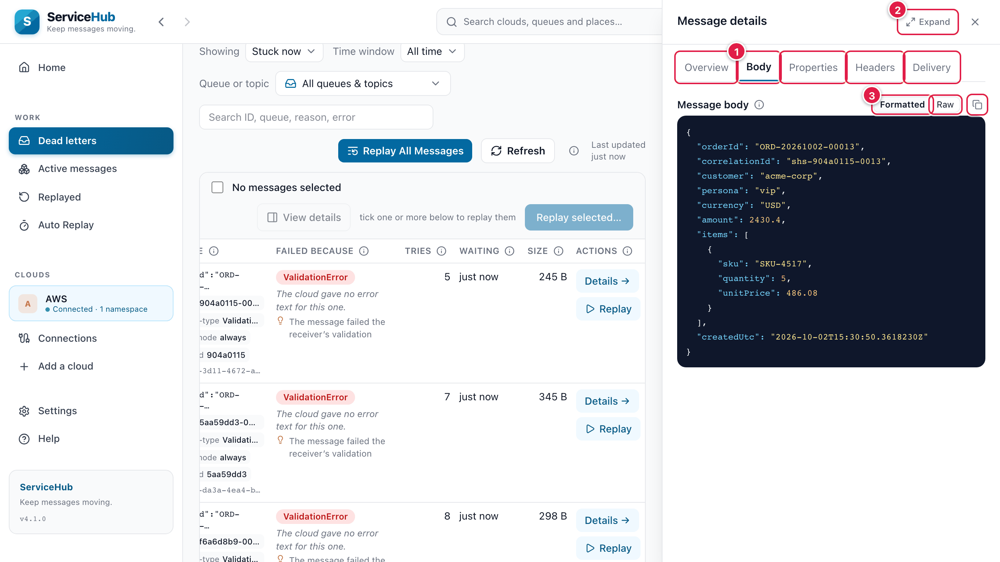


1. The message body exactly as it was sent.
2. Expand widens the panel; the other tabs (Overview, Body, Properties, Headers, Delivery) switch what is shown.
3. Formatted / Raw switch the view; Copy body copies it to your clipboard.


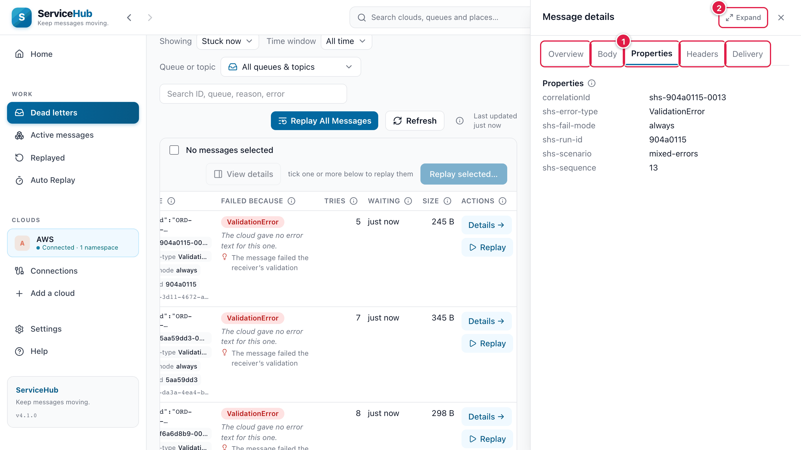


1. The message attributes the sender attached (for example shs-error-type) and the SQS system attributes.
2. Expand widens the panel; the other tabs (Overview, Body, Properties, Headers, Delivery) switch what is shown.


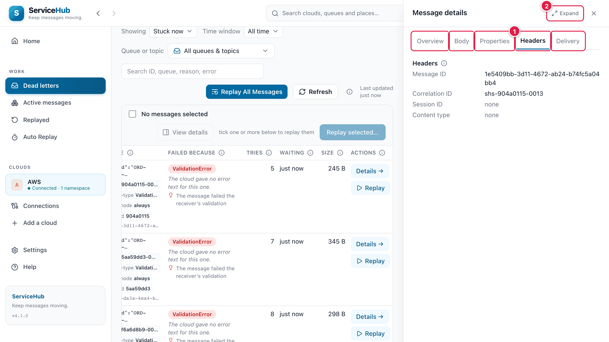


1. What SQS recorded: the sent time, the first receive time, how many times it was received, and which queue it was dead-lettered from.
2. Expand widens the panel; the other tabs (Overview, Body, Properties, Headers, Delivery) switch what is shown.


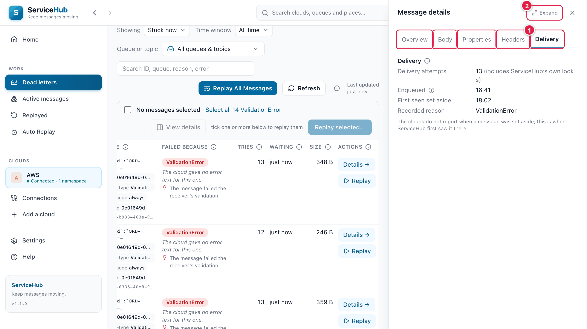


1. How many times AWS delivered it before setting it aside. ServiceHub’s own looks are counted in this number.
2. Expand widens the panel; the other tabs (Overview, Body, Properties, Headers, Delivery) switch what is shown.


### 4.4 Replay one message — you see the proposal first

**Replay** never sends straight away. It shows what will happen (the message goes back to the queue it came from and the dead-letter copy is removed once AWS accepts the new one), every safety check, and what happens afterwards. Only the blue button sends.


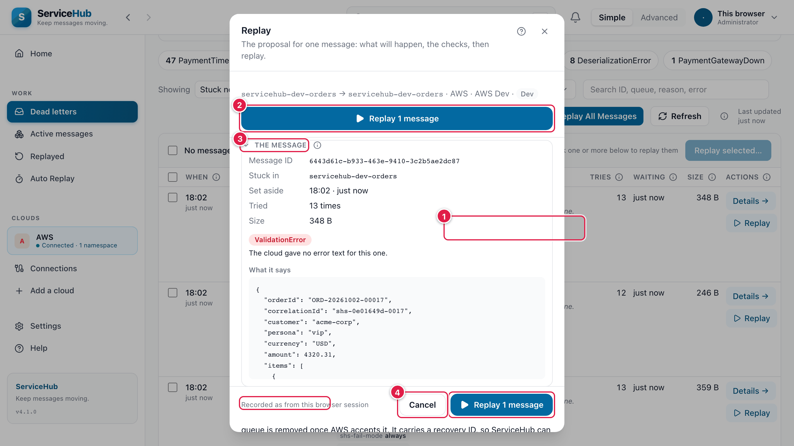


1. The message — what is about to be replayed: ID, where it is stuck, when and why it was set aside, and its body.
2. Replay 1 message — sends it back. It is only sent when you press this.
3. What will happen, Safety checks, After it runs — fold open or closed; the next screenshot shows them open.
4. Cancel — closes without sending.


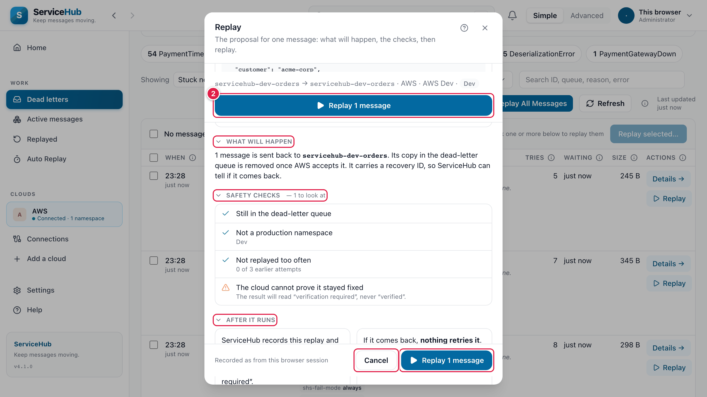


1. The four sections of the proposal — The message, What will happen, Safety checks and After it runs. Each folds open or closed; nothing here sends anything.
2. Replay 1 message sends it; Cancel closes without sending. Both are repeated at the foot of the window so they are always in reach.


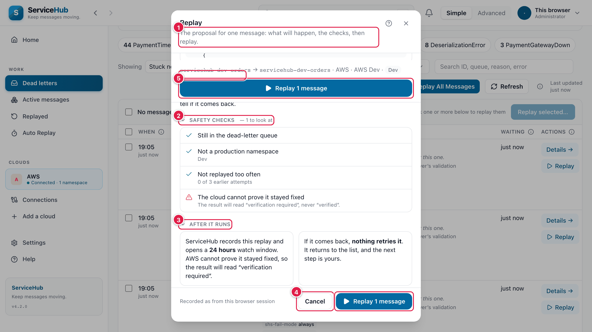


1. What will happen — where it goes and what happens to the dead-letter copy (it is removed once AWS accepts the new copy).
2. Safety checks — every check that must pass; a failing one blocks the replay and says why.
3. After it runs — ServiceHub records it and watches for 24 hours; if it comes back, nothing retries it.
4. Cancel — closes without sending.
5. The folding headings and the Replay button repeated at the end of the window.


### 4.5 Replay several at once

Tick messages (or use **Replay All Messages**) to get a preview: how many will be replayed, which are held back by a safety check, grouped by how they failed and where each goes. When the failures look like bad data, it suggests replaying one first. They are sent one at a time, each re-checked, and the run stops by itself after five sends in a row that are not accepted. Further down is **Purge instead…** — a separate, deliberate step to delete messages that are not worth replaying.


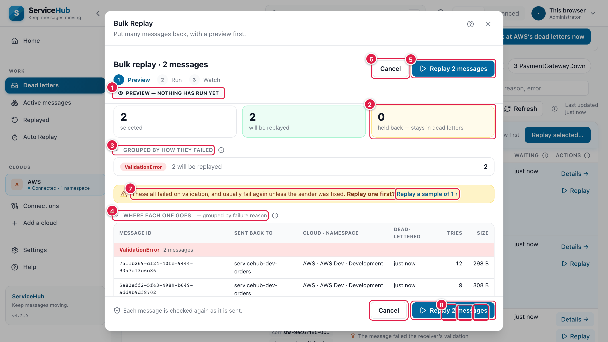


1. Preview — nothing has run yet. Step 1 of Preview → Run → Watch.
2. Held back — messages that fail a safety check stay in dead letters; they are never forced.
3. Grouped by how they failed — so you can see whether you are fixing one problem or several.
4. Where each one goes — the queue each message will be sent back to.
5. Replay N messages — sends them one at a time, re-checking each. You can stop partway.
6. Cancel — nothing is sent.
7. A warning when the failures look like bad data — Replay one first? sends a sample of one, so you can see whether it holds before sending the rest.
8. Page controls — move through the list when more messages are chosen than fit on one page.


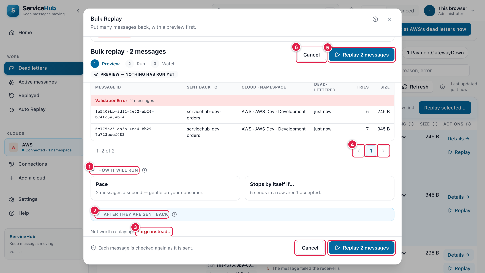


1. How it will run — the pace (a few messages a second, gentle on your consumer) and the automatic stop: five sends in a row that are not accepted.
2. After they are sent back — folds open to say what ServiceHub does next: it keeps watching, and on AWS it records each one as “verification required”, never as fixed.
3. Purge instead… — for messages not worth replaying. It does not delete anything yet: it opens a separate step that asks why, shows what would be purged, and needs you to type a confirmation. Deleting is for good, and each purge is recorded with your name and reason.
4. Page controls — move through the list when more messages are chosen than fit on one page.
5. Replay N messages — sends them one at a time, re-checking each. You can stop partway.
6. Cancel — nothing is sent.


### 4.6 The result

ServiceHub says plainly what happened and records it under Replayed. On AWS the result will read **Verification required**: the message was sent back, but AWS cannot prove the dead-letter queue stayed empty, so ServiceHub never says it held. If a consumer is running on the queue it may pick the message up straight away.


1. The result, in plain words: it was sent back, and ServiceHub will watch for it coming back.
2. It is recorded, with who did it, and shows under Replayed (and in Advanced → Recovery Ledger). On AWS the result will read “Verification required”: this cloud cannot prove the queue stayed empty, so ServiceHub never says it held.
3. Done — closes the window.
4. Active messages / Replayed — jump to where you can watch this message.


## Part 5 — Afterwards

*Did it hold?*


### 5.1 Replayed

Every replay, who did it, and how it ended. On AWS a replay stays *Watching* for its window and is then recorded as *verification required* — never as success — until a person judges it.


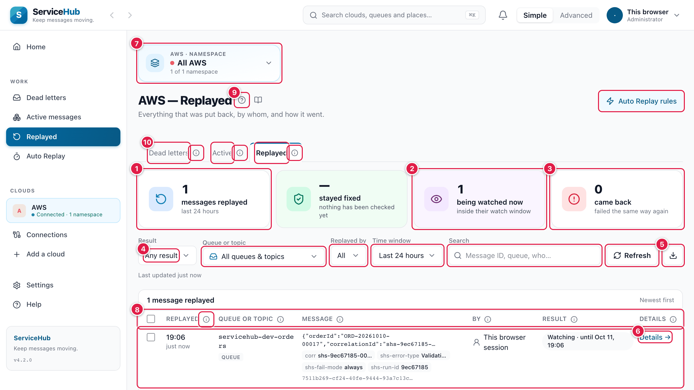


1. Messages replayed — how many were put back in the window.
2. Being watched — replays still inside their watch window. AWS cannot prove whether each stayed fixed, so they wait for you to judge.
3. Came back — messages that failed the same way again. Nothing retries them on its own.
4. Result filter — stayed fixed, being watched, came back.
5. Download — saves this list as a file. It does not change anything.
6. Details — the full record of this replay.
7. Filters — namespace, queue or topic, result, time window and search; Refresh reads the list again. They change what is listed, never what happened.
8. The table — a tick per replay (the heading tick ticks the page) and Details on each row.
9. What am I looking at? — a short reading guide. Auto Replay rules — opens the rules page. All and Last 24 hours — the result and time filters.
10. The three tabs — Dead letters, Active and Replayed. They switch the list below without leaving the page.


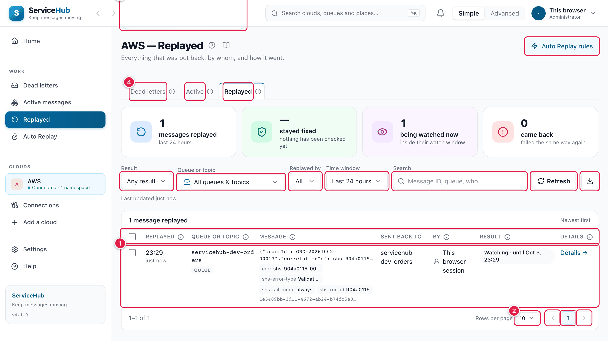


1. The replays, newest first — each with a tick and Details.
2. Paging — rows per page, previous, the page numbers and next.
3. Filters — result, queue or topic, who replayed it, time window and search; Refresh re-reads the list and Download as CSV saves it as a file. They change what is listed, never what happened.
4. The three tabs, the Auto Replay rules button and the table headings, as on the previous screenshot.


### 5.2 Active messages

What is waiting right now, **counted per queue**. ServiceHub does not open active messages on AWS, because there is no way to look at one without it counting as a delivery — watching could push a message into the dead-letter queue by itself. For the same reason **Follow live** is not offered here. **Send a message** is the one control here that changes a queue.


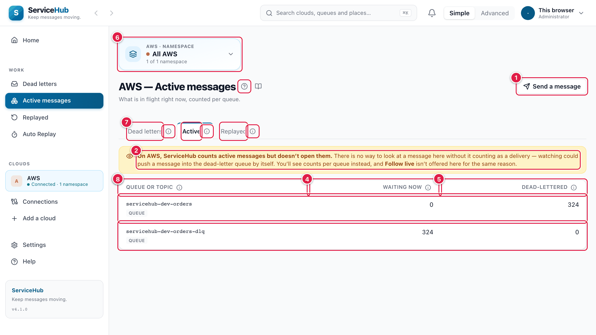


1. Send a message — puts a test message on a queue. This does change the queue, so use a dev queue.
2. Why there is no message list — on AWS there is no way to look at a message without it counting as a delivery, and watching could push it into the dead-letter queue by itself. So ServiceHub shows counts per queue, and “Follow live” is not offered.
3. Namespace — all of AWS, or one account and region.
4. The three tabs — Dead letters, Active and Replayed — each with an ⓘ that explains it.
5. The table — one row per queue found in this region, including the dead-letter queue itself: Queue or topic, Waiting now (ready to be received) and Dead-lettered (moved here after failing too often). AWS counts them; ServiceHub never opens them. The ⓘ on each heading says what that count means.


## Part 6 — Auto Replay

*Let ServiceHub retry a kind of failure on its own — only once it has earned it.*


### 6.1 Rules

A rule names a failure ServiceHub has already seen and how carefully to retry it. It never runs in Production, goes through the same safety checks as you, and **stops itself** if fewer than half of its replays stay fixed. On AWS a rule always waits for a person, because AWS cannot prove a fix held.


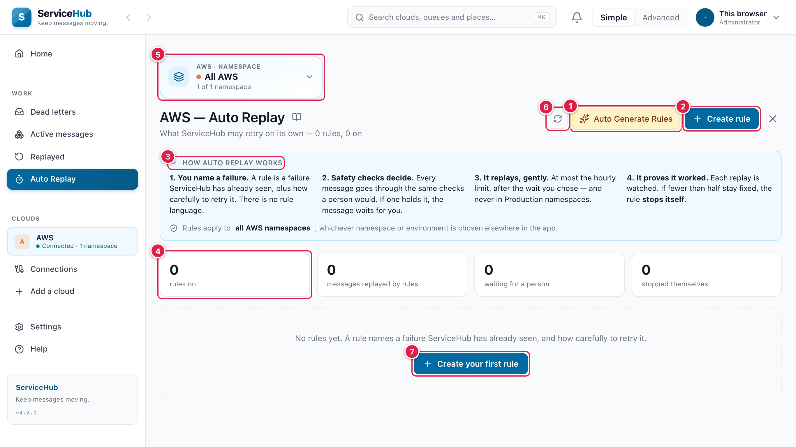


1. Auto Generate Rules — proposes rules from failures already seen. It only proposes; you decide what to turn on.
2. Create rule — start a rule from a failure you have already seen.
3. How it works — you name a failure, safety checks decide, it replays gently, it proves it worked and stops itself if it does not.
4. Totals — rules on, replayed by rules, waiting for a person, stopped themselves.
5. Namespace — Auto Replay rules apply to every AWS account and region you connected; this picks which one the page shows.
6. Refresh rules — reads the rules again.
7. Create your first rule — the same as Create rule, shown while there are none.


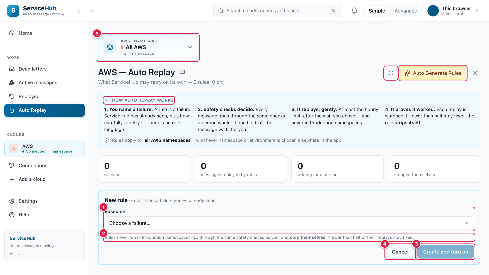


1. Based on — pick a failure ServiceHub has already seen. A rule can only be made from a seen failure.
2. The guarantees: never in Production, same safety checks as you, and it stops itself if fewer than half stay fixed.
3. Create and turn on — enabled once you choose a failure.
4. Cancel — nothing is created.
5. The page header — namespace, Refresh rules, Auto Generate Rules (proposes only) and the “How Auto Replay works” fold, as on the previous screenshot.


## Part 7 — Settings, Help and Advanced

*Everything else.*


### 7.1 Settings

Connections, Notifications (Slack, Teams, any webhook — sent only when the Agent stops and needs a person), Preferences, Access & security (roles and the emergency stop) and Backup.


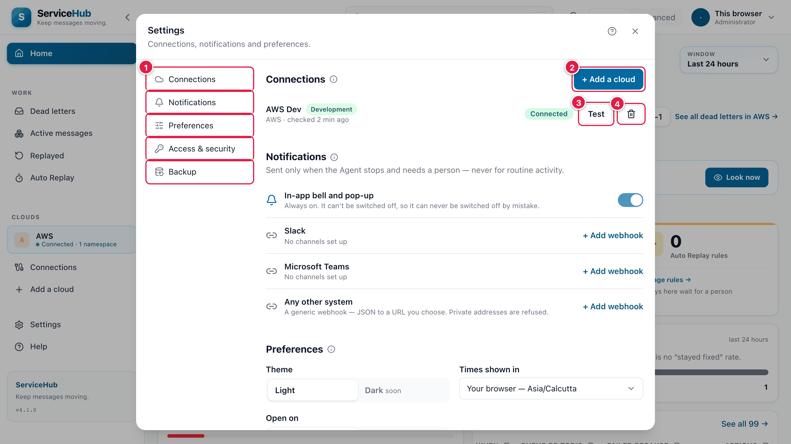


1. Sections — Connections, Notifications, Preferences, Access & security and Backup. Each jumps to that part of this window.
2. Add a cloud — connect another cloud.
3. Test — checks the connection now and shows the result. Reads only.
4. Remove — forgets this connection and its stored credential. It does not delete anything in AWS.


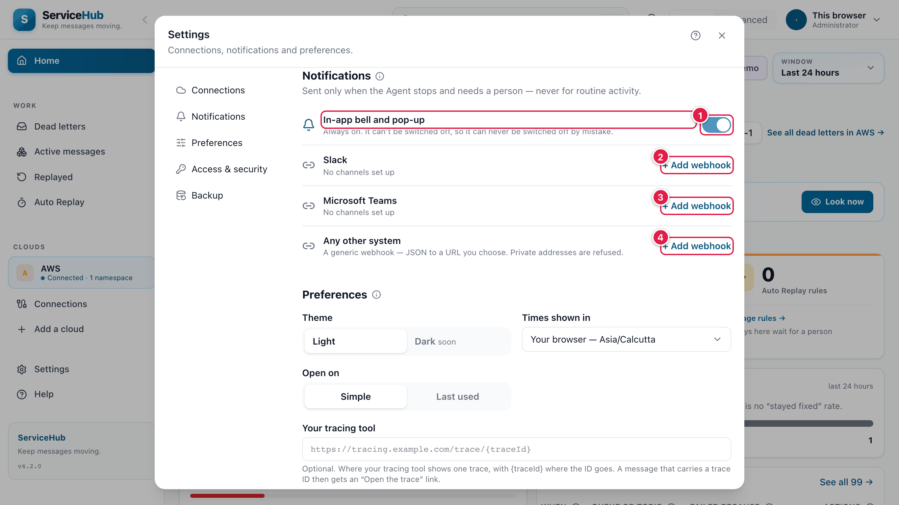


1. In-app bell and pop-up — always on. It cannot be switched off, so it can never be switched off by mistake.
2. Add webhook (Slack) — paste a Slack incoming-webhook URL to also get the message there.
3. Add webhook (Microsoft Teams) — the same for a Teams channel.
4. Add webhook (any other system) — JSON to a URL you choose. Private and internal addresses are refused.


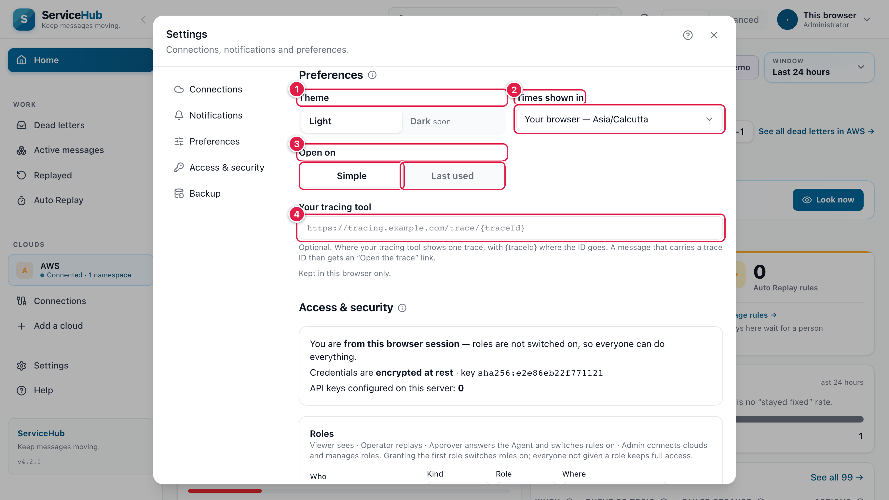


1. Theme — Light today; Dark is marked soon.
2. Times shown in — your browser’s time zone, or UTC. It changes how times are displayed, never the data.
3. Open on — start in Simple every time (Simple), or where you last were (Last used). Kept in this browser only.


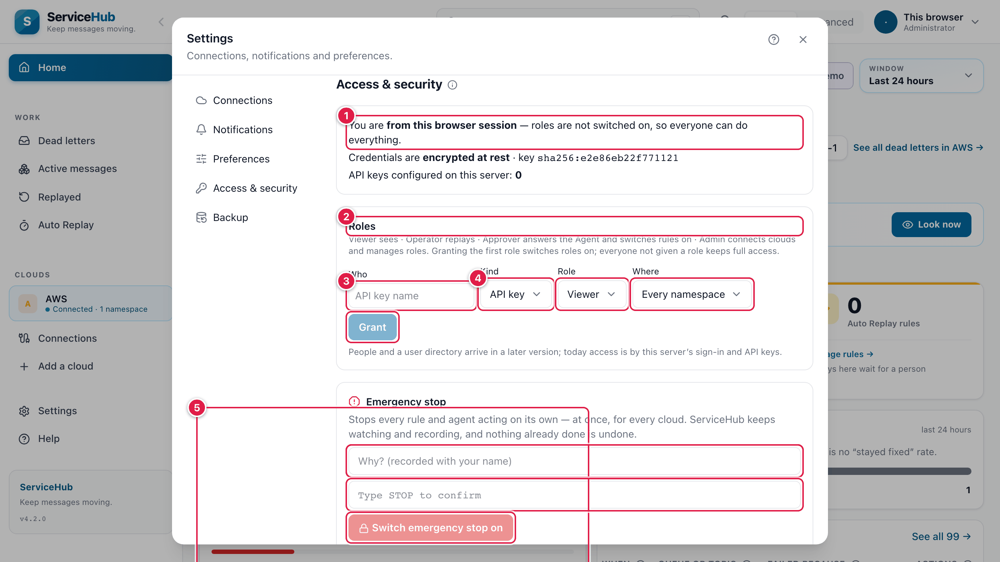


1. Who you are — shown from this browser session until roles are switched on. The credential key fingerprint shows what encrypts stored credentials.
2. Roles — Viewer sees, Operator replays, Approver answers the Agent, Admin connects clouds. Giving the first role switches roles on.
3. Who — the API key name or signed-in user the role is for.
4. Kind, Role, Where and Grant — choose whether it is a key or a person, the role, whether it applies everywhere or to one namespace, then Grant. Granting the first role switches roles on for everyone.
5. Emergency stop — type STOP, say why, and switch it on to halt every automatic action at once. Nothing already done is undone; switch it off to resume.


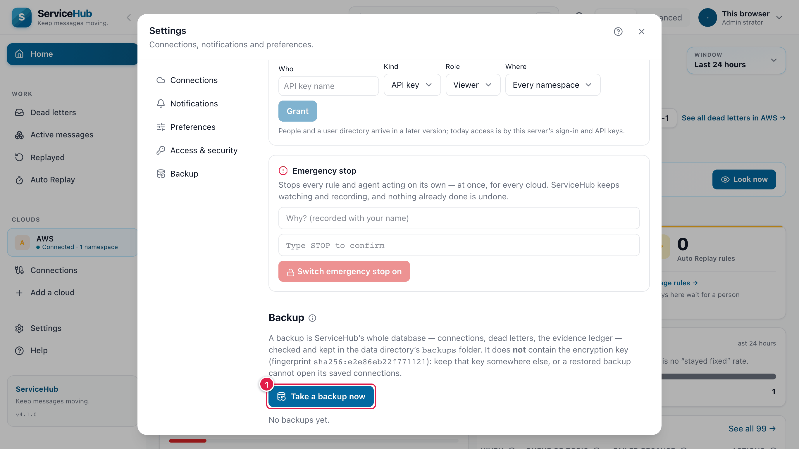


1. Take a backup now — saves a consistent copy of ServiceHub’s own database (not of your clouds).


### 7.2 Help, search and the bell

Help is a panel over whatever you are doing. Search (⌘K) jumps anywhere. The bell is the only place the Agent asks you something.


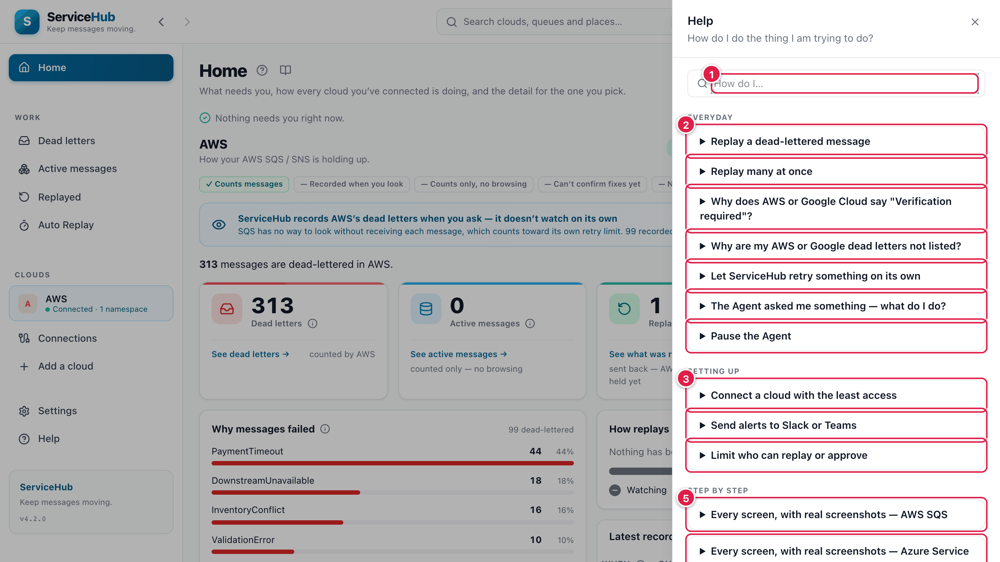


1. Search — type what you are trying to do.
2. An answer — click to open it in place; each links to the screen it is about.
3. Setting up answers — connecting, alerts and who may replay.
4. Keyboard shortcuts — only ones that work are listed.
5. Step by step — one guide per cloud, each with every screen as a real screenshot and a numbered key for every button and link. Yours (AWS) is listed first. The same guides are the articles in docs/clouds.


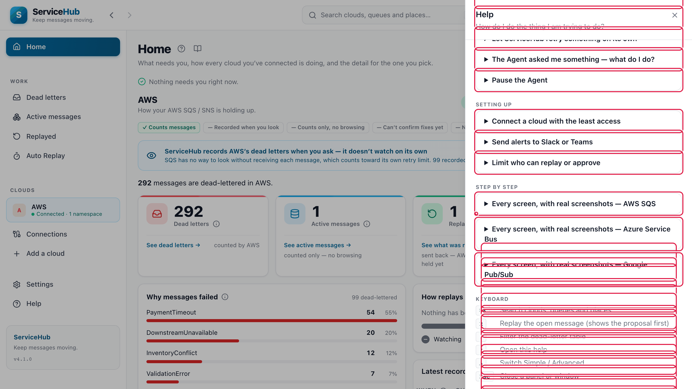


1. Answers and guides — click one to open it in place; the “Every screen” entries are one guide per cloud, each a real screenshot with a numbered key for every button and link.


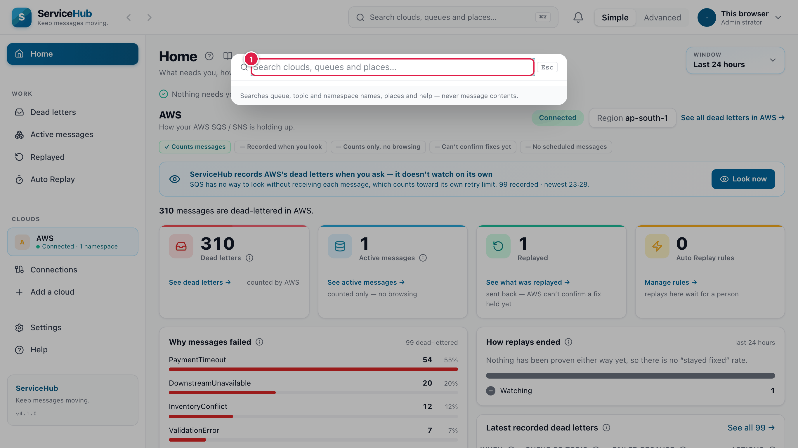


1. Search box — type part of a cloud, queue or page name. Enter opens the first result. Esc closes. Searching never changes anything.


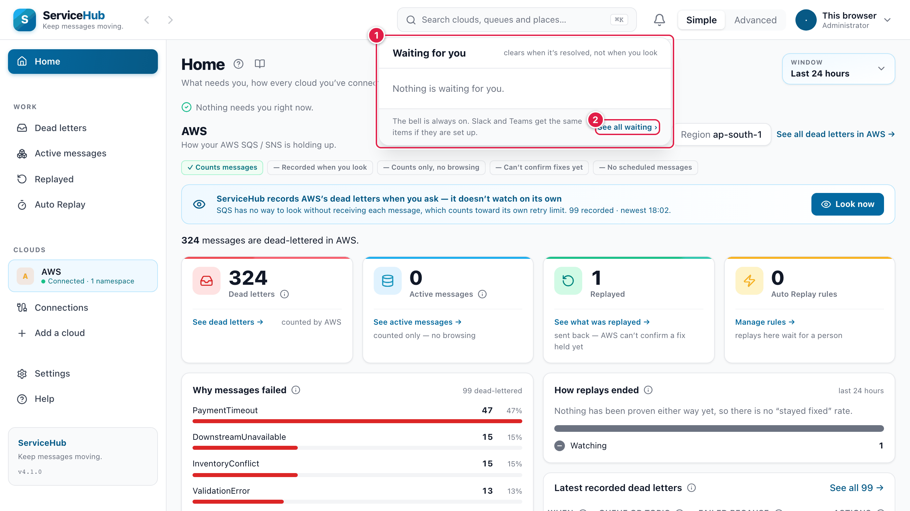


1. The bell — the only place the Agent asks you something. It lists what is waiting for you and clears when it is resolved, not when you look.
2. See all waiting — opens the full list of what needs a person.


### 7.3 The Advanced pages (read-only)

Advanced never changes anything. **Overview** summarises recovery, authority and agents, and says why AWS cannot verify; the **Recovery Ledger** is the tamper-evident record of every action; **Failure Signatures** groups failures and shows what each has earned; **Agents** lists what is acting and what is only watching.


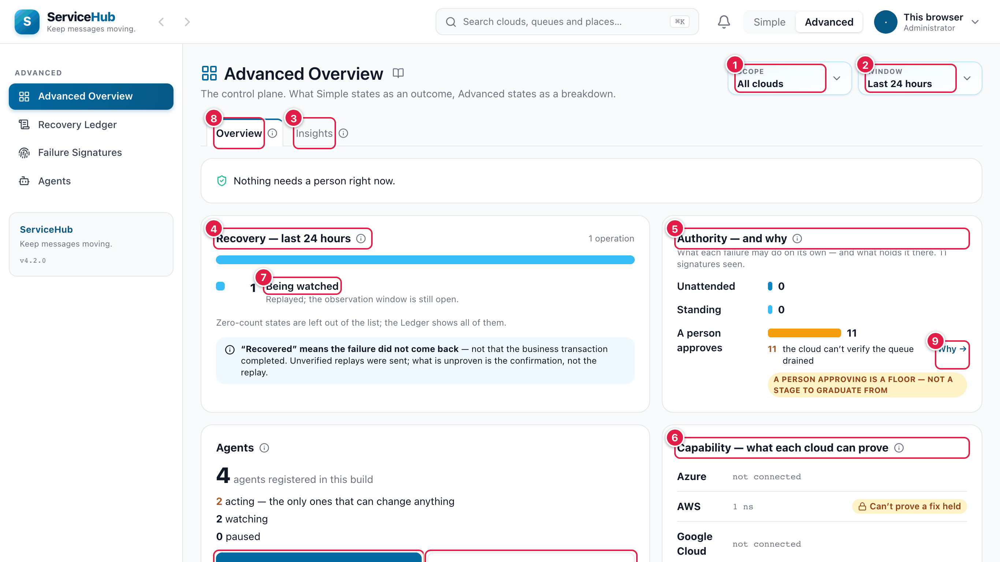


1. Scope — all clouds, or one.
2. Window — the period the page counts over.
3. Insights — patterns ServiceHub noticed across your failures.
4. Recovery — how replays ended. “Recovered” means it did not come back, not that the business transaction completed.
5. Authority — what each failure may do on its own, and what holds it there.
6. Capability — what each cloud can prove.
7. Being watched, All agents → and Recovery Ledger → — jump to the Agents page and the Recovery Ledger. They only open pages; nothing changes.
8. Overview — the page you are on; the other three Advanced pages are in the bar at the top.
9. Why → — explains why this cloud cannot yet prove a replayed message stayed fixed, and what would unlock it. It opens Help; nothing changes.


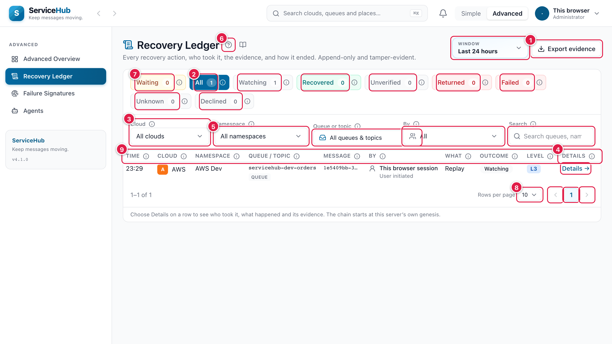


1. Export evidence — downloads the ledger so it can be verified offline. It changes nothing.
2. Outcome chips — Waiting, Watching, Recovered, Unverified, Returned, Failed, Unknown, Declined. Recovered and Unverified are never counted together.
3. Filters — cloud, namespace, queue or topic, who did it, and search.
4. Details — who took the action, what happened and its evidence. Each entry carries a fingerprint of the one before it.
5. Filters and entries — namespace, queue or topic, who, and search narrow the list; each entry opens to show its evidence.
6. What am I looking at? — a short reading guide for this page. Window — the period it counts over.
7. Outcome chips with counts — click one to list only those entries; All shows everything again.
8. Paging — how many rows per page, previous, the page number and next.
9. The table headings — each has an ⓘ that explains that column in a sentence.


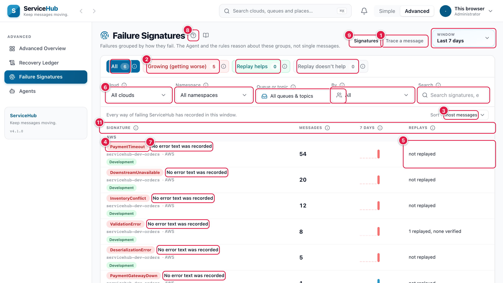


1. Trace a message — follow one message across clouds by its ID.
2. Growing — signatures whose recent days hold at least twice what earlier days did.
3. Sort — most messages, or others.
4. A signature — one way of failing: the same queue and the same kind of error, so many messages become one thing to reason about.
5. Replays — how many of these were replayed and how many were verified to have held. On AWS none can be verified, and this says so.
6. Filters — cloud, namespace, queue or topic, who, and search.
7. Each signature row — opens to show the failures grouped under it and what each replay did.
8. What am I looking at? — a short reading guide. Window — the period counted.
9. Chips — Signatures, All, Replay helps, Replay doesn’t help. Click one to list only those.
10. Paging — rows per page, previous, the page number and next.
11. The table headings — Signature, Messages, Days and Replays, each with an ⓘ that explains it.


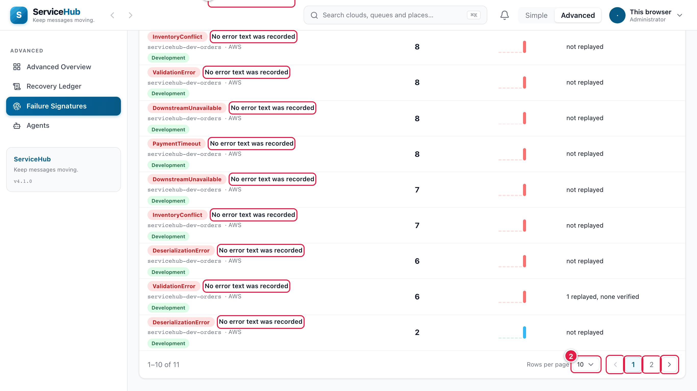


1. Each signature row — opens to show the failures grouped under it and what each replay did.
2. Paging — rows per page, previous, the page numbers and next.
3. The controls above the list — Signatures, Trace a message, the filters, search, sort, and the ⓘ About buttons on the headings — as on the previous screenshot.


1. Acting agents — the only ones that can change anything, and only after the same safety checks you get.
2. Watching agents — they only look and record.
3. Pause — stops that agent acting. It is the one thing Advanced can do, because it only removes authority. Nothing it already did is undone.
4. Learn more — a short explanation of how agents work.
5. Health summary, agent rows and Open — the summary says whether every agent is running normally; a row opens that agent’s details; Open goes to the screen the agent works through.
6. What am I looking at? — a short reading guide for this page.


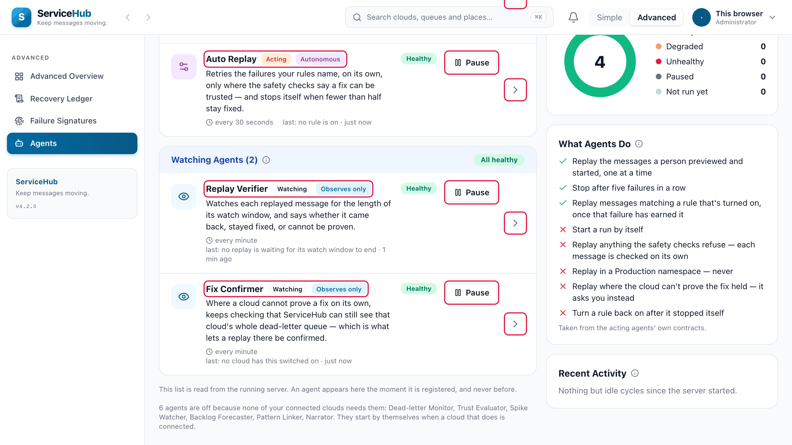


1. Watching agents — they only look and record; they cannot change anything.
2. Each agent row opens to show what it may and may not do; Open goes to the screen it works through; Pause (acting agents only) stops it acting.
3. Learn more — a short explanation of how agents work.


---

## If something goes wrong

- **Connect says the key is invalid or the signature does not match.** Check the Access key ID and Secret access key were copied whole, with no spaces, and that the key is **Active** (IAM → the user → Security credentials). A secret cannot be shown again: if you lost it, create a new key.
- **Connect works but finds 0 queues.** Check the **region** — queues in another region are not seen — and that the policy includes `sqs:ListQueues` with Resource `*`.
- **Dead letters stays empty after Look now.** The dead-letter queue may really be empty, or the policy lacks `sqs:ReceiveMessage` on the dead-letter queue's ARN. Make sure both queue ARNs are in the policy's Resource list.
- **Replay is unavailable or refused.** The policy lacks `sqs:SendMessage` (to put the copy back) or `sqs:DeleteMessage` (to remove the dead-letter copy), or the main queue's ARN is missing from Resource.
- **A looked-at message seems stuck for a while.** The policy lacks `sqs:ChangeMessageVisibility`, so ServiceHub cannot hand a message back at once; SQS releases it after its visibility timeout (30 seconds by default). Add the action.
- **The count is not exactly what the console shows.** SQS counts are approximate and can lag a minute. Look now records up to 100 per queue, so the Dead letters tab can show fewer than the queue holds.
- **Why does every replay say “Verification required”?.** ServiceHub can prove a fix held only where the cloud can show the dead-letter queue stayed empty. AWS cannot, so ServiceHub records the replay honestly instead of calling it fixed.


## Stopping and cleaning up

To stop ServiceHub watching AWS: **Settings → Connections → Remove**. That forgets the connection and its stored credential on the ServiceHub server;
it deletes nothing in AWS. To revoke access in AWS, make the access key **Inactive** or delete it (IAM → the user → Security credentials), and delete the user
if you no longer need it. If you created the queues only to try ServiceHub, delete them in SQS so nothing keeps costing money.
