# ServiceHub on Azure Service Bus — step by step, with real screenshots

This guide takes you from nothing to a working ServiceHub on **Azure Service Bus**, one screen at a time. Every picture is the real
application (or the real Azure portal) — not a mock-up — with numbered markers; the numbered list under each picture says what that control
does **and what it will not do**.

**What you will do**

1. In the Azure portal, make a policy just for ServiceHub, and copy its connection string.
2. Connect Azure in ServiceHub and check it can see your queues.
3. Find a dead-lettered message, understand why it failed, and replay it safely.
4. See that the replay held, and learn what Auto Replay, Settings and the Advanced pages show.

**What you need**

| You need | Why |
|---|---|
| An Azure Service Bus namespace (Standard or Premium for topics; queues work on every tier) | ServiceHub reads what is in it |
| Permission in Azure to create a *Shared access policy* on that namespace | You will make a ServiceHub-only credential |
| **Local Authentication: Enabled** on the namespace | ServiceHub connects with a connection string (shared access key). If your organisation disables it, use a namespace where it is on |
| ServiceHub running (see the README) | You will open it in a browser |

> **Cost.** Looking at Azure from ServiceHub is free of delivery side-effects: on Azure a *peek* is not a delivery, so reading a queue never
> consumes a message or adds a delivery attempt. Your normal Service Bus charges apply; ServiceHub adds none of its own.

---

## Part 1 — In the Azure portal

*Do these first. Each step shows the real portal.*

### 1.1 Open your Service Bus namespace

Sign in to the Azure portal, search for **Service Bus** and open your namespace. Note the **Host name** (it ends in `.servicebus.windows.net`) and that **Local Authentication** is *Enabled*. In the left menu, **Settings → Shared access policies** is where the next step happens.

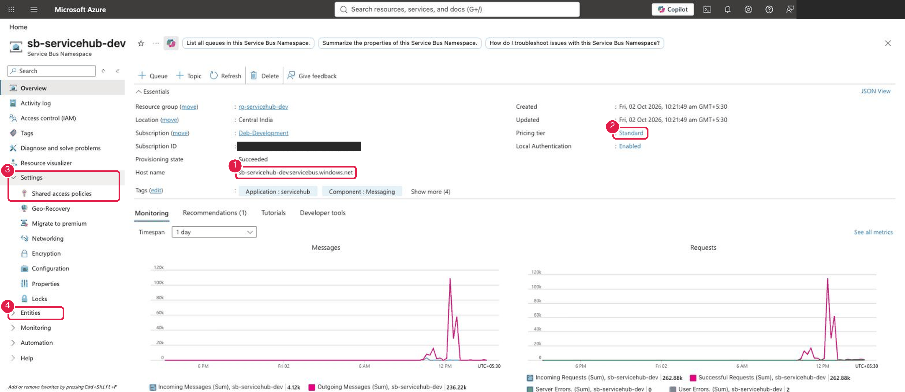

1. Host name — the address of your namespace. Your connection string begins Endpoint=sb:// followed by this name.
2. Pricing tier — Standard or Premium. Basic has no topics; queues work on every tier.
3. Settings → Shared access policies — where you create and copy the connection string ServiceHub uses.
4. Entities — your Queues and Topics live here.

### 1.2 Shared access policies — and why not to reuse the default

Every namespace has `RootManageSharedAccessKey`, a default key shared by everything that touches the namespace. Give ServiceHub its **own** policy instead, so you can revoke it later without disturbing anything else.

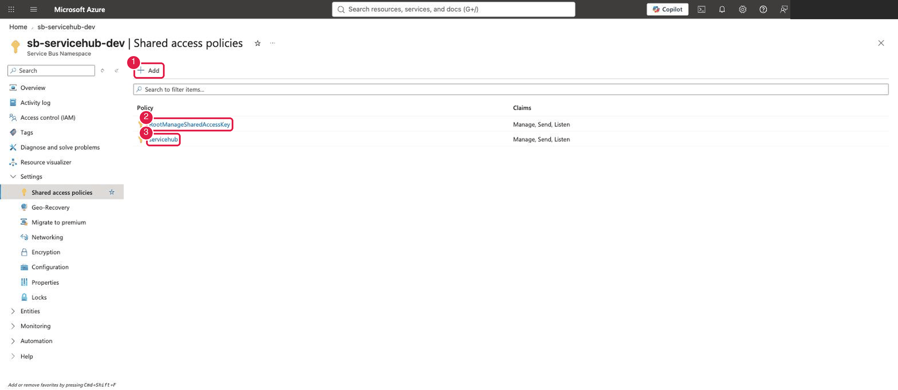

1. Add — creates a new policy. Make one just for ServiceHub, so you can revoke it without touching anything else.
2. RootManageSharedAccessKey — the namespace's default key, shared by everything. Do not hand this one to ServiceHub.
3. Any policy you already have for another tool — better not to share it. Give ServiceHub its own.

### 1.3 Create a ServiceHub-only policy

Choose **Add**, name it (we use `servicehub-app`), tick **Manage** — Azure then ticks **Send** and **Listen** for you — and **Create**. Why Manage? Azure only lets a *Manage* policy **list** your queues and **count** their messages; with Listen and Send alone ServiceHub cannot even see which queues exist (Azure answers *401: Manage, EntityRead claims required*). ServiceHub uses *Send* only when you press Replay.

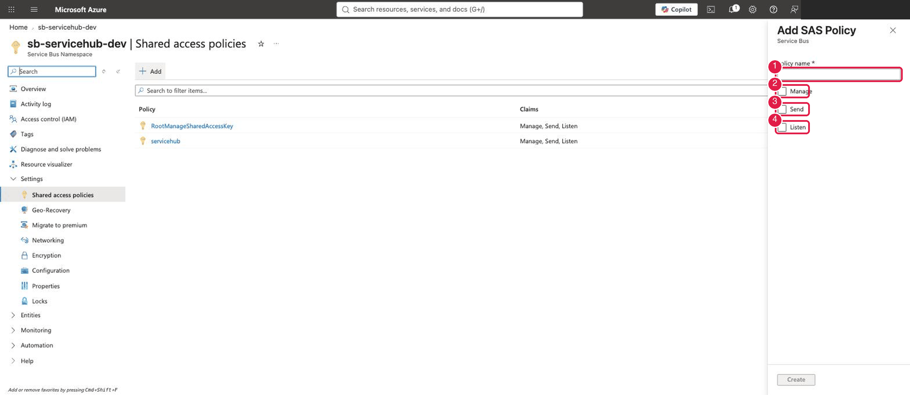

1. Policy name — for example servicehub-app, so you can recognise (and later revoke) it.
2. Manage — required. Azure lets only Manage list your queues and count their messages; without it ServiceHub cannot see them.
3. Send — used only when you press Replay, to put a copy of a dead letter back.
4. Listen — used to read queues and dead-letter queues.

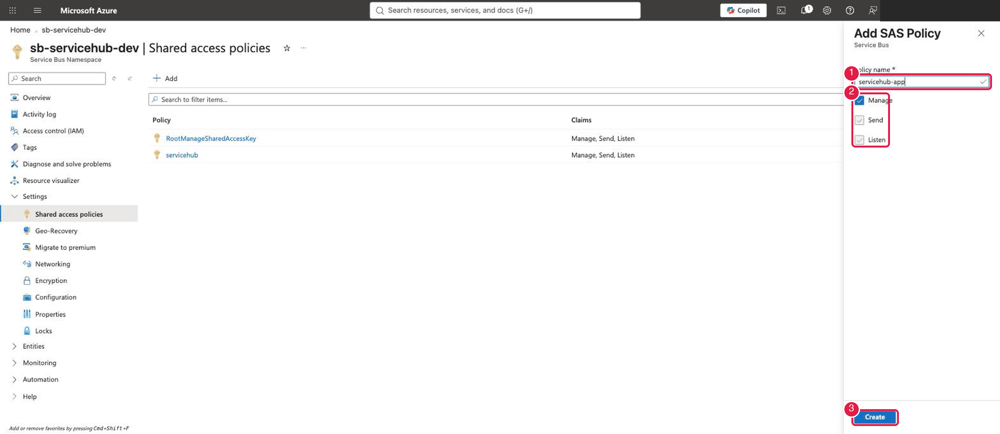

1. The name you chose.
2. Manage, Send and Listen. Azure ticks Send and Listen for you when you tick Manage — Manage includes them.
3. Create — saves the policy and generates its keys.

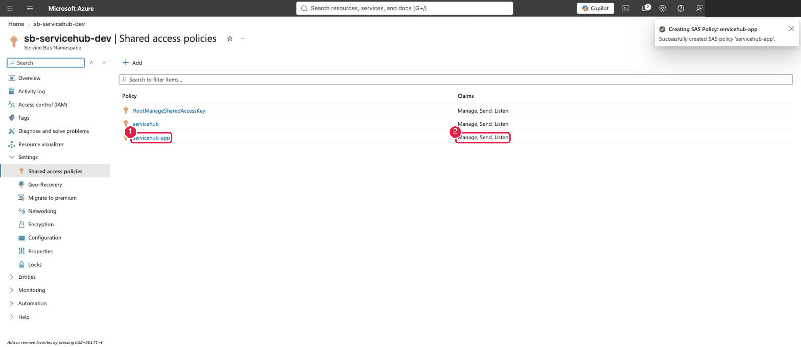

1. Your new policy appears in the list.
2. Claims — Manage, Send, Listen.

### 1.4 Copy the primary connection string

Open the new policy. The keys are hidden; click the copy icon beside **Primary connection string**. It begins `Endpoint=sb://…`. Treat it like a password: ServiceHub encrypts it on arrival and never shows it again, but anyone who has it can use it. The **Delete** button on this panel is how you revoke access later.

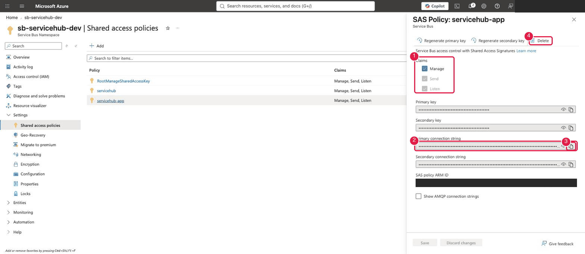

1. Claims — what this policy may do.
2. Primary connection string — click the eye to reveal, then the copy icon. Paste this into ServiceHub. Treat it like a password.
3. Copy to clipboard — copies the whole connection string.
4. Delete — the way to revoke ServiceHub's access later.

### 1.5 Check what is in your queues

Under **Entities → Queues** you can see each queue's *Active* and *Dead-letter* counts. Open a queue to see its **Max delivery count** (after that many failed tries Azure dead-letters the message) — ServiceHub's numbers should match these.

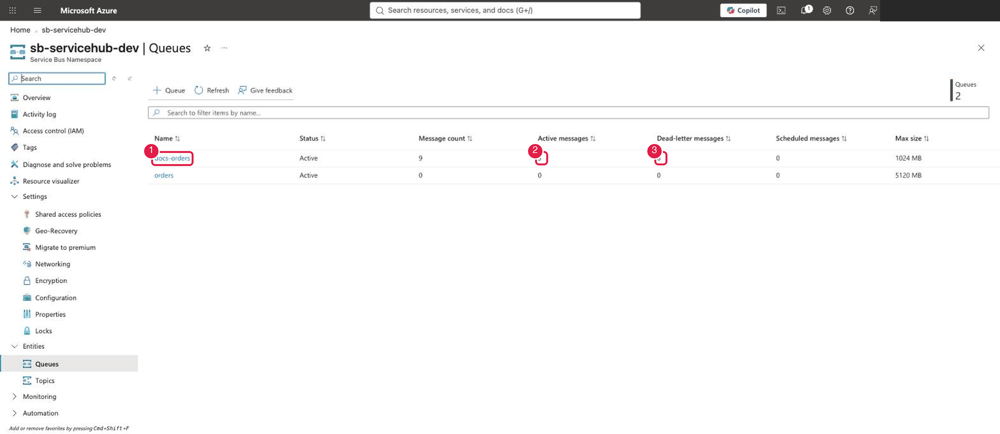

1. Queue name — ServiceHub finds every queue in the namespace; you do not list them.
2. Active messages — waiting to be processed.
3. Dead-letter messages — failed too often and were set aside. These are what ServiceHub shows on its Dead letters tab.

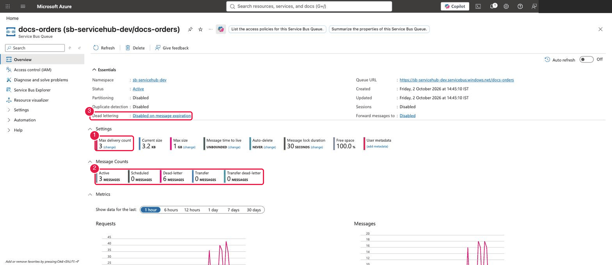

1. Max delivery count — how many tries before Azure dead-letters a message. Here 3.
2. Message counts — Active and Dead-letter must match what ServiceHub shows.
3. Dead lettering on expiry is off — messages here are dead-lettered by delivery count or by your app, which is all ServiceHub needs.

## Part 2 — Connect Azure in ServiceHub

*About two minutes.*

### 2.1 The welcome page

With no cloud connected, ServiceHub opens on a welcome page. Choose **Connect Azure**.

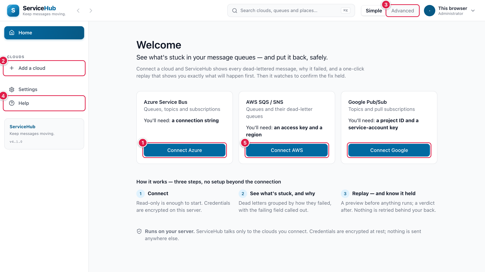

1. Connect Azure — opens the Add a cloud window on the Azure tab. It only asks for a connection string; nothing is read until you press Connect there.
2. Add a cloud — the same window, from anywhere in the app. Use it later to connect AWS or Google Cloud as well.
3. Simple | Advanced — Simple is where you act. Advanced is read-only pages (ledger, signatures, agents); it never changes anything.
4. Help — opens the Help panel with task-shaped answers and the keyboard shortcuts.
5. Connect AWS / Connect Google — the same Add a cloud window, on the AWS or Google Cloud tab. You do not need them for Azure.

### 2.2 Add a cloud

The window opens on the Azure tab. Open **Where do I get the Service Bus connection string?** for the same portal steps you just did.

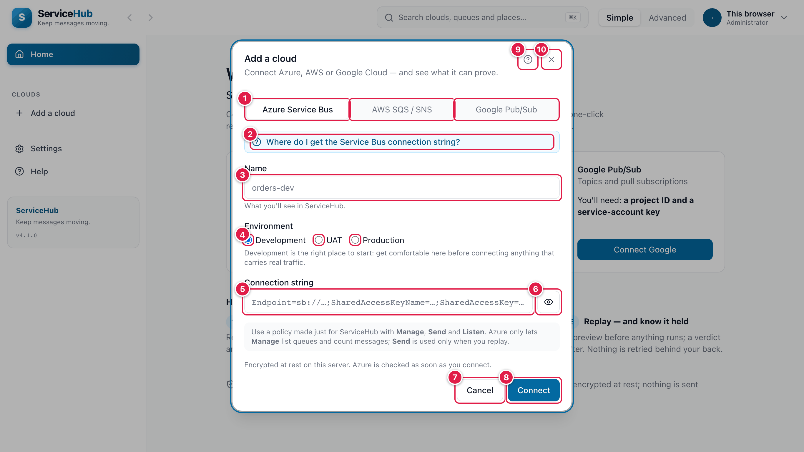

1. Cloud tabs — Azure Service Bus is selected. The AWS and Google tabs ask for different credentials.
2. Where do I get the connection string? — expands the portal steps, with the permissions to give.
3. Name — what you will see in ServiceHub. It is a label only; it does not change anything in Azure.
4. Environment — Development, UAT or Production. Start with Development; Auto Replay never acts in Production.
5. Connection string — paste the Primary connection string of a Shared access policy (Manage, Send, Listen). It is encrypted on this server and never shown again.
6. Show value — reveals what you typed so you can check it. It cannot reveal a stored string.
7. Cancel — closes the window; nothing is saved.
8. Connect — tests the string, then saves it. It only reads queues; it never sends or deletes anything by itself.
9. (?) — opens Help on this very screen. Every window has one.
10. ✕ — closes the window without saving (Esc does the same).

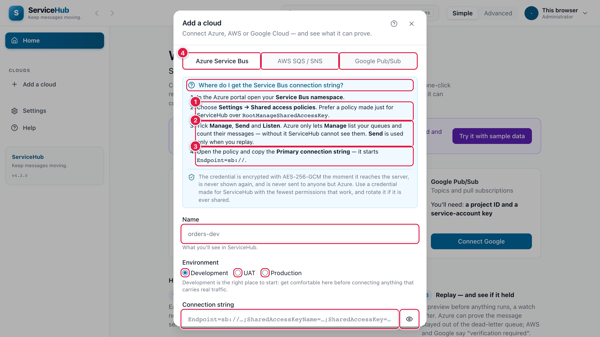

1. Settings → Shared access policies — in the Azure portal, on your Service Bus namespace.
2. Tick Manage, Send and Listen. Azure only lets Manage list your queues and count messages; Send is used only when you replay.
3. Copy the Primary connection string — it starts with Endpoint=sb://.
4. The form underneath — the cloud tabs, Name, Environment, Connection string and Show value, exactly as in the previous screenshot.

### 2.3 Fill it in and connect

Give it a name, keep the environment as **Development** for your first connection, paste the connection string, and press **Connect**. ServiceHub tests the string, then saves it encrypted (AES-256-GCM).

1. A name you will recognise.
2. The connection string, hidden as you paste it.
3. Connect — tests the connection, then saves it.
4. The rest of the form — cloud tabs, Environment, Show value and Cancel, as described on the previous screenshot.

### 2.4 The result

You see exactly what ServiceHub can see: how many queues, topics and subscriptions, how many messages are dead-lettered right now, and whether this cloud can prove a replayed message stayed fixed (Azure can).

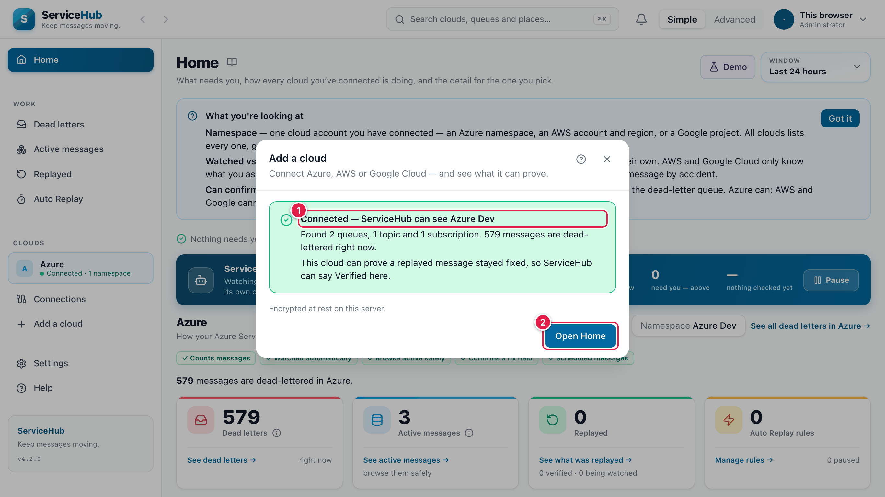

1. The result: how many queues, topics and subscriptions ServiceHub found, how many messages are dead-lettered, and whether this cloud can prove a replay held.
2. Open Home — closes the window and shows Home.

## Part 3 — Learn the screens

*Home, and the controls that are on every page.*

### 3.1 Home

Home answers three questions: *what needs me*, *how is each cloud doing*, and *what is the Agent up to*. The Agent only acts on what it has earned (see Auto Replay below); until then it watches.

1. Window — the period Home counts over (24 hours, 7 or 30 days). It changes what you see, never what happens.
2. The Agent bar — what the Agent is doing, how many replays it verified, and how many it is still watching.
3. Pause — stops the Agent acting until someone resumes it. It keeps watching and recording. Your own replays still work.
4. What this cloud can do — ticks show what Azure lets ServiceHub do safely (count, watch, browse, prove a fix held, scheduled messages).
5. Dead letters — opens the list of messages that failed and were set aside.
6. Active messages — browse what is waiting. On Azure, looking is not a delivery.
7. Replayed — everything put back, by whom, and how it went.
8. Auto Replay rules — opens the rules panel. A rule only acts once a failure has earned it.
9. Got it — hides this explanation. It does not affect your data.
10. See all dead letters in Azure — opens the Dead letters list for this cloud.
11. Help for this page (the book beside the title) — opens Help on this very page, over it. Every page has one.

### 3.2 The bar and the sidebar

These are the same on every page.

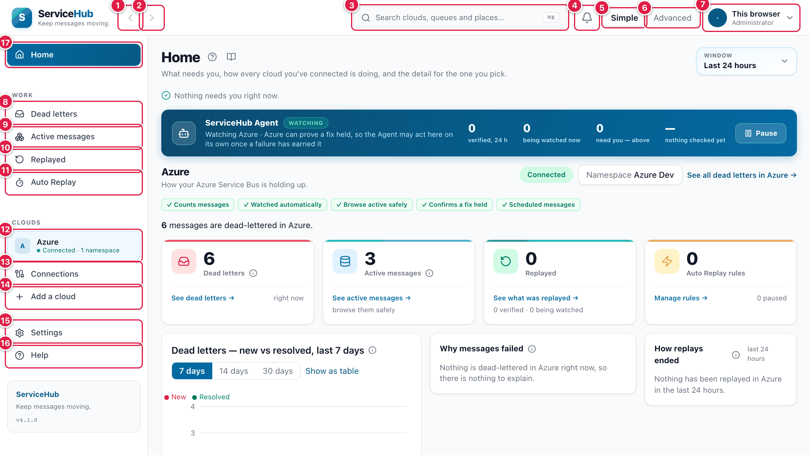

1. Back — returns to the previous place in the app.
2. Forward — goes to the place you came back from.
3. Search (⌘K) — jump to a cloud, queue or page. Searching never changes anything.
4. The bell — the only place the Agent asks you something. A number appears when it needs you.
5. Simple — the two pages where you do the work.
6. Advanced — four read-only pages.
7. You — who ServiceHub records actions as, with your role.
8. Dead letters — messages that failed, with the reason and a Replay button.
9. Active messages — what is waiting now.
10. Replayed — what was put back and whether it stayed fixed.
11. Auto Replay — rules for retries ServiceHub may do on its own.
12. Your cloud — pick it to see only that cloud. The dot shows the connection is healthy.
13. Connections — your connected clouds, to test or remove.
14. Add a cloud — connect another cloud.
15. Settings — connections, notifications, preferences, access and backup.
16. Help — answers and shortcuts.
17. Home — the overview: what needs attention, what the Agent is doing, and how replays ended.

## Part 4 — Work with dead letters

*The core loop: see, understand, replay, confirm.*

### 4.1 The Dead letters tab

A **dead letter** is a message your consumer failed to process several times, so Azure set it aside in the queue's dead-letter queue. ServiceHub groups them by the reason your sender recorded.

1. Namespace picker — all of Azure, or one namespace.
2. Why they failed — the biggest reasons, counted. The reason comes from what your sender wrote when it dead-lettered the message.
3. Dead letters tab — messages set aside. The number is how many are stuck now.
4. Active tab — what is waiting in the queue.
5. Replayed tab — what has been put back.
6. Reason chips — click one to show only that reason.
7. Help for this page — opens Help on this page’s step of the guide. The (?) beside it only re-shows the short explanation.

### 4.2 Filters, selection and the table

Narrow the list, tick the messages you want, and use **Details** or **Replay** on a row.

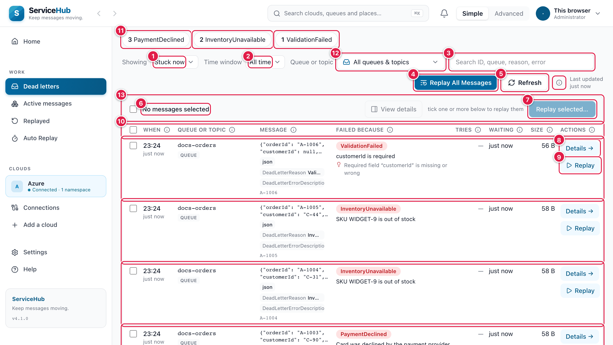

1. Showing — Stuck now, or messages that have since left the queue.
2. Time window — only messages set aside in this period.
3. Search — by message ID, queue, reason or error text.
4. Replay All Messages — opens a preview of everything shown. Nothing is sent until you confirm the preview.
5. Refresh — reads the queue again. On Azure this is free. The ⓘ beside it says when it was last read.
6. Selection — tick rows to act on several; this line shows how many.
7. Replay selected — opens the same preview for just the ticked messages.
8. Details — opens the message: why it failed, its body, properties and delivery history.
9. Replay — opens the proposal for this one message. It does not send anything yet.
10. The table — a tick on every row (the one in the heading ticks the whole page), Details and Replay on every row, and an ⓘ About button on each column heading that explains that column in a sentence. “View details” in the heading chooses which columns show.
11. Reason chips — each shows a reason and how many messages have it. Click one to show only those; click it again to show all.
12. All queues & topics — limit the list to one queue or topic.
13. The selection bar — the tick selects every row on this page; View details chooses which columns show; Replay selected stays dimmed until something is ticked.

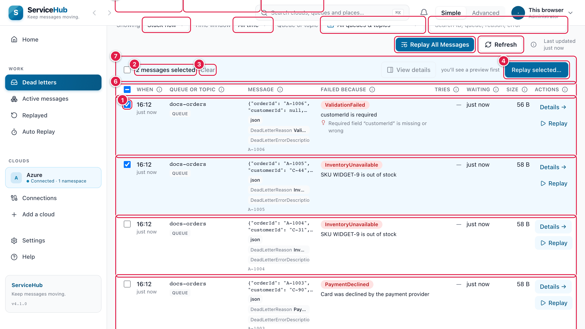

1. Row tick — choose which messages to act on. The header tick chooses every row on the page.
2. Selection count — how many messages are ticked.
3. Clear — unticks everything. Nothing else changes.
4. Replay selected — opens the bulk preview for just these messages. Nothing is sent yet.
5. The filter row — reason chips, Showing, Time window, queue, search, Replay All Messages and Refresh, each explained on the previous screenshot.
6. The table — the ticks, Details and Replay on every row, and the whole-page tick in the heading.
7. The selection bar — the whole-page tick and View details (which columns show).

### 4.3 Open a message

**Details** opens the message: the reason, a plain-words reading of why it failed (marked *Suggestion* because it is a reading, not something Azure reported), and the body with the bad field marked. The tabs show the body, properties, headers and delivery history.

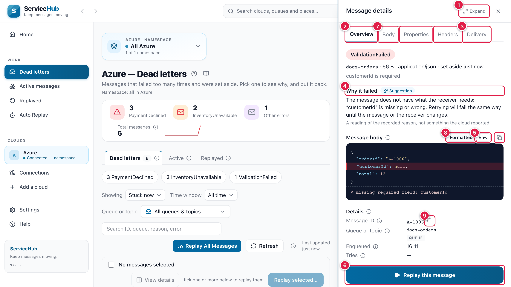

1. Expand — widens the panel for long messages.
2. Overview — reason, why it failed, the body with the bad field marked.
3. Delivery — the delivery history Azure recorded.
4. Why it failed — a plain-words reading of the recorded reason. Marked Suggestion: it is a reading, not something Azure reported.
5. Formatted / Raw — switch the body view.
6. Replay this message — opens the proposal. Nothing is sent from here.
7. Body, Properties and Headers — the other tabs; each is shown below.
8. Formatted and Copy body — pretty-print the body, or copy it to your clipboard. The copy stays in your browser.
9. Copy message ID — copies the ID so you can search for it elsewhere.

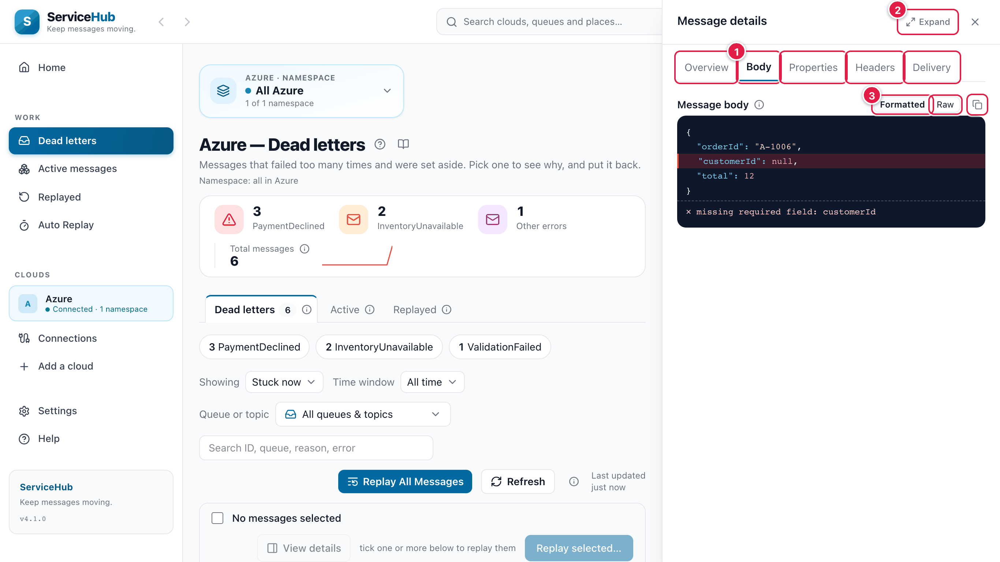

1. The message body exactly as it was sent.
2. Expand widens the panel; the other tabs (Overview, Body, Properties, Headers, Delivery) switch what is shown.
3. Formatted / Raw switch the view; Copy body copies it to your clipboard.

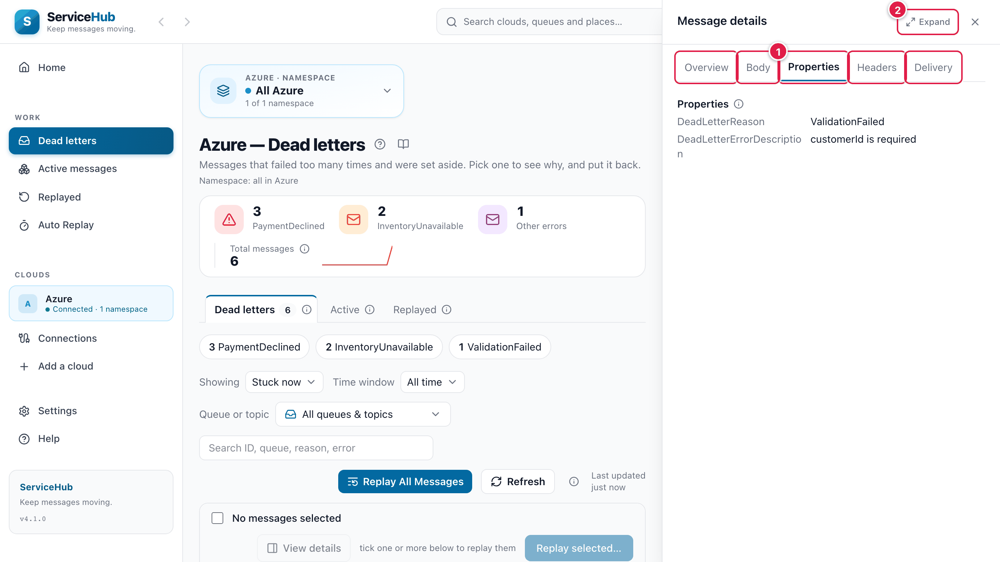

1. Application properties and system properties (message ID, content type, subject).
2. Expand widens the panel; the other tabs (Overview, Body, Properties, Headers, Delivery) switch what is shown.

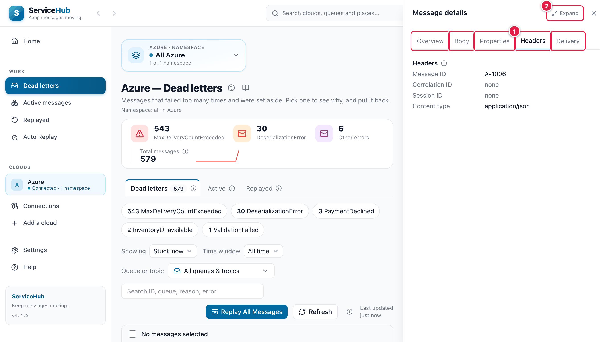

1. Broker headers: enqueued time, lock and sequence information.
2. Expand widens the panel; the other tabs (Overview, Body, Properties, Headers, Delivery) switch what is shown.

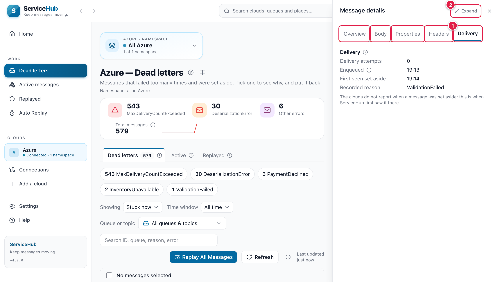

1. How many times Azure tried, and when it set the message aside.
2. Expand widens the panel; the other tabs (Overview, Body, Properties, Headers, Delivery) switch what is shown.

### 4.4 Replay one message — you see the proposal first

**Replay** never sends straight away. It shows what will happen, every safety check, and what happens afterwards. Only the blue button sends.

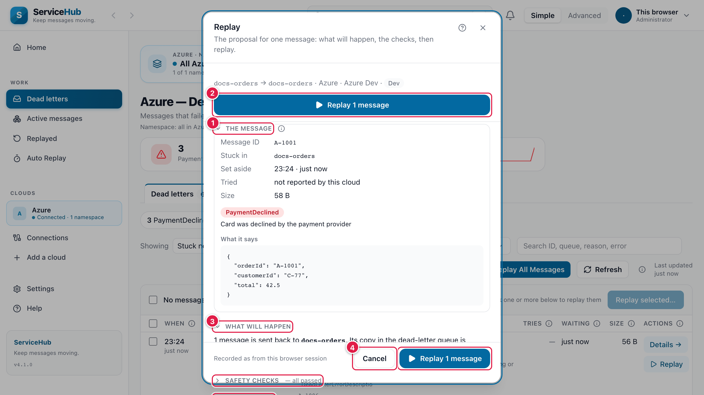

1. The message — what is about to be replayed: ID, where it is stuck, when and why it was set aside, and its body.
2. Replay 1 message — sends it back. It is only sent when you press this.
3. What will happen, Safety checks, After it runs — fold open or closed; the next screenshot shows them open.
4. Cancel — closes without sending.

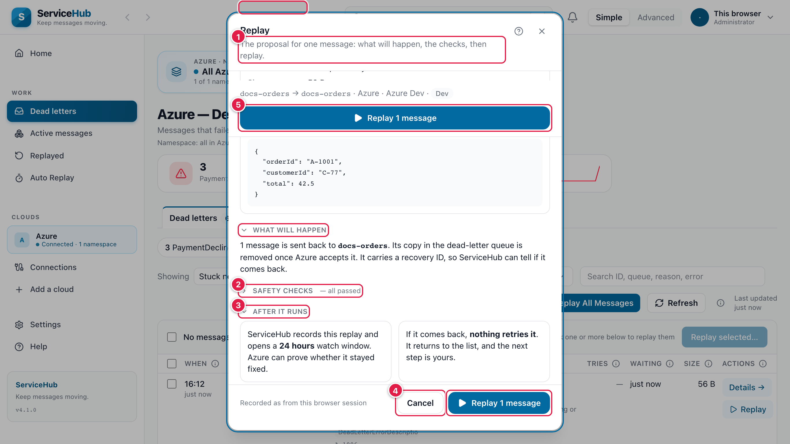

1. What will happen — where it goes and what happens to the dead-letter copy (it is removed once Azure accepts the new one).
2. Safety checks — every check that must pass; a failing one blocks the replay and says why.
3. After it runs — ServiceHub records it and watches for 24 hours; if it comes back, nothing retries it.
4. Cancel — closes without sending.
5. The folding headings and the Replay button repeated at the end of the window.

### 4.5 Replay several at once

Tick messages (or use **Replay All Messages**) to get a preview: how many will be replayed, which are held back by a safety check, grouped by how they failed and where each goes. They are sent one at a time and each is re-checked.

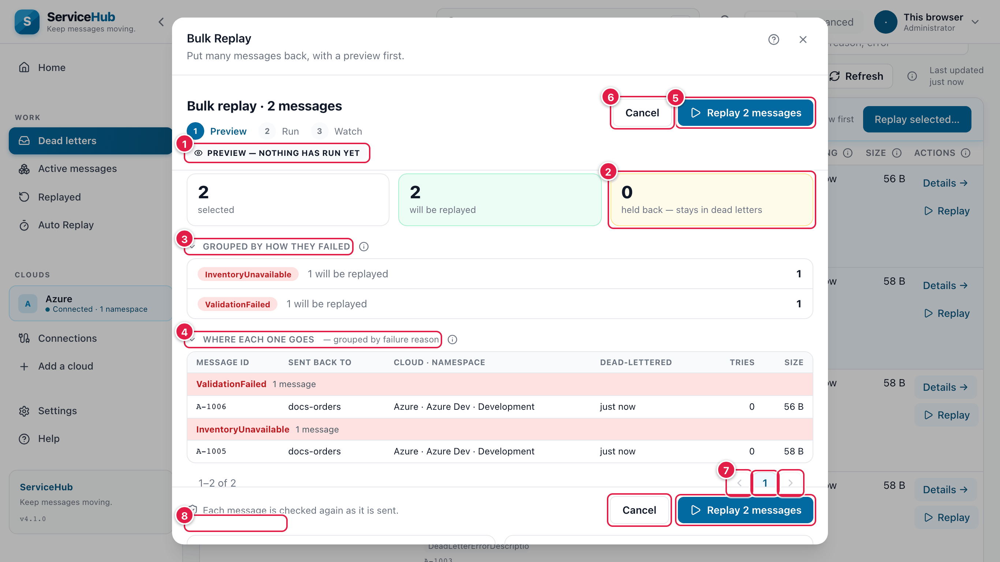

1. Preview — nothing has run yet. Step 1 of Preview → Run → Watch.
2. Held back — messages that fail a safety check stay in dead letters; they are never forced.
3. Grouped by how they failed — so you can see whether you are fixing one problem or several.
4. Where each one goes — the queue each message will be sent back to.
5. Replay N messages — sends them one at a time, re-checking each. You can stop partway.
6. Cancel — nothing is sent.
7. Page controls — move through the list when more messages are chosen than fit on one page.
8. How it will run — folds open to show the pace and the automatic stop (five failures in a row).

### 4.6 The result

ServiceHub says plainly what happened, records it under Replayed, and starts a 24-hour watch for it coming back.

1. The result, in plain words: it was sent back, and ServiceHub will watch for it coming back.
2. It is recorded, with who did it, and shows under Replayed (and in Advanced → Recovery Ledger).
3. Done — closes the window.
4. Active messages / Replayed — jump to where you can watch this message.

## Part 5 — Afterwards

*Did it hold?*

### 5.1 Replayed

Every replay, who did it, and how it ended. On Azure ServiceHub can **prove** whether a replayed message stayed out of the dead-letter queue, so the result moves from *Watching* to *Stayed fixed* or *Came back*.

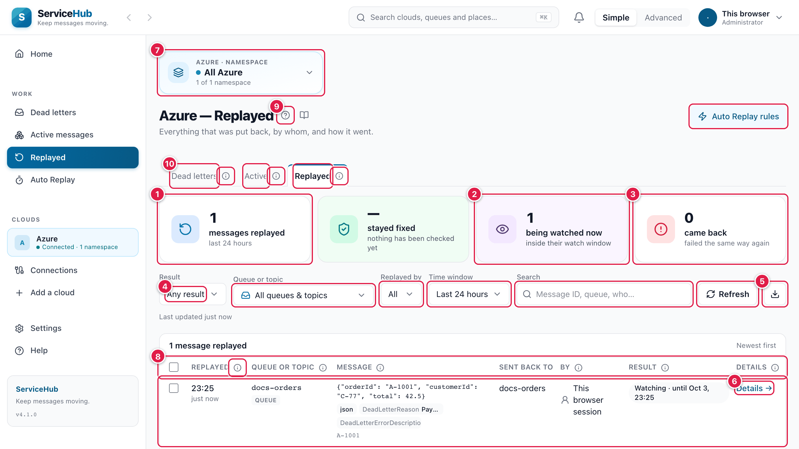

1. Messages replayed — how many were put back in the window.
2. Being watched — replays still inside their watch window. Azure can prove whether each stayed fixed.
3. Came back — messages that failed the same way again. Nothing retries them on its own.
4. Result filter — stayed fixed, being watched, came back.
5. Download — saves this list as a file. It does not change anything.
6. Details — the full record of this replay.
7. Filters — namespace, queue or topic, result, time window and search; Refresh reads the list again. They change what is listed, never what happened.
8. The table — a tick per replay (the heading tick ticks the page) and Details on each row.
9. What am I looking at? — a short reading guide. Auto Replay rules — opens the rules page. All and Last 24 hours — the result and time filters.
10. The three tabs — Dead letters, Active and Replayed. They switch the list below without leaving the page.

### 5.2 Active messages

What is waiting right now. Looking does not touch anything on Azure — a peek is not a delivery. **Send a message** is the one control here that changes a queue.

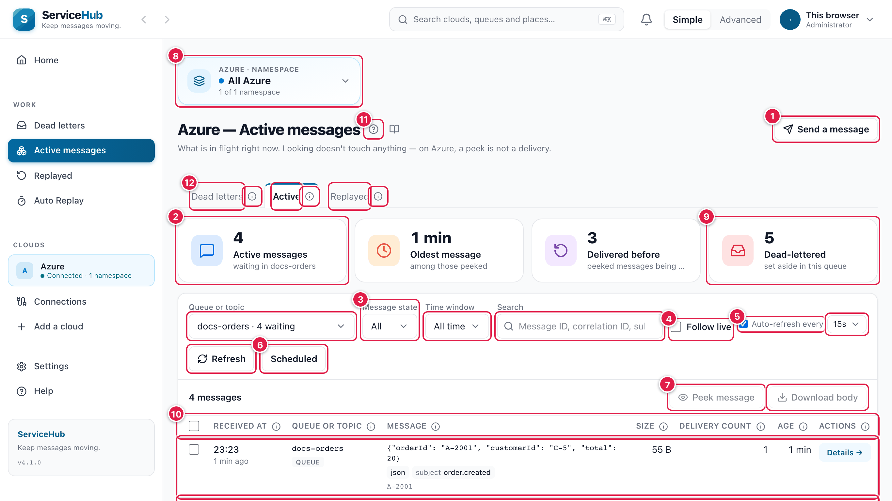

1. Send a message — puts a test message on the queue. This does change the queue, so use a dev queue.
2. Counts — waiting, oldest, delivered before, dead-lettered.
3. Filters — queue or topic, message state, time window and search.
4. Follow live — shows new messages as they arrive. On Azure, looking does not count as a delivery.
5. Auto-refresh — re-reads the queue every 15 seconds.
6. Scheduled — messages set to arrive later.
7. Peek message — opens one message to read it. Peeking does not remove or lock it.
8. Filters and tools — namespace, queue, time window, search, how often the list refreshes, Refresh now, and Download body (saves the shown messages’ bodies as a file; changes nothing).
9. Dead-lettered — jumps to the dead letters in this queue.
10. The table — a tick per message (the heading tick ticks the page) and Details on each row.
11. What am I looking at? — a short reading guide. The queue and time-window pickers narrow what is listed.
12. The three tabs — Dead letters, Active and Replayed. They switch the list below without leaving the page.

## Part 6 — Auto Replay

*Let ServiceHub retry a kind of failure on its own — only once it has earned it.*

### 6.1 Rules

A rule names a failure ServiceHub has already seen and how carefully to retry it. It never runs in Production namespaces, goes through the same safety checks as you, and **stops itself** if fewer than half of its replays stay fixed. A rule only acts once that failure has 10 verified fixes at 95% or better.

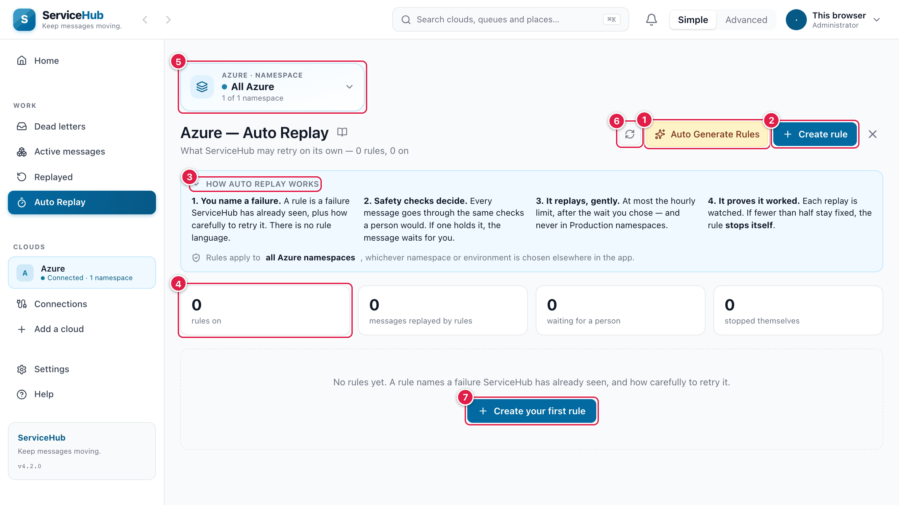

1. Auto Generate Rules — proposes rules from failures already seen. It only proposes; you decide what to turn on.
2. Create rule — start a rule from a failure you have already seen.
3. How it works — you name a failure, safety checks decide, it replays gently, it proves it worked and stops itself if it does not.
4. Totals — rules on, replayed by rules, waiting for a person, stopped themselves.
5. Namespace — Auto Replay rules apply to every Azure namespace; this picks which one the page shows.
6. Refresh rules — reads the rules again.
7. Create your first rule — the same as Create rule, shown while there are none.

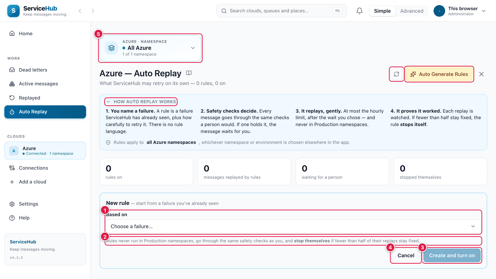

1. Based on — pick a failure ServiceHub has already seen. A rule can only be made from a seen failure.
2. The guarantees: never in Production, same safety checks as you, and it stops itself if fewer than half stay fixed.
3. Create and turn on — enabled once you choose a failure.
4. Cancel — nothing is created.
5. The page header — namespace, Refresh rules, Auto Generate Rules (proposes only) and the “How Auto Replay works” fold, as on the previous screenshot.

## Part 7 — Settings, Help and Advanced

*Everything else.*

### 7.1 Settings

Connections, Notifications (Slack, Teams, any webhook — sent only when the Agent stops and needs a person), Preferences, Access & security (roles and the emergency stop) and Backup.

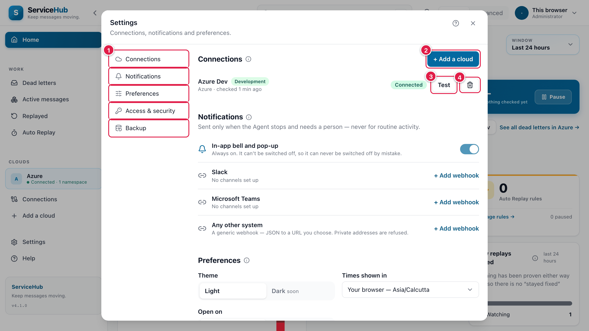

1. Sections — Connections, Notifications, Preferences, Access & security and Backup. Each jumps to that part of this window.
2. Add a cloud — connect another cloud.
3. Test — checks the connection now and shows the result. Reads only.
4. Remove — forgets this connection and its stored credential. It does not delete anything in Azure.

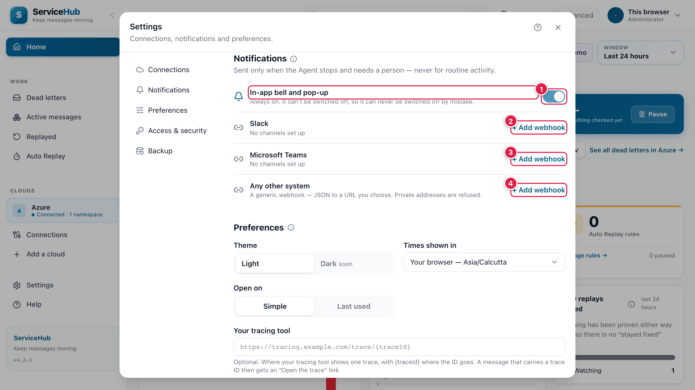

1. In-app bell and pop-up — always on. It cannot be switched off, so it can never be switched off by mistake.
2. Add webhook (Slack) — paste a Slack incoming-webhook URL to also get the message there.
3. Add webhook (Microsoft Teams) — the same for a Teams channel.
4. Add webhook (any other system) — JSON to a URL you choose. Private and internal addresses are refused.

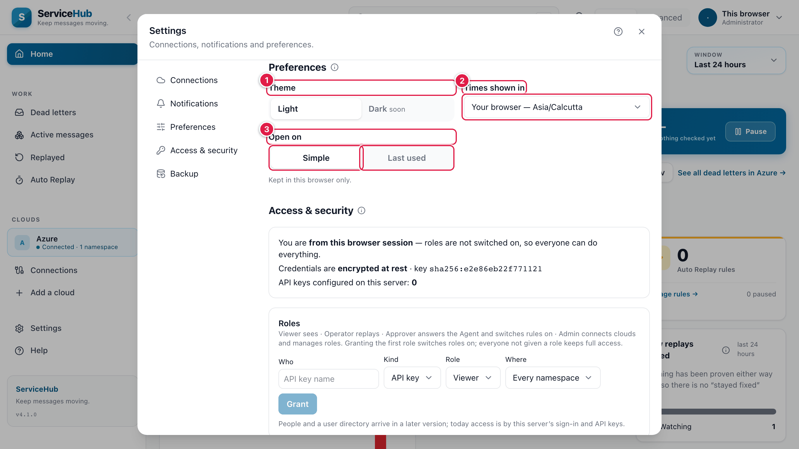

1. Theme — Light today; Dark is marked soon.
2. Times shown in — your browser’s time zone, or UTC. It changes how times are displayed, never the data.
3. Open on — start in Simple every time (Simple), or where you last were (Last used). Kept in this browser only.

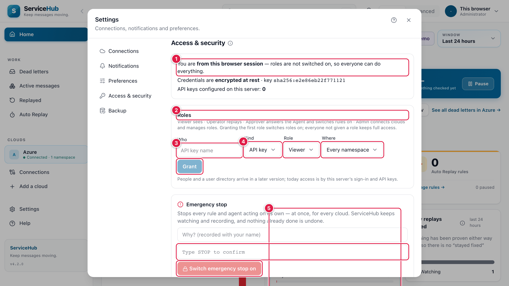

1. Who you are — shown from this browser session until roles are switched on. The credential key fingerprint shows what encrypts stored credentials.
2. Roles — Viewer sees, Operator replays, Approver answers the Agent, Admin connects clouds. Giving the first role switches roles on.
3. Who — the API key name or signed-in user the role is for.
4. Kind, Role, Where and Grant — choose whether it is a key or a person, the role, whether it applies everywhere or to one namespace, then Grant. Granting the first role switches roles on for everyone.
5. Emergency stop — type STOP, say why, and switch it on to halt every automatic action at once. Nothing already done is undone; switch it off to resume.

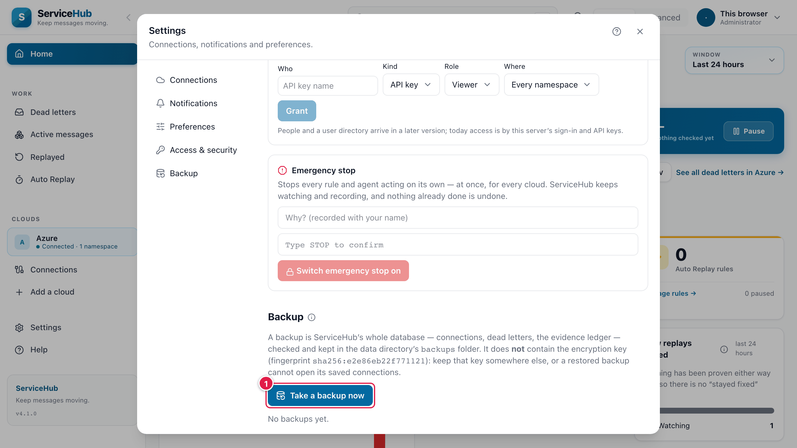

1. Take a backup now — saves a consistent copy of ServiceHub’s own database (not of your clouds).

### 7.2 Help, search and the bell

Help is a panel over whatever you are doing. Search (⌘K) jumps anywhere. The bell is the only place the Agent asks you something.

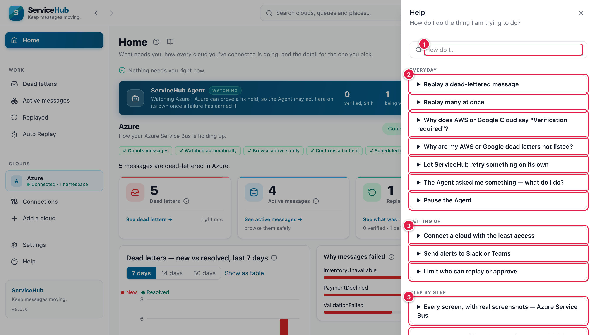

1. Search — type what you are trying to do.
2. An answer — click to open it in place; each links to the screen it is about.
3. Setting up answers — connecting, alerts and who may replay.
4. Keyboard shortcuts — only ones that work are listed.
5. Step by step — every screen with real screenshots and a numbered key for each button and link. This is the same guide as the article in docs/clouds/azure.md.

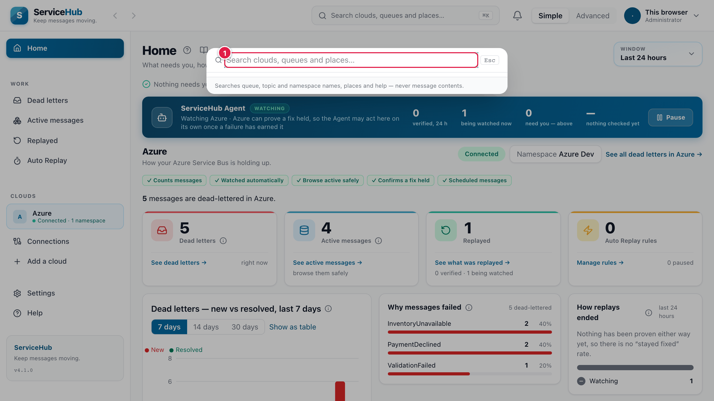

1. Search box — type part of a cloud, queue or page name. Enter opens the first result. Esc closes. Searching never changes anything.

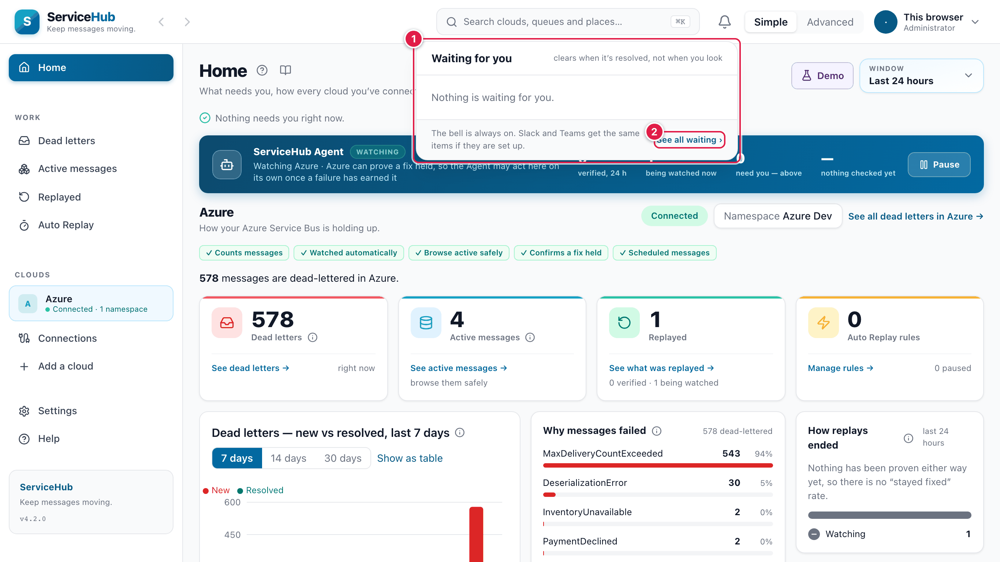

1. The bell — the only place the Agent asks you something. It lists what is waiting for you and clears when it is resolved, not when you look.
2. See all waiting — opens the full list of what needs a person.

### 7.3 The Advanced pages (read-only)

Advanced never changes anything. **Overview** summarises recovery, authority and agents; the **Recovery Ledger** is the tamper-evident record of every action; **Failure Signatures** groups failures and shows what each has earned; **Agents** lists what is acting and what is only watching.

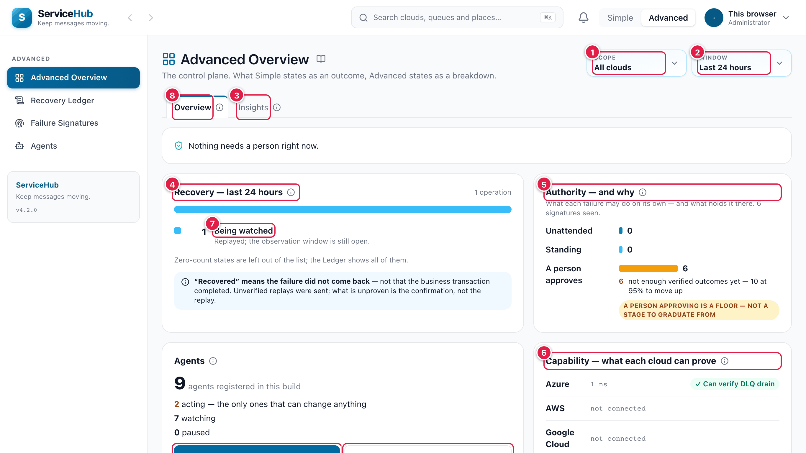

1. Scope — all clouds, or one.
2. Window — the period the page counts over.
3. Insights — patterns ServiceHub noticed across your failures.
4. Recovery — how replays ended. “Recovered” means it did not come back, not that the business transaction completed.
5. Authority — what each failure may do on its own, and what holds it there.
6. Capability — what each cloud can prove.
7. Being watched, All agents → and Recovery Ledger → — jump to the Agents page and the Recovery Ledger. They only open pages; nothing changes.
8. Overview — the page you are on; the other three Advanced pages are in the bar at the top.

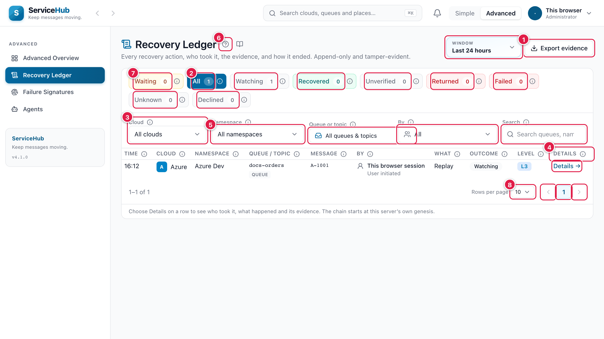

1. Export evidence — downloads the ledger so it can be verified offline. It changes nothing.
2. Outcome chips — Waiting, Watching, Recovered, Unverified, Returned, Failed, Unknown, Declined. Recovered and Unverified are never counted together.
3. Filters — cloud, namespace, queue or topic, who did it, and search.
4. Details — who took the action, what happened and its evidence. Each entry carries a fingerprint of the one before it.
5. Filters and entries — namespace, queue or topic, who, and search narrow the list; each entry opens to show its evidence.
6. What am I looking at? — a short reading guide for this page. Window — the period it counts over.
7. Outcome chips with counts — click one to list only those entries; All shows everything again.
8. Paging — how many rows per page, previous, the page number and next.

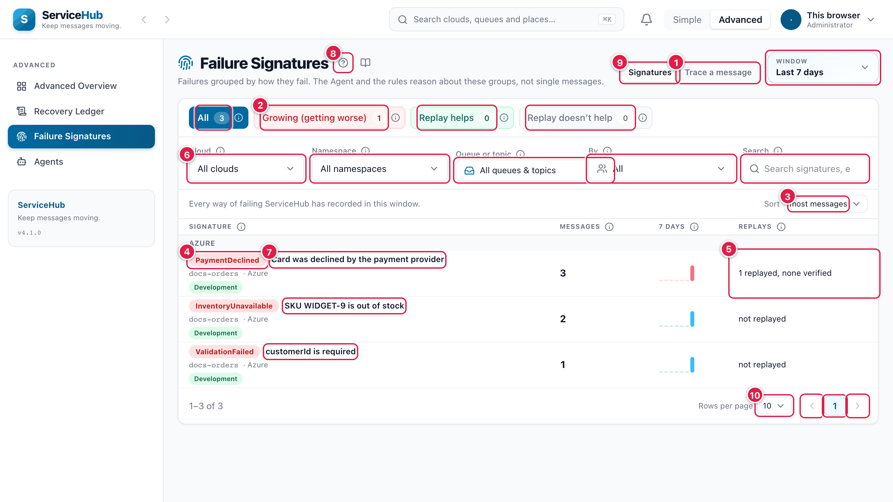

1. Trace a message — follow one message across clouds by its ID.
2. Growing — signatures whose recent days hold at least twice what earlier days did.
3. Sort — most messages, or others.
4. A signature — one way of failing: the same queue and the same kind of error, so many messages become one thing to reason about.
5. Replays — how many of these were replayed and how many were verified to have held.
6. Filters — cloud, namespace, queue or topic, who, and search.
7. Each signature row — opens to show the failures grouped under it and what each replay did.
8. What am I looking at? — a short reading guide. Window — the period counted.
9. Chips — Signatures, All, Replay helps, Replay doesn’t help. Click one to list only those.
10. Paging — rows per page, previous, the page number and next.

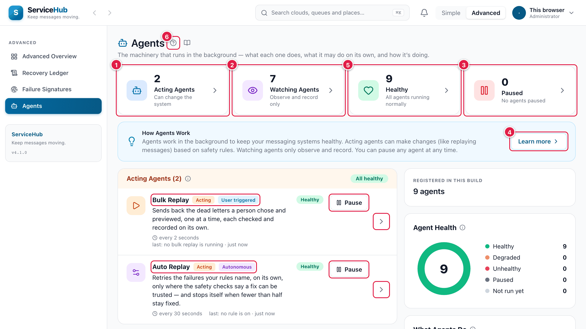

1. Acting agents — the only ones that can change anything, and only after the same safety checks you get.
2. Watching agents — they only look and record.
3. Pause — stops that agent acting. It is the one thing Advanced can do, because it only removes authority. Nothing it already did is undone.
4. Learn more — a short explanation of how agents work.
5. Health summary, agent rows and Open — the summary says whether every agent is running normally; a row opens that agent’s details; Open goes to the screen the agent works through.
6. What am I looking at? — a short reading guide for this page.

---

## If something goes wrong

- **Connect says it could not reach the namespace.** Check the connection string was copied whole (it starts `Endpoint=sb://` and includes `SharedAccessKeyName` and `SharedAccessKey`). In the portal, open **Settings → Networking** and make sure public access is allowed from where ServiceHub runs. Confirm **Local Authentication** is *Enabled* on the Overview.
- **Connect fails with 401 or says it could not list queues.** The policy is missing **Manage**. Azure only lets Manage list queues and count messages. Create a policy with Manage (which includes Send and Listen) and connect again.
- **Connect works but Replay is unavailable.** Your policy lacks **Send**. Replay needs it. A policy with **Manage** includes Send and Listen, so create one as in step 1.3 and connect again.
- **The counts differ from the portal.** Portal metrics can lag by a minute. Press **Refresh** in ServiceHub and **Refresh** in the portal; they should agree.
- **A message I replayed is not under Replayed.** Check the time window on the Replayed tab (the default is the last 24 hours) and that the *Result* filter is *Any result*.

## Stopping and cleaning up

To stop ServiceHub watching Azure: **Settings → Connections → Remove**. That forgets the connection and its stored credential on the ServiceHub server;
it deletes nothing in Azure. To revoke access in Azure, delete the policy under **Shared access policies**. If you created the namespace only to try
ServiceHub, delete its resource group in the portal (or run your Terraform destroy) so nothing keeps costing money.
