# ServiceHub on Google Pub/Sub — step by step, with real screenshots

> **Prefer to watch?** A captioned walkthrough of all of Simple mode, about five minutes — including Replay selected, Replay All and the switch to Advanced: [Google Pub/Sub video](../media/gcp.mp4).

This guide takes you from nothing to a working ServiceHub on **Google Cloud Pub/Sub**, one screen at a time. Every picture is the real
application (or the real Google Cloud console) — not a mock-up — with numbered markers; the numbered list under each picture says what that control
does **and what it will not do**. Account names and key ids are blanked out in the console pictures.

**What you will do**

1. In the Google Cloud console, make a service account just for ServiceHub, give it only the Pub/Sub roles it needs, and download a key.
2. Connect Google Cloud in ServiceHub and check it can see your topics and subscriptions.
3. Ask ServiceHub to look at the dead letters, understand them, and replay one safely.
4. See what ServiceHub can and cannot prove on Google Cloud, and learn what Auto Replay, Settings and the Advanced pages show.

**What you need**

| You need | Why |
|---|---|
| A project with Pub/Sub **topics and subscriptions**, ideally with a **dead-letter policy** on the subscription | Failed messages are forwarded to a dead-letter topic; ServiceHub reads that topic's subscription |
| Permission to create a service account and a key in the project | You will make a ServiceHub-only credential. Some organisations forbid service-account keys by policy: see the troubleshooting list |
| ServiceHub running (see the README) | You will open it in a browser |

> **Cost, and what is different on Google Cloud.** Pub/Sub has no way to look at a message without *pulling* it, and every pull counts as a
> delivery attempt. So ServiceHub **never looks on its own**: it reads dead letters only when you press **Look now** (up to 100 per queue, handed
> straight back, and it can take up to a minute per queue). It does not browse your active messages at all. Pub/Sub also reports **no message
> counts**, **no failure reason** and **no delivery count**, so ServiceHub says "can't count here" or "reason not recorded" instead of guessing.
> Normal Pub/Sub charges apply; ServiceHub adds none of its own.

**The roles to give the service account** (Pub/Sub only; nothing else in your project is reachable):

| Role | Where | Why |
|---|---|---|
| `roles/pubsub.viewer` | The project | List your topics and subscriptions |
| `roles/pubsub.subscriber` | Your subscriptions (including the dead-letter one) | Pull to look, hand a message back, remove the dead-letter copy on replay |
| `roles/pubsub.publisher` | Your topics (including the dead-letter topic) | Put a replayed message back — used only when you replay |

Granting the three roles on the whole project also works and is simpler; granting `subscriber` and `publisher` on just the resources above is tighter.

---

## Part 1 — In the Google Cloud console

*Do these first. Each step shows the real console.*

### 1.1 Look at your topics and subscriptions

Sign in to the Google Cloud console, pick your project (note its **Project ID**, not its name) and open **Pub/Sub**. **Topics** lists where messages are published; **Subscriptions** lists who reads them. A queue in ServiceHub is a subscription together with its topic.

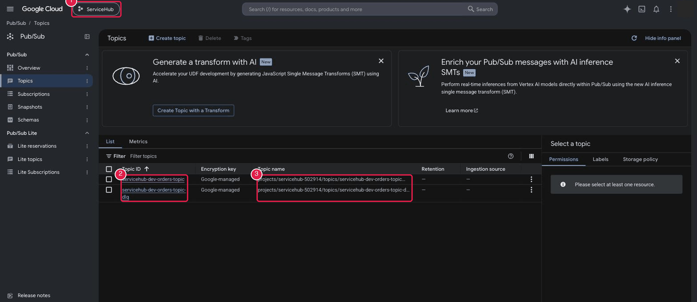

1. Project picker — shows the project you are in. ServiceHub needs its Project ID, which is the part after projects/ in a topic's full name below (not the project's display name).
2. Topic IDs — where messages are published. ServiceHub finds every topic in the project; you do not list them.
3. Topic name — the full path. The part after projects/ is your Project ID, the first thing you type into ServiceHub.

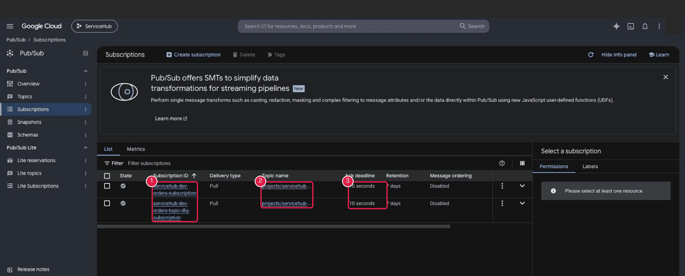

1. Subscription IDs — a queue in ServiceHub is a subscription together with its topic. The one ending -dlq-subscription holds your dead letters.
2. Topic — the topic each subscription reads from.
3. Ack deadline — how long a reader has to acknowledge a message before Pub/Sub delivers it again. ServiceHub hands a looked-at message straight back, so it never waits this out.

### 1.2 Find the dead-letter policy

Open your main subscription and look at **Dead lettering**. It names the dead-letter topic and the **Maximum delivery attempts** — how many tries before Pub/Sub forwards a message there. The dead-letter topic needs its own subscription, or forwarded messages are not kept: that subscription is what ServiceHub reads as your dead letters.

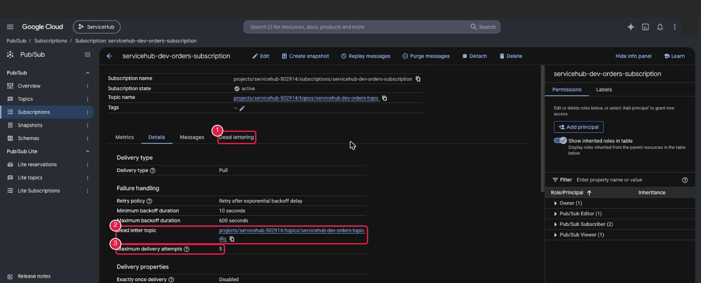

1. Dead lettering — the tab for the same policy, where you can change it.
2. Dead letter topic — where Pub/Sub forwards a message after it fails too often. ServiceHub reads this topic’s own subscription as your dead letters.
3. Maximum delivery attempts — after this many failed tries Pub/Sub forwards the message. Reading a dead letter from ServiceHub counts as one more attempt, which is why ServiceHub only looks when you ask.

### 1.3 Create a ServiceHub-only service account

Open **IAM & Admin → Service accounts → Create service account**. Name it (we use `servicehub-app`) and skip the optional role steps for now. Do not use your own account or the default compute account: a separate account can be switched off later without disturbing anything else.

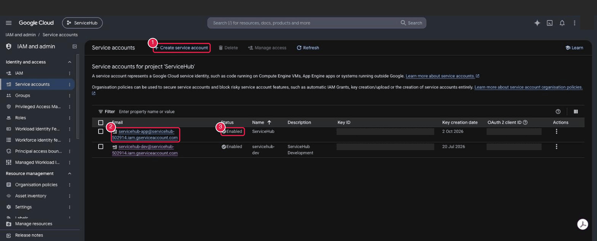

1. Create service account — start here to make an account just for ServiceHub, not your own.
2. The ServiceHub account — separate from your own and from the accounts your applications use, so you can switch it off later without disturbing anything else.
3. Status — Enabled. Disabling or deleting the account cuts ServiceHub off.

### 1.4 Give it only the Pub/Sub roles it needs

Grant the three roles from the table at the start of this guide: **Pub/Sub Viewer** on the project (IAM page), and **Pub/Sub Subscriber** and **Pub/Sub Publisher** on your subscriptions and topics (each resource's **Permissions** panel) — or all three on the project if you prefer one step. If the key ever leaked, it could touch nothing outside Pub/Sub.

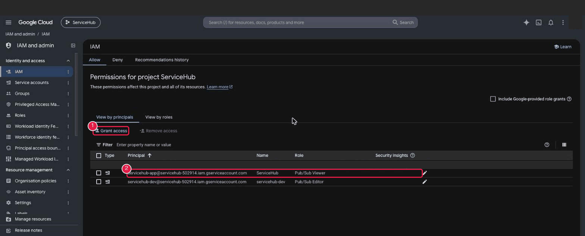

1. Grant access — where you give an account a role on the whole project.
2. The ServiceHub account with Pub/Sub Viewer on the project — it lets ServiceHub list your topics and subscriptions. Pub/Sub Subscriber and Pub/Sub Publisher are granted on the individual subscriptions and topics (next screenshot).

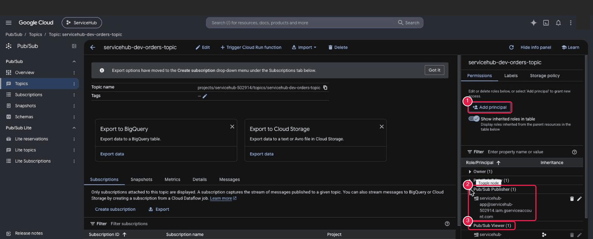

1. Add principal — grants a role on just this topic. Do the same on each subscription for Pub/Sub Subscriber.
2. Pub/Sub Publisher — granted to the ServiceHub account on this topic only. It is used to put a replayed message back.
3. Pub/Sub Viewer — inherited from the project, so the account can see this topic.

### 1.5 Create a key

Open the service account, then **Keys → Add key → Create new key → JSON**. A file downloads — **Google shows its private key only once**. Treat the file like a password: ServiceHub encrypts it on arrival and never shows it again, but anyone who has it can use it. Disabling or deleting the key is how you revoke access later.

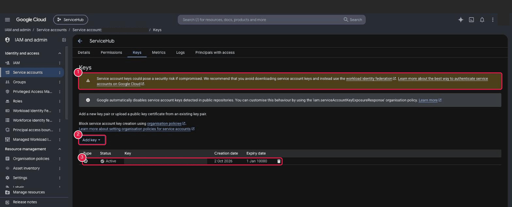

1. Google’s reminder that keys are a risk if they leak. Treat the file like a password, and delete the key when you no longer need it.
2. Add key → Create new key → JSON — downloads the key file ServiceHub needs. Google shows the private key only once.
3. The key — Active. The bin deletes it, which is how you revoke ServiceHub’s access later.

## Part 2 — Connect Google Cloud in ServiceHub

*About two minutes.*

### 2.1 The welcome page

With no cloud connected, ServiceHub opens on a welcome page. Choose **Connect Google**.

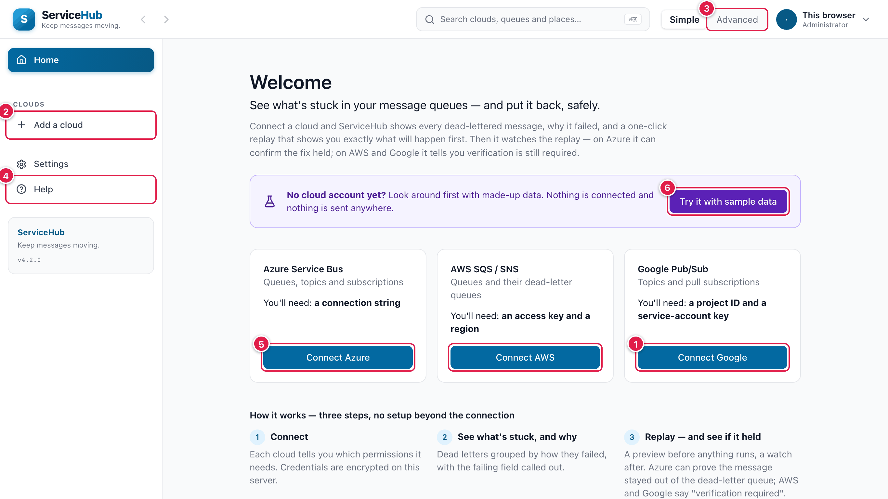

1. Connect Google — opens the Add a cloud window on the Google Pub/Sub tab. It asks for a project ID and a service-account key file; nothing is read until you press Connect there.
2. Add a cloud — the same window, from anywhere in the app. Use it later to connect Azure or AWS as well.
3. Simple | Advanced — Simple is where you act. Advanced is read-only pages (ledger, signatures, agents); it never changes anything.
4. Help — opens the Help panel with task-shaped answers and the keyboard shortcuts.
5. Connect Azure / Connect AWS — the same Add a cloud window, on the Azure or AWS tab. You do not need them for Google Cloud.

### 2.2 Add a cloud

The window opens on the Google Pub/Sub tab. Open **Where do I get the service-account key?** for the same console steps you just did.

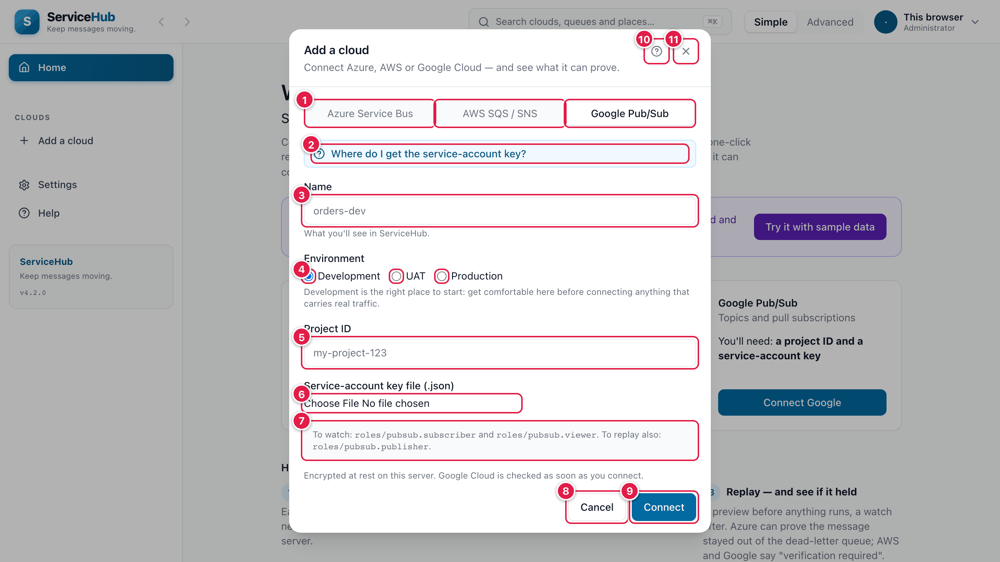

1. Cloud tabs — Google Pub/Sub is selected. The Azure and AWS tabs ask for different credentials.
2. Where do I get the service-account key? — expands the console steps, with the roles to give.
3. Name — what you will see in ServiceHub. It is a label only; it does not change anything in Google Cloud.
4. Environment — Development, UAT or Production. Start with Development; Auto Replay never acts in Production.
5. Project ID — the ID (not the name or number) shown in the console’s project picker. ServiceHub reads the topics and subscriptions in this one project.
6. Service-account key file — the JSON file you downloaded for the ServiceHub service account. It is read in your browser, encrypted on this server and never shown again.
7. The roles ServiceHub uses — to watch, and (second sentence) also to replay. Give it nothing more.
8. Cancel — closes the window; nothing is saved.
9. Connect — tests the key, then saves it. It only lists topics and subscriptions; it never pulls, publishes or acknowledges anything by itself.
10. (?) — opens Help on this very screen. Every window has one.
11. ✕ — closes the window without saving (Esc does the same).

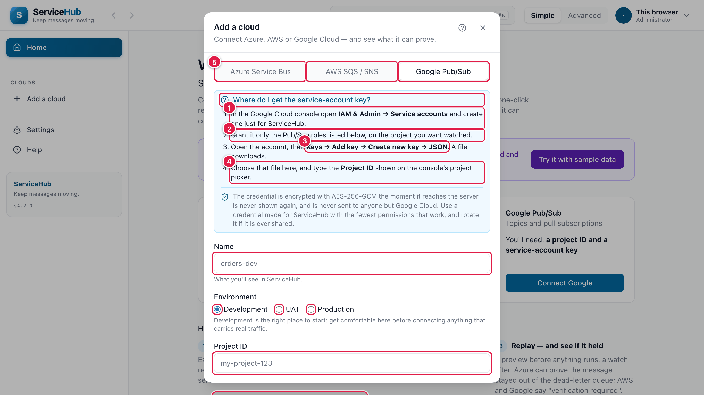

1. IAM & Admin → Service accounts — in the Google Cloud console, make an account just for ServiceHub (not your own).
2. Grant it only the Pub/Sub roles listed below, on the project you want watched.
3. Keys → Add key → Create new key → JSON — a file downloads. Google shows its private key only once.
4. Choose that file here, and type the Project ID shown on the console’s project picker.
5. The form underneath — the cloud tabs, Name, Environment, Project ID and the key file, exactly as in the previous screenshot.

### 2.3 Fill it in and connect

Give it a name, keep the environment as **Development** for your first connection, type the **Project ID**, choose the key file you downloaded, and press **Connect**. ServiceHub reads the file in your browser, tests it, then saves it encrypted (AES-256-GCM).

1. A name you will recognise.
2. The Project ID.
3. The key file you chose. “Using …” confirms which file was read; its contents are never shown.
4. Connect — tests the key, then saves it.
5. The rest of the form — cloud tabs, Environment, the roles hint and Cancel, as described on the previous screenshot.

### 2.4 The result

You see what ServiceHub can see: how many topics and subscriptions it found, and that this cloud **cannot yet prove a replayed message stayed fixed** — ServiceHub will say so honestly rather than pretend.

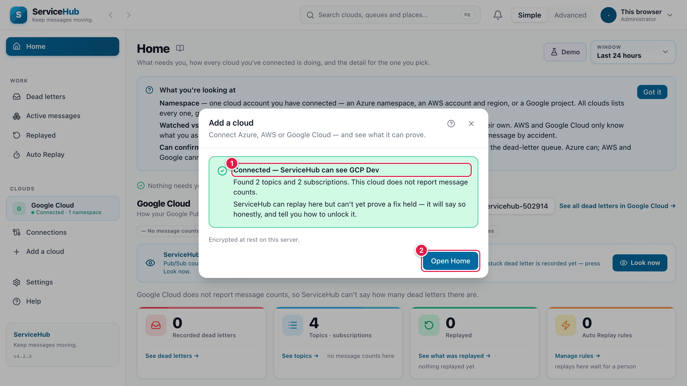

1. The result: how many topics and subscriptions ServiceHub found, and whether this cloud can prove a replayed message stayed fixed (Google Cloud cannot yet — it will say so honestly).
2. Open Home — closes the window and shows Home.

## Part 3 — Learn the screens

*Home, and the controls that are on every page.*

### 3.1 Home

Home answers: *what needs me* and *how is each cloud doing*. For Google Cloud it shows what the cloud can do (the chips: no message counts, recorded when you look, no browsing, can't confirm fixes yet), the **Look now** button, and what has been recorded. Scroll down for why messages failed, how replays ended, your subscriptions with a Look now beside each, the latest dead letters and a live activity list.

1. Window — the period Home counts over (24 hours, 7 or 30 days). It changes what you see, never what happens.
2. Connected, and the project — ServiceHub can reach Google Cloud with your key; the project is the one you chose.
3. What this cloud can do — the chips show what Google Cloud lets ServiceHub do safely. Pub/Sub reports no message counts, records dead letters only when you look, cannot browse messages, cannot prove a fix held and has no scheduled messages.
4. Look now — asks Google Cloud for its dead letters (up to 100 per queue) and keeps them in ServiceHub. Every pull counts as a delivery attempt, which is why ServiceHub never does it on its own. It can take up to a minute per queue.
5. Dead letters — opens the list of messages that failed and were set aside.
6. Topics — opens your topics and subscriptions. Google Cloud reports no message counts, so there are none to show.
7. Replayed — everything put back, by whom, and how it went.
8. Auto Replay rules — opens the rules panel. On Google Cloud a rule always waits for a person, because Google Cloud cannot prove a fix held.
9. Got it — hides this explanation. It does not affect your data.
10. See all dead letters in Google Cloud — opens the Dead letters list for this cloud.
11. Help for this page (the book beside the title) — opens Help on this very page, over it. Every page has one.

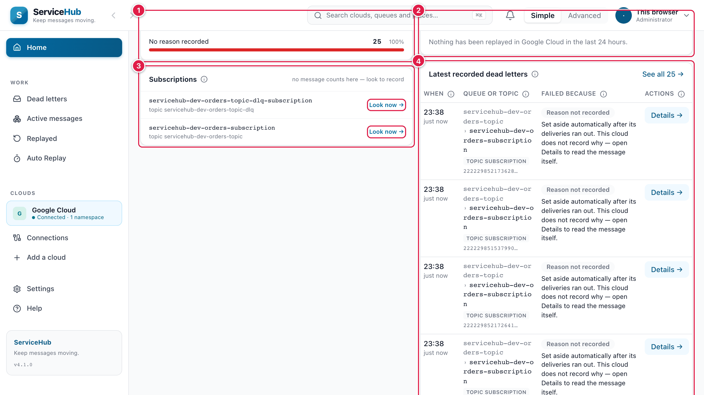

1. Why messages failed — the reasons among the dead letters ServiceHub has recorded, biggest first, with how many each has. It only counts what you have looked at.
2. How replays ended — what happened to the replays in this window. On Google Cloud they stay “watching”, because Google Cloud cannot prove a fix held.
3. Subscriptions — each subscription ServiceHub found, with a Look now → that records just that subscription’s dead letters. Google Cloud reports no message counts here.
4. Latest recorded dead letters — the five most recent ServiceHub has recorded, each with Details →. “See all →” opens the full list.
5. Recent activity — shown in full on the next screenshot.

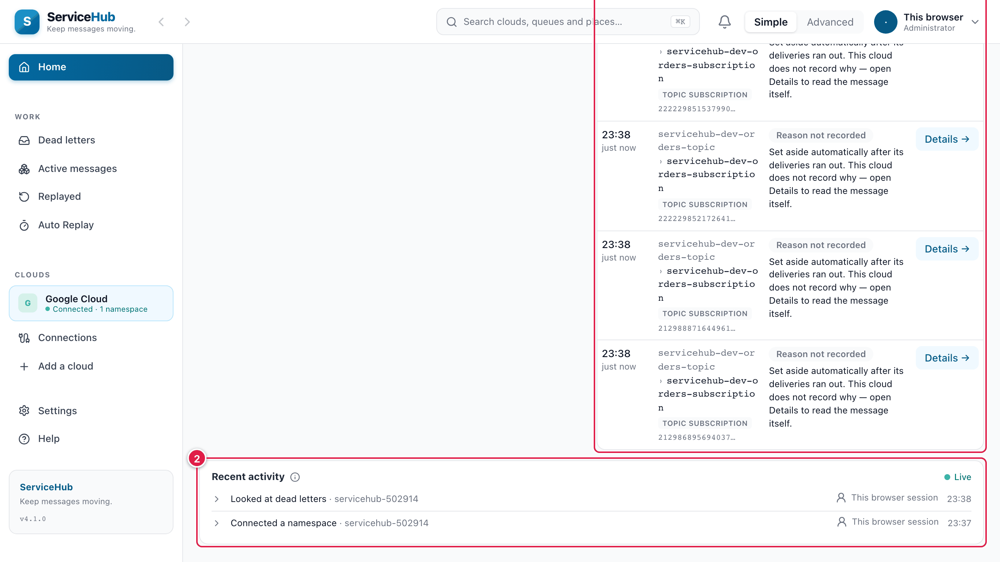

1. The five latest dead letters, each with Details → — the same message view as on the Dead letters tab.
2. Recent activity — what ServiceHub and people did, newest first (Live means it updates by itself). Each line opens to show its detail; nothing here changes anything.
3. Why messages failed, and the subscriptions with their Look now → links — as on the previous screenshot.

### 3.2 The bar and the sidebar

These are the same on every page.

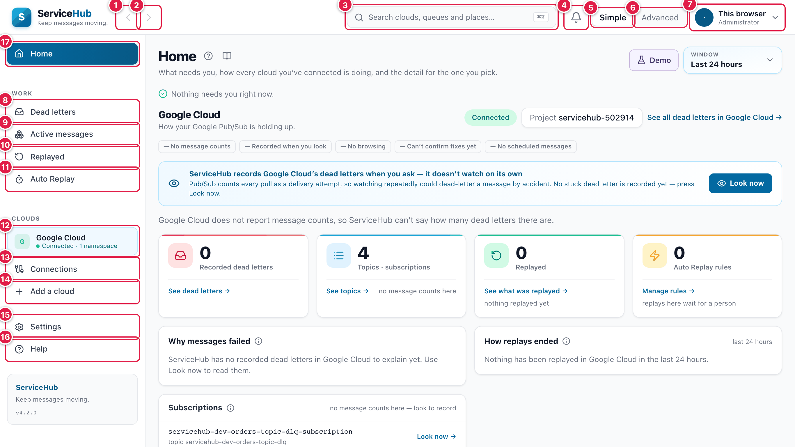

1. Back — returns to the previous place in the app.
2. Forward — goes to the place you came back from.
3. Search (⌘K) — jump to a cloud, queue or page. Searching never changes anything.
4. The bell — the only place the Agent asks you something. A number appears when it needs you.
5. Simple — the two pages where you do the work.
6. Advanced — four read-only pages.
7. You — who ServiceHub records actions as, with your role.
8. Dead letters — messages that failed, with the reason and a Replay button.
9. Active messages — your topics and subscriptions (Google Cloud reports no message counts).
10. Replayed — what was put back and whether it stayed fixed.
11. Auto Replay — rules for retries ServiceHub may do on its own.
12. Your cloud — pick it to see only that cloud. The dot shows the connection is healthy.
13. Connections — your connected clouds, to test or remove.
14. Add a cloud — connect another cloud.
15. Settings — connections, notifications, preferences, access and backup.
16. Help — answers and shortcuts.
17. Home — the overview: what needs attention, what the Agent is doing, and how replays ended.

## Part 4 — Work with dead letters

*The core loop: look, understand, replay, confirm.*

### 4.1 The Dead letters tab

A **dead letter** is a message your consumer failed to process several times, so Pub/Sub forwarded it to the dead-letter topic. The list starts **empty on Google Cloud** even when messages are waiting, because pulling a message counts as a delivery attempt. Press **Look at Google Cloud's dead letters now**: ServiceHub pulls up to 100 per queue, records them, and hands them straight back. It never deletes or moves anything. It can take up to a minute per queue. Press it again to record more; Google Cloud hands back a sample, so a dead letter not seen on a later look stays in the list.

1. Namespace picker — all of Google Cloud, or one project.
2. Why the list starts empty — on Google Cloud, reading a dead letter counts as one delivery attempt, so ServiceHub only looks when you ask. It reads up to 100 per queue and keeps them here; it can take up to a minute per queue.
3. Look at Google Cloud’s dead letters now — receives up to 100 dead letters per queue, records them, and hands them straight back. It never deletes or moves anything; it does add one to each message’s delivery count.
4. The empty list — “nothing recorded” does not mean there are none: the queue holds 324. Press Look now to see them.
5. Help for this page — opens Help on this page’s step of the guide. The (?) beside it only re-shows the short explanation.
6. The three tabs — Dead letters, Active and Replayed — switch the list below. The (?) beside the title brings back the short “What you’re looking at” card.
7. Filters and Refresh — Showing, Time window, queue or topic and search narrow the list; Refresh re-reads what ServiceHub has recorded. On Google Cloud Refresh does not look at Google Cloud: only Look now does.

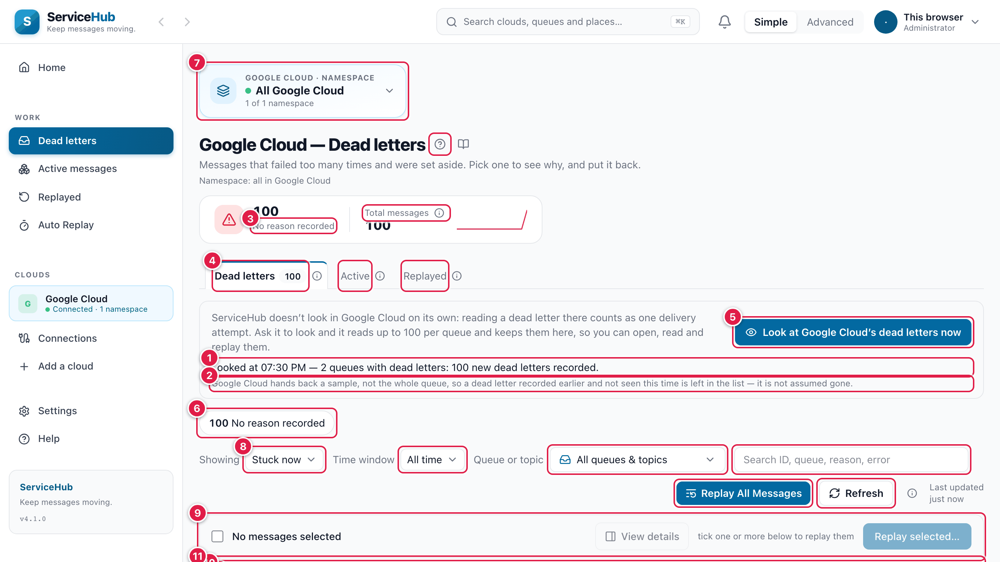

1. What the look found — when it ran, how many queues had dead letters, and how many new ones were recorded.
2. Google Cloud hands back a sample, not the whole queue: a dead letter recorded earlier and not seen this time stays in the list; it is not assumed gone.
3. Why they failed — Pub/Sub records no reason for a dead letter, so every one is counted as “No reason recorded”. The total is how many ServiceHub has recorded.
4. Dead letters tab — the number is how many ServiceHub has recorded (Google Cloud does not report how many it holds).
5. Look again — records any dead letters not seen before. Each look adds one delivery attempt to the messages it reads.
6. Reason chips — click one to show only that reason.
7. The namespace picker, the (?) that re-shows the short explanation, and the Active and Replayed tabs.
8. Filters, Replay All Messages and Refresh — described on the next screenshot, where the table is in view.
9. The selection bar — the tick selects the whole page; View details chooses columns; Replay selected stays dimmed until something is ticked.
10. The tick in the table heading — ticks every row on this page.
11. The table headings — each has an ⓘ that explains that column in a sentence; the next screenshot shows the table itself.

### 4.2 Filters, selection and the table

Narrow the list, tick the messages you want, and use **Details** or **Replay** on a row. Pub/Sub records no failure reason, so there is a single reason, *No reason recorded*; choosing it filters the list (with *show all reasons* at the foot to clear it), and the list pages at the bottom. Refresh re-reads what ServiceHub has recorded; only Look now asks Google Cloud.

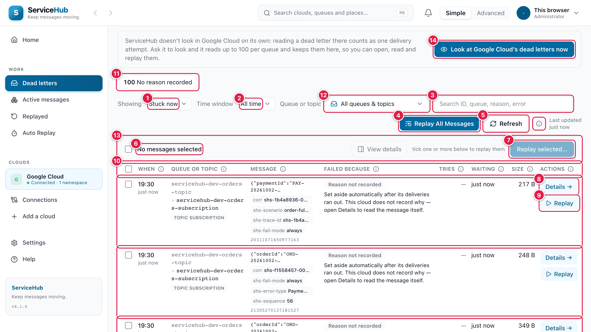

1. Showing — Stuck now, or messages that have since left the queue.
2. Time window — only messages set aside in this period.
3. Search — by message ID, queue, reason or error text.
4. Replay All Messages — opens a preview of everything shown. Nothing is sent until you confirm the preview.
5. Refresh — reads the queue again. It re-reads what ServiceHub has already recorded; it does not look at Google Cloud (only Look now does). The ⓘ beside it says when it was last updated.
6. Selection — tick rows to act on several; this line shows how many.
7. Replay selected — opens the same preview for just the ticked messages.
8. Details — opens the message: why it failed, its body, properties and delivery history.
9. Replay — opens the proposal for this one message. It does not send anything yet.
10. The table — a tick on every row (the one in the heading ticks the whole page), Details and Replay on every row, and an ⓘ About button on each column heading that explains that column in a sentence. “View details” in the heading chooses which columns show.
11. Reason chips — each shows a reason and how many messages have it. Click one to show only those; click it again to show all.
12. All queues & topics — limit the list to one queue or topic.
13. The selection bar — the tick selects every row on this page; View details chooses which columns show; Replay selected stays dimmed until something is ticked.
14. Look at Google Cloud’s dead letters now — records any dead letters not seen before. Each look adds one delivery attempt to the messages it reads.

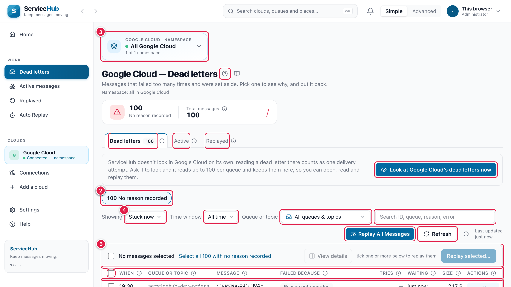

1. Filtering by a reason — the chosen reason is highlighted and “show all reasons” clears the filter. The list below shows only that reason.
2. The reason chips — click one to show only that reason.
3. The namespace picker, the (?) that re-shows the short explanation, and the three tabs.
4. Filters, Replay All Messages, Refresh and Look now — described on the earlier screenshots.
5. The selection bar (which now offers “Select all” for this reason), the table headings and the rows, as on the earlier screenshots.

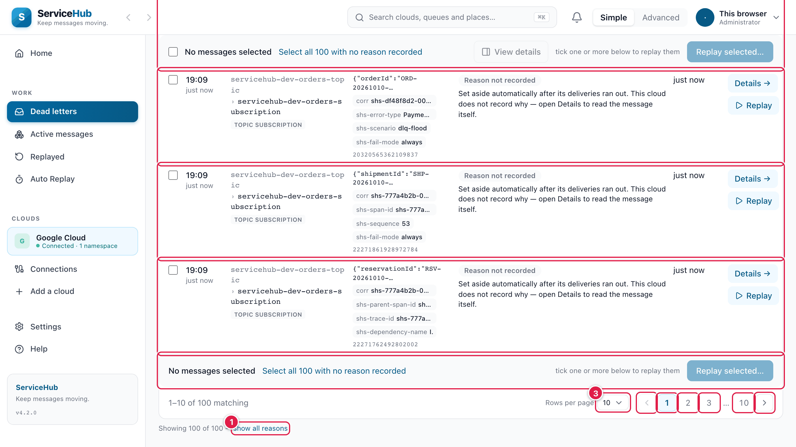

1. Show all reasons — at the foot of a filtered list too: clears the reason filter and brings every recorded dead letter back.
2. The rows of this reason only, and the selection bar repeated underneath.
3. Paging — rows per page, previous, the page numbers and next.

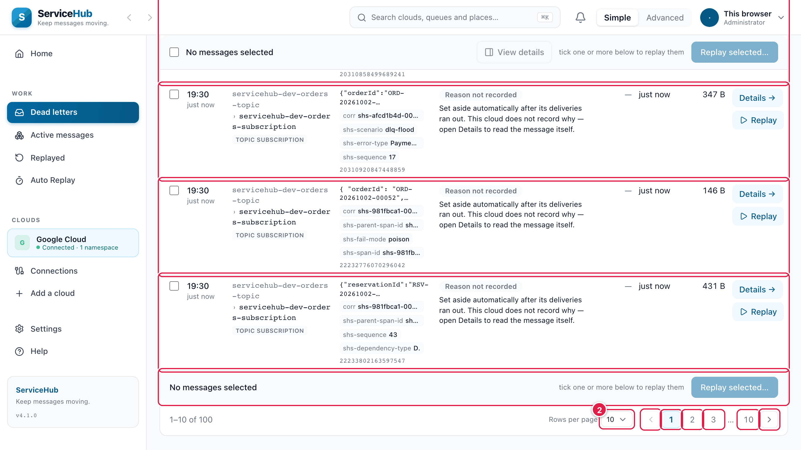

1. The foot of the table — the same ticks, Details and Replay on every row, and the selection bar repeated underneath.
2. Paging — rows per page, previous, the page numbers and next. The list holds up to 100 dead letters per queue from each look.

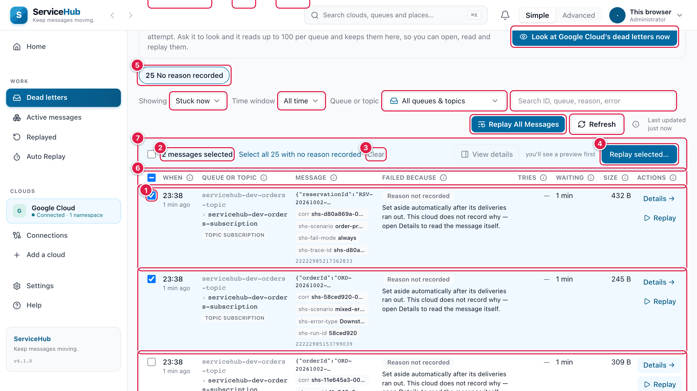

1. Row tick — choose which messages to act on. The header tick chooses every row on the page.
2. Selection count — how many messages are ticked.
3. Clear — unticks everything. Nothing else changes.
4. Replay selected — opens the bulk preview for just these messages. Nothing is sent yet.
5. The tabs and the filter row — reason chips, Showing, Time window, queue, search, Replay All Messages and Refresh, each explained on the previous screenshot.
6. The table — the ticks, Details and Replay on every row, and the whole-page tick in the heading.
7. The selection bar — the whole-page tick and View details (which columns show).

### 4.3 Open a message

**Details** opens the message: *Reason not recorded* (Pub/Sub keeps none), a plain-words reading drawn from the message's own attributes (marked *Suggestion* because it is a reading, not something Google Cloud reported), and the body. The tabs show the body, the attributes your publisher attached, what Pub/Sub recorded, and delivery — which Google Cloud does not report, so it says so. At the bottom are **Replay this message** and **Purge instead…**, which only opens a form.

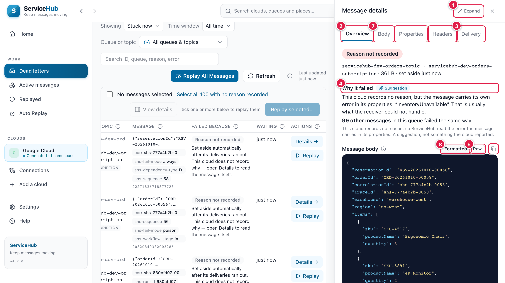

1. Expand — widens the panel for long messages.
2. Overview — reason, why it failed, the body with the bad field marked.
3. Delivery — what Google Cloud reports about delivery. It does not report how many times a message was tried, so this says so rather than guess.
4. Why it failed — a plain-words reading of the recorded reason. Marked Suggestion: it is a reading, not something Google Cloud reported — Pub/Sub records no reason at all.
5. Formatted / Raw — switch the body view.
6. Replay this message — opens the proposal. Nothing is sent from here.
7. Body, Properties and Headers — the other tabs; each is shown below.
8. Formatted and Copy body — pretty-print the body, or copy it to your clipboard. The copy stays in your browser.
9. Copy message ID — copies the ID so you can search for it elsewhere.

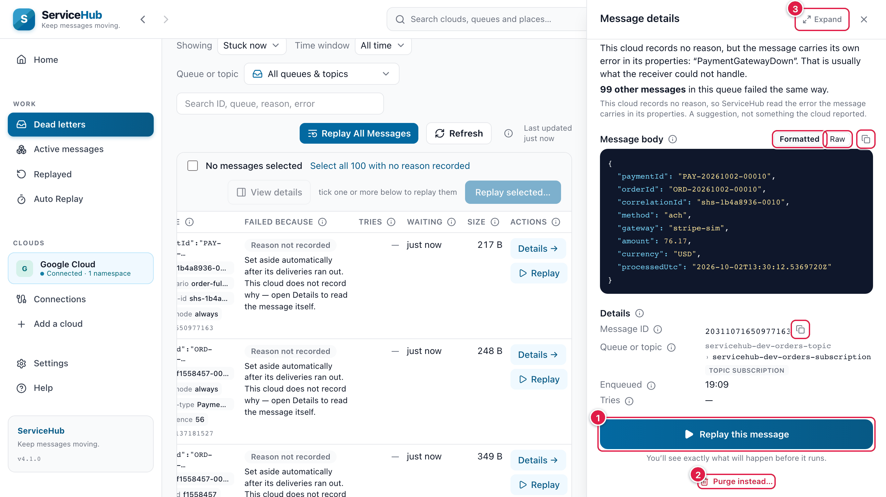

1. Replay this message — opens the proposal. Nothing is sent from here.
2. Purge instead… — for a message not worth replaying. It only opens a small form: you give a reason, and nothing is deleted until you press “Purge for good”. Deleting is permanent, goes through the same checks as a replay, and is recorded with your name and reason.
3. Expand, the body view and the copy buttons — as on the previous screenshots.

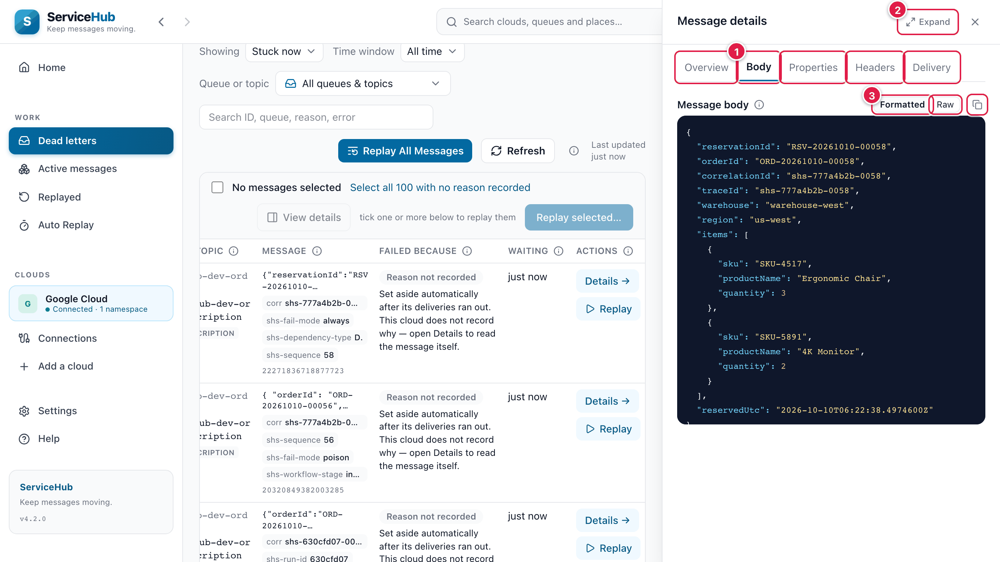

1. The message body exactly as it was sent.
2. Expand widens the panel; the other tabs (Overview, Body, Properties, Headers, Delivery) switch what is shown.
3. Formatted / Raw switch the view; Copy body copies it to your clipboard.

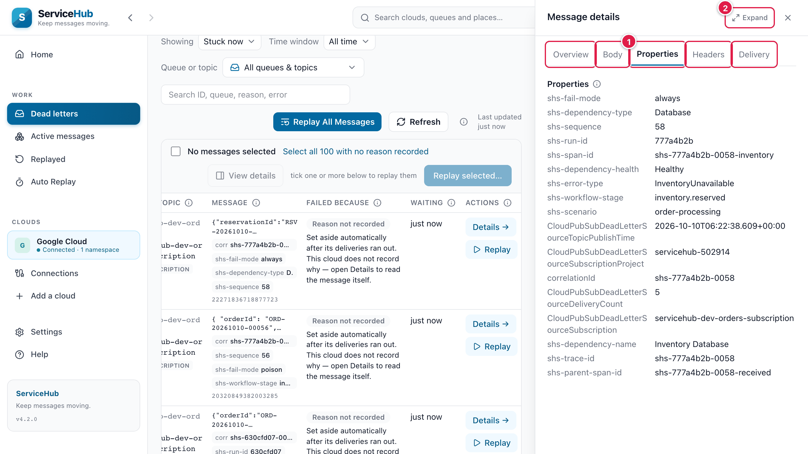

1. The attributes your publisher attached to the message (for example shs-error-type).
2. Expand widens the panel; the other tabs (Overview, Body, Properties, Headers, Delivery) switch what is shown.

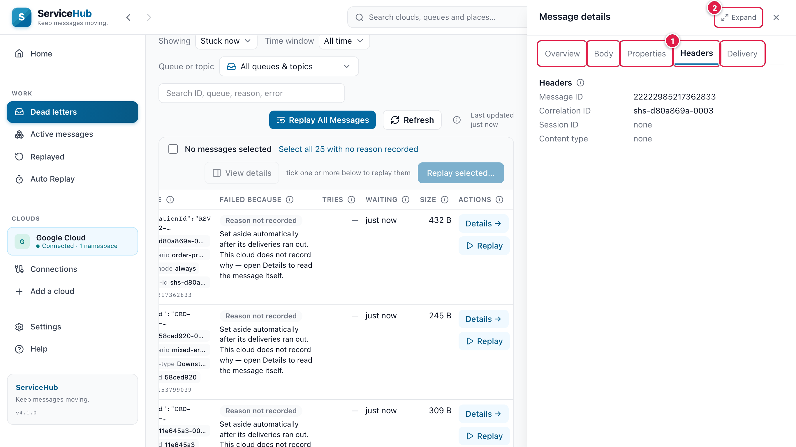

1. What Pub/Sub recorded: the message ID, the publish time and the subscription it was dead-lettered from.
2. Expand widens the panel; the other tabs (Overview, Body, Properties, Headers, Delivery) switch what is shown.

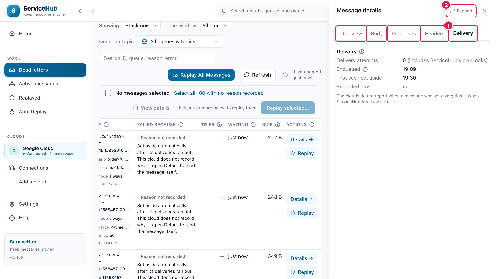

1. What Google Cloud reports about delivery. It does not report how many times a message was tried, so this says so rather than guess.
2. Expand widens the panel; the other tabs (Overview, Body, Properties, Headers, Delivery) switch what is shown.

### 4.4 Replay one message — you see the proposal first

**Replay** never sends straight away. It shows what will happen (the message is published back to the topic it came from and the dead-letter copy is removed once Google Cloud accepts the new one), every safety check, and what happens afterwards. Only the blue button sends. On Google Cloud finding the one message can take up to a minute.

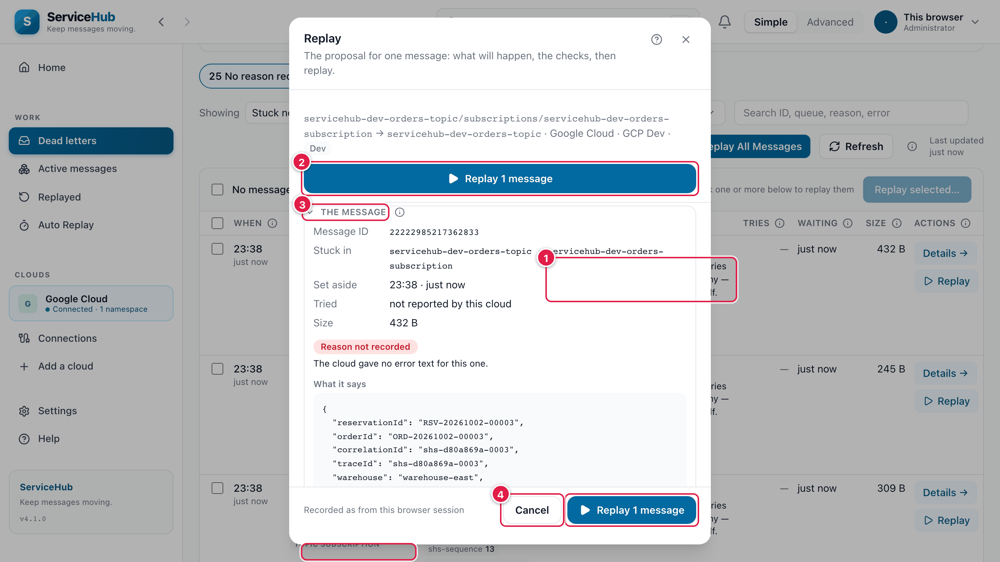

1. The message — what is about to be replayed: ID, where it is stuck, when and why it was set aside, and its body.
2. Replay 1 message — sends it back. It is only sent when you press this.
3. What will happen, Safety checks, After it runs — fold open or closed; the next screenshot shows them open.
4. Cancel — closes without sending.

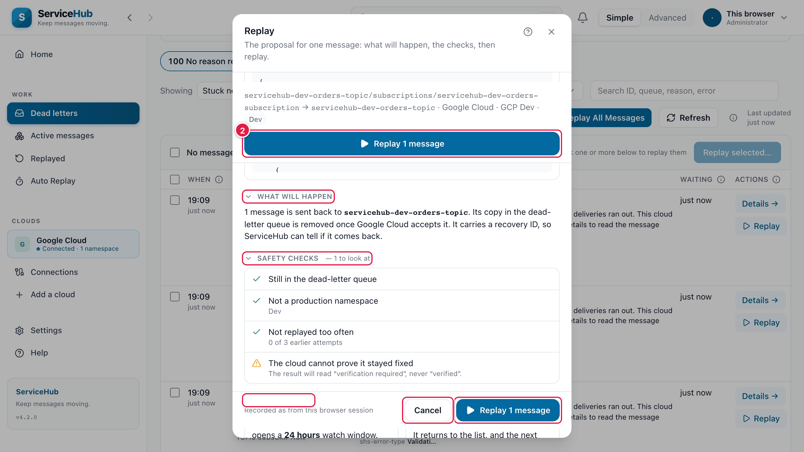

1. The four sections of the proposal — The message, What will happen, Safety checks and After it runs. Each folds open or closed; nothing here sends anything.
2. Replay 1 message sends it; Cancel closes without sending. Both are repeated at the foot of the window so they are always in reach.

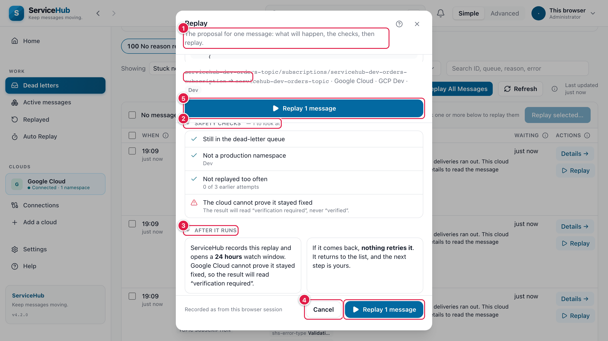

1. What will happen — where it goes and what happens to the dead-letter copy (it is removed once Google Cloud accepts the new one).
2. Safety checks — every check that must pass; a failing one blocks the replay and says why.
3. After it runs — ServiceHub records it and watches for 24 hours; if it comes back, nothing retries it.
4. Cancel — closes without sending.
5. The folding headings and the Replay button repeated at the end of the window.

### 4.5 Replay several at once

Tick messages (or use **Replay All Messages**) to get a preview: how many will be replayed, which are held back by a safety check, grouped by how they failed and where each goes. They are sent one at a time, each re-checked, and the run stops by itself after five sends in a row that are not accepted. Further down is **Purge instead…** — a separate, deliberate step to delete messages that are not worth replaying.

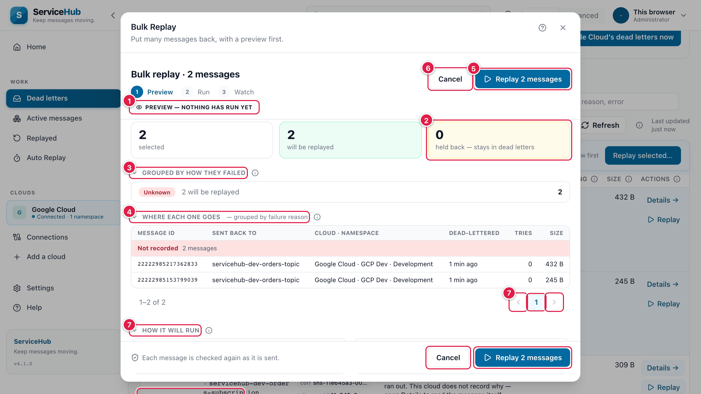

1. Preview — nothing has run yet. Step 1 of Preview → Run → Watch.
2. Held back — messages that fail a safety check stay in dead letters; they are never forced.
3. Grouped by how they failed — so you can see whether you are fixing one problem or several.
4. Where each one goes — the queue each message will be sent back to.
5. Replay N messages — sends them one at a time, re-checking each. You can stop partway.
6. Cancel — nothing is sent.
7. How it will run and After they are sent back — fold open to show the pace and the automatic stop (five sends in a row that are not accepted), and what ServiceHub does next.
7. Page controls — move through the list when more messages are chosen than fit on one page.

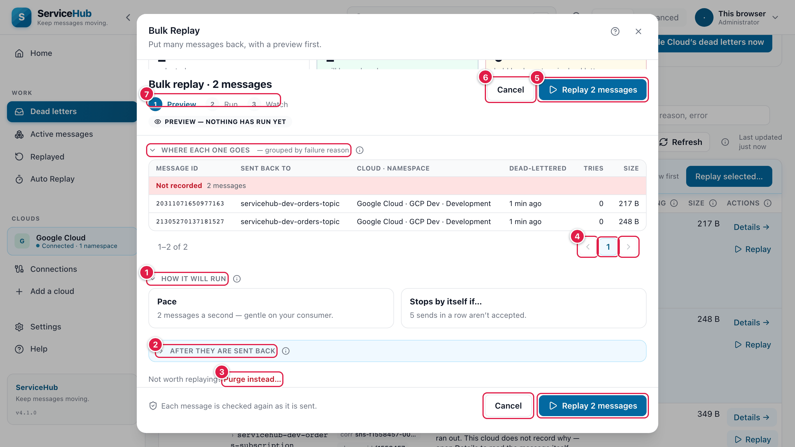

1. How it will run — the pace (a few messages a second, gentle on your consumer) and the automatic stop: five sends in a row that are not accepted.
2. After they are sent back — folds open to say what ServiceHub does next: it keeps watching, and on Google Cloud it records each one as “verification required”, never as fixed.
3. Purge instead… — for messages not worth replaying. It does not delete anything yet: it opens a separate step that asks why, shows what would be purged, and needs you to type a confirmation. Deleting is for good, and each purge is recorded with your name and reason.
4. Page controls — move through the list when more messages are chosen than fit on one page.
5. Replay N messages — sends them one at a time, re-checking each. You can stop partway.
6. Cancel — nothing is sent.
7. Where each one goes — folds open to show the queue each message is sent back to.

### 4.6 The result

ServiceHub says plainly what happened and records it under Replayed. On Google Cloud the result will read **Verification required**: the message was sent back, but Google Cloud cannot prove the dead-letter queue stayed empty, so ServiceHub never says it held. If a consumer is running on the subscription it may pick the message up straight away.

1. The result, in plain words: it was sent back, and ServiceHub will watch for it coming back.
2. It is recorded, with who did it, and shows under Replayed (and in Advanced → Recovery Ledger). On Google Cloud the result will read “Verification required”: this cloud cannot prove the queue stayed empty, so ServiceHub never says it held.
3. Done — closes the window.
4. Active messages / Replayed — jump to where you can watch this message.

## Part 5 — Afterwards

*Did it hold?*

### 5.1 Replayed

Every replay, who did it, and how it ended. On Google Cloud a replay stays *Watching* for its window and is then recorded as *verification required* — never as success — until a person judges it.

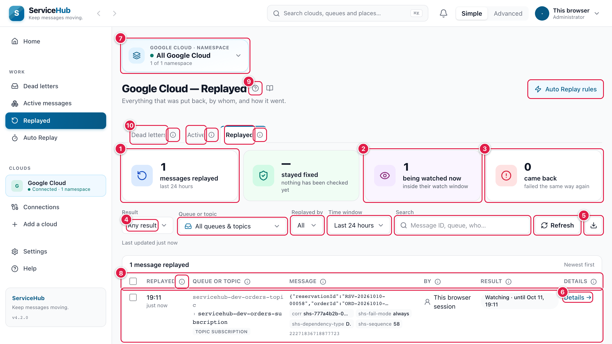

1. Messages replayed — how many were put back in the window.
2. Being watched — replays still inside their watch window. Google Cloud cannot prove whether each stayed fixed, so they wait for you to judge.
3. Came back — messages that failed the same way again. Nothing retries them on its own.
4. Result filter — stayed fixed, being watched, came back.
5. Download — saves this list as a file. It does not change anything.
6. Details — the full record of this replay.
7. Filters — namespace, queue or topic, result, time window and search; Refresh reads the list again. They change what is listed, never what happened.
8. The table — a tick per replay (the heading tick ticks the page) and Details on each row.
9. What am I looking at? — a short reading guide. Auto Replay rules — opens the rules page. All and Last 24 hours — the result and time filters.
10. The three tabs — Dead letters, Active and Replayed. They switch the list below without leaving the page.

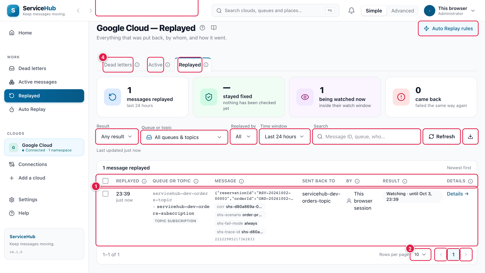

1. The replays, newest first — each with a tick and Details.
2. Paging — rows per page, previous, the page numbers and next.
3. Filters — result, queue or topic, who replayed it, time window and search; Refresh re-reads the list and Download as CSV saves it as a file. They change what is listed, never what happened.
4. The three tabs, the Auto Replay rules button and the table headings, as on the previous screenshot.

### 5.2 Active messages

Your topics and subscriptions. Pub/Sub reports **no message counts**, so each says *can't count here* rather than guess. ServiceHub does not open active messages on Google Cloud, because there is no way to look at one without it counting as a delivery — watching could push a message into the dead-letter topic by itself. For the same reason **Follow live** is not offered here. **Send a message** is the one control here that changes a topic.

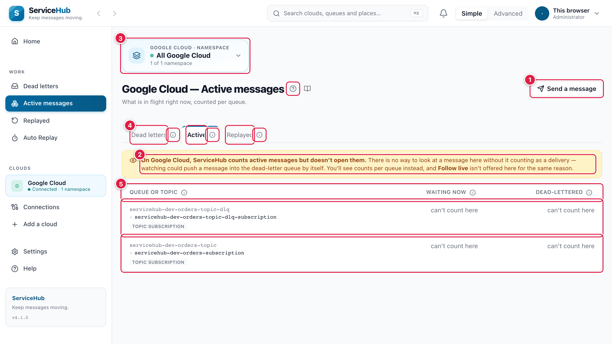

1. Send a message — puts a test message on a queue. This does change the queue, so use a dev queue.
2. Why there is no message list — on Google Cloud there is no way to look at a message without it counting as a delivery, and watching could push it into the dead-letter queue by itself. So ServiceHub shows counts per queue, and “Follow live” is not offered.
3. Namespace — all of AWS, or one account and region.
4. The three tabs — Dead letters, Active and Replayed — and the (?) that re-shows the short explanation.
5. The table — one row per topic and subscription: Queue or topic, Waiting now and Dead-lettered. Pub/Sub reports no counts, so the counts say “can’t count here” rather than guess; the ⓘ on each heading says what the column means.

## Part 6 — Auto Replay

*Let ServiceHub retry a kind of failure on its own — only once it has earned it.*

### 6.1 Rules

A rule names a failure ServiceHub has already seen and how carefully to retry it. It never runs in Production, goes through the same safety checks as you, and **stops itself** if fewer than half of its replays stay fixed. On Google Cloud a rule always waits for a person, because Google Cloud cannot prove a fix held.

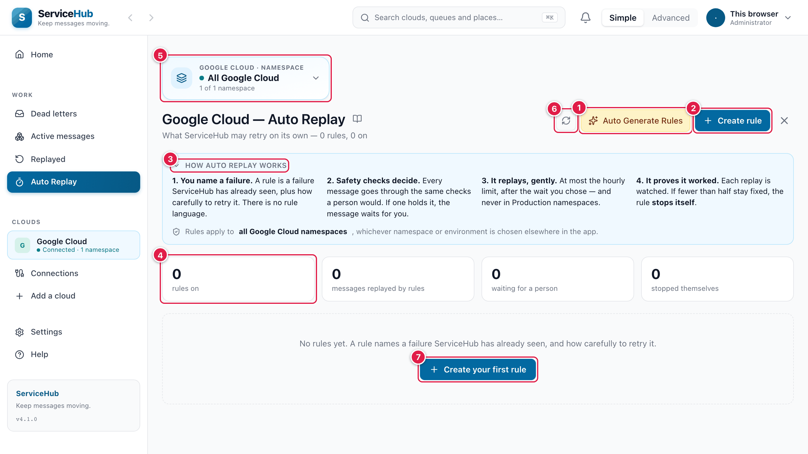

1. Auto Generate Rules — proposes rules from failures already seen. It only proposes; you decide what to turn on.
2. Create rule — start a rule from a failure you have already seen.
3. How it works — you name a failure, safety checks decide, it replays gently, it proves it worked and stops itself if it does not.
4. Totals — rules on, replayed by rules, waiting for a person, stopped themselves.
5. Namespace — Auto Replay rules apply to every Google Cloud project you connected; this picks which one the page shows.
6. Refresh rules — reads the rules again.
7. Create your first rule — the same as Create rule, shown while there are none.

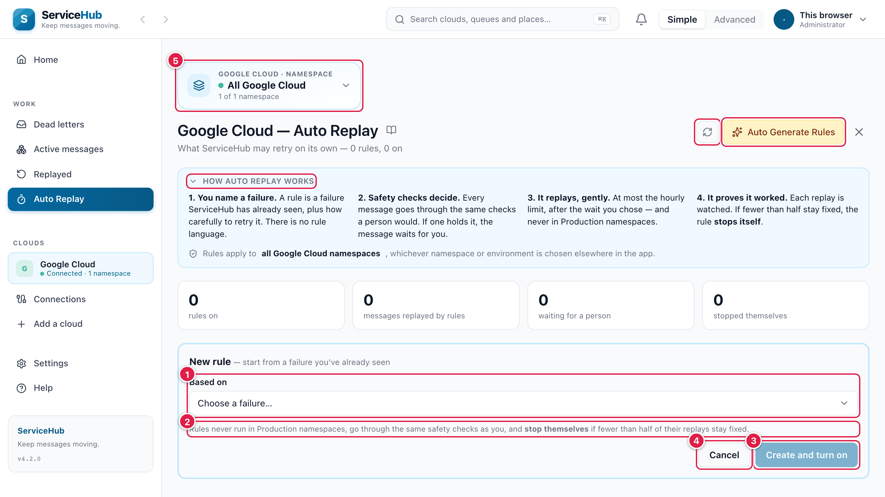

1. Based on — pick a failure ServiceHub has already seen. A rule can only be made from a seen failure.
2. The guarantees: never in Production, same safety checks as you, and it stops itself if fewer than half stay fixed.
3. Create and turn on — enabled once you choose a failure.
4. Cancel — nothing is created.
5. The page header — namespace, Refresh rules, Auto Generate Rules (proposes only) and the “How Auto Replay works” fold, as on the previous screenshot.

## Part 7 — Settings, Help and Advanced

*Everything else.*

### 7.1 Settings

Connections, Notifications (Slack, Teams, any webhook — sent only when the Agent stops and needs a person), Preferences, Access & security (roles and the emergency stop) and Backup.

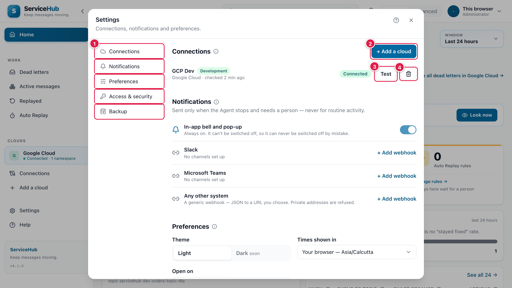

1. Sections — Connections, Notifications, Preferences, Access & security and Backup. Each jumps to that part of this window.
2. Add a cloud — connect another cloud.
3. Test — checks the connection now and shows the result. Reads only.
4. Remove — forgets this connection and its stored credential. It does not delete anything in Google Cloud.

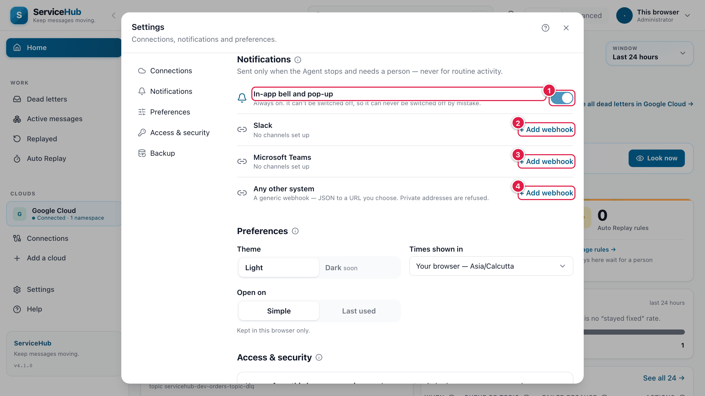

1. In-app bell and pop-up — always on. It cannot be switched off, so it can never be switched off by mistake.
2. Add webhook (Slack) — paste a Slack incoming-webhook URL to also get the message there.
3. Add webhook (Microsoft Teams) — the same for a Teams channel.
4. Add webhook (any other system) — JSON to a URL you choose. Private and internal addresses are refused.

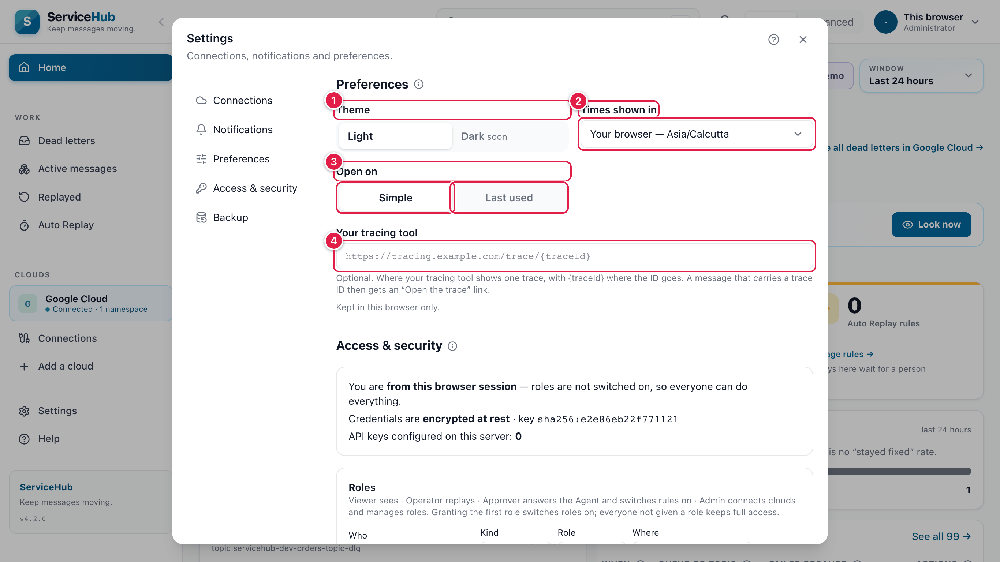

1. Theme — Light today; Dark is marked soon.
2. Times shown in — your browser’s time zone, or UTC. It changes how times are displayed, never the data.
3. Open on — start in Simple every time (Simple), or where you last were (Last used). Kept in this browser only.

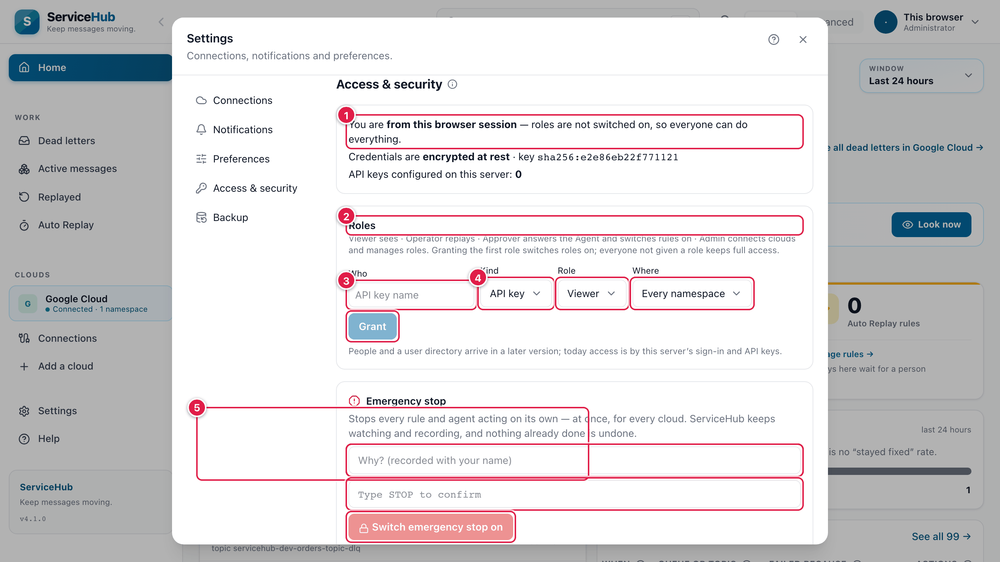

1. Who you are — shown from this browser session until roles are switched on. The credential key fingerprint shows what encrypts stored credentials.
2. Roles — Viewer sees, Operator replays, Approver answers the Agent, Admin connects clouds. Giving the first role switches roles on.
3. Who — the API key name or signed-in user the role is for.
4. Kind, Role, Where and Grant — choose whether it is a key or a person, the role, whether it applies everywhere or to one namespace, then Grant. Granting the first role switches roles on for everyone.
5. Emergency stop — type STOP, say why, and switch it on to halt every automatic action at once. Nothing already done is undone; switch it off to resume.

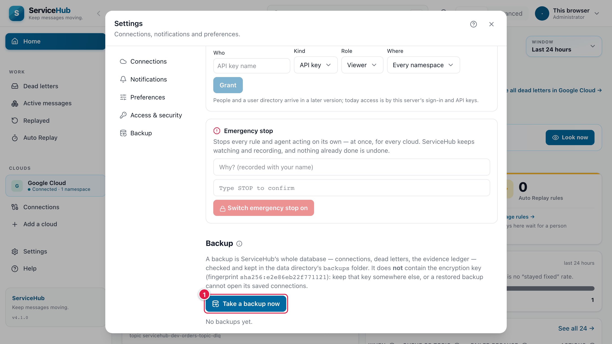

1. Take a backup now — saves a consistent copy of ServiceHub’s own database (not of your clouds).

### 7.2 Help, search and the bell

Help is a panel over whatever you are doing. Search (⌘K) jumps anywhere. The bell is the only place the Agent asks you something.

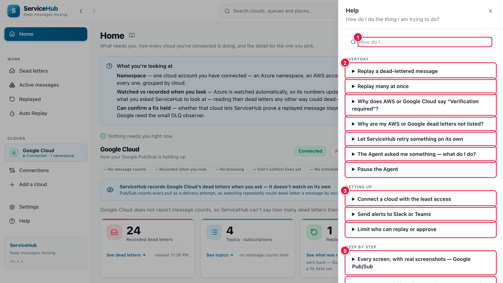

1. Search — type what you are trying to do.
2. An answer — click to open it in place; each links to the screen it is about.
3. Setting up answers — connecting, alerts and who may replay.
4. Keyboard shortcuts — only ones that work are listed.
5. Step by step — one guide per cloud, each with every screen as a real screenshot and a numbered key for every button and link. Yours (Google Cloud) is listed first. The same guides are the articles in docs/clouds.

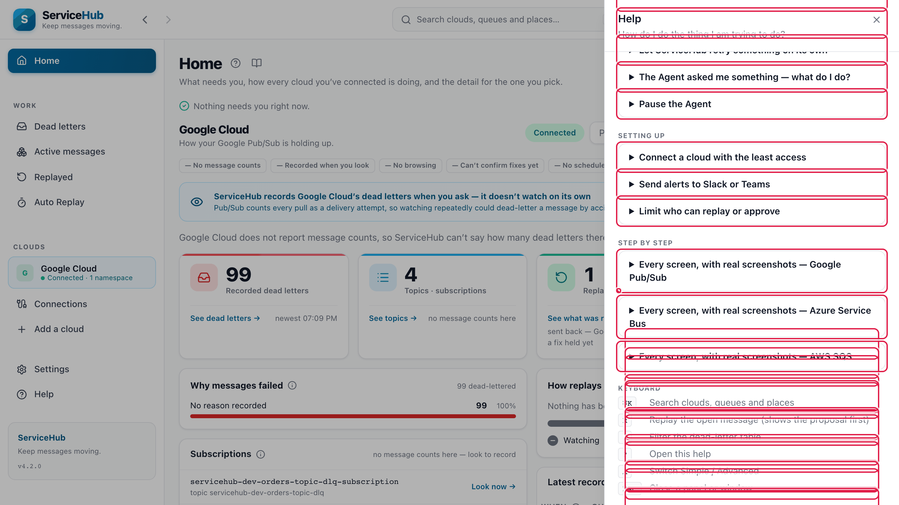

1. Answers and guides — click one to open it in place; the “Every screen” entries are one guide per cloud, each a real screenshot with a numbered key for every button and link.

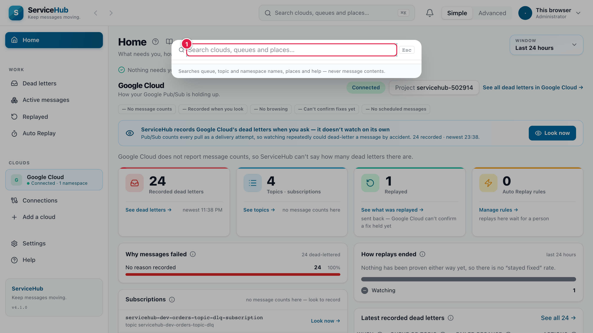

1. Search box — type part of a cloud, queue or page name. Enter opens the first result. Esc closes. Searching never changes anything.

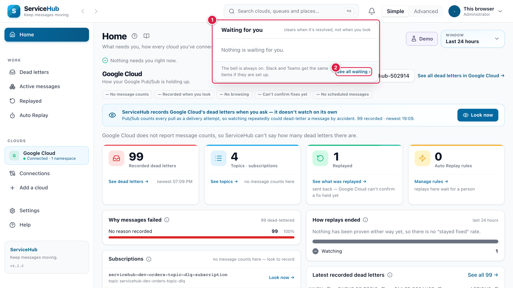

1. The bell — the only place the Agent asks you something. It lists what is waiting for you and clears when it is resolved, not when you look.
2. See all waiting — opens the full list of what needs a person.

### 7.3 The Advanced pages (read-only)

Advanced never changes anything. **Overview** summarises recovery, authority and agents, and says why Google Cloud cannot verify; the **Recovery Ledger** is the tamper-evident record of every action; **Failure Signatures** groups failures (on Google Cloud, with no reason recorded, they group by subscription); **Agents** lists what is acting and what is only watching.

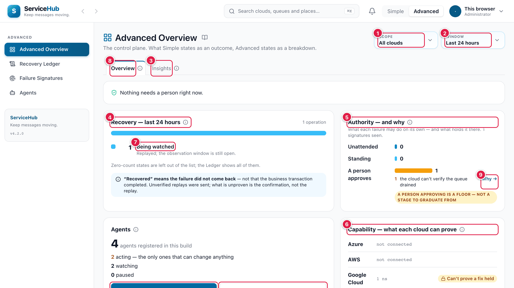

1. Scope — all clouds, or one.
2. Window — the period the page counts over.
3. Insights — patterns ServiceHub noticed across your failures.
4. Recovery — how replays ended. “Recovered” means it did not come back, not that the business transaction completed.
5. Authority — what each failure may do on its own, and what holds it there.
6. Capability — what each cloud can prove.
7. Being watched, All agents → and Recovery Ledger → — jump to the Agents page and the Recovery Ledger. They only open pages; nothing changes.
8. Overview — the page you are on; the other three Advanced pages are in the bar at the top.
9. Why → — explains why this cloud cannot yet prove a replayed message stayed fixed, and what would unlock it. It opens Help; nothing changes.

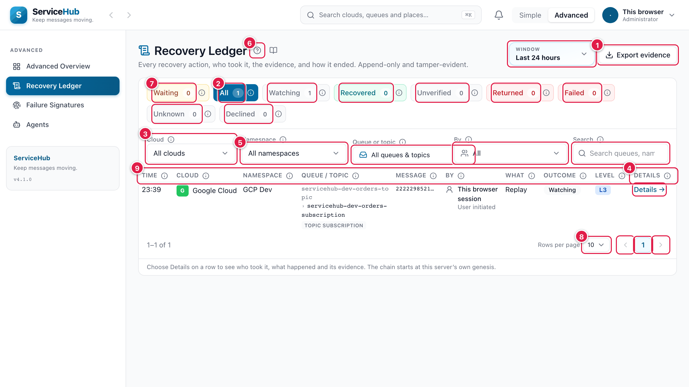

1. Export evidence — downloads the ledger so it can be verified offline. It changes nothing.
2. Outcome chips — Waiting, Watching, Recovered, Unverified, Returned, Failed, Unknown, Declined. Recovered and Unverified are never counted together.
3. Filters — cloud, namespace, queue or topic, who did it, and search.
4. Details — who took the action, what happened and its evidence. Each entry carries a fingerprint of the one before it.
5. Filters and entries — namespace, queue or topic, who, and search narrow the list; each entry opens to show its evidence.
6. What am I looking at? — a short reading guide for this page. Window — the period it counts over.
7. Outcome chips with counts — click one to list only those entries; All shows everything again.
8. Paging — how many rows per page, previous, the page number and next.
9. The table headings — each has an ⓘ that explains that column in a sentence.

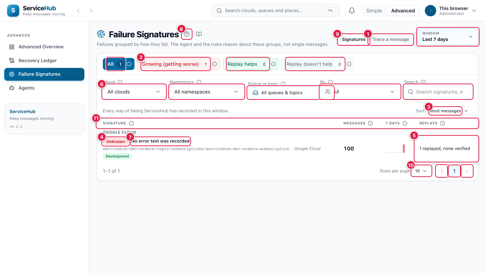

1. Trace a message — follow one message across clouds by its ID.
2. Growing — signatures whose recent days hold at least twice what earlier days did.
3. Sort — most messages, or others.
4. A signature — one way of failing: the same queue and the same kind of error, so many messages become one thing to reason about.
5. Replays — how many of these were replayed and how many were verified to have held. On Google Cloud none can be verified, and this says so.
6. Filters — cloud, namespace, queue or topic, who, and search.
7. Each signature row — opens to show the failures grouped under it and what each replay did.
8. What am I looking at? — a short reading guide. Window — the period counted.
9. Chips — Signatures, All, Replay helps, Replay doesn’t help. Click one to list only those.
10. Paging — rows per page, previous, the page number and next.
11. The table headings — Signature, Messages, Days and Replays, each with an ⓘ that explains it.

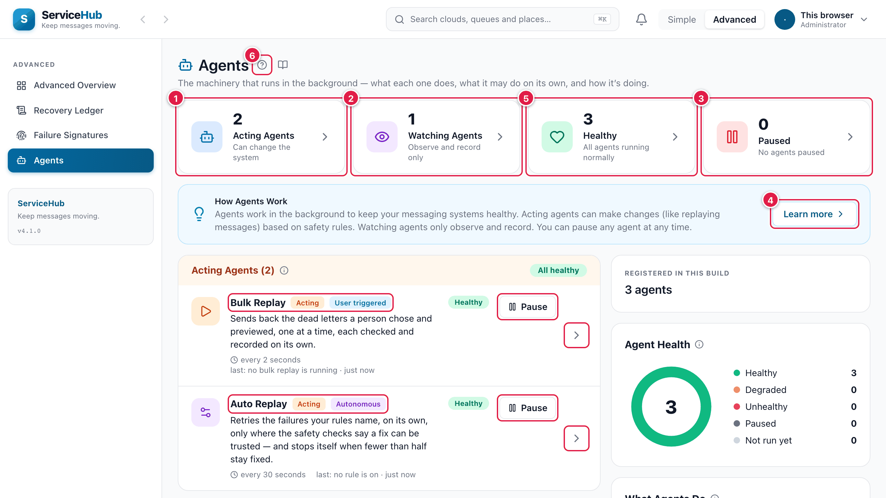

1. Acting agents — the only ones that can change anything, and only after the same safety checks you get.
2. Watching agents — they only look and record.
3. Pause — stops that agent acting. It is the one thing Advanced can do, because it only removes authority. Nothing it already did is undone.
4. Learn more — a short explanation of how agents work.
5. Health summary, agent rows and Open — the summary says whether every agent is running normally; a row opens that agent’s details; Open goes to the screen the agent works through.
6. What am I looking at? — a short reading guide for this page.

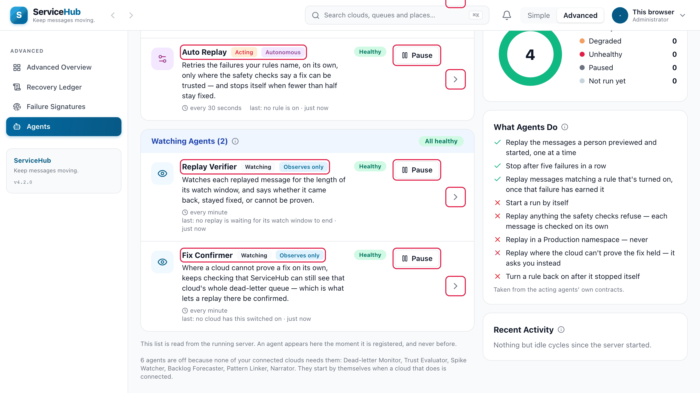

1. Watching agents — they only look and record; they cannot change anything.
2. Each agent row opens to show what it may and may not do; Open goes to the screen it works through; Pause (acting agents only) stops it acting.
3. Learn more — a short explanation of how agents work.

---

## If something goes wrong

- **Connect says the key is invalid, or could not authenticate.** Check you chose the whole JSON file the console downloaded for the ServiceHub service account (it contains `"type": "service_account"` and a `private_key`), and that the key is still **Enabled** (IAM & Admin → Service accounts → the account → Keys). A key cannot be downloaded again: if you lost the file, create a new key.
- **Connect works but finds no topics or subscriptions.** Check the **Project ID** — it is the ID, not the project name or number — and that the service account has **Pub/Sub Viewer** on that project.
- **Creating the key is blocked.** Your organisation may enforce the policy *Disable service account key creation* (`iam.disableServiceAccountKeyCreation`). Ask an administrator for an exception for this project, or use a project where it is allowed.
- **Dead letters stays empty after Look now.** The dead-letter subscription may really be empty, or there may be no subscription on the dead-letter topic (forwarded messages are dropped without one), or the service account lacks **Pub/Sub Subscriber** on it.
- **Replay is unavailable or refused.** The service account lacks **Pub/Sub Publisher** on the topic (to put the copy back) or **Pub/Sub Subscriber** on the subscription (to remove the dead-letter copy).
- **Look now or Replay takes a long time.** Pub/Sub has no way to fetch one message by id, so ServiceHub pulls until it finds it; with a long dead-letter queue this can take up to a minute. Keep the window open — nothing is lost if you leave.
- **The counts say “can't count here”.** Pub/Sub reports no message counts to ServiceHub. That is the cloud, not a fault: ServiceHub shows what it has recorded instead.
- **Why does every replay say “Verification required”?.** ServiceHub can prove a fix held only where the cloud can show the dead-letter queue stayed empty. Google Cloud cannot, so ServiceHub records the replay honestly instead of calling it fixed.

## Stopping and cleaning up

To stop ServiceHub watching Google Cloud: **Settings → Connections → Remove**. That forgets the connection and its stored credential on the ServiceHub server;
it deletes nothing in Google Cloud. To revoke access in Google Cloud, disable or delete the key (IAM & Admin → Service accounts → the account → Keys), and delete the
service account and its role grants if you no longer need them. If you created the topics only to try ServiceHub, delete them in Pub/Sub so nothing keeps costing money.
