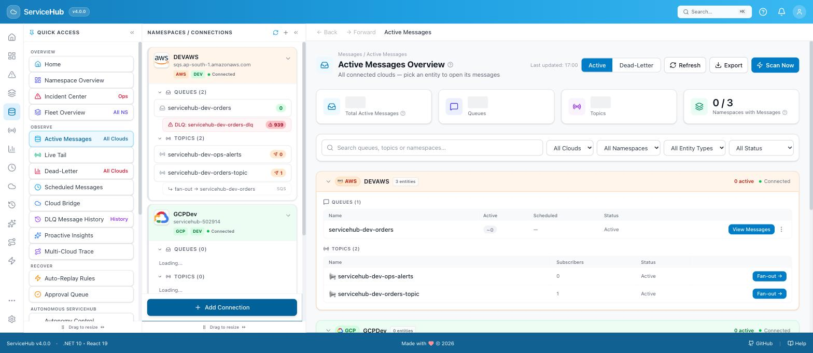
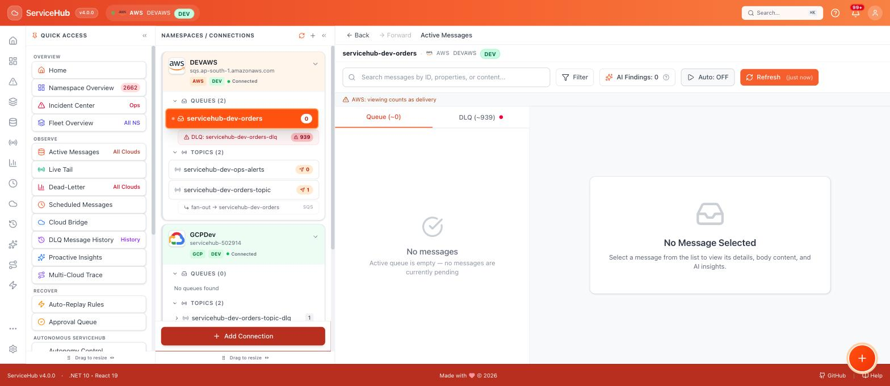
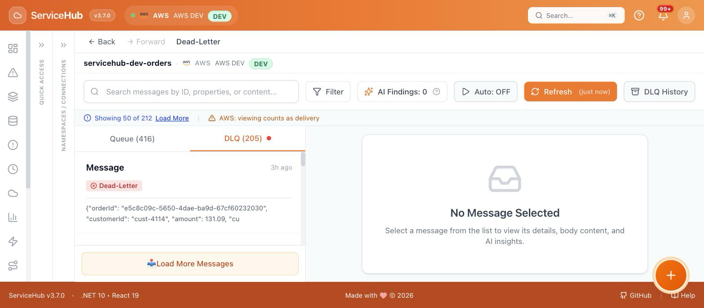
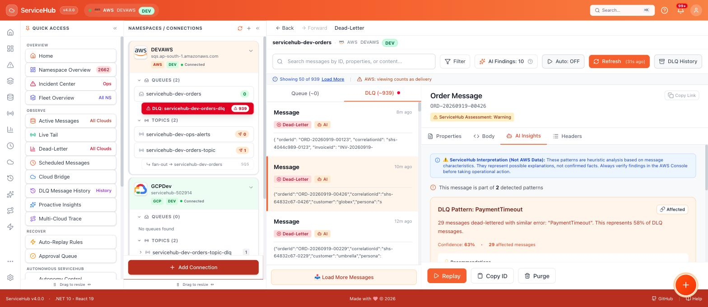
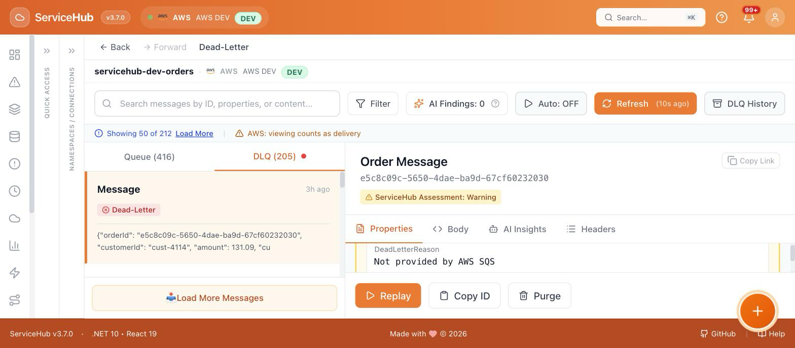
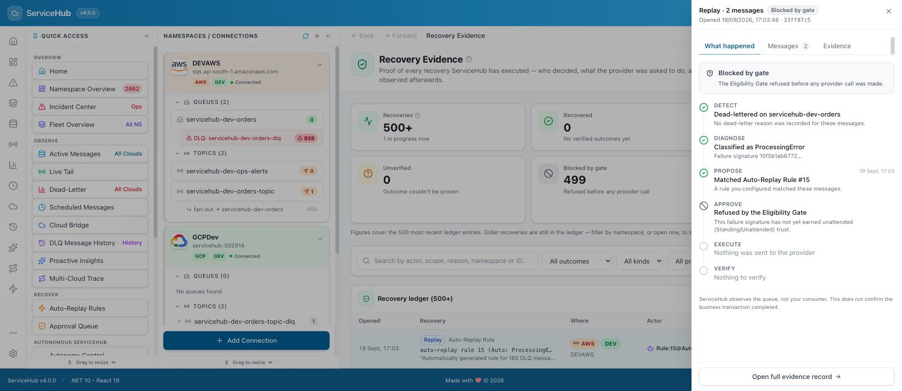
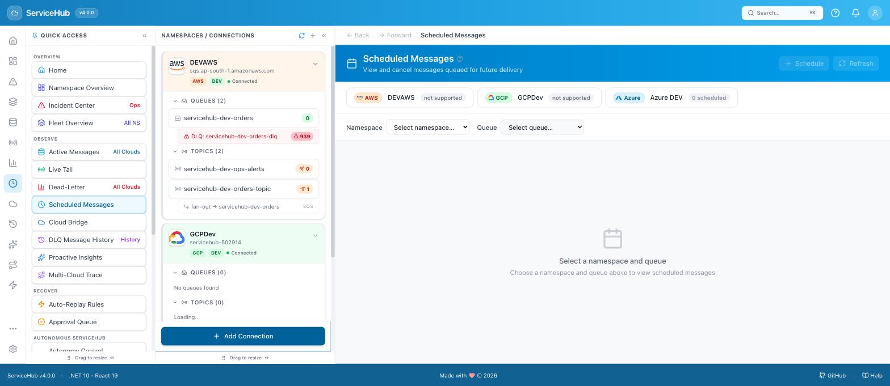

# ServiceHub for AWS SQS/SNS — A Beginner's Guide

This guide assumes no prior ServiceHub experience. It was tested live against a real AWS SQS
queue and SNS topic, not a mockup.

AWS SQS/SNS is a **Preview** provider in ServiceHub: validated against live AWS infrastructure
and safe to use, but with real limitations imposed by how SQS itself works (explained below) —
not full feature parity with Azure. Live browsing requires an operator to enable it on the
server first (off by default).

---

## What is AWS SQS/SNS?

**SQS (Simple Queue Service)** is Amazon's queue service — applications drop messages in, and
a consumer picks them up one at a time. **SNS (Simple Notification Service)** is Amazon's
publish/fan-out service — one message published to an SNS topic can be delivered to many
subscribed queues at once. When a queue is configured with a **redrive policy**, a message
that fails to process a set number of times is automatically moved to a **Dead-Letter Queue
(DLQ)** — a second, ordinary SQS queue set aside for failures.

## Why you need this guide

The AWS Console shows you a message *count*, not the messages themselves — you can't read a
body, search across them, or safely retry one without writing a script. ServiceHub gives you a
real message browser for SQS/SNS, DLQ investigation with AI-assisted grouping, one-click
replay, and a permanent audit trail — while being upfront about what SQS itself does and
doesn't allow (see [What's supported](#whats-supported-for-aws) below).

## How to connect

You'll need an AWS **Access Key ID** and **Secret Access Key**, and AWS support must be turned
on for your ServiceHub server (it's off by default). Full step-by-step instructions with
screenshots are in
[LOCAL-DEPLOYMENT.md → Connecting AWS SQS/SNS](../../LOCAL-DEPLOYMENT.md#connecting-aws-sqssns) —
follow that first, then come back here.

Once connected, your namespace appears in the sidebar, tinted orange (AWS's color throughout
ServiceHub):

---

## How to use it

### 1. Browse your queue

Click your queue in the sidebar. You'll see **Queue** (active messages) and **DLQ** tabs. Two
things look different from Azure right away — read them, they matter:

- **"AWS: viewing counts as delivery"** — SQS has no true non-destructive "peek" the way Azure
  does. Every time ServiceHub reads a message, AWS itself counts that as a delivery attempt.
  ServiceHub tells you this plainly rather than pretending browsing is free.
- **Auto-refresh is OFF by default** — because of the point above, ServiceHub deliberately
  doesn't auto-poll an AWS queue every few seconds the way it does for Azure/GCP, so casual
  browsing doesn't accidentally push messages toward their redrive limit and into the DLQ.
- There's also no **Live Tail** button here — real-time streaming needs a way to watch a queue
  without consuming delivery attempts, which SQS doesn't offer. ServiceHub simply doesn't show
  the button rather than showing a broken one.

Here's the queue's toolbar close-up — notice **Auto: OFF**, no Live Tail button, but a
**DLQ History** button is still present:

If your queue is fed by an SNS topic, the sidebar shows the real fan-out relationship —
topic → subscription → queue — instead of hiding it:

### 2. Investigate the Dead-Letter Queue

Open a DLQ message and check the **AI Insights** tab. Many AWS DLQ messages arrive with no
extra failure information — Amazon simply moves the message once its receive count crosses
the redrive threshold, with no reason attached. ServiceHub is honest about this instead of
inventing a fake pattern:

**What to expect:** if the message carries no distinguishing error information, you'll see "No
Patterns Detected... appears to be processing normally" rather than a fabricated root cause.
If your application *does* attach custom failure information as a message attribute,
ServiceHub will pick it up and cluster on it just like it does for Azure.

The **Properties** tab is honest in the same way. SQS itself doesn't attach a per-message
dead-letter reason the way Azure does, so ServiceHub says exactly that instead of inventing
one:

### 3. Replay a message and verify it

Click **Replay** on a DLQ message, confirm, and then check the **Recovery Evidence Ledger**
(`/recovery`) — every AWS replay is recorded there too, permanently:

### 4. Bulk Replay — with a real safety gate

For queues with many failed messages, **DLQ Intelligence** (`/dlq-history`) offers a **Bulk
Replay** action. Before anything happens, ServiceHub shows you exactly how many messages
matched and flags any it considers unsafe to retry blindly:

**What to expect:** nothing is replayed until you review the sample and explicitly confirm.
This is a real, working gate — not a decorative warning.

---

## What's supported for AWS

| Capability | Supported? | Why |
|---|---|---|
| Queue browsing, search, message detail | Yes | |
| DLQ investigation, AI pattern clustering | Yes | Honestly abstains when there's no real signal |
| Manual replay, purge, bulk replay/purge | Yes | With the safety gates shown above |
| SNS topic fan-out tracing | Yes | |
| **True non-destructive peek** | **No** | SQS has no such API — every read is a delivery attempt |
| **Live Tail (real-time streaming)** | **No** | Same underlying limitation — the button doesn't appear |
| **Scheduled Messages** | **No** | SQS has no native message-scheduling concept the way Service Bus does |
| Exact, always-current message counts | **Approximate** | `ApproximateNumberOfMessages` is AWS's own term — SQS counts are eventually consistent, not a live snapshot |

## What to do when something fails

| What you're seeing | What it means | What to do |
|---|---|---|
| "AWS SQS/SNS is disabled on this server" | The operator hasn't turned the AWS provider flag on yet | See [LOCAL-DEPLOYMENT.md → Connecting AWS SQS/SNS](../../LOCAL-DEPLOYMENT.md#connecting-aws-sqssns) for the one-line config change |
| DLQ or Active count changes just from browsing | Real SQS behavior — reads count as delivery attempts, and can push a message toward its redrive limit | Expected. Keep auto-refresh off (the default) and avoid repeatedly re-opening the same message if you want to preserve its remaining attempts |
| Two counts on the same page look slightly out of sync (e.g. a tab count vs. a "showing X of Y" total) | Both are real, independently-fetched reads of AWS's own approximate count — a few seconds apart, they can legitimately disagree | Not a bug — refresh if you want the latest of both |
| Message has no Live Tail or Scheduled option | Correct — SQS doesn't support the underlying capability | Use regular Refresh instead of Live Tail; there's no scheduled-send equivalent for SQS |
| A replayed message reappears in the DLQ later | The original cause hasn't been fixed, or it crossed the redrive threshold again from routine browsing | Investigate via AI Insights/message attributes, fix the root cause, then replay |

---

## The AWS usage flow

```mermaid
%%{init: {'theme':'dark', 'themeVariables': { 'fontSize':'16px', 'primaryTextColor':'#ffffff', 'fontFamily':'arial', 'lineColor':'#ffffff'}}}%%
flowchart LR
    A["1. Connect<br/>AWS SQS/SNS"] --> B["2. Browse queue<br/>honest 'no true peek' label"]
    B --> C["3. Investigate DLQ<br/>AI abstains if no signal"]
    C --> D["4. Replay<br/>single or bulk, safety-gated"]
    D --> E["5. Recovery Evidence<br/>permanent proof"]

    style A fill:#e65100,stroke:#bf360c,stroke-width:2px,color:#fff
    style B fill:#e65100,stroke:#bf360c,stroke-width:2px,color:#fff
    style C fill:#6a1b9a,stroke:#4a148c,stroke-width:2px,color:#fff
    style D fill:#2e7d32,stroke:#1b5e20,stroke-width:2px,color:#fff
    style E fill:#004d40,stroke:#00695c,stroke-width:2px,color:#fff
```

---

**Next steps:** for least-privilege IAM policy setup, see
[self-hosting/README.md → AWS SQS/SNS](../../self-hosting/README.md#aws-sqs--sns). For the
Recovery Evidence Ledger's full technical model, see [docs/RECOVERY-EVIDENCE.md](../RECOVERY-EVIDENCE.md).
