# ServiceHub for Azure Service Bus — A Beginner's Guide

This guide assumes no prior ServiceHub experience. If you can copy-paste and click a mouse,
you can follow along. Everything shown here was tested live against a real Azure Service Bus
namespace, not a mockup.

Azure Service Bus is the **fully supported (GA)** provider in ServiceHub — every feature in
this guide works end to end.

---

## What is Azure Service Bus?

Azure Service Bus is Microsoft's cloud messaging service. Applications use it to send each
other **messages** — small packets of data — through **queues** (one sender, one receiver) or
**topics with subscriptions** (one sender, many receivers, each getting their own copy).
When a message can't be processed successfully after a number of tries, Service Bus moves it
to a special holding area called the **Dead-Letter Queue (DLQ)** instead of losing it, so
someone can investigate what went wrong.

## Why you need this guide

The Azure Portal can tell you a queue has "247 dead-lettered messages," but not what's
*inside* them, why they failed as a group, or let you safely retry one with a single click.
ServiceHub reads those same messages and gives you a working investigation tool: full message
bodies, search, AI-assisted pattern grouping (with an honest "this is a guess" label — see
below), one-click replay, and a permanent, tamper-evident record of every recovery action
ServiceHub ever took.

## How to connect

Connecting Azure Service Bus to ServiceHub takes about a minute and needs one thing from
Azure: a **connection string** (a long piece of text that acts like a password for one
namespace). Full step-by-step instructions with screenshots are in
[LOCAL-DEPLOYMENT.md → Connecting Azure Service Bus](../../LOCAL-DEPLOYMENT.md#connecting-azure-service-bus) —
follow that first if you haven't connected yet, then come back here.

Once connected, your namespace appears in the left-hand sidebar, tinted blue (Azure's color
throughout ServiceHub):

---

## How to use it

### 1. Browse your queues and topics

Click a queue or topic in the sidebar to open it. You'll see the **Active** tab (messages
waiting to be processed) and the **Dead-Letter** tab (messages that failed), each with a live
count:

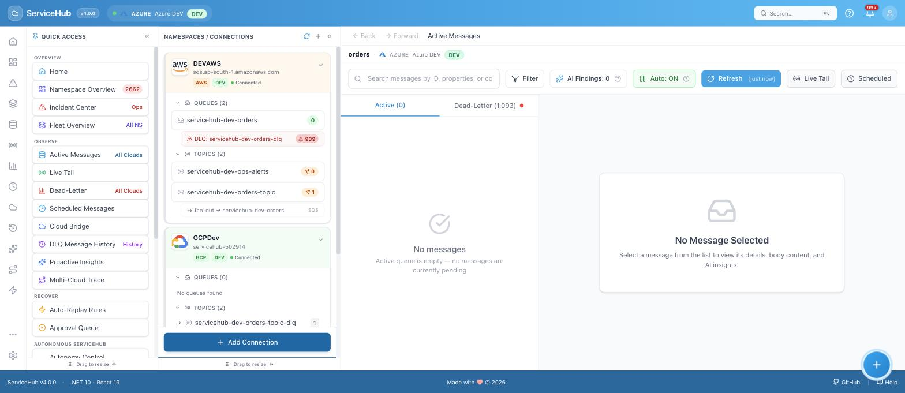

**What to expect:** the counts you see match what's really in Azure — this uses Azure's
"peek" operation, which reads a message without removing it or affecting its delivery count,
so simply browsing never accidentally damages anything.

### 2. Read a message

Click any message to open it. Four tabs show everything about it — **Properties** (technical
metadata like delivery count and sequence number), **Body** (the actual content, pretty-printed
if it's JSON), **AI Insights** (see below), and **Headers**.

**What to expect:** an active message's **Replay** button is disabled with the label "Active
messages cannot be replayed" — this is intentional. ServiceHub only reads messages by default;
replay only makes sense for a message that's already failed and landed in the DLQ.

**Tip:** the namespace panel on the far left can be collapsed with the **«** icon in its
header — this gives the message detail panel significantly more room, which helps once you're
comparing tabs. Here's each tab on its own, with the panel collapsed:

| Properties | Body | Headers |
|---|---|---|
| 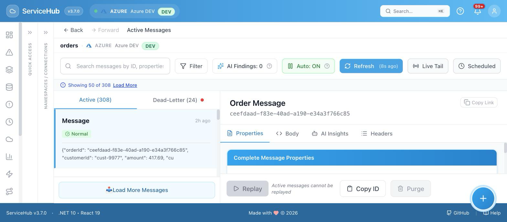 | 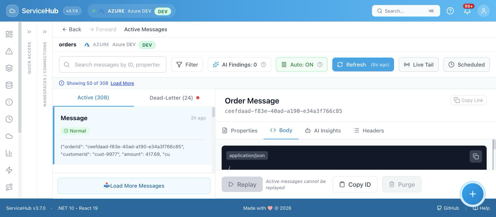 | 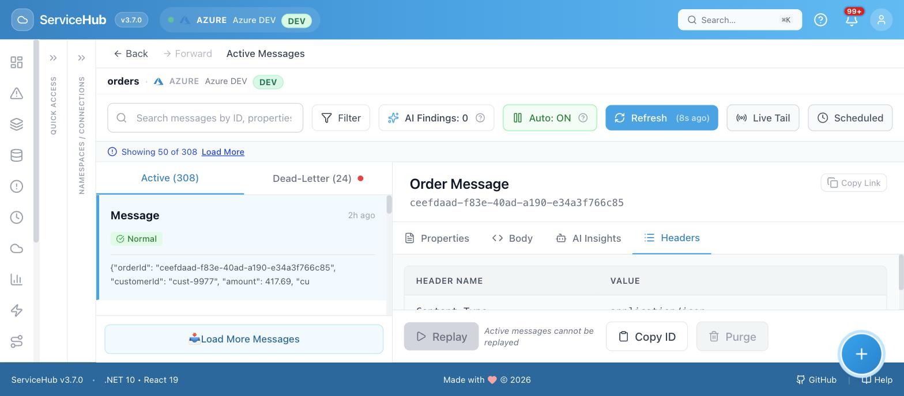 |

**Properties** shows technical metadata (sequence number, delivery count, enqueue time).
**Body** shows the raw content, syntax-highlighted when it's JSON, with a one-click **Copy**
button. **Headers** lists every application property attached to the message as a plain
name/value table.

### 3. Investigate the Dead-Letter Queue

Switch to the **Dead-Letter** tab and open a failed message. ServiceHub shows you Azure's own
real failure reason (`DeadLetterReason`, `DeadLetterErrorDescription`) right on the Properties
tab — this is a fact from Azure, not a guess:

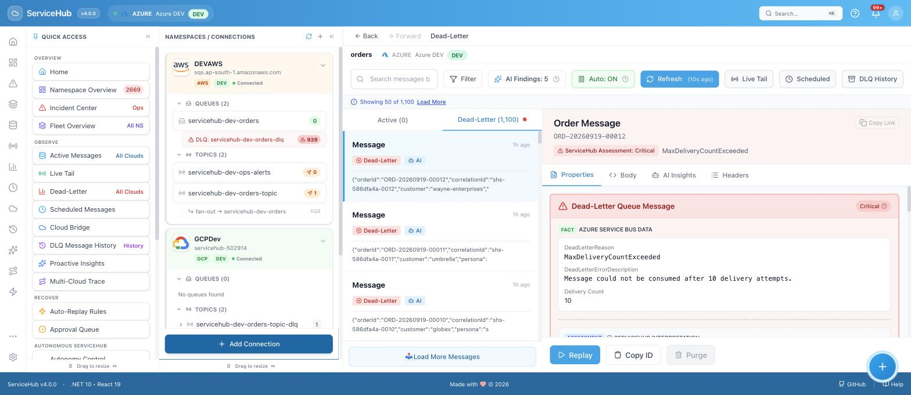

ServiceHub also adds its own plain-language interpretation on top of Azure's raw fields —
labeled as ServiceHub's assessment, never confused with Azure's own data:

### 4. Understand AI Insights (and its honesty label)

The **AI Insights** tab groups similar failures together and suggests what might be going on.
Every single AI-generated insight carries a visible disclaimer, because it's a best-effort
guess based on patterns in the data — never a confirmed fact:

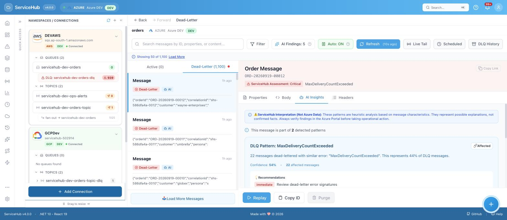

The disclaimer at the top of every AI Insights tab is not a one-time notice — it's shown on
every single finding, every time:

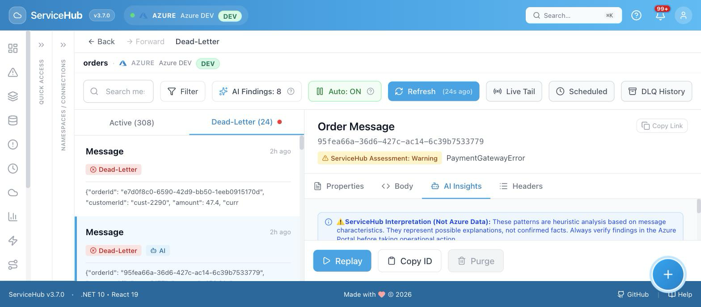

**What to expect:** a confidence percentage, a short recommendation, and a note telling you to
verify in the Azure Portal before taking action. This entire analysis runs in your own browser
— no message content is ever sent to an external AI service.

### 5. Replay a message

Found a message that's safe to retry? Click **Replay**. ServiceHub shows you exactly what will
happen and any caveats before it happens — nothing is silently automatic:

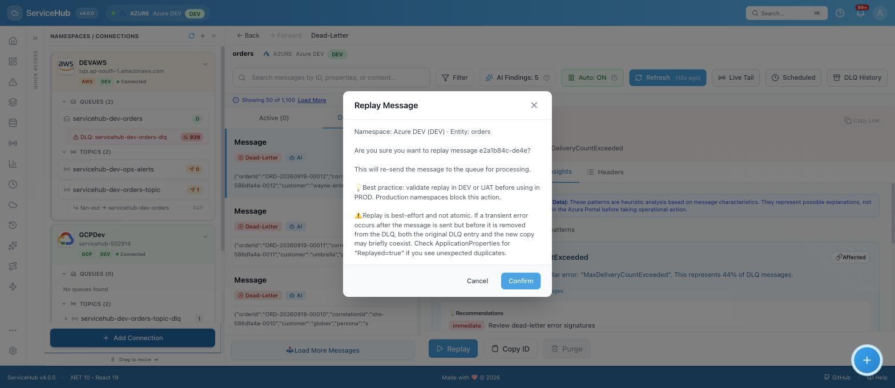

**What to expect:** the message is re-sent to the queue for processing. Because this touches a
real system, ServiceHub is upfront that replay is "best-effort and not atomic" — in rare cases
a transient error could leave both the original and the new copy briefly visible; the new copy
carries a `Replayed=true` marker so you can always tell them apart.

### 6. See proof of what happened — Recovery Evidence

Every replay (manual or automatic) is permanently recorded in the **Recovery Evidence Ledger**
(`/recovery`), so you never have to just take ServiceHub's word for it:

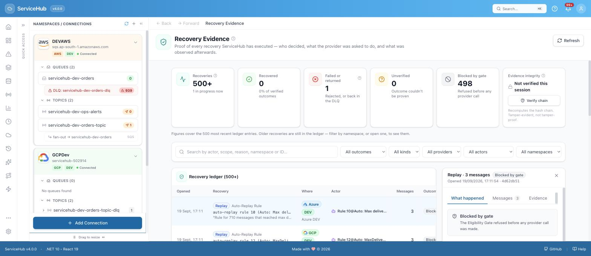

**What to expect:** a row appears within seconds showing who acted (you, or an automated
rule), what was asked of Azure, and how many messages were actually targeted. This ledger is
append-only — nothing in it can be edited or deleted after the fact, even by an administrator.

### 7. Scheduled Messages

If your application uses Service Bus's scheduled-delivery feature, ServiceHub's **Scheduled
Messages** page (`/scheduled`) shows every message queued for future delivery, with a live
countdown, and lets you reschedule or cancel any of them:

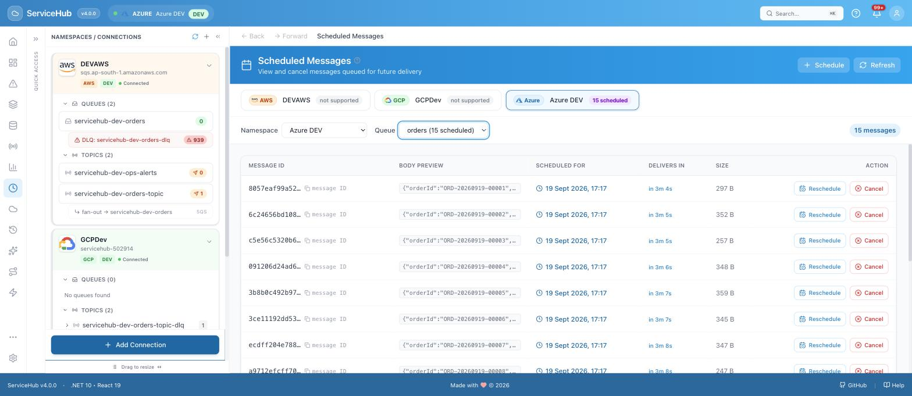

---

## What's supported for Azure

Azure Service Bus is ServiceHub's **fully supported (GA)** provider — every feature in the
product works here: queues, topics and subscriptions, full message browsing, DLQ forensics,
AI pattern clustering, manual and automated replay, bulk operations, Live Tail (real-time
streaming), Scheduled Messages, and the Recovery Evidence Ledger.

## What to do when something fails

| What you're seeing | What it means | What to do |
|---|---|---|
| A queue or topic doesn't appear in the sidebar | ServiceHub hasn't finished listing entities yet, or your connection string's access policy doesn't cover it | Wait a few seconds, or check the policy has at least **Listen** rights |
| "Active messages cannot be replayed" | This is correct, expected behavior | Only Dead-Letter messages can be replayed — that's by design |
| A replayed message reappears in the DLQ | Whatever originally caused the failure (a bug in your consumer, bad data) hasn't been fixed | Replay only re-sends the message — it doesn't fix the underlying cause. Check the AI Insights tab for hints, then fix the root cause before replaying again |
| An AI Insights pattern feels wrong | It's a heuristic guess, not a guarantee — the tab tells you this explicitly | Verify in the Azure Portal before acting on it; treat it as a starting point for investigation, not a final answer |
| Scheduled message countdown doesn't match what you expect | The list auto-refreshes every 10 seconds — you may be looking at a slightly stale value | Wait for the next refresh, or click Refresh manually |

---

## The Azure usage flow

```mermaid
%%{init: {'theme':'dark', 'themeVariables': { 'fontSize':'16px', 'primaryTextColor':'#ffffff', 'fontFamily':'arial', 'lineColor':'#ffffff'}}}%%
flowchart LR
    A["1. Connect<br/>Azure Service Bus"] --> B["2. Browse<br/>queues & topics"]
    B --> C["3. Investigate<br/>Dead-Letter Queue"]
    C --> D["4. AI Insights<br/>heuristic, always labeled"]
    D --> E["5. Replay<br/>with confirm dialog"]
    E --> F["6. Recovery Evidence<br/>permanent proof"]

    style A fill:#1565c0,stroke:#0d47a1,stroke-width:2px,color:#fff
    style B fill:#1565c0,stroke:#0d47a1,stroke-width:2px,color:#fff
    style C fill:#d84315,stroke:#bf360c,stroke-width:2px,color:#fff
    style D fill:#6a1b9a,stroke:#4a148c,stroke-width:2px,color:#fff
    style E fill:#2e7d32,stroke:#1b5e20,stroke-width:2px,color:#fff
    style F fill:#004d40,stroke:#00695c,stroke-width:2px,color:#fff
```

---

**Next steps:** for production deployment guidance — least-privilege access policies,
authentication, and running with real users — see
[self-hosting/README.md](../../self-hosting/README.md). For the deeper technical model behind
the Recovery Evidence Ledger shown above, see [docs/RECOVERY-EVIDENCE.md](../RECOVERY-EVIDENCE.md).
