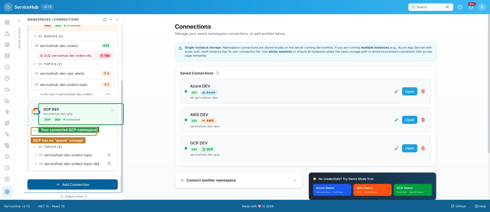
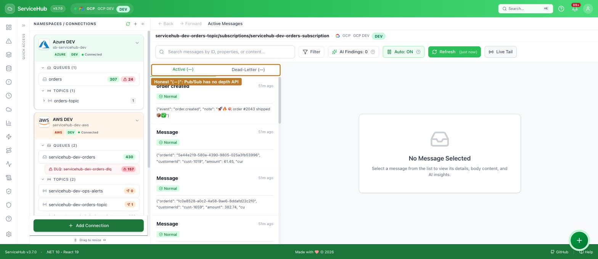
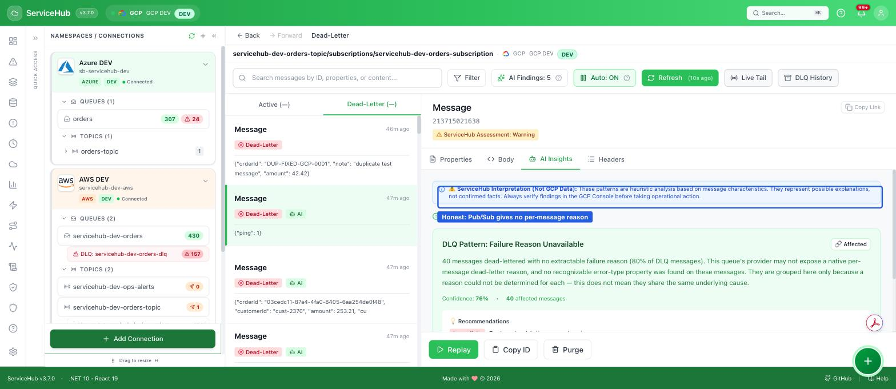
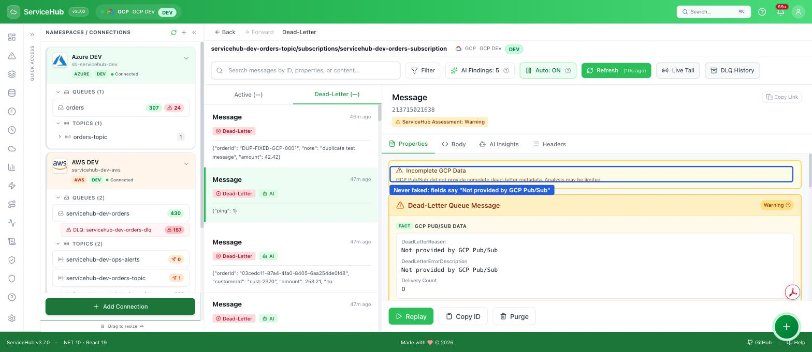
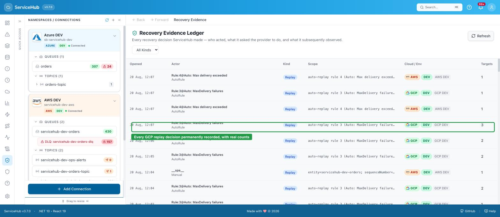
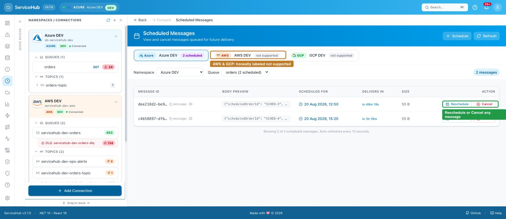
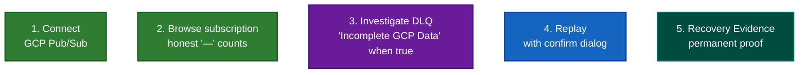

# ServiceHub for GCP Pub/Sub — A Beginner's Guide

This guide assumes no prior ServiceHub experience. It was tested live against a real GCP
Pub/Sub topic and subscription, not a mockup.

GCP Pub/Sub is a **Preview** provider in ServiceHub: validated against live GCP infrastructure
and safe to use, but with real limitations imposed by the Pub/Sub API itself (explained below)
— not full feature parity with Azure. Live browsing requires an operator to enable it on the
server first (off by default).

---

## What is GCP Pub/Sub?

Google Cloud Pub/Sub is a publish/subscribe messaging service. A publisher sends a message to
a **topic**; every **subscription** attached to that topic gets its own independent copy. When
a subscription is configured with a **dead-letter policy**, a message that a subscriber fails
to acknowledge after a set number of delivery attempts is automatically forwarded to a
separate **dead-letter topic** (itself just another topic, with its own subscription).

## Why you need this guide

The Google Cloud Console gives you basic metadata, not a real investigation tool — you can't
read a message body, search across a backlog, or safely retry a failed one without writing
code. ServiceHub gives you a real message browser for Pub/Sub, DLQ investigation, one-click
replay, and a permanent audit trail — while being explicit and honest about the parts of
Pub/Sub's API that simply don't expose certain data (see
[What's supported](#whats-supported-for-gcp) below).

## How to connect

You'll need a GCP **Service Account Key** (a `.json` file) and your **Project ID**, and GCP
support must be turned on for your ServiceHub server (it's off by default). Full step-by-step
instructions with screenshots are in
[LOCAL-DEPLOYMENT.md → Connecting GCP Pub/Sub](../../LOCAL-DEPLOYMENT.md#connecting-gcp-pubsub) —
follow that first, then come back here.

Once connected, your namespace appears in the sidebar, tinted green (GCP's color throughout
ServiceHub). Notice there's no "Queues" section — Pub/Sub doesn't have queues, only topics and
subscriptions, and ServiceHub reflects that honestly instead of showing an empty, confusing
queue list:

---

## How to use it

### 1. Browse your subscription

Click a topic/subscription in the sidebar. You'll notice the Active and Dead-Letter tab labels
show **"(—)"** instead of a number:

**What to expect:** this is intentional. Unlike SQS or Service Bus, Pub/Sub's API has no single
call that reports how many messages are sitting in a subscription — ServiceHub shows an honest
"—" rather than making up a number or crashing.

Message bodies — including Unicode, emoji, and special characters — render correctly and
safely; nothing you see here is ever executed as code, even if a message body happens to
contain something that looks like a script.

### 2. Investigate the Dead-Letter Queue

Open a DLQ message and check **AI Insights**. Pub/Sub's dead-letter mechanism, unlike Azure's,
doesn't attach a specific failure reason to each message — so when there's genuinely no signal
to work with, ServiceHub says so instead of guessing:

Switch to the **Properties** tab on the same message, and you'll see the same honesty applied
to raw data, not just AI commentary:

**What to expect:** fields ServiceHub can't get from GCP read *"Not provided by GCP Pub/Sub"* —
never a fake value standing in for missing data. Where Pub/Sub *does* expose something (like
the real delivery-attempt count from its own metadata), ServiceHub shows that too.

### 3. Replay a message and verify it

Click **Replay** on a DLQ message and confirm. Every GCP replay — manual or automatic — is
permanently recorded in the **Recovery Evidence Ledger** (`/recovery`), the same as every other
provider:

---

## What's supported for GCP

| Capability | Supported? | Why |
|---|---|---|
| Topic/subscription browsing, search, message detail | Yes | |
| DLQ investigation, AI pattern clustering | Yes | Honestly abstains when Pub/Sub gives no per-message reason |
| Manual replay, purge | Yes | |
| Unicode/emoji/special-character-safe rendering | Yes | |
| **Manual dead-lettering of a message** | **No** | Pub/Sub's API has no equivalent of Azure's "move to DLQ" operation |
| **Live message counts on a subscription** | **No** | Pub/Sub has no depth-reporting API — shown honestly as "—" |
| **Scheduled Messages** | **No** | Pub/Sub has no native scheduled-delivery concept |
| Per-message dead-letter reason | **Partial** | Only whatever Pub/Sub itself attaches (e.g. delivery-attempt count) — clearly labeled when something is missing |

## What to do when something fails

| What you're seeing | What it means | What to do |
|---|---|---|
| "GCP Pub/Sub is disabled on this server" | The operator hasn't turned the GCP provider flag on yet | See [LOCAL-DEPLOYMENT.md → Connecting GCP Pub/Sub](../../LOCAL-DEPLOYMENT.md#connecting-gcp-pubsub) for the one-line config change |
| Active/Dead-Letter tab shows "—" instead of a number | Correct — Pub/Sub has no API for this | Not a bug; use the message list itself to see what's actually there |
| "Queues (0)" in the sidebar | Correct — Pub/Sub has no queue concept, only topics/subscriptions | Look under Topics instead |
| No "Purge" or manual dead-letter option on an active message | Correct — Pub/Sub's API doesn't support forcing a message into the DLQ | This is a genuine Pub/Sub API limitation, not a missing ServiceHub feature |
| A DLQ message's Properties show "Not provided by GCP Pub/Sub" | GCP genuinely didn't give ServiceHub that piece of data for this message | Expected for some messages — check the subscription's own delivery-attempt metadata where shown, which is real |
| A replayed message reappears in the DLQ later | The original cause hasn't been fixed | Fix the consuming application, then replay again |

---

## The GCP usage flow

---

**Next steps:** for least-privilege IAM role setup, see
[self-hosting/README.md → GCP Pub/Sub](../../self-hosting/README.md#gcp-pubsub). For the
Recovery Evidence Ledger's full technical model, see [docs/RECOVERY-EVIDENCE.md](../RECOVERY-EVIDENCE.md).
