# The Quick Access Guide — Every Destination, Explained

**ServiceHub** is a self-hosted, open-source forensic debugger for cloud message queues (Azure
Service Bus, AWS SQS/SNS, GCP Pub/Sub). This guide assumes no prior ServiceHub experience. It
documents **every single item** in the
**Quick Access** panel — the column of shortcuts pinned to the left of the screen, the first
thing you see once a namespace is connected. If you've ever wondered "what does this button
actually do?", this is the page that answers it.

Everything shown here was captured live against real, already-connected Azure, AWS, and GCP
namespaces — not a mockup.

---

## Where should I start?

| If you're... | Go to |
|---|---|
| New to ServiceHub | [Namespace Overview](#namespace-overview) |
| Investigating failures | [Dead-Letter](#dead-letter) / [DLQ Intelligence](#dlq-intelligence) |
| Watching messages | [Live Tail](#live-tail) |
| Understanding repeated failures | [Failure Signatures](#failure-signatures) |
| Recovering messages | [Recovery Evidence](#recovery-evidence) |
| Automating recovery | [Auto-Replay Rules](#auto-replay-rules) |

---

## What is Quick Access?

Quick Access is the panel of shortcuts on the left side of every screen, grouped into five
sections by workflow stage: **Overview → Browse across clouds → Diagnose & automate →
Platform → Support**. It's always the first thing in the sidebar, and it's the fastest way to
get anywhere in ServiceHub without knowing a URL or clicking through a namespace tree first.

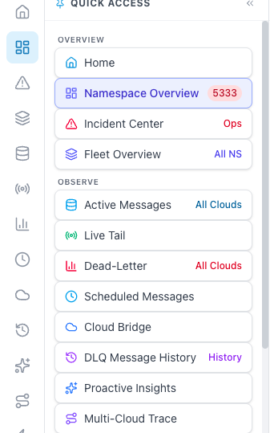

The green **1 — Quick Access panel** marker above shows the whole panel and all five groups at
once: **Overview**, **Browse across clouds**, **Diagnose & automate**, **Platform**, and
**Support**. Every section below shows one destination at a time the same way: a green **1**
marks the exact item to click in this panel, and a blue **2** marks the resulting screen it
opens.

The panel is collapsible (click the pin icon's row header), draggable to reorder, and
resizable — drag its right edge if you want more or less room for it.

**Tip:** the **NAMESPACES / CONNECTIONS** panel next to it (showing your connected clouds and
their queues/topics) can be collapsed with the **«** icon in its header. Collapsing it gives
every message list and detail view significantly more horizontal room — useful once you're
deep in a message's Properties/Body/AI Insights/Headers tabs.

---

## Overview

### Namespace Overview

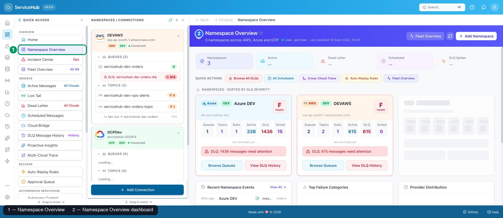

Select **Namespace Overview** in Quick Access (green marker 1). The home dashboard shown on the
right is the resulting screen (blue marker 2).

- **What is it?** The home dashboard. A single-page rollup of every connected namespace: total
  namespace count, active message count, dead-letter count, scheduled count, and a "DLQ
  spikes" indicator.
- **Why would you use it?** It's the fastest way to answer "is anything on fire right now?"
  across every cloud you've connected, without opening each namespace individually.
- **When should you use it?** First thing when you open ServiceHub, or any time you want a
  quick multi-cloud health check.
- **What screen opens?** A purple hero banner with live counts, a row of **Quick Actions**
  (Browse All DLQs, All Scheduled, Cross-Cloud Trace, Auto-Replay Rules, Fleet Health), and a
  **DLQ Hot Spots** list ranking namespaces by dead-letter volume.
- **What should you expect?** Counts refresh automatically ("Live · just now") and a manual
  **Refresh** button if you want to force an update immediately.
- **Important actions:** click **View** next to any hot-spot namespace to jump straight into
  its dead-letter queue.
- **Limitations:** this page aggregates what's already connected — it won't show a namespace
  you haven't added yet (see [Connections](#managing-connections) below).

### Incident Center

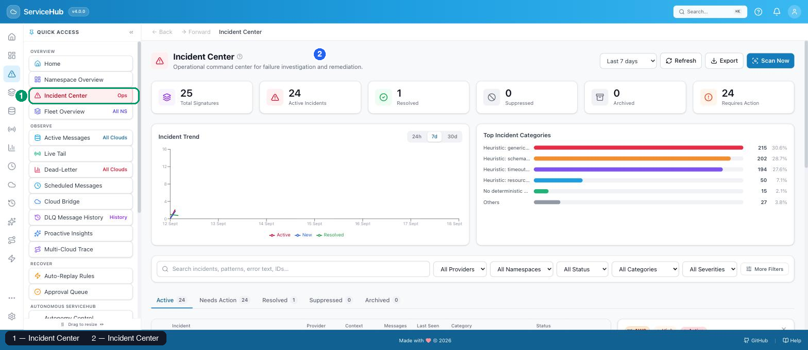

Select **Incident Center** in Quick Access (green marker 1). The operational command view shown
on the right is the resulting screen (blue marker 2).

- **What is it?** An operational command center that rolls up every **Failure Signature**
  (a recurring, AI-clustered pattern of similar dead-letter failures) across all connected
  namespaces, plus a live Fleet Health snapshot.
- **Why would you use it?** It answers "which recurring problems need a human to look at them
  right now?" — one screen instead of checking every namespace's Failure Signatures page one
  by one.
- **When should you use it?** During an incident, or as a daily/weekly triage habit.
- **What screen opens?** Six stat tiles (Total Signatures, Active, Resolved, Suppressed,
  Archived, Requires Action) and a Fleet Health list showing each namespace's status
  (Critical/Warning/Healthy) with an **Open Namespace** shortcut.
- **What should you expect?** "Requires Action" counts only signatures that are genuinely
  unresolved — resolving or suppressing a signature (from its detail page) removes it from
  this count.
- **Limitations:** this is a read-only rollup — you still act on individual signatures from
  their own detail pages (see [Failure Signatures](#failure-signatures) below).

### Fleet Health

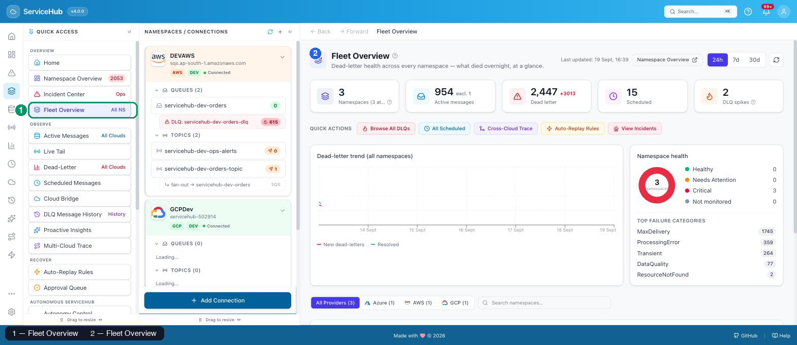

Select **Fleet Health** in Quick Access (green marker 1). The Fleet Health dashboard shown on
the right is the resulting screen (blue marker 2).

- **What is it?** A dead-letter health rollup across every namespace, with a 7-day trend chart
  and a breakdown of top failure categories.
- **Why would you use it?** It shows *trend*, not just a snapshot — is the dead-letter count
  climbing, falling, or flat over the last day/3 days/week?
- **When should you use it?** When you want to know whether things are getting better or worse,
  not just how bad they are right now.
- **What screen opens?** Four stat tiles (Active dead-letters, New in last 24h, Resolved in
  24h, Namespaces at risk), a time-range toggle (24h/3d/7d), a trend chart, and a "Top failure
  categories" list (e.g. ProcessingError, Unknown, MaxDelivery, DataQuality) with counts.
- **What should you expect?** "Namespaces at risk" only flags namespaces with a meaningful
  active dead-letter backlog — a namespace with zero or near-zero DLQ activity won't appear.
- **Important actions:** **Per-namespace details ↗** opens a focused view for one namespace.

---

## Browse across clouds

### Active Messages

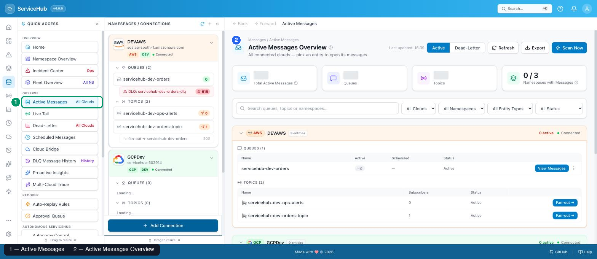

Select **Active Messages** in Quick Access (green marker 1). The cross-cloud entity picker shown
on the right is the resulting screen (blue marker 2).

- **What is it?** A cross-cloud entity picker for browsing messages that are still waiting to
  be processed (not yet failed). Every connected namespace is listed, grouped by provider,
  with its queues/topics and a live active-message count.
- **Why would you use it?** It's the fastest way to jump into any queue or topic across every
  connected cloud from one search box, instead of hunting through the sidebar tree.
- **When should you use it?** Any time you want to browse active traffic and don't already know
  exactly which namespace/queue you're looking for.
- **What screen opens?** A search box ("Search queues and topics across all clouds…"), then a
  card per namespace showing its provider badge, entity count, and each queue/topic with its
  active count. Click any entity to open its message list.
- **What should you expect?** Counts here match what the sidebar shows for the same entity —
  this page is a wider search surface over the same live data, not a separate cache.
- **Limitations:** on a single-provider installation, the button label reads **"All
  Namespaces"** instead of "All Clouds" — ServiceHub avoids implying multi-cloud data that
  doesn't exist.

### Live Tail

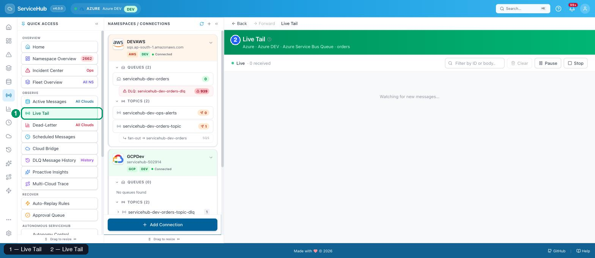

Select **Live Tail** in Quick Access (green marker 1). The namespace/entity picker shown on the
right is the resulting screen (blue marker 2).

- **What is it?** A real-time message stream — watch new messages arrive on one queue or topic
  subscription as they happen, without manually refreshing.
- **Why would you use it?** For watching a queue during a deploy or load test, to confirm
  traffic is flowing (or to catch the moment it stops).
- **When should you use it?** Any time you need to see messages *as they arrive*, rather than
  a point-in-time snapshot.
- **What screen opens?** A namespace picker, then a queue/topic-subscription picker, then a
  live-updating stream once you pick one.
- **What should you expect?** Live Tail needs a way to watch an entity without permanently
  consuming a delivery attempt on each message.
- **Limitations:** **not available for AWS SQS** — the button is simply absent on an AWS
  queue's toolbar, because SQS has no non-destructive way to watch without consuming delivery
  attempts. This isn't a bug; it's an honest capability gap. See the
  [AWS guide](aws-guide.md#whats-supported-for-aws). Selecting an AWS entity on this picker
  itself just highlights it without a distinct "unsupported" visual — the gap only becomes
  visible one level deeper, on the queue's own toolbar, so it isn't captured as a separate
  Quick Access screenshot here.

### Dead-Letter

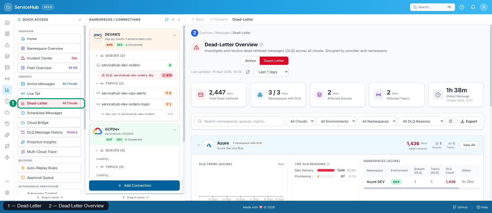

Select **Dead-Letter** in Quick Access (green marker 1). The cross-cloud dead-letter picker
shown on the right is the resulting screen (blue marker 2).

- **What is it?** The same cross-cloud entity picker as Active Messages, but scoped to
  dead-lettered (failed) messages — the ones that actually need investigating.
- **Why would you use it?** It's the fastest single click from anywhere in the app straight to
  "show me what's broken," across every connected cloud.
- **When should you use it?** Whenever you're starting an investigation and don't yet know
  which namespace is the source.
- **What screen opens?** Same layout as Active Messages, but every count and entity link opens
  directly into that entity's Dead-Letter tab.
- **What should you expect?** A red hero banner (vs. Active Messages' blue) makes it visually
  unmistakable that you're looking at failures, not healthy traffic.
- **Limitations:** none beyond what applies to Active Messages above.

### Scheduled Messages

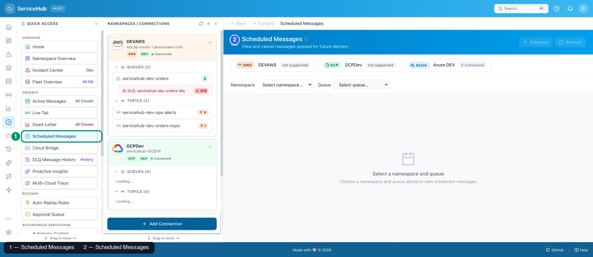

Select **Scheduled Messages** in Quick Access (green marker 1). The resulting screen (blue
marker 2) already shows all three providers' real support state side by side — Azure with a
live scheduled count, AWS and GCP each honestly labeled **"not supported"**.

- **What is it?** A view of every message queued for future delivery, with a live countdown,
  and the ability to reschedule or cancel any of them.
- **Why would you use it?** To confirm a delayed/scheduled send actually landed correctly, or
  to cancel one before it fires.
- **When should you use it?** Whenever your application uses delayed delivery and you need to
  audit or intervene on what's pending.
- **What screen opens?** A provider row (Azure/AWS/GCP, each labeled "N scheduled" or "not
  supported"), then namespace and queue dropdowns, then a table of pending messages.
- **What should you expect?** Selecting an AWS or GCP namespace shows an honest **"not
  supported"** state — not an empty table pretending nothing is scheduled.
- **Limitations:** Scheduled Messages is **Azure-only** — neither SQS nor Pub/Sub has a native
  scheduled-delivery concept for ServiceHub to build on.

### Cloud Bridge

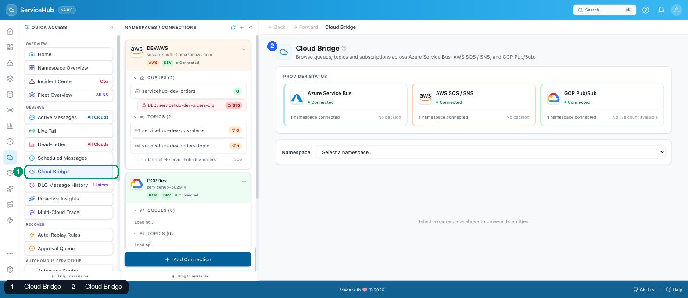

Select **Cloud Bridge** in Quick Access (green marker 1). The provider status screen shown on
the right is the resulting screen (blue marker 2).

- **What is it?** A single screen showing the live connection status of all three providers
  (Azure Service Bus, AWS SQS/SNS, GCP Pub/Sub) at once, each with its namespace count and
  dead-letter total, plus a namespace browser below.
- **Why would you use it?** It's the quickest way to confirm every cloud you expect to be
  connected actually *is* connected, in one glance, before diagning anything deeper.
- **When should you use it?** At the start of a session, or whenever something feels off and
  you want to rule out "is a whole provider down/disconnected?" first.
- **What screen opens?** Three provider cards with a colored status dot (Connected/Degraded/
  Disconnected), then a namespace dropdown to browse that provider's entities directly.
- **What should you expect?** A provider with zero backlog shows **"No backlog"** rather than
  a dead-letter count of 0 styled as a warning — the distinction matters when you're scanning
  quickly.
- **Limitations:** this is a status and browsing view, not an investigation tool — click into
  a namespace to actually read messages.

---

## Diagnose & automate

### DLQ Intelligence

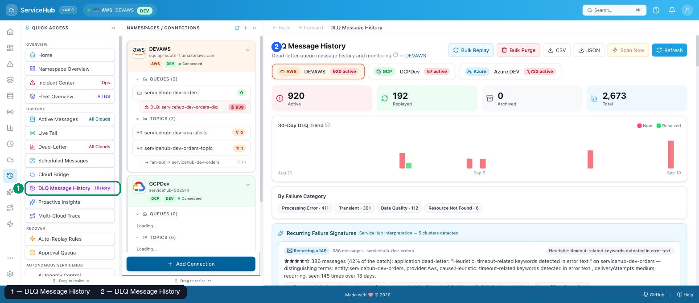

Select **DLQ Intelligence** in Quick Access (green marker 1). The namespace's DLQ history and
monitoring hub shown on the right is the resulting screen (blue marker 2).

- **What is it?** The dead-letter history and monitoring hub for a specific namespace: per-tab
  provider switching, Bulk Replay/Bulk Purge, CSV/JSON export, and a 30-day trend chart.
- **Why would you use it?** It's the deepest single-namespace DLQ view — more history and more
  bulk-action power than the plain Dead-Letter message list.
- **When should you use it?** When you need to act on many failed messages at once, or export
  DLQ history for a report.
- **What screen opens?** A provider tab row, four stat tiles (Active/Replayed/Archived/Total),
  a 30-day New-vs-Resolved trend chart, and (further down) the message list itself.
- **What should you expect?** **Bulk Replay** opens a **preview** first — it shows exactly how
  many messages matched and flags any it considers unsafe, before anything is sent. Nothing
  fires until you explicitly confirm.

  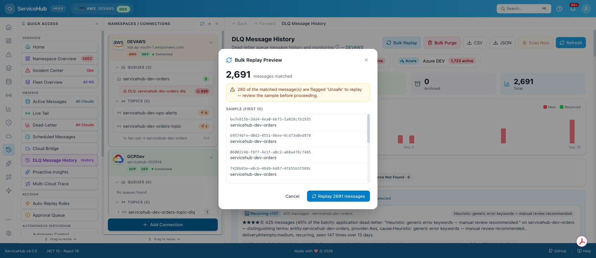

  **Bulk Purge** carries the same preview-before-action pattern, but its consequence is
  permanent rather than a retry — see the real preview dialog and its "no undo, no recycle
  bin" warning in the [AWS guide](aws-guide.md#6-bulk-purge--the-same-permanence-at-scale).

- **Important actions:** **Scan Now** forces an immediate re-scan for new AI patterns;
  **CSV**/**JSON** export the current DLQ history.
- **Limitations:** Bulk Replay/Purge are **disabled entirely on production namespaces** — not
  just hidden, genuinely blocked server-side.

### Auto-Replay Rules

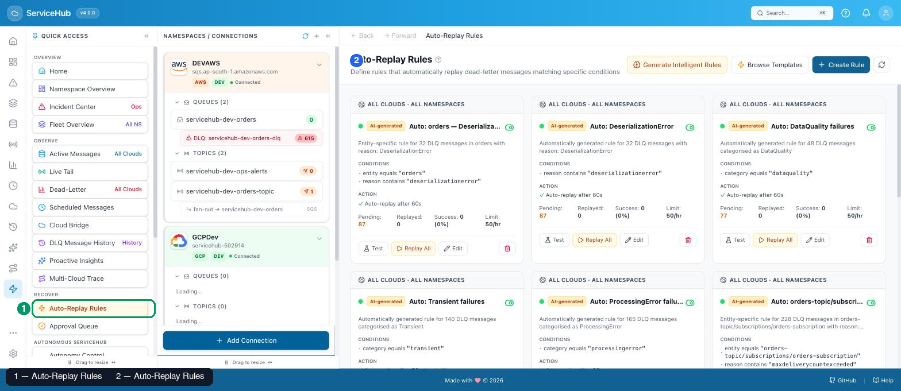

Select **Auto-Replay Rules** in Quick Access (green marker 1). The rule cards shown on the
right are the resulting screen (blue marker 2).

- **What is it?** Where you define rules that automatically replay dead-lettered messages
  matching specific conditions (e.g. "reason contains 'ThrottledException'"), without a human
  clicking Replay each time.
- **Why would you use it?** For failure categories you already know are safe to auto-retry
  (transient throttling, timeouts) — so you're not manually replaying the same known-good
  pattern over and over.
- **When should you use it?** Once you've seen a Failure Signature repeat a few times and
  you're confident it's safe to automate.
- **What screen opens?** A row of rule cards — some scoped to one namespace/entity, some
  "ALL CLOUDS · ALL NAMESPACES" — each showing its match conditions, action, and running
  pending/replayed/success counts. **Generate Intelligent Rules** and **Browse Templates**
  help you start from a suggestion instead of a blank rule.
- **What should you expect?** A rule can self-disable. If a rule's real success rate drops
  too low, ServiceHub's **circuit breaker** flips it off automatically and labels it
  **"safety-disabled"** — explicitly not a human decision, and explained on the card itself.
- **Limitations:** rules only ever touch DLQ messages already matching their conditions —
  they never create new messages or affect active traffic.

### Multi-Cloud Trace

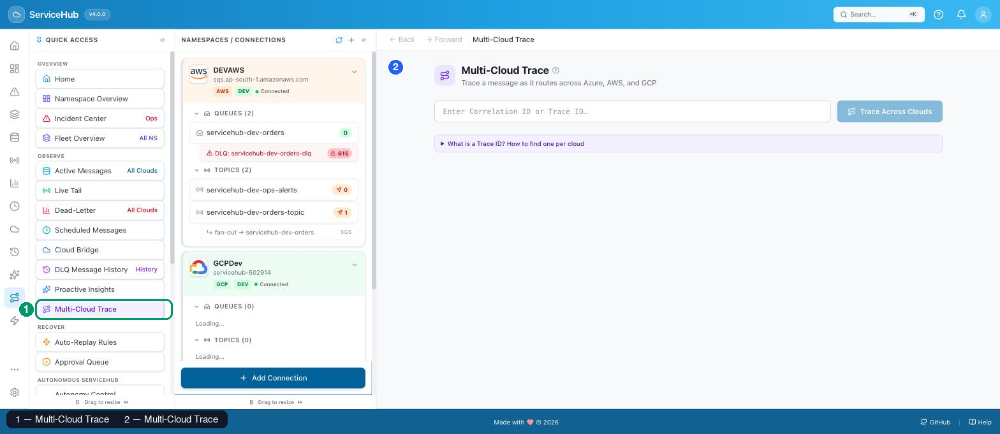

Select **Multi-Cloud Trace** in Quick Access (green marker 1). The trace search screen shown on
the right is the resulting screen (blue marker 2).

- **What is it?** A tool to trace a single message's journey by Correlation ID or Trace ID as
  it hops between providers (e.g. Azure → AWS via an integration).
- **Why would you use it?** To answer "where did this specific message go after it left my
  first cloud?" — useful when one provider's queue feeds another's via your own integration
  code.
- **When should you use it?** When investigating a cross-cloud workflow, and you have a
  correlation/trace ID to search on.
- **What screen opens?** A single search box and a **"What is a Trace ID?"** expandable
  explainer on how to find one per cloud.
- **What should you expect?** With only one provider connected, the sidebar link is still
  clickable but its tooltip says *"Needs at least two connected providers to trace a
  cross-cloud hop"* — an honest prerequisite, not a silent no-op.
- **Limitations:** requires your own application to already be propagating a shared
  correlation ID across clouds — ServiceHub can't trace a hop it has no shared identifier for.

---

## Platform

### System Health

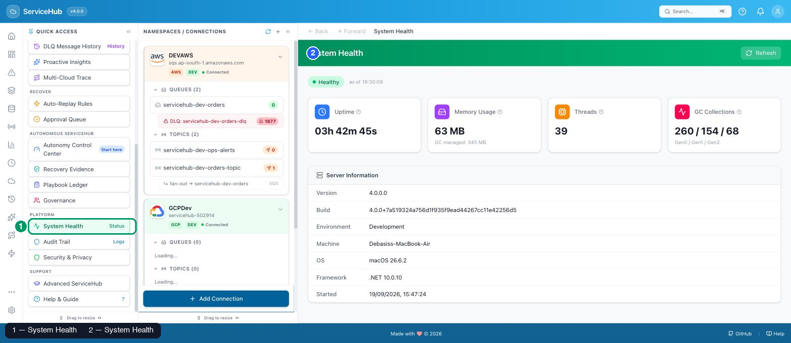

Select **System Health** in Quick Access (green marker 1). The runtime diagnostics screen shown
on the right is the resulting screen (blue marker 2).

- **What is it?** ServiceHub's own runtime diagnostics — not your cloud provider's health, but
  the ServiceHub server process itself (uptime, memory, threads, GC activity, version).
- **Why would you use it?** To sanity-check ServiceHub itself before assuming a data problem
  is a cloud-side issue — e.g. confirming the server hasn't just restarted, or isn't leaking
  memory.
- **When should you use it?** When something feels globally wrong (slow, inconsistent) rather
  than specific to one namespace.
- **What screen opens?** A top-level Healthy/Degraded badge, four stat tiles (Uptime, Memory
  Usage, Threads, GC Collections), and a Server Information panel (version, etc.).
- **What should you expect?** This reflects the process you're running locally — it has
  nothing to do with Azure/AWS/GCP's own status.
- **Limitations:** purely diagnostic — there's nothing to click or act on here.

### Audit Trail

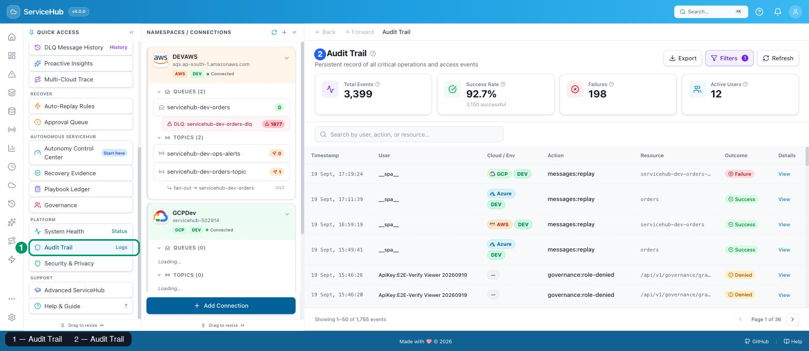

Select **Audit Trail** in Quick Access (green marker 1). The event log shown on the right is
the resulting screen (blue marker 2).

- **What is it?** A persistent, searchable log of every critical operation and access event —
  who did what, when, to which resource, and whether it succeeded.
- **Why would you use it?** For accountability: "who replayed this message?" or "when did this
  connection get added?" — a real answer, not a guess.
- **When should you use it?** During a post-incident review, or any time you need to prove what
  happened and when.
- **What screen opens?** Four stat tiles (Total Events, Success Rate, Failures, Active Users),
  a search box, and a paginated event table (Timestamp / User / Cloud-Env / Action / Resource /
  Outcome).
- **What should you expect?** Every replay, purge, connection change, and several other
  operation types are logged automatically — you don't opt in or configure this.
- **Important actions:** **Export** downloads the current filtered view; **Filters** narrows by
  action type, user, or date range.
- **Limitations:** this is a read-only historical log — it doesn't let you undo anything from
  here.

### Recovery Evidence

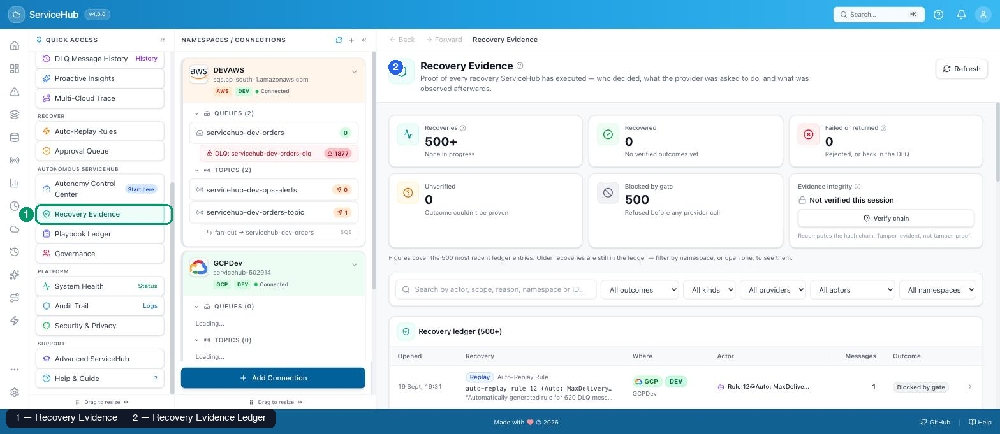

Select **Recovery Evidence** in Quick Access (green marker 1). The ledger shown on the right is
the resulting screen (blue marker 2).

- **What is it?** The permanent, append-only record of every recovery decision ServiceHub has
  made — every replay, whether triggered by a human or an Auto-Replay Rule — including what it
  asked the provider to do and what it subsequently observed.
- **Why would you use it?** It's proof, not a claim. Instead of trusting a "replay succeeded"
  toast, you can open the actual ledger entry and its hash-chained event history.
- **When should you use it?** After any replay, to confirm it actually happened the way you
  expect — or during a compliance/audit review of automated recovery actions.
- **What screen opens?** A table of operations (Opened / Actor / Kind / Scope / Cloud-Env /
  Targets), filterable by Kind. Click any row to open its full detail.
- **What should you expect?** On the detail page: an entry table per target, a **Verify
  chain** button that independently confirms the hash chain hasn't been tampered with, and
  **Export evidence** for a downloadable record.

  Click **Verify chain** and ServiceHub re-walks the entire hash chain server-side, not just
  this operation's own entries — the result appears as a toast:

  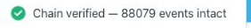

  **What to expect:** a green **"Chain verified — N events intact"** confirmation naming the
  actual number of events checked (tens of thousands in an active ledger) — this is a live
  cryptographic check against the database, not a cached or precomputed answer.

  Click **Export evidence** and ServiceHub downloads the full operation record as JSON
  immediately — no dialog, no extra step:

  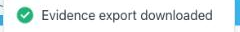

  **What to expect:** the download starts the moment you click; the confirmation toast is your
  only feedback that it happened. The exported file contains the operation's metadata, every
  target entry, and its event chain — suitable for attaching to an incident report or audit
  request without needing ServiceHub itself open.

  

  Not every entry means "replayed successfully" — a **Declined** result means an eligibility
  check blocked the attempt *before* any provider was contacted, and the ledger says so
  explicitly rather than hiding the attempt.
- **Important actions:** **Recovery Ageing Report** (linked from this page) shows every
  recovery entry that hasn't yet reached a terminal outcome, with its current age.

  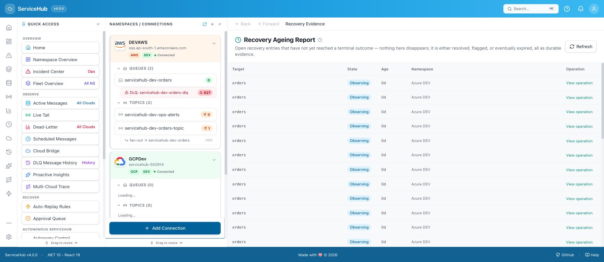

- **Limitations:** entries are append-only by design — nothing here can be edited or deleted
  after the fact, even by an administrator. That's the point.

### Security & Privacy

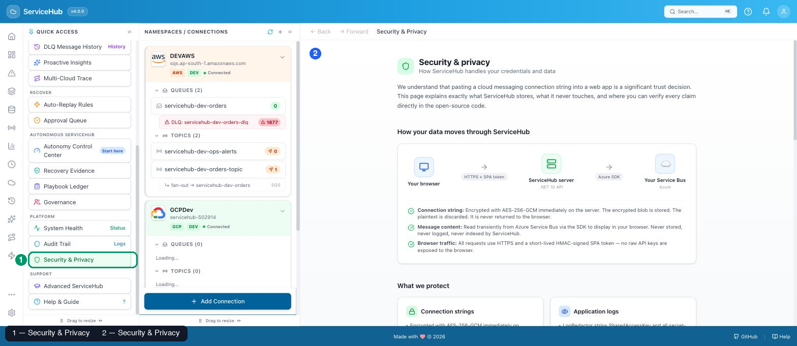

Select **Security & Privacy** in Quick Access (green marker 1). The security explanation page
shown on the right is the resulting screen (blue marker 2).

- **What is it?** A plain-language explanation of exactly how ServiceHub handles your
  credentials and data, including a diagram of how data actually moves through the system.
- **Why would you use it?** Pasting a cloud connection string into a web app is a real trust
  decision — this page tells you precisely what ServiceHub stores, what it never touches, and
  where to verify each claim in the open-source code.
- **When should you use it?** Before connecting your first real namespace, or whenever you need
  to answer a security-review question about ServiceHub.
- **What screen opens?** A "How your data moves through ServiceHub" diagram (Browser → HTTPS +
  SPA token → ServiceHub server → provider SDK → your cloud), followed by specific claims
  (e.g. "Connection string: Encrypted with AES-256-GCM immediately on the server").
- **What should you expect?** Every claim on this page is meant to be independently verifiable
  against the actual source code — it isn't marketing copy.
- **Limitations:** informational only — there are no settings to change on this page.

---

## Support

### Help & Guide

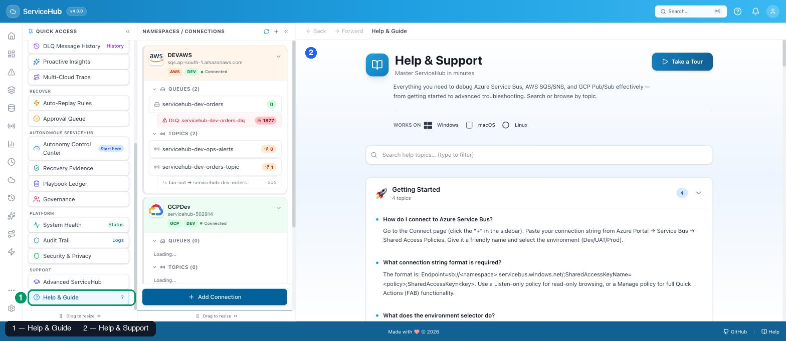

Select **Help & Guide** in Quick Access (green marker 1). The help center shown on the right is
the resulting screen (blue marker 2).

- **What is it?** ServiceHub's built-in help center — searchable topics covering setup,
  every major feature, and troubleshooting.
- **Why would you use it?** It's the fastest way to answer "how do I do X" without leaving the
  app or hunting through repository docs.
- **When should you use it?** Any time you're stuck, or want a guided walkthrough of a feature
  you haven't used yet.
- **What screen opens?** A search box, a **Take a Tour** button for an interactive walkthrough,
  and stat tiles summarizing setup time and feature count.
- **What should you expect?** Content here is written for the same non-programmer audience as
  this guide.
- **Limitations:** none — this is the intended first stop when anything is unclear.

---

## Managing Connections

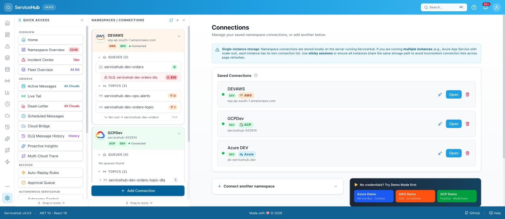

Not part of the Quick Access panel itself, but reachable from the **"Connect a cloud"** link
in the header (or `/connect`): this screen lists every saved namespace connection, with
**Open** and delete actions per row, and a form to add another. See
[LOCAL-DEPLOYMENT.md](../../LOCAL-DEPLOYMENT.md) for the full step-by-step connection walkthrough
per provider.

---

## Failure Signatures

Reached from **Incident Center**'s signature list, or a namespace's own Failure Signatures
page — not a Quick Access panel entry itself, but central enough to the "Diagnose & automate"
workflow to document here.

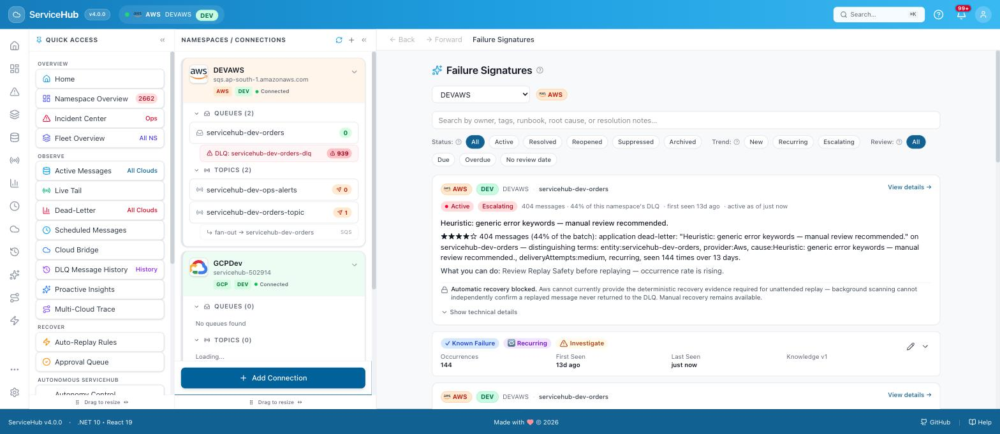

- **What is it?** ServiceHub's AI-assisted clustering of dead-letter messages into recurring
  "signatures" — groups of failures that share a root cause, tracked over time as Active,
  Resolved, Reopened, Suppressed, or Archived.
- **Why would you use it?** Instead of reading 200 individual DLQ messages, you see the small
  number of *distinct problems* behind them.
- **When should you use it?** As your primary DLQ triage tool once a namespace has real
  failure volume — start here before opening individual messages.

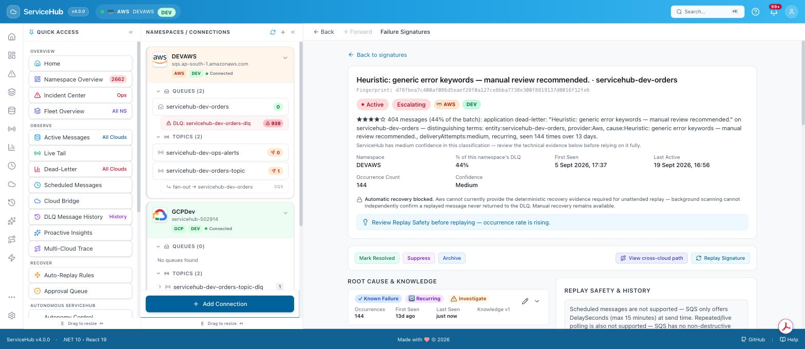

- **What screen opens (detail view)?** The signature's fingerprint, a confidence-scored
  explanation ("★★★★☆ 2 messages (6% of the batch): …"), first-seen/last-seen timestamps,
  occurrence count, and — critically — an honest statement of automatic-recovery eligibility.
- **What should you expect?** A signature can show **"Automatic recovery blocked"** with a
  clear reason (e.g. a provider that can't prove a replayed message never returned to the
  DLQ) — this is a safety decision, not a missing feature.
- **Limitations:** confidence is always labeled (High/Medium/Low) and this page tells you
  explicitly to verify findings before acting — it is a starting point for investigation,
  never a final verdict.

---

## Back / Forward navigation

Every screen's top-left corner shows **← Back** and **→ Forward** links, next to the current
page's name. This is ServiceHub's own in-app history — independent of your browser's
back/forward buttons — so it correctly retraces exactly the sequence of *ServiceHub* screens
you visited, including ones opened via Quick Access shortcuts or deep links.

| Before: viewing an operation's detail | After clicking Back: returned to the list |
|---|---|
| 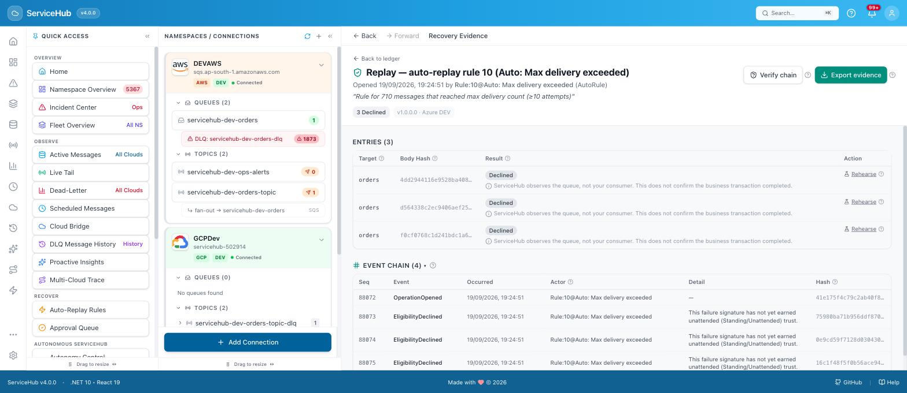 | 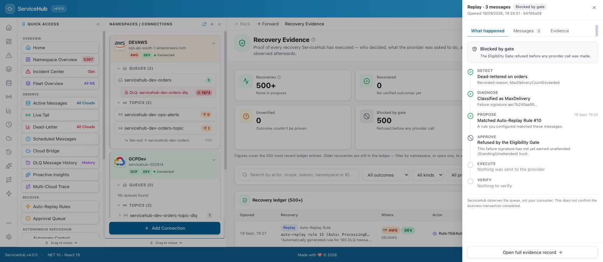 |

**What to expect:** **Back** is greyed out when there's nowhere to go back to (e.g. right
after opening ServiceHub); **Forward** is greyed out until you've gone Back at least once.
Both work the same way regardless of whether you got to the current page via Quick Access, the
sidebar, or a search result.

---

## The complete navigation model

```mermaid
%%{init: {'theme':'dark', 'themeVariables': { 'fontSize':'15px', 'primaryTextColor':'#ffffff', 'fontFamily':'arial', 'lineColor':'#ffffff'}}}%%
flowchart TB
    QA["Quick Access panel<br/>always visible, left sidebar"]

    subgraph OV["Overview"]
        NSO["Namespace Overview<br/>/dashboard"]
        IC["Incident Center<br/>/incidents"]
        FH["Fleet Health<br/>/fleet"]
    end

    subgraph BR["Browse across clouds"]
        AM["Active Messages<br/>/messages-overview"]
        LT["Live Tail<br/>/live-tail"]
        DL["Dead-Letter<br/>/messages-overview"]
        SM["Scheduled Messages<br/>/scheduled"]
        CB["Cloud Bridge<br/>/cloud-bridge"]
    end

    subgraph DA["Diagnose & automate"]
        DI["DLQ Intelligence<br/>/dlq-history"]
        AR["Auto-Replay Rules<br/>/rules"]
        MCT["Multi-Cloud Trace<br/>/cross-cloud-trace"]
    end

    subgraph PL["Platform"]
        SH["System Health<br/>/health"]
        AT["Audit Trail<br/>/audit"]
        RE["Recovery Evidence<br/>/recovery"]
        SEC["Security & Privacy<br/>/security"]
    end

    subgraph SP["Support"]
        HG["Help & Guide<br/>/help"]
    end

    QA --> OV
    QA --> BR
    QA --> DA
    QA --> PL
    QA --> SP

    AM -.opens.-> MSG["Message list → Message detail<br/>Properties / Body / AI Insights / Headers"]
    DL -.opens.-> MSG
    DI -.opens.-> SIG["Failure Signatures<br/>list → detail"]
    IC -.opens.-> SIG
    RE -.opens.-> ROD["Recovery operation detail<br/>+ Recovery Ageing Report"]

    style QA fill:#1565c0,stroke:#0d47a1,stroke-width:2px,color:#fff
    style OV fill:#2e7d32,stroke:#1b5e20,stroke-width:2px,color:#fff
    style BR fill:#1565c0,stroke:#0d47a1,stroke-width:2px,color:#fff
    style DA fill:#6a1b9a,stroke:#4a148c,stroke-width:2px,color:#fff
    style PL fill:#004d40,stroke:#00695c,stroke-width:2px,color:#fff
    style SP fill:#e65100,stroke:#bf360c,stroke-width:2px,color:#fff
```

---

**Next steps:** for a provider-specific walkthrough of actually investigating and recovering
messages, see the [Azure](azure-guide.md), [AWS](aws-guide.md), or [GCP](gcp-guide.md) guide.
For connecting your first namespace, see [LOCAL-DEPLOYMENT.md](../../LOCAL-DEPLOYMENT.md).
