# ServiceHub API Architecture & Design

## Overview

ServiceHub API is built on **Clean Architecture** principles with four distinct layers:
- **Shared**: Common types, constants, and utilities
- **Core**: Business logic and domain interfaces
- **Infrastructure**: Implementations, external service integrations
- **API**: HTTP handlers, middleware, and ASP.NET Core configuration

This document provides deep architectural insights through diagrams and detailed explanations.

---

## 1. Architecture Overview - Layered Design Diagram

```mermaid
%%{init: {'theme':'base', 'themeVariables': { 'fontSize':'18px', 'fontFamily':'arial'}}}%%
graph TB
    subgraph Presentation["🎨 PRESENTATION LAYER"]
        REST["<b>REST API Endpoints</b>"]
        SWAGGER["<b>Swagger/OpenAPI UI</b>"]
        HEALTH["<b>Health Checks</b>"]
    end

    subgraph API["🔌 API LAYER<br/>(ServiceHub.Api)"]
        CTRL["<b>Controllers</b>"]
        FILTER["<b>Filters & Validators</b>"]
        MIDDLEWARE["<b>Middleware Pipeline</b>"]
        EXT["<b>Extensions & Config</b>"]
    end

    subgraph Core["💼 CORE LAYER<br/>(ServiceHub.Core)"]
        ENTITY["<b>Domain Entities</b>"]
        INTERFACE["<b>Service Interfaces</b>"]
        RESULT["<b>Result Types</b>"]
    end

    subgraph Infrastructure["⚙️ INFRASTRUCTURE LAYER<br/>(ServiceHub.Infrastructure)"]
        IMPL["<b>Service Implementations</b>"]
        SB["<b>Azure Service Bus</b>"]
        AI["<b>AI Service</b>"]
        REPO["<b>Repositories</b>"]
        CRYPTO["<b>Encryption</b>"]
    end

    subgraph Shared["🧩 SHARED LAYER<br/>(ServiceHub.Shared)"]
        CONST["<b>Constants</b>"]
        HELPER["<b>Helpers & Utilities</b>"]
        MODEL["<b>Data Models</b>"]
    end

    subgraph External["🌐 EXTERNAL SYSTEMS"]
        ASB["<b>Azure Service Bus</b>"]
        AIAPI["<b>AI API</b>"]
        KV["<b>Azure Key Vault</b>"]
    end

    REST --> CTRL
    SWAGGER --> CTRL
    HEALTH --> CTRL
    CTRL --> FILTER
    CTRL --> INTERFACE
    FILTER --> MIDDLEWARE
    MIDDLEWARE --> EXT
    INTERFACE --> IMPL
    IMPL --> REPO
    IMPL --> CRYPTO
    IMPL --> SB
    IMPL --> AI
    ENTITY --> INTERFACE
    RESULT --> CTRL
    HELPER --> IMPL
    CONST --> IMPL
    REPO --> ENTITY
    SB --> ASB
    AI --> AIAPI
    CRYPTO --> KV

    style Presentation fill:#e1f5ff,stroke:#01579b,stroke-width:3px
    style API fill:#f3e5f5,stroke:#4a148c,stroke-width:3px
    style Core fill:#e8f5e9,stroke:#1b5e20,stroke-width:3px
    style Infrastructure fill:#fff3e0,stroke:#e65100,stroke-width:3px
    style Shared fill:#fce4ec,stroke:#880e4f,stroke-width:3px
    style External fill:#f5f5f5,stroke:#212121,stroke-width:3px
```



---

## 2. Request/Response Sequential Flow

```mermaid
%%{init: {'theme':'base', 'themeVariables': { 'fontSize':'18px'}}}%%
sequenceDiagram
    autonumber
    participant Client as 🌐 HTTP Client
    participant Middleware as 🔧 Middleware<br/>Pipeline
    participant Controller as 🎯 Controller
    participant Service as 💼 Service<br/>Layer
    participant Repository as 💾 Repository
    participant Cache as ⚡ In-Memory<br/>Cache
    participant Logger as 📝 Logger

    Client->>Middleware: <b>HTTP Request</b>
    Note over Middleware: <b>Security Headers</b><br/>Error Handling<br/>Correlation ID<br/>Request Logging<br/>API Key Auth<br/>Rate Limiting

    Middleware->>Controller: <b>Processed Request</b>
    Controller->>Controller: <b>Validate Input</b>
    Controller->>Service: <b>Call Business Logic</b>
    
    Service->>Cache: <b>Check Cache</b>
    alt Cache Hit
        Cache-->>Service: <b>Cached Result ⚡</b>
    else Cache Miss
        Service->>Repository: <b>Fetch Data</b>
        Repository-->>Service: <b>Domain Entity</b>
        Service->>Cache: <b>Store Result</b>
    end

    Service-->>Controller: <b>Result&lt;T&gt;</b>
    Controller->>Logger: <b>Log Operation</b>
    Controller-->>Middleware: <b>Response Object</b>
    
    Middleware->>Middleware: <b>Add Security Headers</b>
    Middleware->>Logger: <b>Log Response</b>
    Middleware-->>Client: <b>HTTP Response (JSON)</b>

    Note over Client,Logger: <b>Total Flow: ~5-50ms</b>
```

---

## 3. Detailed Class & Dependency Injection Diagram


---

## 4. API Request Processing Pipeline - Flow Diagram

```mermaid
graph TD
    A["📨 HTTP Request<br/>Received"] --> B["🔐 SecurityHeadersMiddleware<br/>Add Security Headers"]
    B --> C["⚠️ ErrorHandlingMiddleware<br/>Exception Handling"]
    C --> D["🔗 CorrelationIdMiddleware<br/>Track Request Trace"]
    D --> E["📝 RequestLoggingMiddleware<br/>Log Request Details"]
    E --> F["🔑 ApiKeyAuthenticationMiddleware<br/>Validate API Key"]
    
    F --> G{API Key<br/>Valid?}
    G -->|No| H["❌ 401/403 Response<br/>Return Error"]
    H --> I["🔄 SecurityHeadersMiddleware<br/>Add Headers to Error Response"]
    I --> J["📤 Return Response"]
    
    G -->|Yes| K["⏱️ RateLimitingMiddleware<br/>Check Rate Limit"]
    K --> L{Rate Limit<br/>Exceeded?}
    L -->|Yes| M["❌ 429 Response<br/>Too Many Requests"]
    M --> I
    
    L -->|No| N["📦 ResponseCompressionMiddleware<br/>Prepare Compression"]
    N --> O["🌐 CorsMiddleware<br/>Add CORS Headers"]
    O --> P["📚 Swagger Middleware<br/>API Documentation"]
    P --> Q["🛣️ RoutingMiddleware<br/>Route to Controller"]
    
    Q --> R["🎯 Controller Action<br/>Process Request"]
    R --> S["✅ Service Layer<br/>Business Logic"]
    S --> T["💾 Repository/Cache<br/>Data Access"]
    
    T --> U{Operation<br/>Success?}
    U -->|Error| V["⚠️ Error Result<br/>Build Error Response"]
    U -->|Success| W["✅ Success Result<br/>Build Success Response"]
    
    V --> X["🔄 Serialize Response<br/>JSON/XML"]
    W --> X
    
    X --> Y["💾 Response Caching<br/>Cache Headers"]
    Y --> Z["📤 Add Security Headers<br/>Send Response"]
    Z --> J

    style A fill:#e3f2fd
    style B fill:#ffccbc
    style C fill:#ffccbc
    style D fill:#c8e6c9
    style E fill:#b2dfdb
    style F fill:#ffccbc
    style G fill:#fff9c4
    style H fill:#ffcdd2
    style I fill:#ffccbc
    style J fill:#e3f2fd
    style K fill:#ffccbc
    style L fill:#fff9c4
    style M fill:#ffcdd2
    style R fill:#bbdefb
    style S fill:#c8e6c9
    style T fill:#b2dfdb
```



---

## 5. Data Flow: Create Namespace to Access Messages

```mermaid
%%{init: {'theme':'base', 'themeVariables': { 'fontSize':'18px'}}}%%
graph LR
    subgraph Client_Side["💻 CLIENT APPLICATION"]
        REQ["<b>POST</b><br/>/api/v1/namespaces<br/>{connectionString, name}"]
    end

    subgraph Validation["✅ 1️⃣ VALIDATION LAYER"]
        VAL["<b>ValidateModelAttribute</b><br/>Schema Validation"]
        DECRYPT["<b>Decrypt Connection String</b><br/>AES-GCM"]
    end

    subgraph Business_Logic["💼 2️⃣ BUSINESS LOGIC"]
        NSMGR["<b>NamespaceService</b><br/>Create Namespace"]
        FACT["<b>ServiceBusClientFactory</b><br/>Create Client"]
    end

    subgraph Storage["💾 3️⃣ DATA STORAGE"]
        REPO["<b>InMemoryRepository</b><br/>Store Metadata"]
        CACHE["<b>IServiceBusClientCache</b><br/>Cache Client Connection"]
    end

    subgraph Usage["🔍 4️⃣ USE NAMESPACE"]
        GETMSG["<b>GET</b><br/>/api/v1/namespaces/:id/messages<br/>Fetch Messages"]
        RETRIEVE["<b>ServiceBusReceiver</b><br/>Receive from Queue"]
    end

    subgraph Response["📤 5️⃣ RESPONSE HANDLING"]
        SERIALIZE["<b>Serialize Messages</b><br/>JSON Format"]
        HEADERS["<b>Add Response Headers</b><br/>X-Total-Count, X-Page-Size"]
        CACHE_HEADERS["<b>Add Cache Headers</b><br/>ETag, Last-Modified"]
    end

    REQ --> VAL
    VAL --> DECRYPT
    DECRYPT --> NSMGR
    NSMGR --> FACT
    FACT --> REPO
    REPO --> CACHE
    CACHE -.->|"<b>Later Request</b>"| GETMSG
    GETMSG --> RETRIEVE
    RETRIEVE --> SERIALIZE
    SERIALIZE --> HEADERS
    HEADERS --> CACHE_HEADERS
    CACHE_HEADERS --> FinalResponse["✅ <b>HTTP 200 Response</b>"]

    style Client_Side fill:#e1f5fe,stroke:#01579b,stroke-width:3px
    style Validation fill:#fff9c4,stroke:#f57f17,stroke-width:3px
    style Business_Logic fill:#c8e6c9,stroke:#2e7d32,stroke-width:3px
    style Storage fill:#b2dfdb,stroke:#00695c,stroke-width:3px
    style Usage fill:#c8e6c9,stroke:#2e7d32,stroke-width:3px
    style Response fill:#b2dfdb,stroke:#00695c,stroke-width:3px
    style FinalResponse fill:#a5d6a7,stroke:#1b5e20,stroke-width:3px
```



---

## 6. Security Architecture - Defense in Depth

```mermaid
%%{init: {'theme':'base', 'themeVariables': { 'fontSize':'18px'}}}%%
graph TB
    subgraph Encryption["🔒 ENCRYPTION LAYER"]
        CONNSTR["<b>Connection String Protection</b><br/>AES-GCM-256"]
        PRIVKEY["<b>Derive Key from Master</b><br/>SHA-256"]
        NONCE["<b>Random Nonce (96-bit)</b><br/>Unique per value"]
        TAG["<b>Auth Tag (128-bit)</b><br/>Tamper detection"]
    end

    subgraph Authentication["🔑 AUTHENTICATION LAYER"]
        APIKEY["<b>API Key Validation</b><br/>X-API-KEY Header"]
        BYPASS["<b>Bypass for Health/Swagger</b><br/>Public endpoints"]
        LOG_MASKING["<b>Log Masking</b><br/>Hide sensitive data"]
    end

    subgraph Transport["🔐 TRANSPORT LAYER"]
        TLS["<b>TLS 1.2+</b><br/>Encrypted in transit"]
        HSTS["<b>HSTS (31536000s)</b><br/>Force HTTPS"]
        CERT["<b>Certificate Validation</b><br/>Azure Service Bus"]
    end

    subgraph Headers["🛡️ SECURITY HEADERS"]
        CSP["<b>Content-Security-Policy</b><br/>Prevent XSS"]
        FRAME["<b>X-Frame-Options: DENY</b><br/>Prevent Clickjacking"]
        XCT["<b>X-Content-Type-Options</b><br/>nosniff"]
        PERM["<b>Permissions-Policy</b><br/>Restrict features"]
    end

    subgraph RateLimit["⏱️ RATE LIMITING"]
        IP_LIMIT["<b>IP-based Limiting</b><br/>100 req/min"]
        SLIDING["<b>Sliding Window</b><br/>Rolling 60s window"]
        BACKOFF["<b>Exponential Backoff</b><br/>429 with Retry-After"]
    end

    subgraph Logging["📝 SECURE LOGGING"]
        REDACT["<b>RedactingLoggerProvider</b><br/>Remove secrets"]
        CORRELA["<b>Correlation IDs</b><br/>Request tracing"]
        AUDIT["<b>Audit Trail</b><br/>Track all actions"]
    end

    Encryption --> Authentication
    Authentication --> Transport
    Transport --> Headers
    Headers --> RateLimit
    RateLimit --> Logging

    style Encryption fill:#ffccbc,stroke:#d84315,stroke-width:3px
    style Authentication fill:#fff9c4,stroke:#f57f17,stroke-width:3px
    style Transport fill:#c8e6c9,stroke:#2e7d32,stroke-width:3px
    style Headers fill:#b2dfdb,stroke:#00695c,stroke-width:3px
    style RateLimit fill:#f8bbd0,stroke:#c2185b,stroke-width:3px
    style Logging fill:#bbdefb,stroke:#1976d2,stroke-width:3px
```



---

## 7. Middleware Pipeline Execution Order

```mermaid
%%{init: {'theme':'base', 'themeVariables': { 'fontSize':'17px'}}}%%
graph TD
    A["<b>Request Entry</b>"] --> B["<b>1. SecurityHeadersMiddleware</b><br/>Add Security Headers to Response<br/>Order: FIRST | Scope: ALL requests"]
    
    B --> C["<b>2. ErrorHandlingMiddleware</b><br/>Wrap request in try-catch<br/>Order: SECOND | Scope: ALL requests"]
    
    C --> D["<b>3. CorrelationIdMiddleware</b><br/>Generate/Extract CorrelationId<br/>Order: THIRD | Scope: ALL requests"]
    
    D --> E["<b>4. RequestLoggingMiddleware</b><br/>Log incoming request<br/>Order: FOURTH | Scope: ALL requests"]
    
    E --> F["<b>5. ApiKeyAuthMiddleware</b><br/>Validate X-API-KEY header<br/>Order: FIFTH | Scope: ALL (except /health, /swagger)"]
    
    F --> G["<b>6. RateLimitingMiddleware</b><br/>Check rate limit per IP<br/>Order: SIXTH | Scope: PRODUCTION only"]
    
    G --> H["<b>7. CompressionMiddleware</b><br/>Enable gzip/brotli<br/>Order: SEVENTH | Scope: ALL responses"]
    
    H --> I["<b>8. CorsMiddleware</b><br/>Apply CORS policy<br/>Order: EIGHTH | Scope: ALL cross-origin"]
    
    I --> J["<b>9. SwaggerMiddleware</b><br/>Serve API docs<br/>Order: NINTH | Scope: /swagger only"]
    
    J --> K["<b>10. RoutingMiddleware</b><br/>Match route & select controller<br/>Order: TENTH | Scope: ALL requests"]
    
    K --> L["<b>11. CachingMiddleware</b><br/>Apply caching headers<br/>Order: ELEVENTH | Scope: GET requests"]
    
    L --> M["🎯 <b>CONTROLLER & ACTION</b><br/>Process business logic"]
    
    M -.->|"<b>Response flows back through<br/>middleware in REVERSE order</b>"| N["<b>Response Header Assembly</b><br/>All middleware add response headers"]
    
    N --> O["🎁 <b>HTTP Response to Client</b>"]

    style A fill:#e3f2fd,stroke:#1565c0,stroke-width:3px
    style B fill:#ffccbc,stroke:#d84315,stroke-width:3px
    style C fill:#ffccbc,stroke:#d84315,stroke-width:3px
    style D fill:#c8e6c9,stroke:#2e7d32,stroke-width:3px
    style E fill:#b2dfdb,stroke:#00695c,stroke-width:3px
    style F fill:#ffccbc,stroke:#d84315,stroke-width:3px
    style G fill:#ffccbc,stroke:#d84315,stroke-width:3px
    style H fill:#b2dfdb,stroke:#00695c,stroke-width:3px
    style I fill:#b2dfdb,stroke:#00695c,stroke-width:3px
    style J fill:#b2dfdb,stroke:#00695c,stroke-width:3px
    style K fill:#b2dfdb,stroke:#00695c,stroke-width:3px
    style L fill:#b2dfdb,stroke:#00695c,stroke-width:3px
    style M fill:#bbdefb,stroke:#1976d2,stroke-width:3px
    style N fill:#c8e6c9,stroke:#2e7d32,stroke-width:3px
    style O fill:#e3f2fd,stroke:#1565c0,stroke-width:3px
```



---

## 8. Entity Relationship & Domain Model


---

## 9. Exception Handling Flow

```mermaid
%%{init: {'theme':'base', 'themeVariables': { 'fontSize':'17px'}}}%%
graph TD
    A["<b>Exception Occurs</b><br/>in Business Logic"] --> B{<b>Exception<br/>Type?</b>}
    
    B -->|<b>ValidationException</b>| C["❌ <b>400 Bad Request</b><br/>Client Error<br/>Input validation failed"]
    B -->|<b>NotFoundException</b>| D["❌ <b>404 Not Found</b><br/>Resource doesn't exist"]
    B -->|<b>UnauthorizedException</b>| E["❌ <b>401 Unauthorized</b><br/>Missing/Invalid credentials"]
    B -->|<b>ForbiddenException</b>| F["❌ <b>403 Forbidden</b><br/>Insufficient permissions"]
    B -->|<b>TimeoutException</b>| G["❌ <b>504 Gateway Timeout</b><br/>Operation timed out"]
    B -->|<b>ServiceBusException</b>| H["❌ <b>503 Service Unavailable</b><br/>External service error"]
    B -->|<b>Unexpected Exception</b>| I["❌ <b>500 Internal Server Error</b><br/>Unhandled exception"]
    
    C --> J["<b>Build ProblemDetails</b><br/>RFC 7231 Format"]
    D --> J
    E --> J
    F --> J
    G --> J
    H --> J
    I --> J
    
    J --> K["<b>Log Exception</b><br/>Full stack trace<br/>Correlation ID"]
    K --> L["<b>Add Error Headers</b><br/>X-Error-Code<br/>X-Correlation-Id"]
    L --> M["<b>Serialize JSON Response</b><br/>Include error details"]
    M --> N["<b>Send Response</b><br/>Appropriate HTTP Status"]
    N --> O["💻 <b>Client Receives</b><br/>Structured Error"]

    style A fill:#ffcdd2,stroke:#c62828,stroke-width:3px
    style C fill:#ffcdd2,stroke:#c62828,stroke-width:3px
    style D fill:#ffcdd2,stroke:#c62828,stroke-width:3px
    style E fill:#ffcdd2,stroke:#c62828,stroke-width:3px
    style F fill:#ffcdd2,stroke:#c62828,stroke-width:3px
    style G fill:#ffcdd2,stroke:#c62828,stroke-width:3px
    style H fill:#ffcdd2,stroke:#c62828,stroke-width:3px
    style I fill:#ffcdd2,stroke:#c62828,stroke-width:3px
    style J fill:#fff9c4,stroke:#f57f17,stroke-width:3px
    style K fill:#c8e6c9,stroke:#2e7d32,stroke-width:3px
    style L fill:#b2dfdb,stroke:#00695c,stroke-width:3px
    style M fill:#b2dfdb,stroke:#00695c,stroke-width:3px
    style N fill:#e3f2fd,stroke:#1565c0,stroke-width:3px
```



---

## 10. Caching Strategy - In-Memory Cache Lifecycle

```mermaid
%%{init: {'theme':'base', 'themeVariables': { 'fontSize':'18px'}}}%%
graph LR
    subgraph Request_Flow["🔄 CACHE LOOKUP FLOW"]
        A["🔍 <b>Service Layer</b><br/>Needs Data"] --> B{<b>Cache<br/>Hit?</b>}
        B -->|<b>Yes</b>| C["⚡ <b>Return from Cache</b><br/>~1-2ms"]
        B -->|<b>No</b>| D["💾 <b>Fetch from</b><br/>Repository"]
        D --> E["📦 <b>Store in Cache</b><br/>with TTL"]
        E --> F["✅ <b>Return to Client</b>"]
        C --> F
    end

    subgraph Cache_Types["📊 CACHE STRATEGY PER ENTITY"]
        G["<b>ServiceBus Client</b><br/>Cache Duration: 60 min<br/>Strategy: LRU"]
        H["<b>Namespace List</b><br/>Cache Duration: 5 min<br/>Strategy: TTL"]
        I["<b>Queue Messages</b><br/>Cache Duration: 1 min<br/>Strategy: Event-driven"]
    end

    subgraph Invalidation["🔄 CACHE INVALIDATION"]
        J["<b>Manual Invalidation</b><br/>On Create/Update/Delete"]
        K["<b>Time-based Invalidation</b><br/>TTL Expiration"]
        L["<b>Event-driven Invalidation</b><br/>Service Bus Events"]
    end

    A --> G
    B -.->|"<b>Cache Hit</b>"| H
    B -.->|"<b>Cache Miss</b>"| I
    J --> K
    K --> L
    L --> A

    style Request_Flow fill:#b2dfdb,stroke:#00695c,stroke-width:3px
    style Cache_Types fill:#c8e6c9,stroke:#2e7d32,stroke-width:3px
    style Invalidation fill:#fff9c4,stroke:#f57f17,stroke-width:3px
```



---

## 11. Configuration Hierarchy


---

## 12. Deployment Architecture

```mermaid
%%{init: {'theme':'base', 'themeVariables': { 'fontSize':'17px'}}}%%
graph TB
    subgraph Development["🖥️ DEVELOPMENT ENVIRONMENT"]
        DEV_API["<b>ServiceHub API</b><br/>localhost:5000<br/>Debug Mode"]
        DEV_SB["<b>Local Service Bus</b><br/>Emulator or Dev Namespace"]
        DEV_CONFIG["<b>appsettings.Development.json</b><br/>- Permissive CORS<br/>- Full CSP for Swagger<br/>- API Key: Optional"]
    end

    subgraph Staging["🧪 STAGING ENVIRONMENT"]
        STAG_API["<b>ServiceHub API</b><br/>staging.api.servicehub.com<br/>Release Mode"]
        STAG_SB["<b>Staging Namespace</b><br/>sb://servicehub-staging.servicebus.windows.net"]
        STAG_CONFIG["<b>appsettings.Staging.json</b><br/>- Limited CORS<br/>- Production CSP<br/>- API Key: Required"]
        STAG_CACHE["<b>Redis Cache</b><br/>Optional for performance"]
    end

    subgraph Production["🚀 PRODUCTION ENVIRONMENT"]
        PROD_API["<b>ServiceHub API</b><br/>api.servicehub.com<br/>Release Mode<br/>HTTPS + HSTS"]
        PROD_SB["<b>Production Namespace</b><br/>sb://servicehub-prod.servicebus.windows.net"]
        PROD_CONFIG["<b>appsettings.Production.json</b><br/>- Restricted CORS<br/>- Strict CSP<br/>- API Key: Required + Rotation"]
        PROD_CACHE["<b>Redis Cache Cluster</b><br/>High Availability"]
        PROD_KV["<b>Azure Key Vault</b><br/>Encryption Keys<br/>Connection Strings"]
        MONITOR["<b>Application Insights</b><br/>Monitoring & Logging"]
        WAF["<b>Web Application Firewall</b><br/>DDoS Protection"]
    end

    DEV_API --> DEV_SB
    DEV_CONFIG --> DEV_API
    
    STAG_API --> STAG_SB
    STAG_CONFIG --> STAG_API
    STAG_CACHE --> STAG_API
    
    PROD_API --> PROD_SB
    PROD_CONFIG --> PROD_API
    PROD_CACHE --> PROD_API
    PROD_KV --> PROD_API
    PROD_API --> MONITOR
    WAF --> PROD_API

    style Development fill:#c8e6c9,stroke:#2e7d32,stroke-width:3px
    style Staging fill:#fff9c4,stroke:#f57f17,stroke-width:3px
    style Production fill:#ffccbc,stroke:#d84315,stroke-width:3px
```



---

## Key Architectural Principles

### 1. **Clean Architecture**
- Clear separation of concerns across four layers
- Each layer has specific responsibilities
- Dependencies flow inward (Core doesn't depend on Infrastructure/API)

### 2. **Dependency Injection**
- All services registered in DI container
- Constructor injection for compile-time safety
- Configuration-driven behavior

### 3. **Result-Based Error Handling**
- No exception throwing in business logic
- All operations return `Result<T>` with success/failure
- Consistent error handling across all endpoints

### 4. **Security by Default**
- AES-GCM encryption for connection strings (authenticated encryption)
- API key authentication on all endpoints
- Security headers on all responses
- Log redaction for sensitive data

### 5. **Observability**
- Correlation IDs for request tracing
- Structured logging with redaction
- Health checks (live & ready)
- Exception details in responses (development only)

### 6. **Caching Strategy**
- In-memory caching with TTL
- Efficient Service Bus client connection caching
- Cache invalidation on data changes

### 7. **Configuration Management**
- All hardcoded values externalized to appsettings
- Environment-specific configurations
- Support for environment variables override
- Azure Key Vault integration

---

## Component Interaction Example: Get Messages

```
Client
  ↓ GET /api/v1/namespaces/:id/messages?page=1&limit=10
  ↓ X-API-KEY: dev-api-key-12345
  ↓
Middleware Pipeline (11 steps)
  ↓
Controller: GetMessages()
  ↓ Validate API Key ✓
  ↓ Validate Input ✓
  ↓
MessageService.GetMessages()
  ↓ Get Namespace from Repository
  ↓
ServiceBusClientCache.GetOrCreate(namespaceId)
  ↓ Cache HIT → Return cached client
  ↓
ServiceBusReceiver.ReceiveMessagesAsync()
  ↓ Fetch from Azure Service Bus
  ↓
InMemoryRepository.Cache(messages)
  ↓
Serialize → Result<PagedList<Message>>
  ↓
Controller adds Response Headers:
  - X-Total-Count: 42
  - X-Page-Number: 1
  - X-Page-Size: 10
  - X-Correlation-Id: sh-abc123...
  ↓
Middleware adds Security Headers
  ↓
Client receives HTTP 200 + JSON
```

---

## Performance Considerations

| Component | Performance Impact | Optimization |
|-----------|-------------------|--------------|
| Connection Caching | **High** | 60-min TTL on ServiceBus clients |
| Message Caching | **High** | 1-min TTL on frequently accessed messages |
| Encryption/Decryption | **Medium** | AES-GCM optimized, cached after first use |
| Rate Limiting | **Low** | In-memory counter per IP |
| Security Headers | **Negligible** | Calculated once per response |
| Logging | **Medium** | Async logging with redaction |

---

## Recommended Reading Order

1. Start with **Architecture Overview** (Section 1)
2. Understand the **Request Flow** (Section 2)
3. Explore **Class Diagram** (Section 3)
4. Follow **Request Processing Pipeline** (Section 4)
5. Study **Security Architecture** (Section 6)
6. Review **Middleware Execution Order** (Section 7)

---

## Next Steps

- Review source code in `src/ServiceHub.Api/` directory
- Run the API: `dotnet run --project src/ServiceHub.Api/ServiceHub.Api.csproj`
- Test endpoints via Swagger UI: http://localhost:5000/swagger
- Check health status: http://localhost:5000/health
