# ServiceHub API Architecture & Design

## Overview

ServiceHub API is built on **Clean Architecture** principles with four distinct layers:
- **Shared**: Common types, constants, and utilities
- **Core**: Business logic and domain interfaces
- **Infrastructure**: Implementations, external service integrations
- **API**: HTTP handlers, middleware, and ASP.NET Core configuration

This document provides deep architectural insights through diagrams and detailed explanations.

---

## 1. Architecture Overview - Layered Design Diagram

```mermaid
%%{init: {'theme':'base', 'themeVariables': { 'fontSize':'22px', 'fontFamily':'arial'}}}%%
graph TB
    subgraph Presentation["🎨 PRESENTATION LAYER"]
        REST["REST API Endpoints"]
        SWAGGER["Swagger/OpenAPI UI"]
        HEALTH["Health Checks"]
    end

    subgraph API["🔌 API LAYER<br/>ServiceHub.Api"]
        CTRL["Controllers"]
        FILTER["Filters and Validators"]
        MIDDLEWARE["Middleware Pipeline"]
        EXT["Extensions and Config"]
    end

    subgraph Core["💼 CORE LAYER<br/>ServiceHub.Core"]
        ENTITY["Domain Entities"]
        INTERFACE["Service Interfaces"]
        RESULT["Result Types"]
    end

    subgraph Infrastructure["⚙️ INFRASTRUCTURE LAYER<br/>ServiceHub.Infrastructure"]
        IMPL["Service Implementations"]
        SB["Azure Service Bus"]
        AI["AI Service"]
        REPO["Repositories"]
        CRYPTO["Encryption"]
    end

    subgraph Shared["🧩 SHARED LAYER<br/>ServiceHub.Shared"]
        CONST["Constants"]
        HELPER["Helpers and Utilities"]
        MODEL["Data Models"]
    end

    subgraph External["🌐 EXTERNAL SYSTEMS"]
        ASB["Azure Service Bus"]
        AIAPI["AI API"]
        KV["Azure Key Vault"]
    end

    REST --> CTRL
    SWAGGER --> CTRL
    HEALTH --> CTRL
    CTRL --> FILTER
    CTRL --> INTERFACE
    FILTER --> MIDDLEWARE
    MIDDLEWARE --> EXT
    INTERFACE --> IMPL
    IMPL --> REPO
    IMPL --> CRYPTO
    IMPL --> SB
    IMPL --> AI
    ENTITY --> INTERFACE
    RESULT --> CTRL
    HELPER --> IMPL
    CONST --> IMPL
    REPO --> ENTITY
    SB --> ASB
    AI --> AIAPI
    CRYPTO --> KV

    style Presentation fill:#e1f5ff,stroke:#01579b,stroke-width:3px
    style API fill:#f3e5f5,stroke:#4a148c,stroke-width:3px
    style Core fill:#e8f5e9,stroke:#1b5e20,stroke-width:3px
    style Infrastructure fill:#fff3e0,stroke:#e65100,stroke-width:3px
    style Shared fill:#fce4ec,stroke:#880e4f,stroke-width:3px
    style External fill:#f5f5f5,stroke:#212121,stroke-width:3px
```



---

## 2. Request/Response Sequential Flow


---

## 3. Detailed Class & Dependency Injection Diagram

```mermaid
%%{init: {'theme':'base', 'themeVariables': { 'fontSize':'22px'}}}%%
graph LR
    subgraph DI["🔧 DEPENDENCY INJECTION CONTAINER"]
        direction TB
        HTTP["IHttpContextAccessor"]
        CONFIG["IConfiguration"]
        LOGGER["ILogger"]
        OPTIONS["IOptions"]
    end

    subgraph Services["💼 CORE SERVICES"]
        direction TB
        NSMGR["INamespaceService<br/>Manages connections"]
        MSGMGR["IMessageService<br/>CRUD operations"]
        QMGR["IQueueService<br/>Queue operations"]
        TMGR["ITopicService<br/>Topic operations"]
    end

    subgraph Infrastructure_Impl["⚙️ INFRASTRUCTURE IMPLEMENTATIONS"]
        direction TB
        NSMGR_IMPL["NamespaceService"]
        MSGMGR_IMPL["MessageService"]
        QMGR_IMPL["QueueService"]
        TMGR_IMPL["TopicService"]
        SB_FACT["ServiceBusClientFactory"]
        REPO["INamespaceRepository"]
        REPO_IMPL["InMemoryRepository"]
    end

    subgraph Security["🔒 SECURITY SERVICES"]
        direction TB
        AUTH["ConnectionStringProtector<br/>AES-GCM Encryption"]
        APIKEY["ApiKeyAuthMiddleware"]
        SECEADER["SecurityHeadersMiddleware"]
        LOGGER_PROV["RedactingLoggerProvider<br/>Log Redaction"]
    end

    subgraph External_SDK["📦 EXTERNAL SDKs"]
        direction TB
        SB_SDK["Azure.Messaging.ServiceBus"]
        AZURE_ID["Azure.Identity"]
    end

    CONFIG --> AUTH
    LOGGER --> LOGGER_PROV
    OPTIONS --> SECEADER
    HTTP --> APIKEY

    Services -->|implemented by| Infrastructure_Impl
    NSMGR_IMPL --> SB_FACT
    NSMGR_IMPL --> REPO
    REPO --> REPO_IMPL
    MSGMGR_IMPL --> SB_FACT
    QMGR_IMPL --> SB_FACT
    TMGR_IMPL --> SB_FACT
    SB_FACT --> SB_SDK
    SB_FACT --> AZURE_ID
    NSMGR_IMPL --> AUTH

    DI -.->|provides| Services
    Infrastructure_Impl -.->|uses| DI

    style DI fill:#fff9c4,stroke:#f57f17,stroke-width:3px
    style Services fill:#c8e6c9,stroke:#2e7d32,stroke-width:3px
    style Infrastructure_Impl fill:#ffe0b2,stroke:#ef6c00,stroke-width:3px
    style Security fill:#ffccbc,stroke:#d84315,stroke-width:3px
    style External_SDK fill:#eceff1,stroke:#37474f,stroke-width:3px
```



---

## 4. API Request Processing Pipeline - Flow Diagram

```mermaid
graph TD
    A["📨 HTTP Request<br/>Received"] --> B["🔐 SecurityHeadersMiddleware<br/>Add Security Headers"]
    B --> C["⚠️ ErrorHandlingMiddleware<br/>Exception Handling"]
    C --> D["🔗 CorrelationIdMiddleware<br/>Track Request Trace"]
    D --> E["📝 RequestLoggingMiddleware<br/>Log Request Details"]
    E --> F["🔑 ApiKeyAuthenticationMiddleware<br/>Validate API Key"]
    
    F --> G{API Key<br/>Valid?}
    G -->|No| H["❌ 401/403 Response<br/>Return Error"]
    H --> I["🔄 SecurityHeadersMiddleware<br/>Add Headers to Error Response"]
    I --> J["📤 Return Response"]
    
    G -->|Yes| K["⏱️ RateLimitingMiddleware<br/>Check Rate Limit"]
    K --> L{Rate Limit<br/>Exceeded?}
    L -->|Yes| M["❌ 429 Response<br/>Too Many Requests"]
    M --> I
    
    L -->|No| N["📦 ResponseCompressionMiddleware<br/>Prepare Compression"]
    N --> O["🌐 CorsMiddleware<br/>Add CORS Headers"]
    O --> P["📚 Swagger Middleware<br/>API Documentation"]
    P --> Q["🛣️ RoutingMiddleware<br/>Route to Controller"]
    
    Q --> R["🎯 Controller Action<br/>Process Request"]
    R --> S["✅ Service Layer<br/>Business Logic"]
    S --> T["💾 Repository/Cache<br/>Data Access"]
    
    T --> U{Operation<br/>Success?}
    U -->|Error| V["⚠️ Error Result<br/>Build Error Response"]
    U -->|Success| W["✅ Success Result<br/>Build Success Response"]
    
    V --> X["🔄 Serialize Response<br/>JSON/XML"]
    W --> X
    
    X --> Y["💾 Response Caching<br/>Cache Headers"]
    Y --> Z["📤 Add Security Headers<br/>Send Response"]
    Z --> J

    style A fill:#e3f2fd
    style B fill:#ffccbc
    style C fill:#ffccbc
    style D fill:#c8e6c9
    style E fill:#b2dfdb
    style F fill:#ffccbc
    style G fill:#fff9c4
    style H fill:#ffcdd2
    style I fill:#ffccbc
    style J fill:#e3f2fd
    style K fill:#ffccbc
    style L fill:#fff9c4
    style M fill:#ffcdd2
    style R fill:#bbdefb
    style S fill:#c8e6c9
    style T fill:#b2dfdb
```



---

## 5. Data Flow: Create Namespace to Access Messages

```mermaid
%%{init: {'theme':'base', 'themeVariables': { 'fontSize':'22px'}}}%%
graph LR
    subgraph Client_Side["💻 CLIENT APPLICATION"]
        REQ["POST /api/v1/namespaces<br/>connectionString, name"]
    end

    subgraph Validation["✅ STEP 1: VALIDATION LAYER"]
        VAL["ValidateModelAttribute<br/>Schema Validation"]
        DECRYPT["Decrypt Connection String<br/>AES-GCM"]
    end

    subgraph Business_Logic["💼 STEP 2: BUSINESS LOGIC"]
        NSMGR["NamespaceService<br/>Create Namespace"]
        FACT["ServiceBusClientFactory<br/>Create Client"]
    end

    subgraph Storage["💾 STEP 3: DATA STORAGE"]
        REPO["InMemoryRepository<br/>Store Metadata"]
        CACHE["IServiceBusClientCache<br/>Cache Client Connection"]
    end

    subgraph Usage["🔍 STEP 4: USE NAMESPACE"]
        GETMSG["GET /api/v1/namespaces/:id/messages<br/>Fetch Messages"]
        RETRIEVE["ServiceBusReceiver<br/>Receive from Queue"]
    end

    subgraph Response["📤 STEP 5: RESPONSE HANDLING"]
        SERIALIZE["Serialize Messages<br/>JSON Format"]
        HEADERS["Add Response Headers<br/>X-Total-Count, X-Page-Size"]
        CACHE_HEADERS["Add Cache Headers<br/>ETag, Last-Modified"]
    end

    REQ --> VAL
    VAL --> DECRYPT
    DECRYPT --> NSMGR
    NSMGR --> FACT
    FACT --> REPO
    REPO --> CACHE
    CACHE -.->|Later Request| GETMSG
    GETMSG --> RETRIEVE
    RETRIEVE --> SERIALIZE
    SERIALIZE --> HEADERS
    HEADERS --> CACHE_HEADERS
    CACHE_HEADERS --> FinalResponse["✅ HTTP 200 Response"]

    style Client_Side fill:#e1f5fe,stroke:#01579b,stroke-width:3px
    style Validation fill:#fff9c4,stroke:#f57f17,stroke-width:3px
    style Business_Logic fill:#c8e6c9,stroke:#2e7d32,stroke-width:3px
    style Storage fill:#b2dfdb,stroke:#00695c,stroke-width:3px
    style Usage fill:#c8e6c9,stroke:#2e7d32,stroke-width:3px
    style Response fill:#b2dfdb,stroke:#00695c,stroke-width:3px
    style FinalResponse fill:#a5d6a7,stroke:#1b5e20,stroke-width:3px
```



---

## 6. Security Architecture - Defense in Depth


---

## 7. Middleware Pipeline Execution Order

```mermaid
%%{init: {'theme':'base', 'themeVariables': { 'fontSize':'22px'}}}%%
graph TD
    A["Request Entry"] --> B["1. SecurityHeadersMiddleware<br/>Add Security Headers to Response<br/>Order: FIRST | Scope: ALL requests"]
    
    B --> C["2. ErrorHandlingMiddleware<br/>Wrap request in try-catch<br/>Order: SECOND | Scope: ALL requests"]
    
    C --> D["3. CorrelationIdMiddleware<br/>Generate/Extract CorrelationId<br/>Order: THIRD | Scope: ALL requests"]
    
    D --> E["4. RequestLoggingMiddleware<br/>Log incoming request<br/>Order: FOURTH | Scope: ALL requests"]
    
    E --> F["5. ApiKeyAuthMiddleware<br/>Validate X-API-KEY header<br/>Order: FIFTH | Scope: ALL (except /health, /swagger)"]
    
    F --> G["6. RateLimitingMiddleware<br/>Check rate limit per IP<br/>Order: SIXTH | Scope: PRODUCTION only"]
    
    G --> H["7. CompressionMiddleware<br/>Enable gzip/brotli<br/>Order: SEVENTH | Scope: ALL responses"]
    
    H --> I["8. CorsMiddleware<br/>Apply CORS policy<br/>Order: EIGHTH | Scope: ALL cross-origin"]
    
    I --> J["9. SwaggerMiddleware<br/>Serve API docs<br/>Order: NINTH | Scope: /swagger only"]
    
    J --> K["10. RoutingMiddleware<br/>Match route & select controller<br/>Order: TENTH | Scope: ALL requests"]
    
    K --> L["11. CachingMiddleware<br/>Apply caching headers<br/>Order: ELEVENTH | Scope: GET requests"]
    
    L --> M["🎯 CONTROLLER & ACTION<br/>Process business logic"]
    
    M -.->|"Response flows back through<br/>middleware in REVERSE order"| N["Response Header Assembly<br/>All middleware add response headers"]
    
    N --> O["🎁 HTTP Response to Client"]

    style A fill:#e3f2fd,stroke:#1565c0,stroke-width:3px
    style B fill:#ffccbc,stroke:#d84315,stroke-width:3px
    style C fill:#ffccbc,stroke:#d84315,stroke-width:3px
    style D fill:#c8e6c9,stroke:#2e7d32,stroke-width:3px
    style E fill:#b2dfdb,stroke:#00695c,stroke-width:3px
    style F fill:#ffccbc,stroke:#d84315,stroke-width:3px
    style G fill:#ffccbc,stroke:#d84315,stroke-width:3px
    style H fill:#b2dfdb,stroke:#00695c,stroke-width:3px
    style I fill:#b2dfdb,stroke:#00695c,stroke-width:3px
    style J fill:#b2dfdb,stroke:#00695c,stroke-width:3px
    style K fill:#b2dfdb,stroke:#00695c,stroke-width:3px
    style L fill:#b2dfdb,stroke:#00695c,stroke-width:3px
    style M fill:#bbdefb,stroke:#1976d2,stroke-width:3px
    style N fill:#c8e6c9,stroke:#2e7d32,stroke-width:3px
    style O fill:#e3f2fd,stroke:#1565c0,stroke-width:3px
```



---

## 8. Entity Relationship & Domain Model


---

## 9. Exception Handling Flow

```mermaid
%%{init: {'theme':'base', 'themeVariables': { 'fontSize':'22px'}}}%%
graph TD
    A["Exception Occurs<br/>in Business Logic"] --> B{Exception<br/>Type?}
    
    B -->|ValidationException| C["❌ 400 Bad Request<br/>Client Error<br/>Input validation failed"]
    B -->|NotFoundException| D["❌ 404 Not Found<br/>Resource doesn't exist"]
    B -->|UnauthorizedException| E["❌ 401 Unauthorized<br/>Missing/Invalid credentials"]
    B -->|ForbiddenException| F["❌ 403 Forbidden<br/>Insufficient permissions"]
    B -->|TimeoutException| G["❌ 504 Gateway Timeout<br/>Operation timed out"]
    B -->|ServiceBusException| H["❌ 503 Service Unavailable<br/>External service error"]
    B -->|Unexpected Exception| I["❌ 500 Internal Server Error<br/>Unhandled exception"]
    
    C --> J["Build ProblemDetails<br/>RFC 7231 Format"]
    D --> J
    E --> J
    F --> J
    G --> J
    H --> J
    I --> J
    
    J --> K["Log Exception<br/>Full stack trace<br/>Correlation ID"]
    K --> L["Add Error Headers<br/>X-Error-Code<br/>X-Correlation-Id"]
    L --> M["Serialize JSON Response<br/>Include error details"]
    M --> N["Send Response<br/>Appropriate HTTP Status"]
    N --> O["💻 Client Receives<br/>Structured Error"]

    style A fill:#ffcdd2,stroke:#c62828,stroke-width:3px
    style C fill:#ffcdd2,stroke:#c62828,stroke-width:3px
    style D fill:#ffcdd2,stroke:#c62828,stroke-width:3px
    style E fill:#ffcdd2,stroke:#c62828,stroke-width:3px
    style F fill:#ffcdd2,stroke:#c62828,stroke-width:3px
    style G fill:#ffcdd2,stroke:#c62828,stroke-width:3px
    style H fill:#ffcdd2,stroke:#c62828,stroke-width:3px
    style I fill:#ffcdd2,stroke:#c62828,stroke-width:3px
    style J fill:#fff9c4,stroke:#f57f17,stroke-width:3px
    style K fill:#c8e6c9,stroke:#2e7d32,stroke-width:3px
    style L fill:#b2dfdb,stroke:#00695c,stroke-width:3px
    style M fill:#b2dfdb,stroke:#00695c,stroke-width:3px
    style N fill:#e3f2fd,stroke:#1565c0,stroke-width:3px
```



---

## 10. Caching Strategy - In-Memory Cache Lifecycle

```mermaid
%%{init: {'theme':'base', 'themeVariables': { 'fontSize':'22px'}}}%%
graph LR
    subgraph Request_Flow["🔄 CACHE LOOKUP FLOW"]
        A["🔍 Service Layer<br/>Needs Data"] --> B{Cache<br/>Hit?}
        B -->|Yes| C["⚡ Return from Cache<br/>~1-2ms"]
        B -->|No| D["💾 Fetch from<br/>Repository"]
        D --> E["📦 Store in Cache<br/>with TTL"]
        E --> F["✅ Return to Client"]
        C --> F
    end

    subgraph Cache_Types["📊 CACHE STRATEGY PER ENTITY"]
        G["ServiceBus Client<br/>Cache Duration: 60 min<br/>Strategy: LRU"]
        H["Namespace List<br/>Cache Duration: 5 min<br/>Strategy: TTL"]
        I["Queue Messages<br/>Cache Duration: 1 min<br/>Strategy: Event-driven"]
    end

    subgraph Invalidation["🔄 CACHE INVALIDATION"]
        J["Manual Invalidation<br/>On Create/Update/Delete"]
        K["Time-based Invalidation<br/>TTL Expiration"]
        L["Event-driven Invalidation<br/>Service Bus Events"]
    end

    A --> G
    B -.->|"Cache Hit"| H
    B -.->|"Cache Miss"| I
    J --> K
    K --> L
    L --> A

    style Request_Flow fill:#b2dfdb,stroke:#00695c,stroke-width:3px
    style Cache_Types fill:#c8e6c9,stroke:#2e7d32,stroke-width:3px
    style Invalidation fill:#fff9c4,stroke:#f57f17,stroke-width:3px
```



---

## 11. Configuration Hierarchy


---

## 12. Deployment Architecture


---

## Key Architectural Principles

### 1. **Clean Architecture**
- Clear separation of concerns across four layers
- Each layer has specific responsibilities
- Dependencies flow inward (Core doesn't depend on Infrastructure/API)

### 2. **Dependency Injection**
- All services registered in DI container
- Constructor injection for compile-time safety
- Configuration-driven behavior

### 3. **Result-Based Error Handling**
- No exception throwing in business logic
- All operations return `Result<T>` with success/failure
- Consistent error handling across all endpoints

### 4. **Security by Default**
- AES-GCM encryption for connection strings (authenticated encryption)
- API key authentication on all endpoints
- Security headers on all responses
- Log redaction for sensitive data

### 5. **Observability**
- Correlation IDs for request tracing
- Structured logging with redaction
- Health checks (live & ready)
- Exception details in responses (development only)

### 6. **Caching Strategy**
- In-memory caching with TTL
- Efficient Service Bus client connection caching
- Cache invalidation on data changes

### 7. **Configuration Management**
- All hardcoded values externalized to appsettings
- Environment-specific configurations
- Support for environment variables override
- Azure Key Vault integration

---

## Component Interaction Example: Get Messages

```
Client
  ↓ GET /api/v1/namespaces/:id/messages?page=1&limit=10
  ↓ X-API-KEY: dev-api-key-12345
  ↓
Middleware Pipeline (11 steps)
  ↓
Controller: GetMessages()
  ↓ Validate API Key ✓
  ↓ Validate Input ✓
  ↓
MessageService.GetMessages()
  ↓ Get Namespace from Repository
  ↓
ServiceBusClientCache.GetOrCreate(namespaceId)
  ↓ Cache HIT → Return cached client
  ↓
ServiceBusReceiver.ReceiveMessagesAsync()
  ↓ Fetch from Azure Service Bus
  ↓
InMemoryRepository.Cache(messages)
  ↓
Serialize → Result<PagedList<Message>>
  ↓
Controller adds Response Headers:
  - X-Total-Count: 42
  - X-Page-Number: 1
  - X-Page-Size: 10
  - X-Correlation-Id: sh-abc123...
  ↓
Middleware adds Security Headers
  ↓
Client receives HTTP 200 + JSON
```

---

## Performance Considerations

| Component | Performance Impact | Optimization |
|-----------|-------------------|--------------|
| Connection Caching | **High** | 60-min TTL on ServiceBus clients |
| Message Caching | **High** | 1-min TTL on frequently accessed messages |
| Encryption/Decryption | **Medium** | AES-GCM optimized, cached after first use |
| Rate Limiting | **Low** | In-memory counter per IP |
| Security Headers | **Negligible** | Calculated once per response |
| Logging | **Medium** | Async logging with redaction |

---

## Recommended Reading Order

1. Start with **Architecture Overview** (Section 1)
2. Understand the **Request Flow** (Section 2)
3. Explore **Class Diagram** (Section 3)
4. Follow **Request Processing Pipeline** (Section 4)
5. Study **Security Architecture** (Section 6)
6. Review **Middleware Execution Order** (Section 7)

---

## Next Steps

- Review source code in `src/ServiceHub.Api/` directory
- Run the API: `dotnet run --project src/ServiceHub.Api/ServiceHub.Api.csproj`
- Test endpoints via Swagger UI: http://localhost:5000/swagger
- Check health status: http://localhost:5000/health
