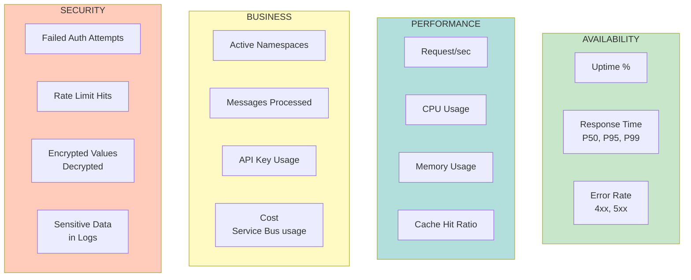
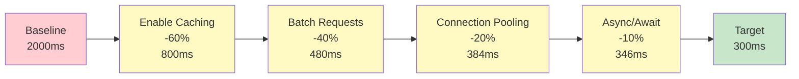

# ServiceHub API - Deployment & Operations Guide

Comprehensive guide for deploying, configuring, and operating the ServiceHub API in different environments.

---

## Table of Contents

1. [Environment Configurations](#environment-configurations)
2. [Deployment Strategies](#deployment-strategies)
3. [Operational Checklists](#operational-checklists)
4. [Monitoring & Alerting](#monitoring-alerting)
5. [Troubleshooting Guide](#troubleshooting)
6. [Performance Tuning](#performance-tuning)
7. [Disaster Recovery](#disaster-recovery)
8. [API Versioning Strategy](#api-versioning)

---

## 1. Environment Configurations {#environment-configurations}

### Development Environment

```json
{
  "ASPNETCORE_ENVIRONMENT": "Development",
  "ASPNETCORE_URLS": "http://localhost:5000",
  
  "Logging": {
    "LogLevel": {
      "Default": "Debug",
      "Microsoft.AspNetCore": "Information"
    }
  },
  
  "Cors": {
    "AllowedOrigins": [
      "http://localhost:3000",
      "http://localhost:5173",
      "http://localhost:5174"
    ]
  },
  
  "SecurityHeaders": {
    "ContentSecurityPolicyDevelopment": "default-src 'self'; script-src 'self' 'unsafe-inline' 'unsafe-eval'; ..."
  },
  
  "Security": {
    "Authentication": {
      "Enabled": false,
      "ApiKeys": []
    }
  },
  
  "ServiceBus": {
    "ConnectionCacheExpirationMinutes": 15
  }
}
```

**Key Characteristics:**
- ✅ Permissive CORS for frontend development
- ✅ Swagger UI fully enabled
- ✅ Debug logging enabled
- ✅ API key optional
- ✅ Shorter cache duration (test environment)

---

### Staging Environment

```json
{
  "ASPNETCORE_ENVIRONMENT": "Staging",
  "ASPNETCORE_URLS": "https://staging-api.servicehub.com",
  
  "Logging": {
    "LogLevel": {
      "Default": "Information"
    }
  },
  
  "Cors": {
    "AllowedOrigins": [
      "https://staging-app.servicehub.com",
      "https://staging-admin.servicehub.com"
    ]
  },
  
  "SecurityHeaders": {
    "Enabled": true,
    "ContentSecurityPolicyProduction": "default-src 'none'; frame-ancestors 'none'"
  },
  
  "Security": {
    "EncryptionKey": "${VAULT_STAGING_ENCRYPTION_KEY}",
    "Authentication": {
      "Enabled": true,
      "ApiKeys": ["${VAULT_STAGING_API_KEY}"]
    }
  },
  
  "RateLimit": {
    "PermitLimit": 1000,
    "Window": "00:01:00"
  }
}
```

**Key Characteristics:**
- ✅ HTTPS enforced
- ✅ Limited CORS origins
- ✅ API key required
- ✅ Swagger disabled (can enable for testing)
- ✅ Higher rate limits than production
- ✅ Secrets from Azure Key Vault

---

### Production Environment

```json
{
  "ASPNETCORE_ENVIRONMENT": "Production",
  "ASPNETCORE_URLS": "https://api.servicehub.com",
  
  "Logging": {
    "LogLevel": {
      "Default": "Information",
      "Microsoft": "Warning"
    }
  },
  
  "Cors": {
    "AllowedOrigins": [
      "https://app.servicehub.com"
    ]
  },
  
  "SecurityHeaders": {
    "Enabled": true,
    "StrictTransportSecurity": "max-age=31536000; includeSubDomains; preload",
    "ContentSecurityPolicyProduction": "default-src 'none'; frame-ancestors 'none'",
    "Permissions-Policy": "accelerometer=(), camera=(), geolocation=(), ..."
  },
  
  "Security": {
    "EncryptionKey": "${VAULT_PROD_ENCRYPTION_KEY}",
    "Authentication": {
      "Enabled": true,
      "ApiKeys": [
        "${VAULT_PROD_API_KEY_1}",
        "${VAULT_PROD_API_KEY_2}"
      ]
    }
  },
  
  "RateLimit": {
    "PermitLimit": 100,
    "Window": "00:01:00"
  },
  
  "HealthChecks": {
    "Enabled": true,
    "CacheDurationSeconds": 30
  }
}
```

**Key Characteristics:**
- ✅ HTTPS only with HSTS
- ✅ Single CORS origin
- ✅ API key required (multiple keys for rotation)
- ✅ Strict security headers
- ✅ Production-level rate limiting
- ✅ All secrets from Key Vault
- ✅ Health checks enabled
- ✅ Swagger disabled

---

## 2. Deployment Strategies {#deployment-strategies}

### Local Development Deployment

```bash
# 1. Clone repository
git clone https://github.com/debasisghosh/servicehub.git
cd servicehub/services/api

# 2. Install dependencies
dotnet restore

# 3. Run in watch mode
dotnet watch run --project src/ServiceHub.Api/ServiceHub.Api.csproj

# 4. Access API
# http://localhost:5000
# http://localhost:5000/swagger
```

---

### Docker Container Deployment

```dockerfile
# Build Stage
FROM mcr.microsoft.com/dotnet/sdk:8.0 AS build
WORKDIR /app

COPY . .
RUN dotnet restore
RUN dotnet publish -c Release -o /app/publish

# Runtime Stage
FROM mcr.microsoft.com/dotnet/aspnet:8.0
WORKDIR /app

COPY --from=build /app/publish .

ENV ASPNETCORE_ENVIRONMENT=Production
ENV ASPNETCORE_URLS=https://+:443;http://+:80

# Health check
HEALTHCHECK --interval=30s --timeout=3s --start-period=40s --retries=3 \
    CMD curl -f http://localhost/health || exit 1

EXPOSE 80 443

ENTRYPOINT ["dotnet", "ServiceHub.Api.dll"]
```

**Build and Run:**
```bash
# Build image
docker build -t servicehub-api:1.0.0 .

# Run container
docker run -d \
  -p 5000:80 \
  -p 5001:443 \
  -e ASPNETCORE_ENVIRONMENT=Production \
  -e "Security:EncryptionKey=your-production-key" \
  -e "Security:Authentication:ApiKeys:0=your-api-key" \
  servicehub-api:1.0.0
```

---

### Kubernetes Deployment

```yaml
apiVersion: apps/v1
kind: Deployment
metadata:
  name: servicehub-api
  namespace: production
spec:
  replicas: 3
  selector:
    matchLabels:
      app: servicehub-api
  template:
    metadata:
      labels:
        app: servicehub-api
    spec:
      containers:
      - name: api
        image: myregistry.azurecr.io/servicehub-api:1.0.0
        ports:
        - containerPort: 80
          name: http
        - containerPort: 443
          name: https
        
        env:
        - name: ASPNETCORE_ENVIRONMENT
          value: Production
        
        - name: Security__EncryptionKey
          valueFrom:
            secretKeyRef:
              name: servicehub-secrets
              key: encryption-key
        
        - name: Security__Authentication__ApiKeys__0
          valueFrom:
            secretKeyRef:
              name: servicehub-secrets
              key: api-key-1
        
        livenessProbe:
          httpGet:
            path: /health/live
            port: 80
          initialDelaySeconds: 30
          periodSeconds: 10
        
        readinessProbe:
          httpGet:
            path: /health/ready
            port: 80
          initialDelaySeconds: 10
          periodSeconds: 5
        
        resources:
          requests:
            memory: "512Mi"
            cpu: "250m"
          limits:
            memory: "1024Mi"
            cpu: "500m"

---
apiVersion: v1
kind: Service
metadata:
  name: servicehub-api-service
  namespace: production
spec:
  type: LoadBalancer
  selector:
    app: servicehub-api
  ports:
  - protocol: TCP
    port: 443
    targetPort: 443
    name: https
  - protocol: TCP
    port: 80
    targetPort: 80
    name: http
```

---

## 3. Operational Checklists {#operational-checklists}

### Pre-Deployment Checklist

```
CONFIGURATION
☐ All secrets configured in Key Vault
☐ Encryption key is strong (32+ chars)
☐ API keys rotated recently
☐ CORS origins correct for environment
☐ Rate limiting tuned for expected load

SECURITY
☐ HTTPS certificate valid
☐ API key authentication enabled
☐ Security headers configured correctly
☐ Firewall rules in place
☐ WAF rules configured

MONITORING
☐ Application Insights configured
☐ Log level appropriate for environment
☐ Alerts configured for critical errors
☐ Health check endpoints accessible
☐ Metrics collection enabled

DEPENDENCIES
☐ Azure Service Bus namespace accessible
☐ Database connections working
☐ External APIs reachable
☐ Network connectivity verified
☐ DNS resolution working

DEPLOYMENT
☐ Container image scanned for vulnerabilities
☐ Database migrations completed
☐ Load balancer health checks passing
☐ Rollback plan documented
☐ Runbook prepared
```

---

### Health Check Verification

```bash
# Live probe: Is the service running?
curl http://localhost:5000/health/live
# Expected: 200 OK

# Ready probe: Is the service ready to accept traffic?
curl http://localhost:5000/health/ready
# Expected: 200 OK (if dependencies OK)

# Detailed health status
curl http://localhost:5000/health
# Shows: ServiceBus connectivity, database status, etc.
```

---

## 4. Monitoring & Alerting {#monitoring-alerting}

### Key Metrics to Monitor



### Alert Thresholds

```
CRITICAL ALERTS (Page immediately)
├─ API Response Time > 5 seconds
├─ Error Rate > 5%
├─ API Unavailable (health check fails)
├─ Service Bus connectivity lost
└─ Failed auth attempts > 100/min

WARNING ALERTS (Investigate within 1 hour)
├─ API Response Time > 2 seconds
├─ Error Rate > 1%
├─ Memory usage > 80%
├─ CPU usage > 70%
└─ Cache hit ratio < 50%

INFO ALERTS (Reviewed in daily standup)
├─ Deployment completed
├─ Configuration changed
├─ Certificate expiring in < 30 days
└─ API key rotation needed
```

### Log Analytics Queries

```kusto
// Find slow requests
requests
| where duration > 2000
| summarize count() by operation_Name, tostring(duration)
| order by duration desc

// Errors by endpoint
requests
| where success == false
| summarize count() by operation_Name
| order by count_ desc

// Rate limit hits
traces
| where message contains "Rate limit exceeded"
| summarize count() by tostring(timestamp)
| render timechart

// Authentication failures
traces
| where message contains "API key" and (message contains "invalid" or message contains "missing")
| summarize count() by timestamp
```

---

## 5. Troubleshooting Guide {#troubleshooting}

### Common Issues and Solutions

#### Issue: API returns 401 Unauthorized

```
DIAGNOSIS:
1. Check if X-API-KEY header is present
   $ curl -v http://localhost:5000/api/v1/namespaces

2. Verify API key is configured
   $ dotnet user-secrets list

3. Check authentication enabled in config
   Security:Authentication:Enabled = true

SOLUTION:
- Add X-API-KEY header to request:
  curl -H "X-API-KEY: your-api-key" http://localhost:5000/api/v1/namespaces

- Or disable for development:
  appsettings.Development.json:
  "Security": { "Authentication": { "Enabled": false } }
```

---

#### Issue: Connection String Decryption Fails

```
DIAGNOSIS:
1. Check encryption key
   $ echo $Security__EncryptionKey | wc -c
   (Should be > 32 characters)

2. Verify encrypted value format
   Connection string should start with: ENC:V2:

3. Check key consistency
   Key must be same as when value was encrypted

SOLUTION:
- Verify encryption key in all environments
- Re-encrypt connection strings if key changed
- Rotation: Generate new key, re-encrypt, then update
```

---

#### Issue: Rate Limiting Too Strict

```
DIAGNOSIS:
1. Check current rate limit config
   RateLimit:PermitLimit = 100
   RateLimit:Window = 00:01:00

2. Monitor rate limit hits
   Logs contain "Rate limit exceeded"

3. Identify throttled client IPs
   Use X-Forwarded-For header inspection

SOLUTION:
- Increase PermitLimit in appsettings
- Extend Window duration
- For known clients, consider separate rate limit tier
- Implement adaptive rate limiting
```

---

#### Issue: High Memory Usage

```
DIAGNOSIS:
1. Check cache size
   InMemoryNamespaceRepository._namespaces.Count
   ServiceBusClientCache.Count

2. Monitor memory over time
   Memory profile shows growth pattern

3. Check for memory leaks
   Using dotMemory or similar profiler

SOLUTION:
- Reduce cache TTL
- Implement cache eviction policy (LRU)
- Increase pod limits (Kubernetes)
- Monitor and set alert thresholds
```

---

#### Issue: Slow Response Times

```
DIAGNOSIS:
1. Measure API response time
   dotnet trace list
   dotnet trace collect --providers Microsoft-Diagnostics-DiagnosticSource

2. Check Service Bus latency
   ServiceBusClient.GetPropertiesAsync() timing

3. Identify slow queries
   Application Insights query performance

SOLUTION:
- Enable response caching for GET requests
- Implement pagination for large result sets
- Batch Service Bus operations
- Increase Service Bus throughput units
- Add Redis cache layer
```

---

## 6. Performance Tuning {#performance-tuning}

### Response Time Optimization



### Cache Hit Ratio Improvement

```
CURRENT STATE:
├─ Cache Hit Rate: 30%
├─ Cache Misses: 70% (expensive DB queries)
└─ Response Time: 1500ms average

OPTIMIZATION PLAN:
1. Increase TTL for stable data
   Before: 1 minute
   After: 5 minutes
   ├─ Hit Rate: +15% → 45%
   └─ Response Time: -300ms → 1200ms

2. Pre-load frequently accessed items
   On startup, cache top 10 namespaces
   ├─ Hit Rate: +20% → 65%
   └─ Response Time: -200ms → 1000ms

3. Implement hierarchical caching
   L1: In-memory (fast)
   L2: Redis (distributed)
   ├─ Hit Rate: +30% → 95%
   └─ Response Time: -500ms → 500ms
```

---

## 7. Disaster Recovery {#disaster-recovery}

### Backup Strategy

```
DAILY BACKUP (3 AM UTC)
├─ Backup namespace configuration
├─ Backup connection string directory
├─ Store in Azure Blob Storage
├─ Retention: 7 days
└─ RPO (Recovery Point Objective): 24 hours

MONTHLY BACKUP (First day of month)
├─ Complete namespace export
├─ Connection strings encrypted
├─ Audit logs archived
├─ Store in Blob + replicated to DR region
└─ Retention: 12 months

ENCRYPTION KEY BACKUP
├─ Backup encryption key to Key Vault
├─ Enable Key Vault soft delete (90 days)
├─ Enable Key Vault purge protection
├─ Copy to DR Key Vault in different region
└─ Never store in version control!
```

### Recovery Procedures

```
SCENARIO 1: Single Namespace Deleted
├─ Detect: Alert on namespace delete
├─ Recover: Restore from latest backup
├─ Verify: Check connection string integrity
├─ RTO: < 1 hour
└─ Test: Monthly restore drill

SCENARIO 2: Encryption Key Compromised
├─ Detect: Security audit detects key usage
├─ Action: Rotate key immediately
├─ Re-encrypt: All connection strings with new key
├─ Verify: Test decryption
├─ Monitor: Alert on failed decryptions
├─ RTO: < 2 hours
└─ Communication: Notify all API consumers

SCENARIO 3: Region Outage
├─ Detect: All health checks fail
├─ Failover: Route to DR region
├─ Restore: Bring up API in DR environment
├─ Sync: Replay operations from disaster region
├─ RTO: < 30 minutes
├─ RPO: < 5 minutes
└─ Test: Quarterly DR drill
```

---

## 8. API Versioning Strategy {#api-versioning}

### Current: v1 (URL-based versioning)

```
GET /api/v1/namespaces       # Version in URL path
GET /api/v1/namespaces/:id
POST /api/v1/namespaces
PUT /api/v1/namespaces/:id
DELETE /api/v1/namespaces/:id
```

**Advantages:**
- ✅ Clear in URL
- ✅ Easy to test different versions
- ✅ Cache-friendly

**Disadvantages:**
- ❌ URL becomes longer
- ❌ Harder to redirect old versions

---

### Future: v2 Implementation Plan

```
WHEN TO RELEASE v2?
- Breaking change needed
- Deprecation period: 6 months from v1 EOL announcement
- Provide migration guide

NEW FEATURES IN v2:
├─ GraphQL endpoint alongside REST
├─ Batch operations in single request
├─ Streaming responses for large datasets
├─ WebSocket support for real-time updates
└─ Enhanced filtering and pagination

COEXISTENCE STRATEGY:
├─ Support both v1 and v2 for 6 months
├─ Document deprecated endpoints
├─ Provide upgrade guide
├─ Monitor v1 usage metrics
└─ Sunset v1 after migration period

VERSIONING HEADERS:
GET /api/namespaces
X-API-Version: 2.0
Accept-API-Version: 2.0
```

---

## Runbook: Production Deployment

```
PRE-DEPLOYMENT (T-30 minutes)
1. ☐ Merge PR to main branch
2. ☐ Trigger CI/CD pipeline
3. ☐ Run integration tests
4. ☐ Generate release notes
5. ☐ Prepare rollback plan

DEPLOYMENT (T-0)
1. ☐ Update load balancer health check grace period (60s)
2. ☐ Deploy to canary environment (10% traffic)
3. ☐ Monitor metrics for 10 minutes
4. ☐ If metrics OK: Deploy to 50% of prod
5. ☐ Monitor for 5 minutes
6. ☐ If metrics OK: Deploy to 100% of prod
7. ☐ Verify all health checks passing

POST-DEPLOYMENT (T+30 minutes)
1. ☐ Verify error rate < 1%
2. ☐ Verify response time P99 < 2s
3. ☐ Check Application Insights for anomalies
4. ☐ Verify API responding to test requests
5. ☐ Notify stakeholders of successful deployment

ROLLBACK PROCEDURE (If issues detected)
1. ☐ Revert traffic to previous version
2. ☐ Monitor metrics normalize
3. ☐ Post-incident review
4. ☐ Identify and fix issue
5. ☐ Schedule re-deployment
```

---

## Related Documentation

- [Architecture Overview](./ARCHITECTURE.md) - System design
- [Implementation Patterns](./IMPLEMENTATION_PATTERNS.md) - Code patterns
- [README](./README.md) - Quick start
