# ServiceHub API - Implementation Patterns & Best Practices

Deep-dive into the architectural patterns, design decisions, and implementation strategies used throughout the ServiceHub API codebase.

---

## Table of Contents

1. [Result Pattern for Error Handling](#result-pattern)
2. [Dependency Injection Container Setup](#dependency-injection)
3. [Middleware Pipeline Design](#middleware-design)
4. [Repository Pattern & Caching](#repository-pattern)
5. [Security Implementation](#security-implementation)
6. [Configuration Management](#configuration-management)
7. [Logging & Observability](#logging-observability)
8. [Validation Strategy](#validation-strategy)
9. [API Response Format](#api-response-format)
10. [Testing Approach](#testing-approach)

---

## 1. Result Pattern for Error Handling {#result-pattern}

The ServiceHub API uses a **Result Pattern** instead of exception-based error handling.

### Why Result Pattern?

```
❌ AVOID: Exception-Based
└─ try-catch blocks scattered everywhere
└─ Performance overhead from exception handling
└─ Implicit error propagation
└─ Difficult to determine function behavior from signature

✅ PREFER: Result Pattern
└─ Explicit success/failure in return type
└─ Better performance (no exceptions)
└─ Clearer intent and contract
└─ Easier to test and compose operations
```

### Implementation

```csharp
// Core.Results.Result<T>
public abstract record Result
{
    public sealed record Success(object? Data) : Result;
    public sealed record Failure(Error Error) : Result;
}

// Domain Error
public record Error(string Code, string Message, ErrorType Type, IReadOnlyDictionary<string, object>? Details);

// ErrorType enumeration
public enum ErrorType
{
    Validation = 1,
    NotFound = 2,
    Unauthorized = 3,
    Forbidden = 4,
    Conflict = 5,
    InternalError = 6,
    Timeout = 7
}
```

### Usage in Controllers

```csharp
[HttpGet("{id}")]
public async Task<IActionResult> GetNamespace(string id)
{
    // Service returns Result<Namespace>
    var result = await _namespaceService.GetByIdAsync(id);
    
    // Convert Result to IActionResult
    return result switch
    {
        Result.Success success => Ok(success.Data),
        Result.Failure failure => HandleError(failure.Error),
        _ => StatusCode(500)
    };
}

private IActionResult HandleError(Error error) =>
    error.Type switch
    {
        ErrorType.NotFound => NotFound(),
        ErrorType.Validation => BadRequest(error),
        ErrorType.Unauthorized => Unauthorized(),
        ErrorType.Forbidden => Forbid(),
        ErrorType.Conflict => Conflict(error),
        ErrorType.Timeout => StatusCode(504),
        _ => StatusCode(500)
    };
```

### Benefits

```mermaid
graph LR
    A["Result Pattern"] --> B["✓ Explicit"]
    A --> C["✓ Composable"]
    A --> D["✓ Testable"]
    A --> E["✓ Performant"]
    A --> F["✓ Type-Safe"]
    
    B --> G["Clear success/failure path"]
    C --> H["Chain operations easily"]
    D --> I["Mock errors in tests"]
    E --> J["No exception overhead"]
    F --> K["Compiler checks error handling"]
```



---

## 2. Dependency Injection Container Setup {#dependency-injection}

ServiceHub uses built-in ASP.NET Core DI with clean layer registration.

### DI Container Configuration


### Service Registration Patterns

```csharp
// 1. Factory Pattern - for complex object creation
services.TryAddSingleton<IServiceBusClientFactory, ServiceBusClientFactory>();

// 2. Singleton - for stateless, thread-safe services
services.TryAddSingleton<IConnectionStringProtector, ConnectionStringProtector>();

// 3. Scoped - per request lifecycle
services.TryAddScoped<IMessageService, MessageService>();

// 4. Options Pattern - for configuration
services.Configure<SecurityHeadersOptions>(configuration.GetSection("SecurityHeaders"));
services.Configure<HttpHeadersOptions>(configuration.GetSection("HttpHeaders"));

// 5. Decorator Pattern - for cross-cutting concerns
services.AddScoped(typeof(ILogger<>), typeof(RedactingLoggerProvider));
```

### Service Lifetime Guidance

```
┌─────────────────────────────────────────────────────────────┐
│ SERVICE LIFETIME DECISION MATRIX                             │
├─────────────────────────────────────────────────────────────┤
│ SINGLETON: Stateless, thread-safe, expensive to create     │
│ ├─ ServiceBusClientCache                                   │
│ ├─ ConnectionStringProtector                               │
│ ├─ IAIServiceClient                                        │
│ └─ Loggers                                                 │
├─────────────────────────────────────────────────────────────┤
│ SCOPED: Request-scoped state, per-request instances       │
│ ├─ INamespaceService                                       │
│ ├─ IMessageService                                         │
│ ├─ IQueueService                                           │
│ └─ HttpContext-dependent services                          │
├─────────────────────────────────────────────────────────────┤
│ TRANSIENT: New instance every time (avoid for expensive)  │
│ ├─ Rare in this project                                   │
│ └─ Only for stateless, lightweight types                   │
└─────────────────────────────────────────────────────────────┘
```

---

## 3. Middleware Pipeline Design {#middleware-design}

### Custom Middleware Architecture

Each middleware follows this pattern:

```csharp
public sealed class NameMiddleware
{
    private readonly RequestDelegate _next;
    private readonly ILogger<NameMiddleware> _logger;
    
    public NameMiddleware(RequestDelegate next, ILogger<NameMiddleware> logger)
    {
        _next = next ?? throw new ArgumentNullException(nameof(next));
        _logger = logger ?? throw new ArgumentNullException(nameof(logger));
    }
    
    public async Task InvokeAsync(HttpContext context)
    {
        try
        {
            // Pre-processing logic
            _logger.LogInformation("Processing {Method} {Path}", 
                context.Request.Method, context.Request.Path);
            
            // Call next middleware
            await _next(context);
            
            // Post-processing logic
            _logger.LogInformation("Response {StatusCode}", 
                context.Response.StatusCode);
        }
        catch (Exception ex)
        {
            _logger.LogError(ex, "Error in middleware");
            throw;
        }
    }
}
```

### Middleware Registration Order (CRITICAL)

```
ORDER MATTERS: Middleware executes in registration order on the way IN,
then in REVERSE order on the way OUT
```



```mermaid
graph TD
    subgraph In["REQUEST PIPELINE (IN)"]
        A["1. SecurityHeadersMiddleware"]
        B["2. ErrorHandlingMiddleware"]
        C["3. CorrelationIdMiddleware"]
        D["4. RequestLoggingMiddleware"]
        E["5. ApiKeyAuthenticationMiddleware"]
        F["6. RateLimitingMiddleware"]
        G["7. (Framework Middleware)"]
        H["🎯 CONTROLLER"]
    end
    
    subgraph Out["RESPONSE PIPELINE (OUT)"]
        I["1. SecurityHeadersMiddleware"]
        J["2. ErrorHandlingMiddleware"]
        K["3. CorrelationIdMiddleware"]
        L["4. RequestLoggingMiddleware"]
        M["5. ApiKeyAuthenticationMiddleware"]
        N["6. RateLimitingMiddleware"]
    end
    
    A --> B --> C --> D --> E --> F --> G --> H
    H --> N --> M --> L --> K --> J --> I

    style H fill:#bbdefb
    style In fill:#e3f2fd
    style Out fill:#e3f2fd
```

### Why This Order?

```
SecurityHeadersMiddleware FIRST:
- Must set headers on response before other middleware processes it

ErrorHandlingMiddleware EARLY:
- Catches exceptions from all downstream middleware

CorrelationIdMiddleware:
- Needs to extract/generate ID early for logging

RequestLoggingMiddleware:
- Logs request details after validation ready

ApiKeyAuthenticationMiddleware:
- After correlation ID set, before authorization

RateLimitingMiddleware:
- After auth to know who is making request

Framework Middleware:
- Compression, CORS, etc. execute normally
```

---

## 4. Repository Pattern & Caching {#repository-pattern}

### Repository Architecture


### Current State: In-Memory Repository

```csharp
public sealed class InMemoryNamespaceRepository : INamespaceRepository
{
    private readonly ConcurrentDictionary<string, Namespace> _namespaces = new();
    
    public async Task<Result<Namespace>> GetByIdAsync(string id)
    {
        if (_namespaces.TryGetValue(id, out var ns))
        {
            return new Result.Success(ns);
        }
        return new Result.Failure(Error.NotFound("Namespace.NotFound", $"Namespace {id} not found"));
    }
    
    public async Task<Result<IEnumerable<Namespace>>> GetAllAsync()
    {
        return new Result.Success(_namespaces.Values.AsEnumerable());
    }
    
    public async Task<Result<Namespace>> AddAsync(Namespace ns)
    {
        if (!_namespaces.TryAdd(ns.Id, ns))
        {
            return new Result.Failure(Error.Conflict("Namespace.Conflict", $"Namespace {ns.Name} already exists"));
        }
        return new Result.Success(ns);
    }
}
```

### Future: SQL Server Repository

```csharp
// TODO: Replace in-memory with:
public sealed class SqlNamespaceRepository : INamespaceRepository
{
    private readonly ApplicationDbContext _context;
    
    public async Task<Result<Namespace>> GetByIdAsync(string id)
    {
        var entity = await _context.Namespaces.FindAsync(id);
        return entity != null 
            ? new Result.Success(entity)
            : new Result.Failure(Error.NotFound(...));
    }
    
    // Similar pattern for other methods
    // Benefits: Persistence, multi-instance support, queries
}
```

### Caching Strategy


### Cache Invalidation Strategy

```
ON CREATE:
└─ Cache new item
└─ Invalidate list cache

ON UPDATE:
└─ Update in cache
└─ Invalidate dependent caches
└─ Trigger event notification

ON DELETE:
└─ Remove from cache
└─ Invalidate list cache
└─ Cascade delete if needed

ON TIME-OUT:
└─ Remove item from cache
└─ Next access triggers reload
```

---

## 5. Security Implementation {#security-implementation}

### Encryption: AES-GCM Pattern

```mermaid
graph TD
    A["Plain Connection String"] -->|Input| B["Encryption"]
    
    B --> C["1. Derive Key<br/>SHA256(MasterKey)"]
    C --> D["2. Generate Nonce<br/>RandomNumberGenerator.Fill<br/>12 bytes"]
    D --> E["3. Encrypt<br/>AES-GCM-256<br/>Key + Nonce"]
    
    E --> F["Get Output<br/>Ciphertext + AuthTag"]
    F --> G["5. Combine<br/>Nonce || Ciphertext || AuthTag"]
    G --> H["6. Base64 Encode"]
    H --> I["7. Prepend Prefix<br/>ENC:V2:<br/>Enable version tracking"]
    
    I --> J["Encrypted Value:<br/>ENC:V2:{base64}"]
    
    K["Encrypted Value<br/>ENC:V2:{base64}"] -->|Input| L["Decryption"]
    L --> M["1. Extract Nonce<br/>First 12 bytes"]
    M --> N["2. Extract Ciphertext<br/>Middle portion"]
    N --> O["3. Extract AuthTag<br/>Last 16 bytes"]
    
    O --> P["4. Derive Key<br/>SHA256(MasterKey)"]
    P --> Q["5. Decrypt & Verify<br/>AES-GCM-256"]
    Q --> R["AuthTag matches?"]
    
    R -->|Yes| S["Plain Connection String<br/>Decrypted Successfully"]
    R -->|No| T["❌ Tamper Detected<br/>Reject Value"]

    style A fill:#c8e6c9
    style J fill:#ffccbc
    style S fill:#c8e6c9
    style T fill:#ffcdd2
```



### API Key Authentication

```
REQUEST:
POST /api/v1/namespaces
X-API-KEY: dev-api-key-12345

MIDDLEWARE PROCESS:
1. Check if path is public (/health, /swagger) → ALLOW
2. Extract API key from X-API-KEY header
3. Check if header present
   ├─ No → Return 401 Unauthorized
   └─ Yes → Validate against configured keys
4. Key found?
   ├─ Yes → Log attempt (key prefix only) → CONTINUE
   └─ No → Return 403 Forbidden → END
5. Continue to next middleware
```

### Security Headers Strategy


---

## 6. Configuration Management {#configuration-management}

### Configuration Precedence

```
┌─────────────────────────────────────────────────────────────┐
│ 1. ENVIRONMENT VARIABLES        (Highest Priority)          │
│    AppSettings__Security__EncryptionKey=prod-key            │
├─────────────────────────────────────────────────────────────┤
│ 2. appsettings.Production.json                              │
│    OR appsettings.Staging.json                              │
├─────────────────────────────────────────────────────────────┤
│ 3. appsettings.Development.json (in Development only)       │
├─────────────────────────────────────────────────────────────┤
│ 4. appsettings.json             (Base Configuration)        │
└─────────────────────────────────────────────────────────────┘
```

### Configuration Sections

```json
{
  "Logging": {...},
  "Cors": {
    "AllowedOrigins": ["..."],
    "DevelopmentDefaults": ["..."]
  },
  "HttpHeaders": {
    "CorrelationId": "X-Correlation-Id",
    "RateLimitLimit": "X-RateLimit-Limit",
    ...
  },
  "SecurityHeaders": {
    "Enabled": true,
    "ContentTypeOptions": "nosniff",
    ...
  },
  "ServiceBus": {
    "ConnectionCacheExpirationMinutes": 60,
    "MaxConcurrentCalls": 10,
    ...
  },
  "Security": {
    "EncryptionKey": "...",
    "Authentication": {
      "Enabled": false,
      "ApiKeys": ["..."]
    }
  }
}
```

### Options Pattern Usage

```csharp
// Register
services.Configure<SecurityHeadersOptions>(
    configuration.GetSection("SecurityHeaders"));

// Inject
public class SecurityHeadersMiddleware
{
    private readonly SecurityHeadersOptions _options;
    
    public SecurityHeadersMiddleware(
        IOptions<SecurityHeadersOptions> options)
    {
        _options = options.Value;
    }
}

// Access
var isEnabled = _options.Enabled;
var cspPolicy = _options.ContentSecurityPolicyProduction;
```

---

## 7. Logging & Observability {#logging-observability}

### Structured Logging Pattern

```csharp
// GOOD: Structured logging with properties
_logger.LogInformation(
    "Namespace created: {NamespaceId} by {UserId} in {Duration}ms",
    namespace.Id,
    userId,
    stopwatch.ElapsedMilliseconds);

// BAD: String concatenation
_logger.LogInformation($"Namespace created: {namespace.Id}");

// GOOD: With correlation ID
using var activity = new Activity("CreateNamespace")
    .SetTag("CorrelationId", correlationId)
    .Start();

// BAD: Without context
_logger.LogInformation("Creating namespace");
```

### Log Redaction

```csharp
// RedactingLoggerProvider wraps existing loggers
public sealed class RedactingLoggerProvider : ILoggerProvider
{
    private static readonly Dictionary<string, string> Patterns = new()
    {
        { @"SharedAccessKey=([^;]*)", "SharedAccessKey=***MASKED***" },
        { @"SharedAccessSignature=([^;]*)", "SharedAccessSignature=***MASKED***" },
        { @"password['\"]?\s*[:=].*?(?=[,\}])", "password=***MASKED***" },
        { @"(ENC:V2:|PROTECTED:)", "[ENCRYPTED]" }
    };
    
    public ILogger CreateLogger(string categoryName)
        => new RedactingLogger(categoryName, Patterns);
}
```

### Correlation ID Flow

```
REQUEST WITH CORRELATION ID:
1. Client sends: X-Correlation-Id: sh-abc123xyz
   OR API generates: sh-{timestamp}-{random}

2. CorrelationIdMiddleware captures/generates
3. Adds to HttpContext.Items["CorrelationId"]
4. All logs include this ID
5. Response includes: X-Correlation-Id: sh-abc123xyz

TRACING:
- Track single request through entire system
- Correlate logs across multiple services
- Find all operations for a user/request
```

---

## 8. Validation Strategy {#validation-strategy}

### Validation Layers

```mermaid
graph TD
    A["HTTP Request"] --> B["1. Model Binding<br/>Deserialization"]
    B --> C["2. FluentValidation<br/>Business Rules"]
    C --> D["3. Controller Logic<br/>State Verification"]
    D --> E["4. Service Layer<br/>Authorization"]
    E --> F["5. Repository<br/>Data Constraints"]
    
    C -->|Invalid| G["400 Bad Request<br/>Validation Errors"]
    D -->|Invalid| H["409 Conflict"]
    E -->|Invalid| I["403 Forbidden"]
    
    F -->|Valid| J["✅ Process Request"]

    style A fill:#e3f2fd
    style G fill:#ffcdd2
    style H fill:#ffcdd2
    style I fill:#ffcdd2
    style J fill:#c8e6c9
```



### FluentValidation Example

```csharp
public class CreateNamespaceRequestValidator : AbstractValidator<CreateNamespaceRequest>
{
    public CreateNamespaceRequestValidator()
    {
        RuleFor(x => x.Name)
            .NotEmpty()
            .WithMessage("Namespace name is required")
            .MinimumLength(3)
            .MaximumLength(50)
            .WithMessage("Namespace name must be between 3 and 50 characters")
            .Matches(@"^[a-z0-9-]+$")
            .WithMessage("Namespace name must contain only lowercase letters, numbers, and hyphens");
        
        RuleFor(x => x.ConnectionString)
            .NotEmpty()
            .WithMessage("Connection string is required")
            .Must(BeValidConnectionString)
            .WithMessage("Connection string format is invalid");
    }
    
    private bool BeValidConnectionString(string cs)
        => cs.StartsWith("Endpoint=") && cs.Contains("SharedAccessKey");
}
```

---

## 9. API Response Format {#api-response-format}

### Success Response (HTTP 200)

```json
{
  "data": {
    "id": "ns-123",
    "name": "my-servicebus",
    "displayName": "My Service Bus",
    "createdAt": "2026-01-17T10:30:00Z"
  },
  "meta": {
    "timestamp": "2026-01-17T10:30:01Z",
    "correlationId": "sh-abc123xyz"
  }
}
```

### Paginated Response (HTTP 200)

```json
{
  "data": [
    {"id": "q1", "name": "queue1", ...},
    {"id": "q2", "name": "queue2", ...}
  ],
  "pagination": {
    "page": 1,
    "pageSize": 10,
    "totalCount": 42,
    "totalPages": 5
  },
  "meta": {
    "timestamp": "2026-01-17T10:30:01Z",
    "correlationId": "sh-abc123xyz"
  }
}
```

**Headers:**
```
X-Total-Count: 42
X-Page-Number: 1
X-Page-Size: 10
X-Correlation-Id: sh-abc123xyz
```

### Error Response (HTTP 4xx/5xx)

```json
{
  "type": "https://tools.ietf.org/html/rfc7231#section-6.5.1",
  "title": "Bad Request",
  "status": 400,
  "detail": "Namespace name must be between 3 and 50 characters",
  "traceId": "sh-abc123xyz",
  "errors": {
    "Name": [
      "Namespace name must be between 3 and 50 characters"
    ]
  }
}
```

### Response Handling in Controller

```csharp
public class NamespaceController : ApiControllerBase
{
    [HttpGet("{id}")]
    public async Task<IActionResult> GetNamespace(string id)
    {
        var result = await _service.GetByIdAsync(id);
        
        return result switch
        {
            Result.Success success => Ok(new ApiResponse { Data = success.Data }),
            Result.Failure failure => Problem(
                detail: failure.Error.Message,
                statusCode: MapErrorToStatusCode(failure.Error.Type),
                title: failure.Error.Code),
            _ => StatusCode(500)
        };
    }
}
```

---

## 10. Testing Approach {#testing-approach}

### Unit Testing Pattern

```csharp
[TestFixture]
public class NamespaceServiceTests
{
    private INamespaceService _service;
    private Mock<INamespaceRepository> _repositoryMock;
    private Mock<IServiceBusClientFactory> _factoryMock;
    
    [SetUp]
    public void Setup()
    {
        _repositoryMock = new Mock<INamespaceRepository>();
        _factoryMock = new Mock<IServiceBusClientFactory>();
        _service = new NamespaceService(_repositoryMock.Object, _factoryMock.Object);
    }
    
    [Test]
    public async Task GetById_WithValidId_ReturnsNamespace()
    {
        // ARRANGE
        var ns = new Namespace { Id = "ns-1", Name = "test" };
        _repositoryMock
            .Setup(r => r.GetByIdAsync("ns-1"))
            .ReturnsAsync(new Result.Success(ns));
        
        // ACT
        var result = await _service.GetByIdAsync("ns-1");
        
        // ASSERT
        Assert.That(result, Is.TypeOf<Result.Success>());
        Assert.That(((Result.Success)result).Data, Is.EqualTo(ns));
    }
    
    [Test]
    public async Task GetById_WithInvalidId_ReturnsNotFound()
    {
        // ARRANGE
        _repositoryMock
            .Setup(r => r.GetByIdAsync("invalid"))
            .ReturnsAsync(new Result.Failure(Error.NotFound(...)));
        
        // ACT
        var result = await _service.GetByIdAsync("invalid");
        
        // ASSERT
        Assert.That(result, Is.TypeOf<Result.Failure>());
    }
}
```

### Integration Testing Pattern

```csharp
[TestFixture]
public class NamespaceControllerIntegrationTests
{
    private WebApplicationFactory<Program> _factory;
    private HttpClient _client;
    
    [SetUp]
    public void Setup()
    {
        _factory = new WebApplicationFactory<Program>();
        _client = _factory.CreateClient();
    }
    
    [Test]
    public async Task Post_CreateNamespace_Returns201()
    {
        // ARRANGE
        var request = new CreateNamespaceRequest
        {
            Name = "test-ns",
            ConnectionString = "Endpoint=sb://test.servicebus.windows.net/;..."
        };
        
        // ACT
        var response = await _client.PostAsJsonAsync("/api/v1/namespaces", request);
        
        // ASSERT
        Assert.That(response.StatusCode, Is.EqualTo(System.Net.HttpStatusCode.Created));
        var content = await response.Content.ReadAsAsync<CreateNamespaceResponse>();
        Assert.That(content.Id, Is.Not.Null);
    }
}
```

---

## Performance Optimization Tips

```
1. CONNECTION POOLING
   └─ ServiceBusClientCache reuses connections
   └─ TTL: 60 minutes per connection
   └─ LRU eviction for unused connections

2. MESSAGE BATCHING
   └─ Process multiple messages per SDK call
   └─ Reduce round-trips to Azure Service Bus
   └─ Typical batch size: 10-50 messages

3. RESPONSE CACHING
   └─ GET requests cached with ETag
   └─ Client can validate freshness
   └─ Server returns 304 Not Modified

4. LOG OPTIMIZATION
   └─ Async logging to avoid blocking
   └─ Structured logging for efficient parsing
   └─ Log level configuration per namespace

5. PAGINATION
   └─ Don't fetch all messages at once
   └─ Use page size limits: 10-100 items
   └─ Include totalCount in response metadata
```

---

## Common Mistakes to Avoid

```
❌ MISTAKE 1: Throwing exceptions for normal flows
   ✅ USE: Result pattern for expected failures

❌ MISTAKE 2: Logging without context
   ✅ USE: Correlation IDs in every log

❌ MISTAKE 3: Hardcoding configuration values
   ✅ USE: appsettings.json + environment overrides

❌ MISTAKE 4: Ignoring middleware order
   ✅ USE: Critical middleware first (security, error handling)

❌ MISTAKE 5: Synchronous I/O operations
   ✅ USE: async/await for all I/O

❌ MISTAKE 6: No input validation
   ✅ USE: FluentValidation at multiple layers

❌ MISTAKE 7: Hardcoded sensitive data
   ✅ USE: Encryption for connection strings, Key Vault for keys
```

---

## Related Documentation

- [Architecture Overview](./ARCHITECTURE.md) - High-level design
- [README](./README.md) - Getting started
- [Security Implementation](./ARCHITECTURE.md#security-architecture) - Detailed security
